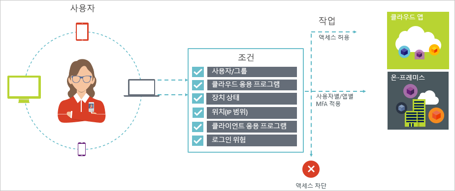

# Azure Active Directory의 조건부 액세스란?

보안은 클라우드를 사용하는 조직에서 가장 중요한 문제입니다. 클라우드 보안의 주요 측면은 클라우드 리소스 관리에 사용되는 ID 및 액세스입니다. 모바일 우선, 클라우드 우선 환경에서는 사용자가 다양한 장치와 앱을 사용하여 어디서나 조직의 리소스에 액세스할 수 있습니다. 따라서 리소스에 액세스할 수 있는 사람에만 초점을 맞추는 것은 더 이상 충분하지 않습니다. 보안과 생산성 간의 균형을 이루기 위해서는 리소스가 액세스되는 방법도 액세스 제어 결정에 고려해야 합니다. Azure AD(Azure Active Directory) 조건부 액세스를 사용하면 이 요구 사항을 처리할 수 있습니다. 조건부 액세스는 Azure Active Directory의 기능입니다. 조건부 액세스를 사용하면 조건에 따라 클라우드 앱에 액세스할 수 있는 사용자를 결정하는 자동 액세스 제어 결정 시스템을 구현할 수 있습니다. 

이 문서에서는 Azure AD의 조건부 액세스에 대한 개념적 개요를 제공합니다.

## 일반적인 시나리오

모바일 우선, 클라우드 우선 세계에서 Azure Active Directory는 어디에서나 디바이스, 앱 및 서비스에 대한 Single Sign-On을 가능하게 합니다. 장치(BYOD 포함), 기업 네트워크 외 근무 및 타사 SaaS 앱의 확산에 따라 다음과 같이 서로 대립하는 두 가지 목표에 직면하게 되었습니다.

- 사용자가 언제 어디서나 생산성을 높일 수 있도록 지원
- 언제든지 회사 자산 보호

조건부 액세스 정책을 사용하면 필요한 조건에 따라 올바른 액세스 제어를 적용할 수 있습니다. Azure AD 조건부 액세스를 통해 필요할 때 보안을 강화하고 필요하지 않을 때 사용자를 방해하지 않을 수 있습니다. 

다음은 조건부 액세스가 도움이 될 수 있는 몇 가지 일반적인 액세스 문제입니다.

- **[로그인 위험](conditions.md#sign-in-risk)**: Azure AD ID 보호에서 로그인 위험을 검색합니다. 검색된 로그인 위험이 잘못된 작업자를 나타내는 경우 액세스를 제한하려면 어떻게 하나요? 로그인이 합법적 사용자에 의해 수행되었다는 강력한 증거를 확보하려면 어떻게 해야 할까요? 특정 사용자가 앱에 액세스하지 못하게 차단할 만큼 강한 의심이 든다면 어떻게 해야 할까요?  

- **[네트워크 위치](location-condition.md)**: Azure AD는 어디서나 액세스할 수 있습니다. IT 부서에서 제어하지 않는 네트워크 위치로부터 액세스를 시도하는 경우 어떻게 되나요? 사용자 이름 및 암호 조합을 사용하면 회사 네트워크로부터의 액세스 시도를 위한 ID 증명으로 충분할 수 있습니다. 다른 예기치 않은 국가 또는 지역에서 시작되는 액세스 시도에 대해 보다 강력한 확인 증명을 요구하는 경우 어떻게 되나요? 특정 위치에서의 액세스 시도를 차단하려는 경우 어떻게 되나요?  

- **[장치 관리](conditions.md#device-platforms)**: Azure AD에서 사용자는 모바일 및 개인 장치를 포함하여 광범위한 장치에서 클라우드 앱에 액세스할 수 있습니다. IT 부서에서 관리하는 디바이스를 사용하여 액세스하도록 요구하는 경우 어떻게 되나요? 사용자 환경의 클라우드 앱에서 특정 장치 유형의 액세스를 차단하려는 경우 어떻게 되나요? 

- **[클라이언트 응용 프로그램](conditions.md#client-apps)**: 현재, 웹 기반 앱, 모바일 앱, 데스크톱 앱 등의 여러 앱 유형을 사용하여 많은 클라우드 앱에 액세스할 수 있습니다. 알려진 문제를 발생시키는 클라이언트 앱 유형을 사용하여 액세스를 시도하는 경우 어떻게 되나요? 특정 앱 유형에 대해 IT 부서에서 관리하는 장치를 요구하는 경우 어떻게 되나요? 

이러한 질문과 관련 답변은 Azure AD 조건부 액세스에 대한 일반적인 액세스 시나리오를 나타냅니다. 조건부 액세스는 정책 기반 방법을 사용하여 액세스 시나리오를 처리할 수 있게 해주는 Azure Active Directory의 기능입니다.

## 조건부 액세스 정책

조건부 액세스 정책은 다음 패턴을 사용하는 액세스 시나리오 정의입니다.

**Then do this**는 정책의 응답을 지정합니다. 조건부 액세스 정책의 목표는 클라우드 앱에 대한 액세스 권한을 부여하지 않는 것입니다. Azure AD에서 클라우드 앱에 대한 액세스 권한 부여는 사용자 할당을 통해 이루어집니다. 조건부 액세스 정책을 사용하면 권한 부여된 사용자(클라우드 앱에 대한 액세스 권한이 부여된 사용자)가 특정 조건에서 클라우드 앱에 액세스할 수 있는 방법을 제어합니다. 응답에서 Multi-Factor Authentication, 관리 장치 등의 추가 요구 사항을 적용합니다. Azure AD 조건부 액세스의 컨텍스트에서 정책이 적용하는 요구 사항을 액세스 제어라고 합니다. 가장 제한적인 형태에서는 정책을 통해 액세스를 차단할 수 있습니다. 자세한 내용은 [Azure Active Directory 조건부 액세스의 액세스 제어](controls.md)를 참조하세요.
     

**When this happens**는 정책을 트리거하는 이유를 정의합니다. 이 이유는 충족된 조건 그룹으로 특성화됩니다. Azure AD 조건부 액세스에서는 다음 두 가지 할당 조건이 특수 역할을 수행합니다.

- **[사용자](conditions.md#users-and-groups)**: 액세스를 시도하는 사용자(**Who**)입니다. 

- **[클라우드 앱](conditions.md#cloud-apps)**: 액세스 시도 대상(**What**)입니다.    

이러한 두 조건은 조건부 액세스 정책에서 필수입니다. 두 가지 필수 조건 외에도 액세스 시도 방법을 설명하는 추가 조건을 포함할 수 있습니다. 일반적인 예는 회사 네트워크 외부에 있는 모바일 장치 또는 위치를 사용하는 경우입니다. 자세한 내용은 [Azure Active Directory 조건부 액세스의 조건](conditions.md)을 참조하세요.   

조건과 액세스 제어의 조합이 조건부 액세스 정책을 나타냅니다. 

Azure AD 조건부 액세스를 사용하여 권한 있는 사용자가 클라우드 앱에 액세스하는 방법을 제어할 수 있습니다. 조건부 액세스 정책은 액세스 시도 방법에 의해 구동되는 클라우드 앱에 대한 액세스 시도에 추가 액세스 제어를 적용하는 것을 목표로 합니다.

정책 기반 방법을 사용하여 클라우드 앱에 대한 액세스를 보호하면 기술 구현에 대해 염려하지 않고 이 문서에 요약된 구조를 사용하여 사용자 환경에 대한 정책 요구 사항을 작성할 수 있습니다. 

## Azure AD 조건부 액세스 및 페더레이션된 인증

조건부 액세스 정책은 [페더레이션된 인증](../../security/azure-ad-choose-authn.md#federated-authentication)에서 원활하게 작동합니다. 이 지원에는 [Azure AD 보고](../reports-monitoring/concept-sign-ins.md)를 통해 정책이 활성 사용자 로그인에 적용되는 방식에 대한 모든 지원되는 조건 및 제어와 가시성이 포함됩니다.

*Azure AD에 페더레이션된 인증*이란 신뢰할 수 있는 인증 서비스가 Azure AD에 대한 사용자 인증을 처리한다는 뜻입니다. 신뢰할 수 있는 인증 서비스의 예로는 AD FS(Active Directory Federation Services) 또는 기타 페더레이션 서비스가 있습니다. 이 구성에서는 기본 사용자 인증이 서비스 수준에서 수행된 다음, Azure AD를 사용하여 개별 응용 프로그램에 로그인합니다. Azure AD 조건부 액세스는 사용자가 액세스하는 응용 프로그램에 대한 액세스를 부여하기 전에 적용됩니다. 

구성된 조건부 액세스 정책에 다단계 인증이 필요할 경우 Azure AD의 기본값은 Azure MFA를 사용하는 것입니다. MFA에 대해 페디레이션 서비스를 사용할 경우 [PowerShell](https://docs.microsoft.com/powershell/module/msonline/set-msoldomainfederationsettings)에서 `-SupportsMFA`를 `$true`로 설정하여 페더레이션 서비스로 리디렉션하도록 Azure AD를 구성할 수 있습니다 이 설정은 `wauth= http://schemas.microsoft.com/claims/multipleauthn`을 사용하여 Azure AD에서 발행한 MFA 과제 요청을 지원하는 페더레이션된 인증 서비스에 적용됩니다.

사용자가 페더레이션된 인증 서비스에 로그인한 후 Azure AD는 디바이스 준수, 승인된 애플리케이션 같은 다른 정책 요구 사항을 처리합니다.

## 조건부 액세스를 사용하기 위한 라이선스 요구 사항

조건부 액세스를 사용하려면 Azure AD Premium 라이선스가 필요합니다. 요구 사항에 적합한 라이선스를 찾으려면 [Free, Basic 및 Premium 버전의 일반적으로 사용할 수 있는 기능 비교](https://azure.microsoft.com/pricing/details/active-directory/)를 참조하세요.

## 다음 단계

- 자세히 알아보려는 경우 다음을 수행합니다.
    - 조건에 대한 자세한 내용은 [Azure Active Directory 조건부 액세스의 조건](conditions.md)을 참조하세요.

    - 액세스 제어에 대한 자세한 내용은 [Azure Active Directory 조건부 액세스의 액세스 제어](controls.md)를 참조하세요.

- 조건부 액세스 정책을 구성하는 경험을 쌓으려면 [Azure Active Directory 조건부 액세스를 사용하는 특정 앱에 MFA 요구](app-based-mfa.md)를 참조하세요.

- 사용자 환경에 대한 조건부 액세스 정책을 구성할 준비가 완료된 경우 [Azure Active Directory의 조건부 액세스 모범 사례](best-practices.md)를 참조하세요. 

- 권장된 정책을 사용하여 단계별 배포 계획을 원하는 경우 [조건부 액세스 배포 계획](https://aka.ms/conditionalaccessdeploymentplan)을 참조하세요.
