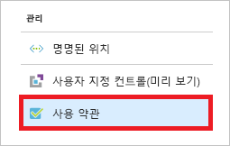
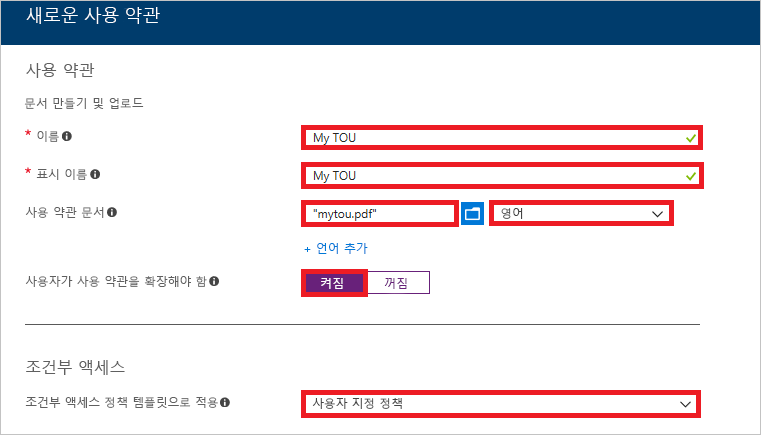
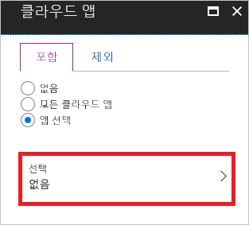
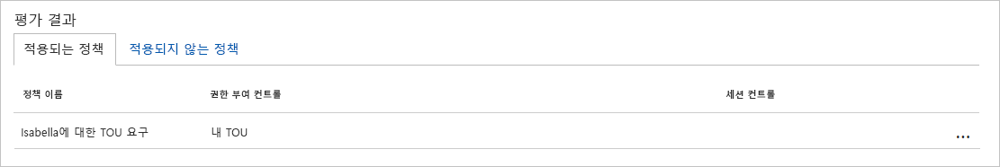
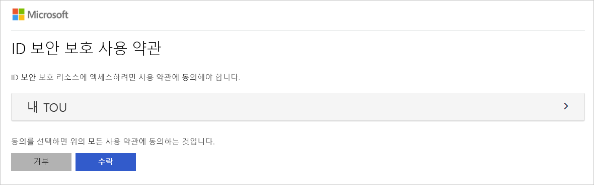
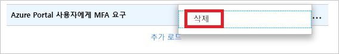

# 빠른 시작: 클라우드 앱에 액세스하기 전에 사용 약관에 동의하도록 요구 

사용자 환경에서 특정 클라우드 앱에 액세스하기 전에 ToU(사용 약관)를 수락하는 형태로 사용자의 동의를 요구하는 것이 좋습니다. Azure AD(Azure Active Directory) 조건부 액세스에서 제공하는 항목은 다음과 같습니다. 

- ToU를 구성하는 간단한 방법
- 조건부 액세스 정책을 통해 사용 약관에 동의하도록 요구하는 옵션  

이 빠른 시작에서는 사용자 환경에서 선택한 클라우드 앱에 대한 ToU에 동의하도록 요구하는 [Azure AD 조건부 액세스 정책](../active-directory-conditional-access-azure-portal.md)을 구성하는 방법을 보여 줍니다.

Azure 구독이 아직 없는 경우 시작하기 전에 [체험 계정](https://azure.microsoft.com/free/?WT.mc_id=A261C142F)을 만듭니다.

## 필수 조건 

이 빠른 시작의 시나리오를 완료하려면 다음이 필요합니다.

- **Azure AD Premium Edition에 대한 액세스 권한** - Azure AD 조건부 액세스는 Azure AD Premium 기능입니다. 

- **Isabella Simonsen이라고 하는 테스트 계정** - 테스트 계정을 만드는 방법을 모르는 경우 [클라우드 기반 사용자 추가](../fundamentals/add-users-azure-active-directory.md#add-a-new-user)를 참조하세요.

## 로그인 테스트

이 단계의 목표는 조건부 액세스 정책 없이 로그인 환경에 대한 인상을 가져오는 것입니다.

**로그인을 테스트하려면:**

1. [Azure Portal](https://portal.azure.com/)에 Isabella Simonsen으로 로그인합니다.

2. 로그아웃합니다.

## 사용 약관 만들기

이 섹션에서는 ToU 샘플을 만드는 단계를 제공합니다. ToU를 만드는 경우 **조건부 액세스 정책 템플릿으로 적용**에 대한 값을 선택합니다. **사용자 지정 정책**을 선택하면 ToU를 만든 즉시 새 조건부 액세스 정책을 만들 수 있는 대화 상자가 열립니다.

**사용 약관을 만들려면:**

1. Microsoft Word에서 새 문서를 만듭니다.

2. **내 사용 약관**을 입력한 다음, 컴퓨터에서 문서를 **mytou.pdf**로 저장합니다.

3. [Azure Portal](https://portal.azure.com)에 전역 관리자, 보안 관리자 또는 조건부 액세스 관리자 권한으로 로그인합니다.

4. Azure Portal의 왼쪽 탐색 모음에서 **Azure Active Directory**를 클릭합니다. 

    

5. **Azure Active Directory** 페이지의 **보안** 섹션에서 **조건부 액세스**를 클릭합니다.

     

6. **관리** 섹션에서 **사용 약관**을 클릭합니다.

     

7. 위쪽 메뉴에서 **새로운 약관**을 클릭합니다.

     

8. **새로운 사용 약관** 페이지에서:

     

    a. **이름** 텍스트 상자에서 **내 TOU**를 입력합니다.

    b. **표시 이름** 텍스트 상자에서 **내 TOU**를 입력합니다.

    다. 사용 약관 PDF 파일을 업로드합니다.

    d. **언어**로 **영어**를 선택합니다.

    e. **사용자가 사용 약관을 확장해야 함**으로 **켜기**를 선택합니다.

    f. **조건부 액세스 정책 템플릿으로 적용**으로 **사용자 지정 정책**을 선택합니다.

    g. **만들기**를 클릭합니다.
 

## 조건부 액세스 정책 만들기 

이 섹션에서는 필요한 조건부 액세스 정책을 만드는 방법을 보여줍니다. 이 빠른 시작의 시나리오에서는 다음을 사용합니다.

- ToU에 동의하도록 요구하는 클라우드 앱에 대한 자리 표시자인 Azure Portal 
- 조건부 액세스 정책을 테스트할 샘플 사용자.  

정책에서 다음을 설정합니다.

|설정 |값|
|---     | --- |
|개요 | Isabella Simonsen |
|클라우드 앱 | Microsoft Azure 관리 |
|액세스 권한 부여 | 내 TOU |
 

 

**조건부 액세스 정책을 구성하려면:**

1. **새로 만들기** 페이지의 **이름** 텍스트 상자에서 **Isabella에게 TOU 요구**를 입력합니다.

    

2. **할당** 섹션에서 **사용자 및 그룹**을 클릭합니다.

    

3. **사용자 및 그룹** 페이지에서:

    

    a. **사용자 및 그룹 선택**을 클릭한 다음, **사용자 및 그룹**을 선택합니다.

    b. **선택**을 클릭합니다.

    다. **선택** 페이지에서 **Isabella Simonsen**을 선택한 다음, **선택**을 클릭합니다.

    d. **사용자 및 그룹** 페이지에서 **완료**를 클릭합니다.

4. **클라우드 앱**을 클릭합니다.

    

5. **클라우드 앱** 페이지에서:

    

    a. **앱 선택**을 클릭합니다.

    b. **선택**을 클릭합니다.

    다. **선택** 페이지에서 **Microsoft Azure 관리**를 선택한 다음, **선택**을 클릭합니다.

    d. **클라우드 앱** 페이지에서 **완료**를 클릭합니다.

6. **액세스 제어** 섹션에서 **허용**을 클릭합니다.

    

7. **권한 부여** 페이지에서:

    

    a. **액세스 권한 부여**를 선택합니다.

    a. **내 TOU**를 선택합니다.

    b. **선택**을 클릭합니다.

8. **정책 사용** 섹션에서 **켬**을 클릭합니다.

    

9. **만들기**를 클릭합니다.

## 시뮬레이션된 로그인 평가

조건부 액세스 정책을 구성했으니, 예상대로 작동하는지 확인해야 합니다. 첫 번째 단계로, 조건부 액세스 what if 정책 도구를 사용하여 테스트 사용자 로그인을 시뮬레이션합니다. 이 시뮬레이션은 이 로그인이 정책에 미치는 영향을 평가하고, 시뮬레이션 보고서를 생성합니다.  

what if 정책 평가 도구를 초기화하려면 다음을 설정합니다.

- 사용자로 **Isabella Simonsen** 
- 클라우드 앱으로 **Microsoft Azure 관리**

**What If**를 클릭하면 다음 내용을 보여주는 시뮬레이션 보고서가 작성됩니다.

- **적용되는 정책** 아래에 있는 **Isabella에게 TOU 요구** 
- **컨트롤 권한 부여**로 **내 TOU**

**조건부 액세스 정책을 평가하려면:**

1. [조건부 액세스 - 정책](https://portal.azure.com/#blade/Microsoft_AAD_IAM/ConditionalAccessBlade/Policies) 페이지의 위쪽 메뉴에서 **What If**를 클릭합니다.  
 
    

2. **사용자**를 클릭하고, **Isabella Simonsen**을 선택하고, **선택**을 클릭합니다.

    

2. 클라우드 앱을 선택하려면:

    

    a. **클라우드 앱**을 클릭합니다.

    b. **클라우드 앱** 페이지에서 **앱 선택**을 클릭합니다.

    다. **선택**을 클릭합니다.

    d. **선택** 페이지에서 **Microsoft Azure 관리**를 선택한 다음, **선택**을 클릭합니다.

    e. 클라우드 앱 페이지에서 **완료**를 클릭합니다.

3. **What If**를 클릭합니다.

## 조건부 액세스 정책 테스트

이전 섹션에서는 시뮬레이션된 로그인을 평가하는 방법을 배웠습니다. 시뮬레이션 외에도, 조건부 액세스 정책이 예상대로 작동하는지 테스트해야 합니다. 

정책을 테스트하려면 **Isabella Simonsen** 테스트 계정을 사용하여 [Azure portal](https://portal.azure.com)에 로그인합니다. 사용 약관에 동의하도록 요구하는 대화 상자가 표시됩니다.

## 리소스 정리

테스트 사용자 및 조건부 액세스 정책이 더 이상 필요 없으면 삭제합니다.

- Azure AD 사용자를 삭제하는 방법을 모르겠으면 [Azure AD에서 사용자 삭제](../fundamentals/add-users-azure-active-directory.md#delete-a-user)를 참조하세요.

- 정책을 삭제하려면 정책을 선택하고, 빠른 실행 도구 모음에서 **삭제**를 클릭합니다.

    

- 사용 약관을 삭제하려면 해당 사용 약관을 선택한 다음, 위쪽의 도구 모음에서 **약관 삭제**를 클릭합니다. 

    

## 다음 단계

> [!div class="nextstepaction"]
> [특정 앱에 MFA 요구](app-based-mfa.md)
> [세션 위험이 감지되면 액세스 차단](app-sign-in-risk.md)

