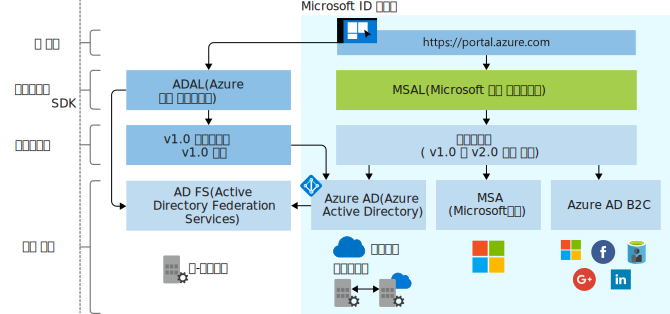

# Microsoft ID 플랫폼의 발전

Microsoft ID 플랫폼은 Azure AD(Azure Active Directory) 개발자 플랫폼의 발전된 형태입니다. 이 플랫폼을 사용하면 개발자는 사용자를 로그인하고, Microsoft Graph 같은 API 또는 개발자가 빌드한 API를 호출하는 토큰을 가져오는 애플리케이션을 빌드할 수 있습니다. 이 플랫폼은 인증 서비스, 오픈 소스 라이브러리, 애플리케이션 등록 및 구성(개발자 포털 및 애플리케이션 API를 통해), 완전한 개발자 설명서, 빠른 시작 샘플, 코드 샘플, 자습서, 방법 가이드, 기타 개발자 콘텐츠로 구성되어 있습니다. Microsoft ID 플랫폼은 OAuth 2.0 및 OpenID Connect 등의 산업 표준 프로토콜을 지원합니다.

지금까지는 대부분의 개발자가 ADAL(Azure AD 인증 라이브러리), 애플리케이션 등록 및 구성을 위한 Azure Portal, 프로그래밍 방식으로 애플리케이션 구성을 위한 Azure AD Graph API를 사용하여 Azure AD v1.0 엔드포인트에서 토큰을 요청하는 방법으로 Azure AD v1.0 플랫폼을 작업하여 회사 및 학교 계정(Azure AD로 프로비저닝된)을 인증했습니다.

Microsoft ID 플랫폼(v2.0)을 사용하면 서비스 범위가 다음과 같은 사용자로 확장됩니다.

- 회사 및 학교 계정(Azure AD로 프로비저닝한 계정)
- 개인 계정(예: Outlook.com 또는 Hotmail.com)
- Azure AD B2C 제품을 통해 자신의 이메일 또는 소셜 ID(예: LinkedIn, Facebook, Google)를 사용하는 고객

통합 Microsoft ID 플랫폼을 사용하는 경우 코드를 한 번만 작성하면 모든 Microsoft ID를 애플리케이션에 인증할 수 있습니다. 여러 플랫폼을 완벽하게 지원하는 MSAL(Microsoft 인증 라이브러리)이라는 오픈 소스 라이브러리가 있습니다. MSAL은 사용 방법이 간단하고, 사용자에게 뛰어난 SSO(Single Sign-On) 환경을 제공하고, 높은 신뢰성과 성능을 제공하며, Microsoft SDL(Security Development Lifecycle)을 사용하여 개발됩니다. API를 호출할 때 증분 동의를 활용하도록 애플리케이션을 구성할 수 있습니다. 이렇게 하면 런타임에 애플리케이션을 사용할 수 있을 때까지 동의 요청을 지연하여 보다 공격적인 범위를 구현할 수 있습니다.

Azure Portal을 사용하여 애플리케이션을 등록 및 구성하고, Microsoft Graph API를 방식 애플리케이션 구성에 사용할 수 있습니다.

원하는 속도로 애플리케이션을 업데이트할 수 있습니다. ADAL 라이브러리를 사용하여 빌드된 애플리케이션은 계속 지원됩니다. ADAL을 사용하여 빌드된 애플리케이션과 MSAL 라이브러리를 사용하여 빌드된 애플리케이션으로 구성되는 혼합 애플리케이션 포트폴리오도 지원됩니다. 즉, 최신 ADAL 및 최신 MSAL을 사용하는 애플리케이션은 포트폴리오 전체에 SSO를 제공하며, SSO는 이러한 라이브러리 간에 공유 토큰 캐시를 통해 제공됩니다. ADAL에서 MSAL로 업데이트된 애플리케이션은 업그레이드 당시의 사용자 로그인 상태를 유지합니다.

## Microsoft ID 플랫폼 환경

다음 다이어그램은 앱 등록 환경, SDK, 엔드포인트 및 지원되는 ID를 포함하는 높은 수준의 Microsoft ID 환경을 보여줍니다.

### 앱 등록 환경

Azure Portal **[앱 등록](https://go.microsoft.com/fwlink/?linkid=2083908)** 환경은 Microsoft ID 플랫폼과 통합한 모든 애플리케이션을 관리할 수 있는 단일 포털 환경입니다. 지금까지 애플리케이션 등록 포털을 사용해 오신 경우 먼저 Azure Portal 앱 등록 환경부터 시작해보세요.

Azure AD B2C와 통합하려면(소셜 또는 로컬 ID를 인증할 때) 애플리케이션을 B2C 테넌트에 등록해야 합니다. 이 환경은 Azure Portal의 일부이기도 합니다.

**Microsoft Graph의 애플리케이션 API**는 현재 미리 보기로 제공됩니다. 이 API를 사용하면 모든 Microsoft ID를 인증하도록 Microsoft ID 플랫폼과 통합된 애플리케이션을 프로그래밍 방식으로 구성할 수 있습니다. 하지만 이 API가 일반 공급될 때까지는 Azure AD Graph 1.6 API 및 애플리케이션 매니페스트를 사용해야 합니다.

### MSAL 라이브러리

MSAL 라이브러리를 사용하여 모든 Microsoft ID를 인증하는 애플리케이션을 빌드할 수 있습니다. .NET의 MSAL 라이브러리는 현재 일반 공급됩니다. JavaScript, iOS 및 Android용 MSAL 라이브러리는 미리 보기로 제공되며 프로덕션 환경에서 사용하기에 적합합니다. 현재 일반 공급되는 MSAL 및 ADAL 버전과 동일한 수준의 프로덕션 수준 지원이 MSAL 라이브러리 미리 보기에도 제공됩니다.

또한 MSAL 라이브러리를 사용하여 애플리케이션을 Azure AD B2C와 통합할 수 있습니다.

웹앱 및 웹 API 빌드에 사용되는 서버 쪽 라이브러리는 현재 일반 공급됩니다. [ASP.NET](https://docs.microsoft.com/aspnet/overview) 및 [ASP.NET Core](https://docs.microsoft.com/aspnet/core/?view=aspnetcore-2.2)

### Microsoft ID 플랫폼 엔드포인트

Microsoft ID 플랫폼(v2.0) 엔드포인트는 OIDC 인증을 획득했습니다. MSAL(Microsoft 인증 라이브러리) 및 기타 표준 규격 라이브러리를 지원하며, 산업 표준에 따라 사람이 읽을 수 있는 범위를 구현합니다.

## 다음 단계

v1.0 및 v2.0에 대해 자세히 알아봅니다.

* [Microsoft ID 플랫폼(v2.0) 개요](v2-overview.md)
* [개발자용 Azure Active Directory(v1.0) 개요](v1-overview.md)
