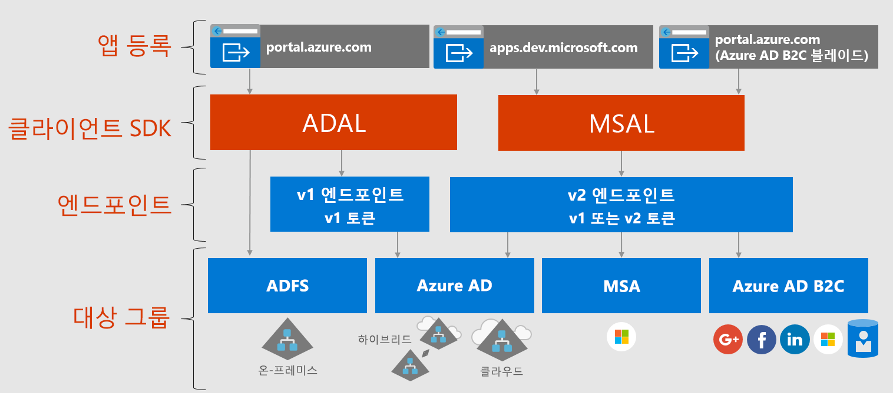

# Microsoft ID 플랫폼 정보

Microsoft ID 플랫폼은 Azure AD(Azure Active Directory) ID 서비스와 개발자 플랫폼의 발전된 형태입니다. 이 플랫폼을 사용하면 개발자가 모든 Microsoft ID에 로그인하고, Microsoft Graph, 기타 Microsoft API 또는 개발자가 빌드한 API를 호출하기 위한 토큰을 가져오는 응용 프로그램을 빌드할 수 있습니다. 인증 서비스, 오픈 소스 라이브러리, 응용 프로그램 등록 및 구성(개발자 포털 또는 응용 프로그램 API를 통해), 완전한 개발자 설명서, 코드 샘플 및 기타 개발자 콘텐츠로 구성된 모든 기능을 갖춘 플랫폼입니다. Microsoft ID 플랫폼은 OAuth 2.0 및 OpenID Connect 등의 산업 표준 프로토콜을 지원합니다.

지금까지는 대부분의 개발자가 Azure AD v1.0 엔드포인트에서 토큰을 요청하고, ADAL(Azure AD 인증 라이브러리), 응용 프로그램 등록 및 구성을 위한 Azure Portal 및 프로그래밍 방식으로 응용 프로그램 구성을 위한 Azure AD Graph API를 사용하여 Azure AD ID(회사 및 학교 계정)를 인증하기 위해 Azure AD v1.0 플랫폼을 사용하여 작업했습니다. Azure AD v1.0 플랫폼은 엔터프라이즈 응용 프로그램에 대한 작업을 계속하는 완성도 높은 플랫폼 제품입니다.

Microsoft ID 플랫폼의 기능을 확장하고 발전시키기 위해 이제 Azure AD v2.0 엔드포인트로 알려졌던 것을 통해 광범위한 Microsoft ID 집합(Azure AD ID, Microsoft 계정(예: outlook.com 및 hotmail.com) 및 Azure AD B2C를 통한 소셜 및 로컬 계정)을 인증할 수 있습니다. 여기에서 Microsoft 인증 라이브러리(MSAL) 또는 모든 오픈 소스 OAuth2.0 또는 OpenID Connect 라이브러리, 응용 프로그램 등록 및 구성을 위한 Azure Portal, 프로그래밍 방식으로 응용 프로그램 구성을 위한 Microsoft Graph API를 사용합니다. 지난 한 해 동안 업데이트된 Microsoft ID 플랫폼은 크게 발전했습니다(특히 MSAL 라이브러리 및 최신 Azure Portal 앱 등록 환경). 이 릴리스를 마무리하기 위해 개발자는 최신 Microsoft ID 플랫폼을 사용하여 해당 응용 프로그램을 개발 및 테스트하는 것이 좋습니다.

최신 ADAL 및 최신 MSAL을 사용하는 응용 프로그램은 서로 SSO됩니다. ADAL에서 MSAL로 업데이트된 응용 프로그램은 사용자의 로그인 상태를 유지합니다. ADAL을 사용하여 빌드된 응용 프로그램은 계속해서 작동하고 지원되므로 개발자는 적합한 MSAL로 해당 응용 프로그램을 업데이트하도록 선택할 수 있습니다.

## Microsoft ID 플랫폼 환경

다음 다이어그램은 앱 등록 환경, SDK, 엔드포인트 및 지원되는 ID를 포함하는 높은 수준의 Microsoft ID 환경을 보여줍니다.

Microsoft ID 플랫폼에는 두 개의 엔드포인트(v1.0 및 v2.0)와 이러한 엔드포인트를 처리하는 클라이언트 라이브러리의 두 가지 집합이 있습니다. 새 응용 프로그램을 개발할 때 엔드포인트 및 인증 라이브러리의 장점 및 현재 상태를 고려합니다. 또한 다음 사항도 고려합니다.

* 지원되는 플랫폼

    * [ADAL](active-directory-authentication-libraries.md)은 .NET, JavaScript, iOS, Android, Java 및 Python을 지원합니다.
    * [MSAL 미리 보기](reference-v2-libraries.md)는 .NET, JavaScript, iOS 및 Android를 지원합니다.
    * 두 엔드포인트는 API 및 로그인을 보호하기 위한 .NET 및 Node.js 서버 미들웨어를 지원합니다. 

* 동적 동의 및 증분 동의와 같은 대부분의 혁신은 v2.0 엔드포인트 및 MSAL에서 발생하지만 v1.0 및 ADAL을 계속해서 지원합니다.

    Azure Portal에서 이전에는 앱에서 필요한 모든 범위를 정적으로 식별해야 했습니다. v2.0 엔드포인트 및 이 엔드포인트와 연결된 포털을 사용하여 전과 같이 범위를 정적으로 정의하거나 앱에서 사용 권한이 필요하므로 동적으로 요청할 수 있습니다. 동적은 증분 동의의 선택적 기능 한가지를 더 제공합니다. 증분 동의를 통해 사용자가 처음 인증하고 필요로 하는 추가 범위를 요청할 때 필요한 범위의 하위 집합을 요청할 수 있습니다. 
    
    예를 들어 모바일 장치에서 카메라 앱을 사용하는 경우 사용자는 카메라에 액세스하도록 앱을 허용할지 묻는 메시지가 표시되고, 사용자가 동의한 후에만 앱은 카메라에 액세스하도록 허용되고 사진을 찍습니다.  앱이 새 사진을 저장할 준비가 되면 사진 읽기/쓰기 권한을 요청할 수 있습니다. 

* 가능한 주요 변경 내용

    MSAL은 프로덕션 환경에서 사용하기에 적합합니다. Microsoft는 MSAL에 대해 현재 프로덕션 라이브러리와 동일한 프로덕션 수준의 지원을 제공합니다. 미리 보기 중에는 버그 수정이나 기능 향상과 함께 사용하는 데 필요한 API, 내부 캐시 형식 및 이 라이브러리의 다른 메커니즘이 변경될 수 있습니다. 이러한 변경은 응용 프로그램에 영향을 줄 수 있습니다. 예를 들어 캐시 형식을 변경하면 다시 로그인하도록 요구하는 등 사용자에게 영향을 줄 수 있습니다. API 변경으로 인해 코드를 업데이트해야 할 수 있습니다. GA(일반 공급) 릴리스가 제공되면 라이브러리의 미리 보기 버전을 사용하여 작성된 응용 프로그램이 더 이상 작동하지 않을 수 있으므로 6개월 내에 GA 버전으로 업데이트해야 합니다.

## 다음 단계

v1.0 및 v2.0에 대해 자세히 알아봅니다.

* [v1.0 정보](azure-ad-developers-guide.md)
* [v2.0 정보](azure-ad-developers-guide.md)
