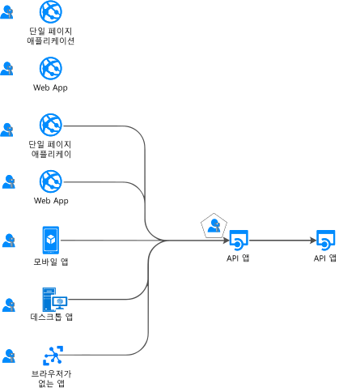
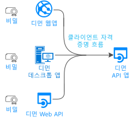

# 인증 흐름 및 애플리케이션 시나리오

Microsoft ID 플랫폼(v2.0) 엔드포인트는 다양한 종류의 최신 애플리케이션 아키텍처에 대한 인증을 지원합니다. 모든 아키텍처는 [OAuth 2.0 또는 OpenID Connect](active-directory-v2-protocols.md) 업계 표준 프로토콜을 기반으로 합니다.  [인증 라이브러리](reference-v2-libraries.md)를 사용하면 애플리케이션에서 ID를 인증하고 토큰을 획득하여 보호된 API에 액세스합니다.

이 문서에서는 다양한 인증 흐름과 이러한 흐름이 사용되는 애플리케이션 시나리오에 대해 설명합니다. 이 문서에서는 다음 목록도 제공합니다.
- [애플리케이션 시나리오 및 지원되는 인증 흐름](#scenarios-and-supported-authentication-flows)
- [애플리케이션 시나리오 및 지원되는 플랫폼과 언어](#scenarios-and-supported-platforms-and-languages)

## 애플리케이션 범주

토큰은 다음과 같은 여러 유형의 애플리케이션에서 가져올 수 있습니다.

- 웹 앱
- 모바일 앱
- 데스크톱 앱
- Web API

또한 브라우저가 없거나 IoT에서 실행되는 디바이스에서 실행되는 앱에서도 가져올 수 있습니다.

애플리케이션은 다음 목록과 같이 분류할 수 있습니다.

- [보호 된 리소스 및 클라이언트 응용 프로그램](#protected-resources-vs-client-applications): 웹 앱 또는 웹 api와 같은 리소스를 보호 하는 시나리오가 있습니다. 다른 시나리오는 보안 토큰을 가져와서 보호된 웹 API를 호출하는 것입니다.
- 사용자 [또는 사용자가 없는](#with-users-or-without-users)사용자: 일부 시나리오에는 로그인 한 사용자가 포함 되지만, 디먼 시나리오와 같은 다른 시나리오에는 사용자가 포함 되지 않습니다.
- [단일 페이지, 공용 클라이언트 및 기밀 클라이언트 응용 프로그램](#single-page-public-client-and-confidential-client-applications): 이러한 응용 프로그램 종류는 세 가지 범주의 응용 프로그램입니다. 각 라이브러리는 서로 다른 라이브러리와 개체에 사용됩니다.
- [로그인 대상](v2-supported-account-types.md#certain-authentication-flows-dont-support-all-the-account-types): 사용 가능한 인증 흐름은 로그인 대상 그룹에 따라 달라 집니다. 일부 흐름은 회사 또는 학교 계정에서만 사용할 수 있습니다. 그리고 일부는 회사/학교 계정과 개인 Microsoft 계정 모두에 사용할 수 있습니다. 허용되는 대상은 인증 흐름에 따라 다릅니다.
- [지원 되는 OAuth 2.0 흐름](#scenarios-and-supported-authentication-flows): 인증 흐름은 토큰을 요청 하는 응용 프로그램 시나리오를 구현 하는 데 사용 됩니다. 애플리케이션 시나리오와 인증 흐름 간에는 일대일 매핑이 없습니다.
- [지원 되는 플랫폼](#scenarios-and-supported-platforms-and-languages): 모든 플랫폼에서 모든 응용 프로그램 시나리오를 사용할 수 있는 것은 아닙니다.

### 보호된 리소스 및 클라이언트 애플리케이션

인증 시나리오에는 두 가지 작업이 포함됩니다.

- **보호 된 WEB API에 대 한 보안 토큰 획득**: Microsoft 인증 라이브러리 (msal) 제품군에서 [인증 라이브러리](reference-v2-libraries.md#microsoft-supported-client-libraries) 를 사용 하 여 토큰을 얻는 것이 좋습니다.
- Web **api 또는 웹 앱 보호**: web api 또는 웹 앱 리소스를 보호 하는 한 가지 문제는 보안 토큰의 유효성을 검사 하는 것입니다. 일부 플랫폼의 경우 Microsoft에서 [미들웨어 라이브러리](reference-v2-libraries.md#microsoft-supported-server-middleware-libraries)를 제공합니다.

### 사용자 포함 또는 사용자 없음

대부분의 인증 시나리오에서는 로그인한 사용자를 대신하여 토큰을 획득합니다.

그러나 애플리케이션에서 사용자를 대신하여 토큰을 획득하는 디먼 애플리케이션 시나리오도 있습니다.

### 단일 페이지, 퍼블릭 클라이언트 및 기밀 클라이언트 애플리케이션

보안 토큰은 여러 애플리케이션 유형에서 가져올 수 있습니다. 이러한 애플리케이션은 다음 세 가지 범주로 구분됩니다.

- **단일 페이지 응용 프로그램**: spas 라고도 하며, 브라우저에서 실행 되는 JavaScript 또는 TypeScript 앱에서 토큰을 가져오는 웹 앱입니다. 대부분의 최신 앱에는 기본적으로 JavaScript로 작성된 단일 페이지 애플리케이션 프런트 엔드가 있습니다. 애플리케이션은 종종 Angular, React 또는 Vue와 같은 프레임워크를 사용합니다. MSAL.js는 단일 페이지 애플리케이션을 지원하는 유일한 Microsoft 인증 라이브러리입니다.

- **공용 클라이언트 응용 프로그램**: 이러한 응용 프로그램은 항상 사용자를 로그인 합니다.
  - 로그인한 사용자를 대신하여 웹 API를 호출하는 데스크톱 앱
  - 모바일 앱
  - 브라우저가 없는 디바이스에서 실행되는 앱(예: iOT에서 실행되는 앱)

  이러한 앱은 MSAL [PublicClientApplication](msal-client-applications.md) 클래스로 표시됩니다.

- **기밀 클라이언트 애플리케이션**:
  - 웹 API를 호출하는 웹앱
  - 웹 API를 호출하는 웹 API
  - 디먼 앱(Linux 디먼 또는 Windows 서비스와 같은 콘솔 서비스로 구현된 경우에도 해당)

  이러한 유형의 앱은 [ConfidentialClientApplication](msal-client-applications.md) 클래스를 사용합니다.

## 애플리케이션 시나리오

Microsoft ID 플랫폼 엔드포인트는 다양한 종류의 앱 아키텍처에 대한 인증을 지원합니다.

- 단일 페이지 앱
- 웹 앱
- Web API
- 모바일 앱
- 네이티브 앱
- 디먼 앱
- 서버 쪽 앱

애플리케이션은 다양한 인증 흐름을 사용하여 사용자를 로그인하고, 토큰을 가져와서 보호된 API를 호출합니다.

### 단일 페이지 애플리케이션

많은 최신 웹앱은 JavaScript 또는 SPA 프레임워크(예: Angular, Vue.js 및 React.js)를 사용하여 작성된 클라이언트 쪽 단일 페이지 애플리케이션으로 빌드됩니다. 이러한 애플리케이션은 웹 브라우저에서 실행됩니다. 해당 인증 특성은 기존의 서버 쪽 웹앱과 다릅니다. Microsoft ID 플랫폼을 사용하면 단일 페이지 애플리케이션에서 사용자를 로그인하고 토큰을 가져와서 백 엔드 서비스 또는 웹 API에 액세스할 수 있습니다.

자세한 내용은 [단일 페이지 애플리케이션](scenario-spa-overview.md)을 참조하세요.

### 사용자를 로그인하는 웹앱

사용자를 로그인하는 웹앱을 보호하려면 다음을 수행합니다.

- .NET에서 개발하는 경우 ASP.NET Open ID Connect 미들웨어에서 ASP.NET 또는 ASP.NET Core를 사용합니다. 리소스를 보호하려면 보안 토큰의 유효성을 검사해야 하며, 이 작업은 MSAL 라이브러리가 아닌 [.NET용 IdentityModel 확장](https://github.com/AzureAD/azure-activedirectory-identitymodel-extensions-for-dotnet/wiki) 라이브러리를 통해 수행됩니다.

- Node.js에서 개발하는 경우 Passport.js를 사용합니다.

자세한 내용은 [사용자를 로그인하는 웹앱](scenario-web-app-sign-user-overview.md)을 참조하세요.

### 사용자를 로그인하고 사용자를 대신하여 웹 API를 호출하는 웹앱

사용자를 대신하여 웹앱에서 웹 API를 호출하려면 MSAL **ConfidentialClientApplication** 클래스를 사용합니다. 권한 부여 코드 흐름을 사용하고 획득한 토큰을 토큰 캐시에 저장합니다. 필요한 경우 MSAL은 토큰을 새로 고치고, 컨트롤러는 캐시에서 토큰을 자동으로 가져옵니다.

자세한 내용은 [웹 API를 호출하는 웹앱](scenario-web-app-call-api-overview.md)을 참조하세요.

### 로그인한 사용자를 대신하여 웹 API를 호출하는 데스크톱 앱

데스크톱 앱에서 사용자를 로그인하는 웹 API를 호출하려면 MSAL **PublicClientApplication** 클래스의 대화형 토큰 획득 메서드를 사용합니다. 이러한 대화형 메서드를 사용하면 로그인 UI 환경을 제어할 수 있습니다. MSAL은 이 상호 작용에 웹 브라우저를 사용합니다.

Windows 도메인에 조인되거나 Azure AD(Azure Active Directory)에서 조인한 컴퓨터에서 Windows에 호스팅된 애플리케이션을 사용할 수도 있습니다. 이러한 애플리케이션은 [Windows 통합 인증](https://aka.ms/msal-net-iwa)을 사용하여 토큰을 자동으로 가져올 수 있습니다.

브라우저 없이 디바이스에서 실행되는 애플리케이션은 여전히 사용자를 대신하여 API를 호출할 수 있습니다. 인증하려면 사용자가 웹 브라우저를 사용하는 다른 디바이스에 로그인해야 합니다. 이 시나리오에서는 [디바이스 코드 흐름](https://aka.ms/msal-net-device-code-flow)을 사용해야 합니다.

이를 사용하지 않는 것이 좋지만, [사용자 이름/암호 흐름](https://aka.ms/msal-net-up)은 퍼블릭 클라이언트 애플리케이션에서 사용할 수 있습니다. 이 흐름은 여전히 DevOps와 같은 일부 시나리오에서 필요합니다.

그러나 이러한 흐름을 사용하면 애플리케이션에 제약 조건이 적용됩니다. 예를 들어 이 흐름을 사용하는 애플리케이션에서는 다단계 인증 또는 조건부 액세스를 수행해야 하는 사용자가 로그인할 수 없습니다. 또한 애플리케이션에서 Single Sign-On의 이점을 누릴 수 없습니다.

사용자 이름/암호 흐름을 사용하는 인증은 최신 인증 원칙에 위반되며, 레거시 용도로만 제공됩니다.

데스크톱 앱에서 토큰 캐시를 영구적으로 유지하려면 [토큰 캐시 직렬화를 사용자 지정](https://aka.ms/msal-net-token-cache-serialization)해야 합니다. [이중 토큰 캐시 직렬화](https://aka.ms/msal-net-dual-cache-serialization)를 구현하면 이전 인증 라이브러리 세대의 이전 버전 및 이후 버전과 호환되는 토큰 캐시를 사용할 수 있습니다. 특정 라이브러리에는 .NET용 Azure AD 인증 라이브러리(ADAL.NET) 버전 3 및 4가 포함됩니다.

자세한 내용은 [웹 API를 호출하는 데스크톱 앱](scenario-desktop-overview.md)을 참조하세요.

### 대화형 사용자를 대신하여 웹 API를 호출하는 모바일 앱

데스크톱 앱과 비슷하게 모바일 앱도 MSAL **PublicClientApplication** 클래스의 대화형 토큰 획득 메서드를 호출하여 웹 API를 호출하기 위한 토큰을 가져옵니다.

MSAL iOS 및 MSAL Android는 기본적으로 시스템 웹 브라우저를 사용합니다. 그러나 포함된 웹 보기를 대신 사용하도록 지시할 수 있습니다. 유니버설 Windows 플랫폼 (UWP), iOS 또는 Android 모바일 플랫폼에 종속 된 specificities 있습니다.

디바이스 ID 또는 디바이스 등록과 관련된 조건부 액세스가 포함된 일부 시나리오에서는 [broker](https://github.com/AzureAD/azure-activedirectory-library-for-dotnet/wiki/leveraging-brokers-on-Android-and-iOS)를 디바이스에 설치해야 합니다. broker의 예로는 Android의 Microsoft 회사 포털과 Android 및 iOS의 Microsoft Authenticator가 있습니다. 또한 MSAL은 이제 broker와 상호 작용할 수 있습니다.

> [!NOTE]
> Xamarin에서 MSAL.iOS, MSAL.Android 또는 MSAL.NET을 사용하는 모바일 앱에는 앱 보호 정책이 적용될 수 있습니다. 예를 들어 정책을 사용하면 사용자가 보호된 텍스트를 복사하지 못할 수 있습니다. 모바일 앱은 [Intune에서 관리](https://docs.microsoft.com/intune/app-sdk)하고, Intune에서 관리형 앱으로 인식합니다. [Intune 앱 SDK](https://docs.microsoft.com/intune/app-sdk-get-started)는 MSAL 라이브러리와는 별개이며, 자체적으로 Azure AD와 상호 작용합니다.

자세한 내용은 [웹 API를 호출하는 모바일 앱](scenario-mobile-overview.md)을 참조하세요.

### 보호된 웹 API

Microsoft ID 플랫폼 엔드포인트를 사용하여 앱의 RESTful Web API와 같은 웹 서비스를 보호할 수 있습니다. 보호된 웹 API는 API의 데이터를 보호하고 들어오는 요청을 인증하기 위해 액세스 토큰을 사용하여 호출됩니다. 웹 API 호출자는 액세스 토큰을 HTTP 요청의 인증 헤더에 추가합니다.

ASP.NET 또는 ASP.NET Core 웹 API를 보호하려면 액세스 토큰의 유효성을 검사해야 합니다. 이 유효성 검사를 위해 ASP.NET JWT 미들웨어를 사용합니다. 유효성 검사는 MSAL.NET이 아니라 [.NET용 IdentityModel 확장](https://github.com/AzureAD/azure-activedirectory-identitymodel-extensions-for-dotnet/wiki) 라이브러리에서 수행합니다.

자세한 내용은 [보호된 웹 API](scenario-protected-web-api-overview.md)를 참조하세요.

### 사용자를 대신하여 다른 웹 API를 호출하는 웹 API

ASP.NET 또는 ASP.NET Core 보호된 웹 API에서 사용자를 대신하여 다른 웹 API를 호출하려면 앱에서 다운스트림 웹 API에 대한 토큰을 가져와야 합니다. 이렇게 하려면 **ConfidentialClientApplication** 클래스의 [AcquireTokenOnBehalfOf](https://aka.ms/msal-net-on-behalf-of) 메서드를 호출합니다. 이러한 호출을 서비스 간 호출이라고도 합니다. 다른 웹 API를 호출하는 웹 API는 사용자 지정 캐시 직렬화를 제공해야 합니다.

  

자세한 내용은 [웹 API를 호출하는 웹 API](scenario-web-api-call-api-overview.md)를 참조하세요.

### 디먼 이름으로 웹 API를 호출하는 디먼 앱

장기 실행 프로세스가 있거나 사용자 상호 작용 없이 작동하는 앱에도 보안 웹 API에 액세스할 수 있는 방법이 필요합니다. 이러한 앱은 사용자의 위임된 ID 대신 앱의 ID를 사용하여 인증하고 토큰을 가져올 수 있습니다. 앱은 클라이언트 비밀 또는 인증서를 사용하여 해당 ID를 증명합니다.

MSAL **ConfidentialClientApplication** 클래스의 [클라이언트 자격 증명](https://aka.ms/msal-net-client-credentials) 획득 메서드를 사용하여 호출 앱에 대한 토큰을 획득하는 디먼 앱을 작성할 수 있습니다. 이러한 메서드를 사용하려면 호출 앱에서 비밀을 Azure AD에 등록해야 합니다. 그런 다음, 앱에서 이 비밀을 호출된 디먼과 공유합니다. 이러한 비밀의 예로는 애플리케이션 암호, 인증서 어설션 또는 클라이언트 어설션이 있습니다.

자세한 내용은 [웹 API를 호출하는 디먼 애플리케이션](scenario-daemon-overview.md)을 참조하세요.

## 시나리오 및 지원되는 인증 흐름

토큰 획득과 관련된 시나리오는 [Microsoft ID 플랫폼 프로토콜](active-directory-v2-protocols.md)에서 자세히 설명한 대로 OAuth 2.0 인증 흐름에도 매핑됩니다.

<table>
 <thead>
  <tr><th>시나리오</th> <th>자세한 시나리오 연습</th> <th>OAuth 2.0 흐름 및 권한 부여</th> <th>사용자</th></tr>
 </thead>
 <tbody>
  <tr>
   <td></td>
   <td><a href="scenario-spa-overview.md">단일 페이지 앱</a></td>
   <td><a href="v2-oauth2-implicit-grant-flow.md">암시적</a></td>
   <td>회사/학교 계정, 개인 계정 및 Microsoft Azure AD B2C(Azure Active Directory B2C)</td>
 </tr>

  <tr>
   <td></td>
   <td><a href="scenario-web-app-sign-user-overview.md">사용자를 로그인하는 웹앱</a></td>
   <td><a href="v2-oauth2-auth-code-flow.md">인증 코드</a></td>
   <td>회사/학교 계정, 개인 계정 및 Azure AD B2C</td>
 </tr>

  <tr>
   <td></td>
   <td><a href="scenario-web-app-call-api-overview.md">웹 API를 호출하는 웹앱</a></td>
   <td><a href="v2-oauth2-auth-code-flow.md">인증 코드</a></td>
   <td>회사/학교 계정, 개인 계정 및 Azure AD B2C</td>
 </tr>

  <tr>
   <td rowspan="3"></td>
   <td rowspan="4"><a href="scenario-desktop-overview.md">웹 API를 호출하는 데스크톱 앱</a></td>
   <td>대화형(PKCE가 있는 <a href="v2-oauth2-auth-code-flow.md">권한 부여 코드</a> 사용)</td>
   <td>회사/학교 계정, 개인 계정 및 Azure AD B2C</td>
 </tr>

  <tr>
   <td>통합 Windows 인증</td>
   <td>회사 또는 학교 계정</td>
 </tr>

  <tr>
   <td><a href="v2-oauth-ropc.md">리소스 소유자 암호</a></td>
   <td>회사/학교 계정 및 Azure AD B2C</td>
 </tr>

  <tr>
   <td></td>
   <td><a href="v2-oauth2-device-code.md">디바이스 코드</a></td>
   <td>회사 또는 학교 계정</td>
 </tr>

 <tr>
   <td rowspan="2"></td>
   <td rowspan="2"><a href="scenario-mobile-overview.md">웹 API를 호출하는 모바일 앱</a></td>
   <td>대화형(PKCE가 있는 <a href="v2-oauth2-auth-code-flow.md">권한 부여 코드</a> 사용)</td>
   <td>회사/학교 계정, 개인 계정 및 Azure AD B2C</td>
 </tr>

  <tr>
   <td><a href="v2-oauth-ropc.md">리소스 소유자 암호</a></td>
   <td>회사/학교 계정 및 Azure AD B2C</td>
 </tr>

  <tr>
   <td></td>
   <td><a href="scenario-daemon-overview.md">웹 API를 호출하는 디먼 앱</a></td>
   <td><a href="v2-oauth2-client-creds-grant-flow.md">클라이언트 자격 증명</a></td>
   <td>사용자가 없고 Azure AD 조직에서만 사용되는 앱 전용 권한</td>
 </tr>

  <tr>
   <td></td>
   <td><a href="scenario-web-api-call-api-overview.md">웹 API를 호출하는 웹 API</a></td>
   <td><a href="v2-oauth2-on-behalf-of-flow.md">다음 항목 대신</a></td>
   <td>회사/학교 계정 및 개인 계정</td>
 </tr>

 </tbody>
</table>

## 시나리오 및 지원되는 플랫폼과 언어

Microsoft 인증 라이브러리에서 지원하는 여러 플랫폼은 다음과 같습니다.

- JavaScript
- .NET Framework
- .NET Core
- Windows 10/UWP
- Xamarin.iOS
- Xamarin.Android
- 네이티브 iOS
- macOS
- 네이티브 Android
- Java
- Python

다양한 언어를 사용하여 애플리케이션을 빌드할 수도 있습니다. 일부 애플리케이션 유형은 모든 플랫폼에서 사용할 수 없습니다.

다음 표의 Windows 열에서 .NET Core가 언급될 때마다 .NET Framework도 사용할 수 있습니다. 복잡한 표가 되지 않도록 후자는 생략되었습니다.

|시나리오  | Windows | Linux | Mac | iOS | Android
|--|--|--|--|--|--|--|
| [단일 페이지 앱](scenario-spa-overview.md)   |  MSAL.js |  MSAL.js |  MSAL.js |  MSAL.js |  MSAL.js
| [사용자를 로그인하는 웹앱](scenario-web-app-sign-user-overview.md)   |  ASP.NET Core |  ASP.NET Core |  ASP.NET Core
| [웹 API를 호출하는 웹앱](scenario-web-app-call-api-overview.md)     |  ASP.NET Core + MSAL.NET   MSAL Java  Flask + MSAL Python|  ASP.NET Core + MSAL.NET  MSAL Java  Flask + MSAL Python|  ASP.NET Core + MSAL.NET  MSAL Java   Flask + MSAL Python
| [Web API를 호출하는 데스크톱 앱](scenario-desktop-overview.md)      | MSAL.NET  MSAL Java   MSAL Python| MSAL.NET  MSAL Java  MSAL Python| MSAL.NET  MSAL Java  MSAL Python    MSAL.objc |
| [웹 API를 호출하는 모바일 앱](scenario-mobile-overview.md)    |  MSAL.NET  MSAL.NET | | |  MSAL.objc |  MSAL.Android
| [디먼 앱](scenario-daemon-overview.md)    | MSAL.NET  MSAL Java  MSAL Python|  MSAL.NET  MSAL Java  MSAL Python| MSAL.NET  MSAL Java  MSAL Python
| [웹 API를 호출하는 웹 API](scenario-web-api-call-api-overview.md)     |  ASP.NET Core + MSAL.NET  MSAL Java  MSAL Python|  ASP.NET Core + MSAL.NET  MSAL Java  MSAL Python|  ASP.NET Core + MSAL.NET  MSAL Java  MSAL Python

[OS/언어별 Microsoft 지원 라이브러리](reference-v2-libraries.md#microsoft-supported-libraries-by-os--language)도 참조하세요.

## 다음 단계
[인증 기본 사항](authentication-scenarios.md) 및 [액세스 토큰](access-tokens.md)에 대해 자세히 알아보세요.
