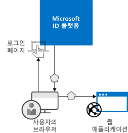
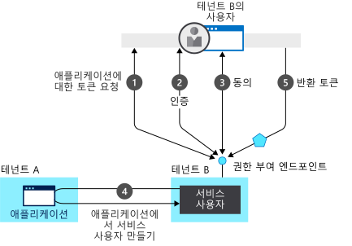

# 인증이란?

*인증*이란 ID 및 액세스 제어에 사용할 보안 주체를 만들기 위한 기반을 제공하도록 당사자에게 합법적인 자격 증명을 할 수 있게 챌린지하는 작업입니다. 간단히 말해서 사용자 자신이 본인임을 증명하게 하는 프로세스입니다. Authentication(인증)은 종종 AuthN으로 축약됩니다.

*권한 부여*란 인증된 보안 주체에게 작업을 수행할 수 있게 사용 권한을 부여하는 작업입니다. 액세스가 허용된 데이터 및 해당 데이터로 할 수 있는 작업을 지정합니다. Authorization(권한 부여)는 종종 AuthZ로 축약됩니다.

Microsoft ID 플랫폼은 빠르게 코딩을 시작하는 데 유용한 업계 표준 프로토콜(예: OAuth 2.0 및 OpenID Connect) 및 다양한 플랫폼용 오픈 소스 라이브러리를 지원하여 ID를 서비스로 제공함으로써 애플리케이션 개발자를 위한 인증을 간소화합니다.

Microsoft ID 플랫폼 프로그래밍 모델의 기본 사용 사례가 두 가지 있습니다.

* OAuth 2.0 권한 부여 흐름 동안 - 리소스 소유자가 클라이언트 애플리케이션에 권한을 부여하여 클라이언트에서 리소스 소유자의 리소스에 액세스할 수 있도록 허용합니다.
* 클라이언트에서 리소스에 액세스하는 동안 - 리소스 서버에서 구현하는 대로 액세스 토큰에 있는 클레임 값을 기반으로 하여 액세스 제어를 결정합니다.

## Microsoft ID 플랫폼의 인증 기본 사항

ID가 필요한 가장 기본적인 시나리오를 가정하겠습니다. 예를 들어 웹 브라우저 사용자가 웹 애플리케이션에 대한 인증을 받아야 합니다. 다음 다이어그램은 이 시나리오를 보여줍니다.

다이어그램에 나온 다양한 구성 요소에 대해 알아야 할 사항은 다음과 같습니다.

* Microsoft ID 플랫폼은 ID 공급자입니다. ID 공급자는 조직의 디렉터리에 존재하는 사용자 및 애플리케이션의 ID를 확인하고 해당 사용자 및 애플리케이션을 성공적으로 인증하면 보안 토큰을 발급하는 책임이 있습니다.
* Microsoft ID 플랫폼으로 인증을 아웃소싱하려는 애플리케이션을 Azure AD(Azure Active Directory)에 등록해야 합니다. Azure AD는 앱을 디렉터리에 등록하고 고유하게 식별합니다.
* 개발자는 오픈 소스 Microsoft ID 플랫폼 인증 라이브러리를 사용하여 프로토콜 세부 정보를 처리함으로써 인증을 쉽게 수행할 수 있습니다. 자세한 내용은 Microsoft ID 플랫폼 [v2.0 인증 라이브러리](reference-v2-libraries.md) 및 [v1.0 인증 라이브러리](active-directory-authentication-libraries.md)를 참조하세요.
* 사용자가 인증되면 애플리케이션에서 이 해당 사용자의 보안 토큰에 대한 유효성을 검사하여 인증에 성공했는지 확인해야 합니다. 응용 프로그램이 수행해야 하는 것을 보여주는 빠른 시작, 자습서 및 코드 샘플을 다양한 언어 및 프레임워크에서 찾을 수 있습니다.
  * 신속하게 앱을 빌드하고 토큰 가져오기, 토큰 새로 고치기, 사용자 로그인, 사용자 정보 표시 등의 기능을 추가하려면 문서의 **빠른 시작** 섹션을 참조하세요.
  * 액세스 토큰 가져오기와 이를 Microsoft Graph API 및 다른 API에 대한 호출에서 사용하기처럼 상위 인증 개발자 작업을 위한 시나리오 기반 프로시저, OpenID Connect를 사용하여 기존의 웹 브라우저 기반 앱으로 Microsoft에 로그인 구현 등을 자세히 알아보려면 문서의 **자습서** 섹션을 참조하세요.
  * 코드 샘플을 다운로드하려면 [GitHub](https://github.com/Azure-Samples?q=active-directory)로 이동하세요.
* 인증 프로세스에 대한 요청의 흐름 및 응답은 OAuth 2.0, OpenID Connect, WS-Federation 또는 SAML 2.0과 같이 사용하는 인증 프로토콜에 의해 결정됩니다. 프로토콜에 대한 자세한 내용은 문서의 **개념 > 프로토콜** 섹션을 참조하세요.

위에 나온 예제 시나리오에서는 이러한 두 역할에 따라 앱을 분류할 수 있습니다.

* 안전하게 리소스에 액세스해야 하는 앱
* 리소스 자체의 역할을 수행하는 앱

이제 기본 사항을 간략히 살펴보았으므로 ID 앱 모델 및 API 이해, Microsoft ID 플랫폼에서 프로비전이 작동하는 방법 및 Microsoft ID 플랫폼에서 지원하는 일반적인 시나리오에 대한 자세한 정보 링크를 살펴보세요.

## 애플리케이션 모델

Microsoft ID 플랫폼은 두 가지 주요 기능을 충족하도록 설계된 특정 모델을 따르는 애플리케이션을 나타냅니다.

* **지원되는 인증 프로토콜에 따라 앱을 식별** - 모든 식별자, URL, 비밀 및 인증 시 필요한 관련 정보를 열거해야 합니다. 여기서 Microsoft ID 플랫폼은 다음을 수행합니다.

    * 런타임 시 인증을 지원하는 데 필요한 모든 데이터를 보유합니다.
    * 앱이 액세스해야 하는 리소스 및 어떠한 상황에서 지정된 요청이 충족되어야 하는지 여부를 결정하기 위한 모든 데이터를 보유합니다.
    * 앱 개발자의 테넌트 내 및 다른 Azure AD 테넌트에서 앱 프로비전을 구현하기 위해 인프라를 제공합니다.

* **토큰 요청 시간 동안 사용자 동의 처리 및 테넌트에서 앱의 동적 프로비전을 용이하게 함** - 여기서 Microsoft ID 플랫폼은 다음을 수행합니다.

    * 앱이 대신 리소스에 액세스하는 데 관해 사용자 및 관리자가 동적으로 권한을 부여하거나 동의를 거부할 수 있도록 설정합니다.
    * 관리자가 궁극적으로 앱이 수행할 수 있는 작업, 특정 앱을 사용할 수 있는 사용자 및 디렉터리 리소스에 액세스하는 방식을 결정하도록 설정합니다.

Microsoft ID 플랫폼에서 **애플리케이션 개체**는 추상 엔터티로 애플리케이션을 설명합니다. 개발자는 애플리케이션을 사용하여 작업합니다. 배포 시 Microsoft ID 플랫폼은 디렉터리 또는 테넌트 내에서 애플리케이션의 구체적인 인스턴스를 나타내는 **서비스 주체**를 만들기 위한 청사진으로 지정된 애플리케이션 개체를 사용합니다. 특정 대상 디렉터리에서 앱이 실제로 수행할 수 있는 작업, 앱을 사용할 수 있는 대상, 앱이 액세스할 수 있는 리소스 등을 정의하는 서비스 주체입니다. Microsoft ID 플랫폼은 **동의**를 통해 애플리케이션 개체에서 서비스 주체를 만듭니다.

다음 다이어그램에는 동의를 통해 구동되는 간소화된 Microsoft ID 플랫폼 프로비저닝 흐름이 나와 있습니다.  두 개의 테넌트(A 및 B)가 있는데, 테넌트 A는 애플리케이션을 소유하고 있고, 테넌트 B는 서비스 주체를 통해 애플리케이션을 인스턴스화하고 있습니다.  

이 프로비전 흐름에서

1. 테넌트 B의 사용자가 앱에 로그인하려고 시도하면 권한 부여 엔드포인트에서 애플리케이션의 토큰을 요청합니다.
1. 인증에 필요한 사용자 자격 증명을 획득하여 확인
1. 테넌트 B에 대한 액세스 권한을 얻으려면 앱에 동의하라는 메시지가 사용자에게 표시됨
1. Microsoft ID 플랫폼은 테넌트 A의 애플리케이션 개체를 테넌트 B의 서비스 주체를 만들기 위한 청사진으로 사용
1. 사용자가 요청된 토큰 수신

다른 테넌트(C, D 등)에서 원하는 횟수만큼 이 프로세스를 반복할 수 있습니다. 테넌트 A에서 앱(애플리케이션 개체)에 대한 청사진을 유지합니다. 앱에 동의한 다른 모든 테넌트의 사용자 및 관리자는 각 테넌트에서 해당하는 서비스 주체 개체를 통해 애플리케이션이 수행할 수 있는 작업에 대한 컨트롤을 유지합니다. 자세한 내용은 [Microsoft ID 플랫폼의 애플리케이션 및 서비스 주체 개체](app-objects-and-service-principals.md)를 참조하세요.

## Microsoft ID 플랫폼 보안 토큰의 클레임

Microsoft ID 플랫폼에서 발급하는 보안 토큰(액세스 및 ID 토큰)에는 인증된 주체에 대한 클레임 또는 어설션 정보가 포함됩니다. 애플리케이션은 다음을 포함한 다양한 작업에 대한 클레임을 사용할 수 있습니다.

* 토큰 유효성 검사
* 주체의 디렉터리 테넌트 식별
* 사용자 정보 표시
* 주체의 권한 부여 확인

임의의 지정된 보안 토큰에 있는 클레임은 토큰 형식, 사용자 인증에 사용되는 자격 증명 유형, 애플리케이션 구성 등에 따라 다릅니다.

아래 표에서는 Microsoft ID 플랫폼에서 내보내는 각 클레임 유형에 대해 간략하게 설명합니다. 자세한 내용은 Microsoft ID 플랫폼에서 발급한 [액세스 토큰](access-tokens.md) 및 [ID 토큰](id-tokens.md)을 참조하세요.

| 클레임 | 설명 |
| --- | --- |
| 애플리케이션 UI | 토큰을 사용 중인 애플리케이션을 식별합니다. |
| 대상 | 토큰의 의도된 받는 사람 리소스를 식별합니다. |
| 애플리케이션 인증 컨텍스트 클래스 참조 | 클라이언트가 인증된 방법을 나타냅니다(공용 클라이언트 또는 기밀 클라이언트). |
| 인증 인스턴트 | 인증이 발생한 날짜 및 시간을 기록합니다. |
| 인증 방법 | 토큰의 주체가 인증된 방법을 나타냅니다(예: 암호, 인증서 등). |
| 이름 | Azure AD에서 설정된 사용자 이름을 제공합니다. |
| 그룹 | 사용자가 속한 Azure AD 그룹의 개체 ID를 포함합니다. |
| ID 공급자 | 토큰의 주체를 인증한 ID 공급자를 기록합니다. |
| 발급 시간 | 토큰이 발급된 시간을 기록합니다. 종종 토큰 새로 고침에 사용됩니다. |
| 발급자 | 토큰을 내보낸 STS 및 Azure AD 테넌트를 식별합니다. |
| 성 | Azure AD에서 설정된 사용자 성을 제공합니다. |
| 이름 | 토큰의 주체를 식별하는, 사람이 인식할 수 있는 값을 제공합니다. |
| 개체 ID | Azure AD의 주체에 대한 변경 불가능한 고유 식별자를 포함합니다. |
| 역할 | 사용자에게 부여된 Azure AD 애플리케이션 역할의 이름을 포함합니다. |
| 범위 | 클라이언트 애플리케이션에 부여된 권한을 나타냅니다. |
| 제목 | 토큰에서 어설션하는 정보의 주체를 나타냅니다. |
| 테넌트 ID | 토큰을 발급한 디렉터리 테넌트에 대한 변경 불가능한 고유 식별자를 포함합니다. |
| 토큰 수명 | 토큰이 유효한 시간 간격을 정의합니다. |
| 사용자 계정 이름 | 주체의 사용자 계정 이름을 포함합니다. |
| 버전 | 토큰의 버전 번호를 포함합니다. |

## 다음 단계

* [Microsoft ID 플랫폼에서 지원되는 애플리케이션 유형 및 시나리오](app-types.md)에 대해 알아봅니다.
