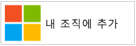
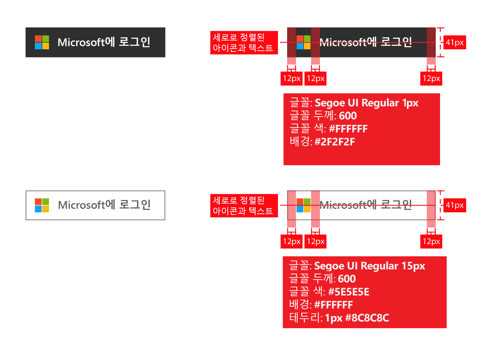
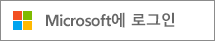
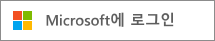
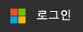
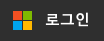
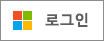
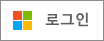

# 애플리케이션에 대한 브랜딩 지침

Microsoft id 플랫폼을 사용 하 여 응용 프로그램을 개발 하는 경우 응용 프로그램 등록 및 로그인을 위해 회사 또는 학교 계정 (Azure AD에서 관리) 또는 개인 계정을 사용 하려는 경우 고객에 게 문의 해야 합니다.

이 문서에서는 다음을 수행합니다.

- Microsoft에서 관리하는 두 종류의 사용자 계정과 애플리케이션에서 Azure AD 계정을 가리키는 방법에 대해 알아봅니다.
- 앱에서 사용할 Microsoft 로고를 추가 하기 위해 수행 해야 하는 작업을 확인 합니다.
- 앱에서 사용할 공식 **로그인** 또는 **Microsoft에 로그인** 이미지를 다운로드합니다.
- 브랜딩 및 탐색과 관련해서 수행해야 할 작업과 수행하지 않아야 할 작업에 대해 알아봅니다.

## Microsoft의 개인 계정과 회사 또는 학교 계정

Microsoft는 두 종류의 사용자 계정을 관리합니다.

- **개인 계정** (이전의 Windows Live ID). 이 계정은 *개인* 사용자와 Microsoft 사이의 관계를 나타내며 Microsoft의 소비자 디바이스 및 서비스에 액세스하는 데 사용됩니다. 이 계정은 개인적인 용도를 위한 것입니다.
- **회사 또는 학교 계정.**  이 계정은 Azure Active Directory를 사용하는 조직을 대신하여 Microsoft에서 관리합니다. 이러한 계정은 Microsoft의 Microsoft 365 및 기타 비즈니스 서비스에 로그인 하는 데 사용 됩니다.

Microsoft 회사 또는 학교 계정은 일반적으로 회사, 학교, 정부 기관 등의 조직이 직원, 학생, 연방 직원 등의 최종 사용자에게 할당합니다. 이러한 계정은 온-프레미스 디렉터리 (예: Windows Server Active Directory)에서 Azure AD로 동기화 되거나 클라우드에서 직접 마스터 됩니다 (Azure AD 플랫폼에서). Microsoft는 회사 또는 학교 계정의 *보유자* 이지만, 이 계정을 소유하고 제어하는 것은 조직입니다.

## 애플리케이션에서 Azure AD 계정 언급

Microsoft는 Azure 또는 Active Directory 브랜드 이름에 최종 사용자를 노출하지 않으며 이 규칙을 강제합니다.

- 사용자가 로그인되어 있으면 가능한 한 조직의 이름 및 로고를 사용합니다. 이것이 "조직"과 같은 일반적인 용어를 사용하는 것보다 좋습니다.
- 사용자가 로그인되어 있지 않으면 해당 계정을 “회사 또는 학교 계정”으로 참조하고 Microsoft 로고를 사용하여 Microsoft에서 이러한 계정을 관리한다고 전달합니다. 사용자에게 혼동을 줄 수 있는 "엔터프라이즈 계정", "비즈니스 계정" 또는 "회사 계정"과 같은 용어는 사용하지 마세요.

## 사용자 계정 픽토그램

이 지침의 이전 버전에서는 "파란색 배지" 픽토그램을 사용하도록 권장했습니다. 사용자와 개발자의 의견을 반영하여 이제 그 대신 Microsoft 로고를 사용할 것을 권장합니다. Microsoft 로고는 사용자가 Microsoft 365 또는 다른 Microsoft 비즈니스 서비스에 사용 하는 계정을 다시 사용 하 여 앱에 로그인 하는 것을 이해 하는 데 도움이 됩니다.

## Azure AD를 사용한 등록 및 로그인

앱의 등록 경로와 로그인 경로가 별도로 제공될 수 있으며, 다음 섹션에서는 두 시나리오에 대한 시각적인 지침을 제공합니다.

**최종 사용자 등록을 지원하는 앱의 경우(예: 평가판 또는 프리미엄(freemium) 모델)**: 사용자가 회사 또는 개인 계정을 사용하여 앱에 액세스하는 데 사용할 수 있는 **로그인** 단추를 표시할 수 있습니다. 사용자가 처음으로 앱에 액세스할 때 Azure AD에서 동의하도록 요구하는 메시지가 표시됩니다.

**관리자만 동의할 수 있는 권한을 요구하는 앱 또는 조직 라이선스가 필요한 앱의 경우**: 관리 취득과 사용자 로그인을 분리합니다. **"이 앱 가져오기" 단추**는 관리자에게 로그인하도록 리디렉션한 다음, 해당 조직의 사용자를 대신하여 동의하도록 요청합니다. 그러면 앱에 최종 사용자 동의 확인 프롬프트를 사용하지 않는 혜택이 추가됩니다.

## 앱 구입에 대한 시각적 지침

"앱 가져오기" 링크는 Azure AD 액세스 권한 부여(권한 부여) 페이지로 사용자를 리디렉션해야 합니다. 그러면 조직 관리자가 앱이 Microsoft에서 호스트되는 조직 데이터에 액세스할 수 있게 승인할 수 있습니다. 액세스 권한을 요청하는 방법에 대한 자세한 내용은 [Azure Active Directory와 애플리케이션 통합](./quickstart-register-app.md) 문서에서 설명합니다.

관리자는 앱에 동의한 후 Microsoft 365 사용자의 앱 시작 관리자 환경 (와플 및에서 액세스할 수 있음)에 추가 하도록 선택할 수 있습니다 [https://portal.office.com/myapps](https://portal.office.com/myapps) . 이 기능을 보급하려는 경우 "조직에 이 앱 추가"와 같은 용어를 사용하고 다음 예제와 같은 단추를 표시할 수 있습니다.

그러나 단추에 의존하는 대신 설명 텍스트를 작성하는 것이 좋습니다. 예를 들면 다음과 같습니다.

> *이미 Microsoft 365 또는 Microsoft의 다른 비즈니스 서비스를 사용 하는 경우 조직의 데이터에 대 한 액세스> <your_app_name 부여할 수 있습니다. 이렇게 하면 사용자가 기존 회사 계정으로 <your_app_name>에 액세스할 수 있습니다.*

공식 Microsoft 로고를 앱에서 사용하기 위해 다운로드하려면 사용할 이미지를 마우스 오른쪽 단추로 클릭한 다음, 컴퓨터에 저장합니다.

| 자산                                | PNG 형식 | SVG 형식 |
| ------------------------------------ | ---------- | ---------- |
| Microsoft 로고  |  |  |

## 로그인에 대한 시각적 지침

앱은 Azure AD와 통합하는 데 사용하는 프로토콜에 해당하는 로그인 엔드포인트로 사용자를 리디렉션하는 로그인 단추를 표시해야 합니다. 다음 섹션에서는 이 단추의 모양을 자세히 설명합니다.

### 픽토그램 및 “Microsoft 로그인”

Microsoft 로고와 앱이 지원하는 다른 ID 공급자 중에서 Azure AD를 고유하게 나타내는 "Microsoft에 로그인"이라는 일반 용어를 결합한 것입니다. 공간이 부족하여 "Microsoft에 로그인"을 사용할 수 없는 경우에는 "로그인"으로 줄여도 됩니다. 단추에 밝거나 어두운 색 구성표를 사용할 수 있습니다.

다음 다이어그램은 앱에서 자산을 사용하는 경우 Microsoft 권장 검토를 보여줍니다. 검토는 "Microsoft에 로그인" 또는 짧은 "로그인" 버전에 적용합니다.

공식 이미지를 앱에서 사용하기 위해 다운로드하려면 사용할 이미지를 마우스 오른쪽 단추로 클릭한 다음, 컴퓨터에 저장합니다.

| 자산                                | PNG 형식 | SVG 형식 |
| ------------------------------------ | ---------- | ---------- |
| Microsoft로 로그인(어두운 테마)  |  |  |
| Microsoft로 로그인(밝은 테마) |  |  |
| 로그인(어두운 테마)                 |  |  |
| 로그인(밝은 테마)                |  |  |

## 브랜딩 관련 할 일과 하지 말아야 할 일

**권장** 최종 사용자가 단추를 사용할 수 있는지 여부를 인식할 수 있도록, 추가 설명을 제공하기 위해 "회사 또는 학교 계정"을 "Microsoft에 로그인" 단추와 함께 사용합니다. **권장 안 함** "엔터프라이즈 계정", "비즈니스 계정" 또는 "회사 계정"과 같은 다른 용어는 사용하지 않습니다.

"Microsoft 365 ID" 또는 "Azure ID"를 사용 **하지 마세요** . Microsoft 365은 Microsoft에서 제공 하는 소비자의 이름 이기도 하며 인증에 Azure AD를 사용 하지 않습니다.

**권장 안 함** Microsoft 로고를 변경하지 않습니다.

**권장 안 함** Azure 또는 Active Directory 브랜드에 최종 사용자를 노출하지 않습니다. 그러나 개발자, IT 전문가, 관리자에 대해서는 이 용어를 사용해도 됩니다.

## 탐색 관련 할 일과 하지 말아야 할 일

사용자가 로그아웃하여 다른 사용자 계정으로 전환할 수 있는 방법을 **제공합니다**. 대부분의 사람들은 Microsoft/Facebook/Google/Twitter의 단일 개인 계정을 가지고 있지만, 사람들은 종종 여러 조직과 연결됩니다. 여러 명의 로그인한 사용자에 대한 지원이 곧 제공됩니다.