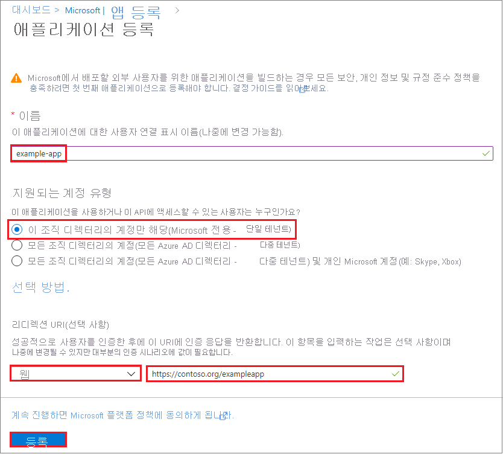

# 방법: 포털을 사용하여 리소스에 액세스할 수 있는 Azure AD 애플리케이션 및 서비스 주체 만들기

리소스에 액세스하거나 리소스를 수정해야 하는 코드가 있는 경우 앱의 ID를 만들 수 있습니다. 이 ID를 서비스 주체라고 합니다. 서비스 주체에 필수 권한을 할당할 수 있습니다. 이 문서에서는 포털을 사용하여 서비스 주체를 만드는 방법을 보여 줍니다. 여기서는 하나의 조직 내에서만 실행하는 응용 프로그램인, 단일 테넌트 응용 프로그램을 중점적으로 다룹니다. 일반적으로 단일 조직 내에서 실행되는 LOB(기간 업무) 응용 프로그램은 단일 테넌트 응용 프로그램을 사용합니다.

> [!IMPORTANT]
> 서비스 주체를 만드는 대신 응용 프로그램 ID에 Azure 리소스에 대한 관리 ID를 사용하는 것이 좋습니다. 코드가 관리 ID를 지원하는 서비스에서 실행되고 Azure AD(Azure Active Directory) 인증을 지원하는 리소스에 액세스하는 경우 관리 ID를 사용하는 것이 더 좋습니다. Azure 리소스에 대한 관리 ID 및 현재 이 관리 ID를 지원하는 서비스를 알아보려면 [Azure 리소스에 대한 관리 ID란?](../managed-identities-azure-resources/overview.md)을 참조하세요.

## Azure Active Directory 응용 프로그램 만들기

이제 ID를 만들어 보겠습니다. 문제가 발생하면 [필요한 권한](#required-permissions)을 확인하여 계정이 ID를 만들 수 있는지 확인합니다.

1. [Azure Portal](https://portal.azure.com)을 통해 Azure 계정에 로그인합니다.
1. **Azure Active Directory**를 선택합니다.
1. **앱 등록**을 선택합니다.

   

1. **새 응용 프로그램 등록**을 선택합니다.

   

1. 응용 프로그램에 대한 이름 및 URL을 제공합니다. 만들려는 응용 프로그램 유형으로 **웹앱/API**를 선택합니다. [네이티브 응용 프로그램](../manage-apps/application-proxy-configure-native-client-application.md)의 자격 증명은 만들 수 없습니다. 자동화된 응용 프로그램에 해당 형식을 사용할 수 없습니다. 값을 설정한 후 **만들기**를 선택합니다.

   

Azure AD 응용 프로그램 및 서비스 주체를 만들었습니다.

## 응용 프로그램을 역할에 할당

구독의 리소스에 액세스하려면 응용 프로그램을 역할에 할당해야 합니다. 응용 프로그램에 적합한 권한을 제공하는 역할을 결정합니다. 사용 가능한 역할에 대해 알아보려면 [RBAC: 기본 제공 역할](../../role-based-access-control/built-in-roles.md)을 참조하세요.

구독, 리소스 그룹 또는 리소스 수준에서 범위를 설정할 수 있습니다. 권한은 하위 수준의 범위로 상속됩니다. 예를 들어 응용 프로그램에 리소스 그룹에 대한 독자 역할을 추가하면 응용 프로그램이 리소스 그룹과 그 안에 포함된 모든 리소스를 읽을 수 있습니다.

1. 응용 프로그램을 할당하려는 범위 수준으로 이동합니다. 예를 들어, 구독 범위에서 역할을 할당하려면 **모든 서비스** 및 **구독**을 선택합니다.

   

1. 애플리케이션을 할당할 특정 구독을 선택합니다.

   

   찾고 있는 구독이 표시되지 않으면 **글로벌 구독 필터**를 선택합니다. 포털에 대해 원하는 구독이 선택되었는지 확인합니다. 

1. **액세스 제어(IAM)** 를 선택합니다.
1. **역할 할당 추가**를 선택합니다.

   

1. 응용 프로그램에 할당할 역할을 선택합니다. 응용 프로그램이 **다시 부팅**, **시작** 및 **중지** 인스턴스 같은 작업을 실행하게 하려면 **기여자** 역할을 선택합니다. 기본적으로 Azure AD 응용 프로그램이 사용 가능한 옵션에 표시되지 않습니다. 응용 프로그램을 찾으려면 이름을 검색하여 선택합니다.

   

1. **저장**을 선택하여 역할 할당을 완료합니다. 목록에서 해당 범위에 대한 역할에 할당된 사용자 목록에서 응용 프로그램이 나타납니다.

서비스 주체가 설정되었습니다. 서비스 주체 사용을 시작하여 스크립트나 앱을 실행할 수 있습니다. 다음 섹션에서는 프로그래밍 방식으로 로그인할 때 필요한 값을 가져오는 방법을 보여 줍니다.

## 로그인을 위한 값 가져오기

### 테넌트 ID 가져오기

프로그래밍 방식으로 로그인하는 경우 인증 요청과 함께 테넌트 ID를 전달해야 합니다.

1. **Azure Active Directory**를 선택합니다.
1. **속성**을 선택합니다.

   

1. **디렉터리 ID**를 복사하여 테넌트 ID를 가져옵니다.

   

### 응용 프로그램 ID 및 인증 키 가져오기

응용 프로그램 ID 및 인증 키도 필요합니다. 이러한 값을 가져오려면 다음 단계를 사용합니다.

1. Azure AD의 **앱 등록**에서 응용 프로그램을 선택합니다.

   

1. **응용 프로그램 ID**를 복사해 응용 프로그램 코드에 저장합니다.

   

1. **설정**을 선택합니다.

   

1. **키**를 선택합니다.
1. 키에 대한 설명 및 키의 기간을 제공합니다. 완료되면 **저장**을 선택합니다.

   

   키를 저장하면 키 값이 표시됩니다. 나중에 키를 검색할 수 없으므로 이 값을 복사해둡니다. 응용 프로그램으로 로그인하려면 응용 프로그램 ID와 함께 키 값을 제공합니다. 응용 프로그램이 검색할 수 있는 위치에 키 값을 저장합니다.

   

## 필요한 사용 권한

Azure AD 테넌트에 응용 프로그램을 등록하고 Azure 구독의 역할에 응용 프로그램을 할당하기 위한 충분한 권한이 있어야 합니다.

### Azure AD 권한 확인

1. **Azure Active Directory**를 선택합니다.
1. 역할을 기록해 둡니다. **사용자** 역할이 있는 경우 비관리자가 응용 프로그램을 등록할 수 있는지 확인해야 합니다.

   

1. **사용자 설정**을 선택합니다.

   

1. **앱 등록** 설정을 확인합니다. 이 값은 관리자만 설정할 수 있습니다. **예**로 설정하면 Azure AD 테넌트의 모든 사용자가 앱을 등록할 수 있습니다.

   

앱 등록 설정이 **아니요**로 설정되어 있으면 [전역 관리자](../users-groups-roles/directory-assign-admin-roles.md)만 앱을 등록할 수 있습니다. 계정이 사용자 역할에 할당되어 있으나 앱 등록 설정이 관리자로 제한되어 있으면 관리자에게 사용자를 전역 관리자 역할로 할당하거나 사용자가 앱을 등록할 수 있게 설정하도록 요청합니다.

### Azure 구독 권한 확인

Azure 구독에서 사용자 계정에 AD 앱을 역할에 할당할 수 있는 `Microsoft.Authorization/*/Write` 권한이 있어야 합니다. 이 작업에 대한 권한은 [소유자](../../role-based-access-control/built-in-roles.md#owner) 역할 또는 [사용자 액세스 관리자](../../role-based-access-control/built-in-roles.md#user-access-administrator) 역할을 통해 부여됩니다. 계정이 **기여자** 역할에 할당된 경우 적절한 사용 권한이 없습니다. 서비스 주체를 역할에 할당하려고 하면 오류가 발생합니다.

Azure 구독 권한을 확인하려면

1. 오른쪽 위 모서리에서 계정을 선택하고 **내 권한**을 선택합니다.

   

1. 드롭다운 목록에서 서비스 주체를 만들려는 구독을 선택합니다. 그런 다음, **이 구독에 대한 전체 액세스 세부 정보를 보려면 여기를 클릭하세요.** 를 선택합니다.

   

1. 할당된 사용자 역할을 확인하고 AD 앱을 역할에 할당하기 위한 적절한 권한이 있는지 확인합니다. 이러한 권한이 없으면 구독 관리자에게 사용자 액세스 관리자 역할에 사용자를 추가할 것을 요청합니다. 다음 이미지에서 사용자에게는 소유자 역할이 할당되었으므로 사용자는 적절한 권한을 갖습니다.

   

## 다음 단계

* 다중 테넌트 응용 프로그램을 설정하려면 [Resource Manager 인증 API를 사용하여 구독에 액세스](../../azure-resource-manager/resource-manager-api-authentication.md)를 참조하세요.
* 보안 정책 지정에 대해 자세히 알아보려면 [RBAC 및 Azure Portal을 사용하여 액세스 관리](../../role-based-access-control/role-assignments-portal.md)을 참조하세요.  
* 권한이 부여되거나 사용자에 대해 거부될 수 있는 작업 목록은 [Azure Resource Manager 리소스 공급자 작업](../../role-based-access-control/resource-provider-operations.md)을 참조하세요.
