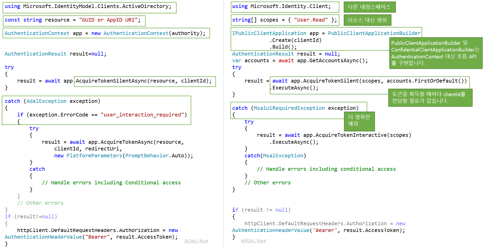

# <a name="migrating-applications-to-msalnet"></a>애플리케이션을 MSAL.NET으로 마이그레이션

MSAL.NET(.NET용 Microsoft 인증 라이브러리) 및 ADAL.NET(.NET용 Azure AD 인증 라이브러리)은 모두 Azure AD 엔터티를 인증하고 Azure AD에서 토큰을 요청하는 데 사용됩니다. 지금까지 대부분의 개발자는 ADAL(Azure AD 인증 라이브러리)을 사용하는 토큰을 요청하여 Azure AD ID(회사 및 학교 계정)를 인증하기 위해 개발자 플랫폼(v1.0)에서 Azure AD를 사용했습니다. 이제 MSAL.NET을 사용하면 Microsoft ID 플랫폼 엔드포인트를 통해 광범위한 Microsoft ID 세트(AD ID 및 Microsoft 계정, Azure AD B2C를 통한 소셜 및 로컬 계정)를 인증할 수 있습니다. 

이 문서에서는 MSAL.NET(.NET용 Microsoft 인증 라이브러리)과 ADAL.NET(.NET용 Azure AD 인증 라이브러리) 중에서 선택하는 방법을 설명하고 두 라이브러리를 비교합니다.  

## <a name="differences-between-adal-and-msal-apps"></a>ADAL 및 MSAL 앱의 차이점
대부분의 경우 Microsoft 인증 라이브러리의 최신 세대인 MSAL.NET 및 Microsoft ID 플랫폼 엔드포인트를 사용하려고 합니다. MSAL.NET을 사용하면 Azure AD(회사 및 학교 계정), MSA(Microsoft (개인) 계정) 또는 Azure AD B2C를 사용하여 애플리케이션에 로그인하는 사용자에 대한 토큰을 얻을 수 있습니다. 

개발자용 Azure AD(v1.0) 엔드포인트 및 ADAL.NET에 이미 익숙한 경우 [Microsoft ID 플랫폼(v2.0) 엔드포인트와의 차이점은?](active-directory-v2-compare.md)을 참조하는 것이 좋습니다.

그러나 애플리케이션이 이전 버전의 [ADFS(Active Directory Federation Services)](/windows-server/identity/active-directory-federation-services)를 사용하여 사용자를 로그인해야 하는 경우에는 여전히 ADAL.NET을 사용해야 합니다. 자세한 내용은 [ADFS 지원](https://aka.ms/msal-net-adfs-support)을 참조하세요.

다음 그림에서는 ADAL.NET 및 MSAL.NET  간의 일부 차이점 중 일부를 요약하고 있습니다.

### <a name="nuget-packages-and-namespaces"></a>NuGet 패키지 및 네임스페이스

ADAL.NET은 [Microsoft.IdentityModel.Clients.ActiveDirectory](https://www.nuget.org/packages/Microsoft.IdentityModel.Clients.ActiveDirectory) NuGet 패키지에서 사용됩니다. 사용할 네임스페이스는 `Microsoft.IdentityModel.Clients.ActiveDirectory`입니다.

MSAL.NET을 사용하려면 [Microsoft.Identity.Client](https://www.nuget.org/packages/Microsoft.Identity.Client) NuGet 패키지를 추가하고 `Microsoft.Identity.Client` 네임스페이스를 사용해야 합니다.

### <a name="scopes-not-resources"></a>리소스가 아닌 범위

ADAL.NET은 *리소스*에 대한 토큰을 획득하지만, MSAL.NET은 *범위*에 대한 토큰을 획득합니다. 다양한 MSAL.NET AcquireToken 재정의에는 scopes(`IEnumerable<string> scopes`)라는 매개 변수가 필요합니다. 이 매개 변수는 원하는 권한 및 요청된 리소스를 선언하는 간단한 문자열 목록입니다. 잘 알려진 범위는 [Microsoft Graph의 scope](/graph/permissions-reference)입니다.

또한 MSAL.NET에서는 v1.0 리소스에도 액세스할 수 있습니다. [v1.0 애플리케이션에 대한 범위](#scopes-for-a-web-api-accepting-v10-tokens)에서 세부 정보를 참조하세요. 

### <a name="core-classes"></a>핵심 클래스

- ADAL.NET은 인증 기관을 통해 STS(보안 토큰 서비스) 또는 권한 부여 서버에 대한 연결을 나타내는 표현으로 [AuthenticationContext](https://github.com/AzureAD/azure-activedirectory-library-for-dotnet/wiki/AuthenticationContext:-the-connection-to-Azure-AD)를 사용합니다. 반면 MSAL.NET은 [클라이언트 애플리케이션](https://github.com/AzureAD/microsoft-authentication-library-for-dotnet/wiki/Client-Applications)을 중심으로 설계되었습니다. 제공하는 두 개의 개별 클래스는 `PublicClientApplication` 및 `ConfidentialClientApplication`입니다.

- 토큰 획득: ADAL.NET 및 MSAL.NET의 인증 호출은 동일하지만(ADAL.NET의 경우 `AcquireTokenAsync` 및 `AcquireTokenSilentAsync`, MSAL.NET의 경우 `AqquireTokenInteractive` 및 `AcquireTokenSilent`), 필요한 매개 변수가 서로 다릅니다. 한 가지 차이점은 MSAL.NET의 경우 AcquireTokenXX 호출마다 애플리케이션의 `ClientID`를 더 이상 전달할 필요가 없다는 것입니다. 실제로 `ClientID`는 `IPublicClientApplication` 또는 `IConfidentialClientApplication`을 빌드할 때 한 번만 설정됩니다.

### <a name="iaccount-not-iuser"></a>IUser가 아닌 IAccount

ADAL.NET에서는 사용자를 조작했습니다. 그러나 사용자는 사람 또는 소프트웨어 에이전트이지만 Microsoft ID 시스템에서 하나 이상의 계정(여러 개의 Azure AD 계정, Azure AD B2C, Microsoft 개인 계정)을 소유하거나 책임질 수 있습니다. 

MSAL.NET 2.x는 이제 IAccount 인터페이스를 통해 계정에 대한 개념을 정의합니다. 이 주요 변경은 올바른 의미 체계, 즉 동일한 사용자가 여러 Azure AD 디렉터리에 여러 계정을 가질 수 있다는 사실을 제공합니다. 또한 홈 계정 정보가 제공되므로 MSAL.NET은 게스트 시나리오에서 더 나은 정보를 제공합니다.

IUser와 IAccount의 차이점에 대한 자세한 내용은 [MSAL.NET 2.x](https://aka.ms/msal-net-2-released)를 참조하세요.

### <a name="exceptions"></a>예외

#### <a name="interaction-required-exceptions"></a>상호 작용에 필요한 예외

MSAL.NET에는 더 명확한 예외가 있습니다. 예를 들어 ADAL에서 자동 인증이 실패하면 프로시저에서 예외를 catch하고 `user_interaction_required` 오류 코드를 찾습니다.

```csharp
catch(AdalException exception)
{
 if (exception.ErrorCode == “user_interaction_required”)
 {
  try
  {“try to authenticate interactively”}}
 }
}
```

ADAL.NET을 사용하여 [토큰을 획득하는 데 추천되는 패턴](https://github.com/AzureAD/azure-activedirectory-library-for-dotnet/wiki/AcquireTokenSilentAsync-using-a-cached-token#recommended-pattern-to-acquire-a-token)에서 세부 정보를 참조하세요.

MSAL.NET을 사용하면 [AcquireTokenSilent](https://github.com/AzureAD/microsoft-authentication-library-for-dotnet/wiki/AcquireTokenSilentAsync-using-a-cached-token)에서 설명한 대로 `MsalUiRequiredException`을 catch합니다.

```csharp
catch(MsalUiRequiredException exception)
{
 try {“try to authenticate interactively”}
}
```

#### <a name="handling-claim-challenge-exceptions"></a>클레임 챌린지 예외 처리

ADAL.NET에서 클레임 챌린지 예외는 다음과 같은 방법으로 처리됩니다.

- `AdalClaimChallengeException`은 리소스에서 사용자로부터 더 많은 클레임(예: 2단계 인증)을 요구하는 경우 서비스에서 throw하는 예외(`AdalServiceException`에서 파생됨)입니다. `Claims` 멤버에는 필요한 클레임이 포함된 일부 JSON 조각이 포함되어 있습니다.
- ADAL.NET에서는 여전히 이 예외를 받는 공용 클라이언트 애플리케이션에서 claims 매개 변수가 있는 `AcquireTokenInteractive` 재정의를 호출해야 합니다. `AcquireTokenInteractive`의 이 재정의는 캐시가 필요하지 않으므로 캐시 적중을 시도하지도 않습니다. 이는 캐시의 토큰에 적절한 클레임이 없기 때문입니다(그렇지 않으면 `AdalClaimChallengeException`이 throw되지 않음). 따라서 캐시는 살펴볼 필요가 없습니다. OBO를 수행하는 Web API에서 `ClaimChallengeException`을 받을 수 있지만, 이 Web API를 호출하는 공용 클라이언트 애플리케이션에서는 `AcquireTokenInteractive`를 호출해야 합니다.
- 샘플을 포함한 자세한 내용은 [AdalClaimChallengeException](https://github.com/AzureAD/azure-activedirectory-library-for-dotnet/wiki/Exceptions-in-ADAL.NET#handling-adalclaimchallengeexception) 처리를 참조하세요.

MSAL.NET에서 클레임 챌린지 예외는 다음과 같은 방법으로 처리됩니다.

- `Claims`가 `MsalServiceException`에 표시됩니다.
- `AcquireTokenInteractive` 작성기에 적용할 수 있는 `.WithClaim(claims)` 메서드가 있습니다. 

### <a name="supported-grants"></a>지원되는 권한 부여

일부 권한 부여는 MSAL.NET 및 v2.0 엔드포인트에서 아직 지원되지 않습니다. ADAL.NET 및 MSAL.NET에서 지원되는 권한 부여는 다음과 같이 요약됩니다.

#### <a name="public-client-applications"></a>공용 클라이언트 애플리케이션

데스크톱 및 모바일 애플리케이션용 ADAL.NET 및 MSAL.NET에서 지원되는 권한은 다음과 같습니다.

허용 | ADAL.NET | MSAL.NET
----- |----- | -----
대화형 | [대화형 인증](https://github.com/AzureAD/azure-activedirectory-library-for-dotnet/wiki/Acquiring-tokens-interactively---Public-client-application-flows) | [MSAL.NET에서 대화형으로 토큰 획득](https://github.com/AzureAD/microsoft-authentication-library-for-dotnet/wiki/Acquiring-tokens-interactively)
Windows 통합 인증 | [Windows의 통합 인증(Kerberos)](https://github.com/AzureAD/azure-activedirectory-library-for-dotnet/wiki/AcquireTokenSilentAsync-using-Integrated-authentication-on-Windows-(Kerberos)) | [Windows 통합 인증](msal-authentication-flows.md#integrated-windows-authentication)
사용자 이름/암호 | [사용자 이름 및 암호를 사용하여 토큰 획득](https://github.com/AzureAD/azure-activedirectory-library-for-dotnet/wiki/Acquiring-tokens-with-username-and-password)| [사용자 이름 암호 인증](msal-authentication-flows.md#usernamepassword)
디바이스 코드 흐름 | [웹 브라우저가 없는 디바이스에 대한 디바이스 프로필](https://github.com/AzureAD/azure-activedirectory-library-for-dotnet/wiki/Device-profile-for-devices-without-web-browsers) | [디바이스 코드 흐름](msal-authentication-flows.md#device-code)

#### <a name="confidential-client-applications"></a>기밀 클라이언트 애플리케이션

웹 애플리케이션, Web API 및 디먼 애플리케이션용 ADAL.NET 및 MSAL.NET에서 지원되는 권한은 다음과 같습니다.

앱 유형 | 허용 | ADAL.NET | MSAL.NET
----- | ----- | ----- | -----
Web App, Web API, 디먼 | 클라이언트 자격 증명 | [ADAL.NET의 클라이언트 자격 증명 흐름](https://github.com/AzureAD/azure-activedirectory-library-for-dotnet/wiki/Client-credential-flows) | [MSAL.NET의 클라이언트 자격 증명 흐름](msal-authentication-flows.md#client-credentials)
Web API | On-Behalf-Of | [사용자를 대신하여 ADAL.NET을 통해 서비스 간 호출](https://github.com/AzureAD/azure-activedirectory-library-for-dotnet/wiki/Service-to-service-calls-on-behalf-of-the-user) | [MSAL.NET의 On-Behalf-Of 흐름](msal-authentication-flows.md#on-behalf-of)
웹앱 | 권한 부여 코드 | [ADAL.NET을 사용하여 웹앱에서 권한 부여 코드가 있는 토큰 획득](https://github.com/AzureAD/azure-activedirectory-library-for-dotnet/wiki/Acquiring-tokens-with-authorization-codes-on-web-apps) | [MSAL.NET을 사용하여 웹앱에서 권한 부여 코드가 있는 토큰 획득](msal-authentication-flows.md#authorization-code)

### <a name="cache-persistence"></a>캐시 지속성

ADAL.NET을 사용하면 보안 스토리지(.NET Framework 및 .NET Core)가 없는 플랫폼에서 원하는 지속성 기능을 구현하기 위해 `BeforeAccess` 및 `BeforeWrite` 메서드를 사용하여 `TokenCache` 클래스를 확장할 수 있습니다. 자세한 내용은 [ADAL.NET의 토큰 캐시 직렬화](https://github.com/AzureAD/azure-activedirectory-library-for-dotnet/wiki/Token-cache-serialization)를 참조하세요.

MSAL.NET은 토큰 캐시를 sealed 클래스로 만들어 확장 기능을 제거합니다. 따라서 토큰 캐시 지속성의 구현은 sealed 토큰 캐시와 상호 작용하는 도우미 클래스 형식이어야 합니다. 이 상호 작용은 [MSAL.NET의 토큰 캐시 직렬화](https://github.com/AzureAD/microsoft-authentication-library-for-dotnet/wiki/token-cache-serialization)에서 설명하고 있습니다.

## <a name="signification-of-the-common-authority"></a>공용 인증 기관의 의미

v1.0에서 https://login.microsoftonline.com/common 인증 기관을 사용하는 경우 사용자가 모든 조직에 대해 AAD 계정을 사용하여 로그인하도록 허용할 수 있습니다. [ADAL.NET의 인증 기관 유효성 검사](https://github.com/AzureAD/azure-activedirectory-library-for-dotnet/wiki/AuthenticationContext:-the-connection-to-Azure-AD#authority-validation)를 참조하세요

v2.0에서 https://login.microsoftonline.com/common 인증 기관을 사용하는 경우 사용자가 모든 AAD 조직 또는 MSA(Microsoft 개인 계정)를 사용하여 로그인하도록 허용할 수 있습니다. MSAL.NET에서 AAD 계정에 대한 로그인(ADAL.NET과 동일한 동작)을 제한하려면 https://login.microsoftonline.com/organizations를 사용해야 합니다. 자세한 내용은 [공용 클라이언트 애플리케이션](https://github.com/AzureAD/microsoft-authentication-library-for-dotnet/wiki/Client-Applications#publicclientapplication)의 `authority` 매개 변수를 참조하세요.

## <a name="v10-and-v20-tokens"></a>v1.0 및 v2.0 토큰

토큰에는 다음 두 가지 버전이 있습니다.
- v1.0 토큰
- v2.0 토큰 

v1.0 엔드포인트(ADAL에서 사용)는 v1.0 토큰만 내보냅니다.

그러나 v2.0 엔드포인트(MSAL에서 사용)는 Web API에서 허용하는 토큰 버전을 내보냅니다. Web API의 애플리케이션 매니페스트 속성을 사용하면 개발자가 허용할 토큰 버전을 선택할 수 있습니다. [애플리케이션 매니페스트](reference-app-manifest.md) 참조 설명서에서 `accessTokenAcceptedVersion`을 참조하세요.

v1.0 및 v2.0 토큰에 대한 자세한 내용은 [Azure Active Directory 액세스 토큰](access-tokens.md)을 참조하세요.

## <a name="scopes-for-a-web-api-accepting-v10-tokens"></a>v1.0 토큰을 허용하는 Web API에 대한 범위

OAuth2 권한은 v1.0 웹 API(리소스) 애플리케이션에서 클라이언트 애플리케이션에 공개하는 권한 범위입니다. 이러한 권한 범위를 동의를 통해 클라이언트 애플리케이션에 부여할 수 있습니다. [Azure Active Directory 애플리케이션 매니페스트](active-directory-application-manifest.md)에서 oauth2Permissions 관련 섹션을 참조하세요.

### <a name="scopes-to-request-access-to-specific-oauth2-permissions-of-a-v10-application"></a>v1.0 애플리케이션의 특정 OAuth2 권한에 대한 액세스를 요청하는 범위

v1.0 애플리케이션의 특정 범위(예: AAD 그래프(https://graph.windows.net))에 대한 토큰을 획득하려면 원하는 리소스 식별자를 해당 리소스에 대해 원하는 OAuth2 권한과 연결하여 `scopes`를 만들어야 합니다.

예를 들어 App ID URI가 `ResourceId`인 v1.0 Web API를 사용자 이름으로 액세스하려면 다음을 사용해야 합니다.

```csharp
var scopes = new [] {  ResourceId+"/user_impersonation"};
```

AAD 그래프 API(https://graph.windows.net/)를 사용하여 MSAL.NET Azure Active Directory에서 읽고 쓰려면 다음 코드 조각과 같은 범위 목록을 만듭니다.

```csharp
ResourceId = "https://graph.windows.net/";
var scopes = new [] { ResourceId + “Directory.Read”, ResourceID + “Directory.Write”}
```

#### <a name="warning-should-you-have-one-or-two-slashes-in-the-scope-corresponding-to-a-v10-web-api"></a>경고: v1.0 Web API에 해당하는 범위에 단일 또는 이중 슬래시가 있는 경우

Azure Resource Manager API(https://management.core.windows.net/)에 해당하는 범위를 작성하려면 다음 범위를 요청해야 합니다(이중 슬래시에 주의). 

```csharp
var scopes = new[] {"https://management.core.windows.net//user_impersonation"};
var result = await app.AcquireTokenInteractive(scopes).ExecuteAsync();

// then call the API: https://management.azure.com/subscriptions?api-version=2016-09-01
```

이는 Resource Manager API에서 해당 대상 그룹 클레임(`aud`)에 슬래시를 예상한 다음, 범위에서 API 이름을 분리하는 슬래시가 있기 때문입니다.

Azure AD에서 사용하는 논리는 다음과 같습니다.
- v1.0 액세스 토큰을 사용하는 ADAL(v1.0) 엔드포인트의 경우(유일하게 가능한 경우) audio=resource
- MSAL(v2.0 엔드포인트)에서 v2.0 토큰을 허용하는 리소스에 대한 액세스 토큰을 요청하는 경우 aud=resource.AppId
- MSAL(v2.0 엔드포인트)에서 v1.0 액세스 토큰을 허용하는 리소스(위의 경우)에 대한 액세스 토큰을 요청하는 경우 Azure AD는 마지막 슬래시 앞의 모든 항목을 가져와서 리소스 식별자로 사용하여 요청된 범위에서 원하는 대상 그룹을 구문 분석합니다. 따라서 https:\//database.windows.net에서 "https://database.windows.net/"의 대상이 예상된다면, https:\//database.windows.net//.default의 범위를 요청해야 합니다. #[747](https://github.com/AzureAD/microsoft-authentication-library-for-dotnet/issues/747) 리소스 URL의 후행 슬래시가 누락되어 sql 인증 실패 문제도 참조하세요.


### <a name="scopes-to-request-access-to-all-the-permissions-of-a-v10-application"></a>v1.0 애플리케이션의 모든 권한에 대한 액세스를 요청하는 범위

예를 들어 v1.0 애플리케이션의 모든 정적 범위에 대한 토큰을 획득하려면 다음을 사용해야 합니다.

```csharp
ResourceId = "someAppIDURI";
var scopes = new [] {  ResourceId+"/.default"};
```

### <a name="scopes-to-request-in-the-case-of-client-credential-flow--daemon-app"></a>클라이언트 자격 증명 흐름/디먼 앱의 경우 요청하는 범위

클라이언트 자격 증명 흐름의 경우 전달하는 범위도 `/.default`가 됩니다. 이렇게 하면 관리자가 애플리케이션 등록에서 동의한 모든 앱 수준 권한을 요청한다고 Azure AD에 알려줍니다.

## <a name="adal-to-msal-migration"></a>ADAL에서 MSAL로 마이그레이션

ADAL.NET v2.X에서는 새로 고침 토큰이 공개되어 토큰을 캐시하고 ADAL 2.x에서 제공하는 `AcquireTokenByRefreshToken` 메서드를 사용하여 이러한 토큰의 사용과 관련된 솔루션을 개발할 수 있었습니다. 이러한 솔루션 중 일부는 다음과 같은 시나리오에서 사용되었습니다.
* 사용자가 더 이상 연결되지 않은 상태에서 사용자를 대신하여 대시보드를 새로 고치는 등의 작업을 수행하는 장기 실행 서비스 
* 클라이언트에서 RT를 웹 서비스로 가져올 수 있게 하는 WebFarm 시나리오(클라이언트 쪽에서 캐싱 수행, 쿠키 암호화, 서버 쪽이 아님)

MSAL.NET의 경우는 아니지만, 보안상의 이유로 새로 고침 토큰을 이 방식으로 더 이상 활용하지 않는 것이 좋습니다. 이렇게 하면 API에서 이전에 획득한 새로 고침 토큰을 전달하는 방법을 제공하지 않으므로 MSAL 3.x로 마이그레이션하기가 어려울 수 있습니다. 

다행히도 MSAL.NET에는 이전의 새로 고침 토큰을 `IConfidentialClientApplication`으로 마이그레이션할 수 있는 API가 있습니다. 

```CSharp
/// <summary>
/// Acquires an access token from an existing refresh token and stores it and the refresh token into 
/// the application user token cache, where it will be available for further AcquireTokenSilent calls.
/// This method can be used in migration to MSAL from ADAL v2 and in various integration 
/// scenarios where you have a RefreshToken available. 
/// (see https://aka.ms/msal-net-migration-adal2-msal2)
/// </summary>
/// <param name="scopes">Scope to request from the token endpoint. 
/// Setting this to null or empty will request an access token, refresh token and ID token with default scopes</param>
/// <param name="refreshToken">The refresh token from ADAL 2.x</param>
IByRefreshToken.AcquireTokenByRefreshToken(IEnumerable<string> scopes, string refreshToken);
```
 
이 메서드를 사용하면 이전에 사용한 새로 고침 토큰을 원하는 범위(리소스)와 함께 제공할 수 있습니다. 새로 고침 토큰이 새 토큰으로 교환되고 애플리케이션에 캐시됩니다.  

이 메서드는 일반적이지 않은 시나리오를 위한 것이므로 먼저 `IByRefreshToken`에 캐스팅해야 `IConfidentialClientApplication`에서 쉽게 액세스할 수 있습니다.

다음 코드 조각에서는 기밀 클라이언트 애플리케이션의 일부 마이그레이션 코드를 보여 줍니다. `GetCachedRefreshTokenForSignedInUser`는 ADAL 2.x를 활용하는 데 사용된 이전 버전의 애플리케이션에서 일부 스토리지에 저장한 새로 고침 토큰을 검색합니다. `GetTokenCacheForSignedInUser`는 로그인한 사용자에 대한 캐시를 역직렬화합니다(기밀 클라이언트 애플리케이션에 사용자당 하나의 캐시가 있어야 하므로).

```csharp
TokenCache userCache = GetTokenCacheForSignedInUser();
string rt = GetCachedRefreshTokenForSignedInUser();

IConfidentialClientApplication app;
app = ConfidentialClientApplicationBuilder.Create(clientId)
 .WithAuthority(Authority)
 .WithRedirectUri(RedirectUri)
 .WithClientSecret(ClientSecret)
 .Build();
IByRefreshToken appRt = app as IByRefreshToken;
         
AuthenticationResult result = await appRt.AcquireTokenByRefreshToken(null, rt)
                                         .ExecuteAsync()
                                         .ConfigureAwait(false);
```

새 새로 고침 토큰이 캐시에 저장되어 있는 동안 액세스 토큰과 ID 토큰이 AuthenticationResult에 반환됩니다.

이 메서드는 새로 고침 토큰을 사용할 수 있는 다양한 통합 시나리오에 사용할 수도 있습니다.

## <a name="next-steps"></a>다음 단계

[Microsoft ID 플랫폼 엔드포인트의 범위, 권한 및 동의](v2-permissions-and-consent.md)에서 범위에 대한 자세한 내용을 확인할 수 있습니다.