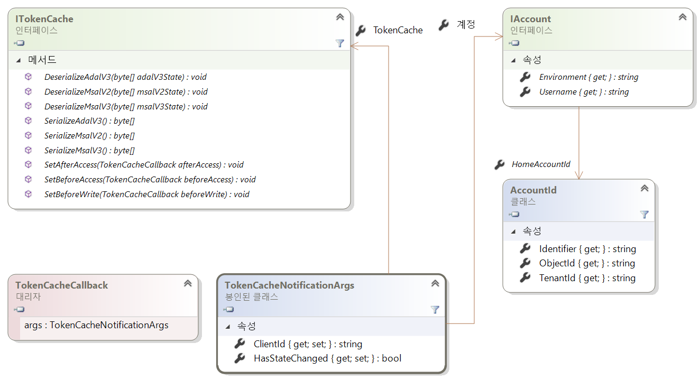
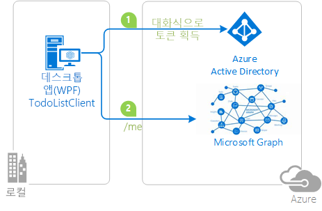

# <a name="token-cache-serialization-in-msalnet"></a>MSAL.NET에서 토큰 캐시 직렬화
[획득한 토큰](msal-acquire-cache-tokens.md)은 MSAL(Microsoft 인증 라이브러리)을 사용하여 캐시됩니다.  애플리케이션 코드는 캐시에서 토큰을 가져오려고 시도한 후 다른 방법으로 토큰을 획득해야 합니다.  이 문서에서는 MSAL.NET에서 제공하는 토큰 캐시의 기본 및 사용자 지정 직렬화에 대해 설명합니다.

이 문서는 MSAL.NET 3.x용으로 작성되었습니다. MSAL.NET 2.x에 관심이 있는 분들은 [MSAL.NET 2.x에서 토큰 캐시 직렬화](https://github.com/AzureAD/microsoft-authentication-library-for-dotnet/wiki/Token-cache-serialization-2x)를 참조하세요.

## <a name="default-serialization-for-mobile-platforms"></a>모바일 플랫폼의 기본 직렬화

MSAL.NET에서는 메모리 내 토큰 캐시가 기본적으로 제공됩니다. 사용자가 플랫폼의 일부로 보안 스토리지를 사용할 수 있는 플랫폼에는 기본적으로 직렬화가 제공됩니다. UWP(유니버설 Windows 플랫폼), Xamarin.iOS 및 Xamarin.Android가 대표적인 예입니다.

> [!Note]
> Xamarin.Android 프로젝트를 MSAL.NET 1.x에서 MSAL.NET 3.x로 마이그레이션하는 경우 프로젝트에 `android:allowBackup="false"`를 추가하면 Visual Studio 배포 시 로컬 스토리지의 복원이 트리거되어도 기존의 캐시된 토큰이 복원되지 않습니다. [이슈 #659](https://github.com/AzureAD/microsoft-authentication-library-for-dotnet/issues/659#issuecomment-436181938)를 참조하세요.

## <a name="custom-serialization-for-windows-desktop-apps-and-web-appsweb-apis"></a>Windows 데스크톱 앱 및 웹앱/웹 API의 사용자 지정 직렬화

사용자 지정 직렬화는 모바일 플랫폼(UWP, Xamarin.iOS 및 Xamarin.Android)에서 사용할 수 없습니다. MSAL은 이미 이러한 플랫폼을 위한 안전하고 성능이 뛰어난 직렬화 메커니즘을 제공합니다. 하지만 .NET 데스크톱 및 .NET Core 애플리케이션은 다양한 아키텍처를 갖고 있으며 MSAL은 범용 직렬화 메커니즘을 구현할 수 없습니다. 예를 들어 웹 사이트가 토큰을 Redis 캐시에 저장하거나 데스크톱 앱이 토큰을 암호화된 파일에 저장할 수 있습니다. 따라서 기본적으로 직렬화가 제공되지 않습니다. .NET 데스크톱 또는 .NET Core에서 영구 토큰 캐시 애플리케이션을 사용하려면 직렬화를 사용자 지정해야 합니다.

다음 클래스 및 인터페이스는 토큰 캐시 직렬화에 사용됩니다.

- `ITokenCache`: 토큰 캐시 직렬화 요청을 구독하는 이벤트, 그리고 캐시를 다양한 형식(ADAL v3.0, MSAL 2.x 및 MSAL 3.x = ADAL v5.0)으로 직렬화 또는 역직렬화하는 메서드를 정의합니다.
- `TokenCacheCallback`은 직렬화를 처리할 수 있도록 이벤트에 전달되는 콜백입니다. `TokenCacheNotificationArgs` 형식의 인수를 사용하여 호출됩니다.
- `TokenCacheNotificationArgs`는 토큰을 사용할 수 있는 사용자에게 애플리케이션 `ClientId`와 참조를 제공하기만 합니다.

  

> [!IMPORTANT]
> 사용자가 애플리케이션의 `GetUserTokenCache` 및 `GetAppTokenCache` 메서드를 호출하면 MSAL.NET은 사용자 대신 토큰 캐시를 만들고 사용자에게 `IToken` 캐시를 제공합니다. 사용자가 인터페이스를 직접 구현할 필요가 없습니다. 사용자는 사용자 지정 토큰 캐시 직렬화를 구현할 때 다음과 같은 일만 하면 됩니다.
> - `BeforeAccess` 및 `AfterAccess` "이벤트"에 대응합니다. `BeforeAccess` 대리자는 캐시를 deserialize하는 역할을 담당하고, `AfterAccess`는 캐시를 serialize하는 역할을 담당합니다.
> - 이러한 이벤트의 일부는 Blob을 저장하거나 로드하며, Blob은 이벤트 인수를 통해 사용자가 원하는 스토리지에 전달됩니다.

사용자가 작성하려는 토큰 캐시 직렬화가 [공용 클라이언트 애플리케이션](msal-client-applications.md)(데스크톱)을 위한 것인지 아니면 [기밀 클라이언트 애플리케이션](msal-client-applications.md)(웹앱/웹 API, 디먼 앱)을 위한 것인지에 따라 전략이 달라집니다.

### <a name="token-cache-for-a-public-client"></a>공용 클라이언트의 토큰 캐시 

MSAL.NET v2.x부터 공용 클라이언트의 토큰 캐시를 직렬화하는 여러 가지 옵션이 제공됩니다. 캐시를 MSAL.NET 형식으로만 직렬화할 수 있습니다(MSAL과 플랫폼에서 통합 형식 캐시를 공통적으로 사용).  ADAL V3의 [레거시](https://github.com/AzureAD/azure-activedirectory-library-for-dotnet/wiki/Token-cache-serialization) 토큰 캐시 직렬화를 지원할 수도 있습니다.

ADAL.NET 3.x, ADAL.NET 5.x 및 MSAL.NET 간에 Single Sign-On을 공유하도록 토큰 캐시 직렬화를 사용자 지정하는 방법은 [active-directory-dotnet-v1-to-v2](https://github.com/Azure-Samples/active-directory-dotnet-v1-to-v2) 샘플에 설명되어 있습니다.

> [!Note]
> MSAL.NET 1.1.4-미리 보기 토큰 캐시 형식은 더 이상 MSAL 2.x에서 지원되지 않습니다. MSAL.NET 1.x를 활용하는 애플리케이션이 있다면 사용자가 다시 로그인해야 합니다. 또는 ADAL 4.x(및 3.x)에서 마이그레이션할 수 있습니다.

#### <a name="simple-token-cache-serialization-msal-only"></a>간단한 토큰 캐시 직렬화(MSAL만 해당)

아래는 데스크톱 애플리케이션의 토큰 캐시를 사용자 지정 직렬화하는 간단한 예입니다. 여기서 사용자 토큰 캐시는 애플리케이션과 동일한 폴더에 들어 있는 파일입니다.

애플리케이션을 빌드한 후, `TokenCacheHelper.EnableSerialization()` 메서드를 호출하고 `UserTokenCache` 애플리케이션을 전달하여 직렬화를 사용하도록 설정합니다.

```csharp
app = PublicClientApplicationBuilder.Create(ClientId)
    .Build();
TokenCacheHelper.EnableSerialization(app.UserTokenCache);
```

`TokenCacheHelper` 도우미 클래스는 다음과 같이 정의됩니다.

```csharp
static class TokenCacheHelper
 {
  public static void EnableSerialization(ITokenCache tokenCache)
  {
   tokenCache.SetBeforeAccess(BeforeAccessNotification);
   tokenCache.SetAfterAccess(AfterAccessNotification);
  }

  /// <summary>
  /// Path to the token cache
  /// </summary>
  public static readonly string CacheFilePath = System.Reflection.Assembly.GetExecutingAssembly().Location + ".msalcache.bin3";

  private static readonly object FileLock = new object();


  private static void BeforeAccessNotification(TokenCacheNotificationArgs args)
  {
   lock (FileLock)
   {
    args.TokenCache.DeserializeMsalV3(File.Exists(CacheFilePath)
            ? ProtectedData.Unprotect(File.ReadAllBytes(CacheFilePath),
                                      null,
                                      DataProtectionScope.CurrentUser)
            : null);
   }
  }

  private static void AfterAccessNotification(TokenCacheNotificationArgs args)
  {
   // if the access operation resulted in a cache update
   if (args.HasStateChanged)
   {
    lock (FileLock)
    {
     // reflect changesgs in the persistent store
     File.WriteAllBytes(CacheFilePath,
                         ProtectedData.Protect(args.TokenCache.SerializeMsalV3(),
                                                 null,
                                                 DataProtectionScope.CurrentUser)
                         );
    }
   }
  }
 }
```

공용 클라이언트 애플리케이션(Windows, Mac 및 Linux에서 실행되는 데스크톱 애플리케이션)을 위한 제품 품질 토큰 캐시 파일 기반 serializer의 미리 보기는 [Microsoft.Identity.Client.Extensions.Msal](https://github.com/AzureAD/microsoft-authentication-extensions-for-dotnet/tree/master/src/Microsoft.Identity.Client.Extensions.Msal) 오픈 소스 라이브러리에서 사용할 수 있습니다. 다음 nuget 패키지에서 이 미리 보기를 애플리케이션에 포함할 수 있습니다. [Microsoft.Identity.Client.Extensions.Msal](https://www.nuget.org/packages/Microsoft.Identity.Client.Extensions.Msal/).

#### <a name="dual-token-cache-serialization-msal-unified-cache-and-adal-v3"></a>이중 토큰 캐시 직렬화(MSAL 통합 캐시 및 ADAL v3)

두 토큰 캐시 직렬화를 모두 통합 캐시 형식(ADAL.NET 4.x, MSAL.NET 2.x 및 같은 세대/이전 세대/같은 플랫폼의 기타 MSAL에 공통적으로 적용)으로 구현하려면 다음 코드를 잘 살펴보세요.

```csharp
string appLocation = Path.GetDirectoryName(Assembly.GetEntryAssembly().Location;
string cacheFolder = Path.GetFullPath(appLocation) + @"..\..\..\..");
string adalV3cacheFileName = Path.Combine(cacheFolder, "cacheAdalV3.bin");
string unifiedCacheFileName = Path.Combine(cacheFolder, "unifiedCache.bin");

IPublicClientApplication app;
app = PublicClientApplicationBuilder.Create(clientId)
                                    .Build();
FilesBasedTokenCacheHelper.EnableSerialization(app.UserTokenCache,
                                               unifiedCacheFileName,
                                               adalV3cacheFileName);

```

이번에는 도우미 클래스가 다음과 같이 정의됩니다.

```csharp
using System;
using System.IO;
using System.Security.Cryptography;
using Microsoft.Identity.Client;

namespace CommonCacheMsalV3
{
 /// <summary>
 /// Simple persistent cache implementation of the dual cache serialization (ADAL V3 legacy
 /// and unified cache format) for a desktop applications (from MSAL 2.x)
 /// </summary>
 static class FilesBasedTokenCacheHelper
 {
  /// <summary>
  /// Get the user token cache
  /// </summary>
  /// <param name="adalV3CacheFileName">File name where the cache is serialized with the
  /// ADAL V3 token cache format. Can
  /// be <c>null</c> if you don't want to implement the legacy ADAL V3 token cache
  /// serialization in your MSAL 2.x+ application</param>
  /// <param name="unifiedCacheFileName">File name where the cache is serialized
  /// with the Unified cache format, common to
  /// ADAL V4 and MSAL V2 and above, and also across ADAL/MSAL on the same platform.
  ///  Should not be <c>null</c></param>
  /// <returns></returns>
  public static void EnableSerialization(ITokenCache cache, string unifiedCacheFileName, string adalV3CacheFileName)
  {
   usertokenCache = cache;
   UnifiedCacheFileName = unifiedCacheFileName;
   AdalV3CacheFileName = adalV3CacheFileName;

   usertokenCache.SetBeforeAccess(BeforeAccessNotification);
   usertokenCache.SetAfterAccess(AfterAccessNotification);
  }

  /// <summary>
  /// Token cache
  /// </summary>
  static ITokenCache usertokenCache;

  /// <summary>
  /// File path where the token cache is serialized with the unified cache format
  /// (ADAL.NET V4, MSAL.NET V3)
  /// </summary>
  public static string UnifiedCacheFileName { get; private set; }

  /// <summary>
  /// File path where the token cache is serialized with the legacy ADAL V3 format
  /// </summary>
  public static string AdalV3CacheFileName { get; private set; }

  private static readonly object FileLock = new object();

  public static void BeforeAccessNotification(TokenCacheNotificationArgs args)
  {
   lock (FileLock)
   {
    args.TokenCache.DeserializeAdalV3(ReadFromFileIfExists(AdalV3CacheFileName));
    try
    {
     args.TokenCache.DeserializeMsalV3(ReadFromFileIfExists(UnifiedCacheFileName));
    }
    catch(Exception ex)
    {
     // Compatibility with the MSAL v2 cache if you used one
     args.TokenCache.DeserializeMsalV2(ReadFromFileIfExists(UnifiedCacheFileName));
    }
   }
  }

  public static void AfterAccessNotification(TokenCacheNotificationArgs args)
  {
   // if the access operation resulted in a cache update
   if (args.HasStateChanged)
   {
    lock (FileLock)
    {
     WriteToFileIfNotNull(UnifiedCacheFileName, args.TokenCache.SerializeMsalV3());
     if (!string.IsNullOrWhiteSpace(AdalV3CacheFileName))
     {
      WriteToFileIfNotNull(AdalV3CacheFileName, args.TokenCache.SerializeAdalV3());
     }
    }
   }
  }

  /// <summary>
  /// Read the content of a file if it exists
  /// </summary>
  /// <param name="path">File path</param>
  /// <returns>Content of the file (in bytes)</returns>
  private static byte[] ReadFromFileIfExists(string path)
  {
   byte[] protectedBytes = (!string.IsNullOrEmpty(path) && File.Exists(path))
       ? File.ReadAllBytes(path) : null;
   byte[] unprotectedBytes = encrypt ?
       ((protectedBytes != null) ? ProtectedData.Unprotect(protectedBytes, null, DataProtectionScope.CurrentUser) : null)
       : protectedBytes;
   return unprotectedBytes;
  }

  /// <summary>
  /// Writes a blob of bytes to a file. If the blob is <c>null</c>, deletes the file
  /// </summary>
  /// <param name="path">path to the file to write</param>
  /// <param name="blob">Blob of bytes to write</param>
  private static void WriteToFileIfNotNull(string path, byte[] blob)
  {
   if (blob != null)
   {
    byte[] protectedBytes = encrypt
      ? ProtectedData.Protect(blob, null, DataProtectionScope.CurrentUser)
      : blob;
    File.WriteAllBytes(path, protectedBytes);
   }
   else
   {
    File.Delete(path);
   }
  }

  // Change if you want to test with an un-encrypted blob (this is a json format)
  private static bool encrypt = true;
 }
}
```

### <a name="token-cache-for-a-web-app-confidential-client-application"></a>웹앱의 토큰 캐시(기밀 클라이언트 애플리케이션)

웹앱 또는 웹 API에서 캐시는 세션, Redis 캐시 또는 데이터베이스를 활용할 수 있습니다.

한 가지 기억해야 할 중요한 내용으로, 웹앱과 웹 API의 경우 사용자당(계정당) 토큰 캐시가 하나만 허용됩니다. 각 계정의 토큰 캐시를 직렬화해야 합니다.

웹앱 및 웹 API의 토큰 캐시를 사용하는 방법의 예제는 [2-2 토큰 캐시](https://github.com/Azure-Samples/active-directory-aspnetcore-webapp-openidconnect-v2/tree/master/2-WebApp-graph-user/2-2-TokenCache) 단계의 [ASP.NET Core 웹앱 자습서](https://ms-identity-aspnetcore-webapp-tutorial)에서 찾을 수 있습니다. 구현 방법은 [Microsoft.Identity.Client.Extensions.Web](https://github.com/AzureAD/microsoft-authentication-extensions-for-dotnet/tree/master/src/Microsoft.Identity.Client.Extensions.Web) 폴더에 있는 [microsoft-authentication-extensions-for-dotnet](https://github.com/AzureAD/microsoft-authentication-extensions-for-dotnet) 라이브러리의 [TokenCacheProviders](https://github.com/AzureAD/microsoft-authentication-extensions-for-dotnet/tree/master/src/Microsoft.Identity.Client.Extensions.Web/TokenCacheProviders) 폴더를 살펴보세요. 

## <a name="next-steps"></a>다음 단계
다음 샘플은 토큰 캐시 직렬화를 보여줍니다.

| 샘플 | 플랫폼 | 설명|
| ------ | -------- | ----------- |
|[active-directory-dotnet-desktop-msgraph-v2](https://github.com/azure-samples/active-directory-dotnet-desktop-msgraph-v2) | 데스크톱(WPF) | Microsoft Graph API를 호출하는 Windows 데스크톱 .NET(WPF) 애플리케이션 |
|[active-directory-dotnet-v1-to-v2](https://github.com/Azure-Samples/active-directory-dotnet-v1-to-v2) | 데스크톱(콘솔) | Azure AD v1.0 애플리케이션(ADAL.NET 사용)을 컨버지드 애플리케이션이라고도 하는 Azure AD v2.0 애플리케이션(MSAL.NET 사용)으로 마이그레이션, 특히 [토큰 캐시 마이그레이션](https://github.com/Azure-Samples/active-directory-dotnet-v1-to-v2/blob/master/TokenCacheMigration/README.md)하는 방법을 보여주는 Visual Studio 솔루션 세트|