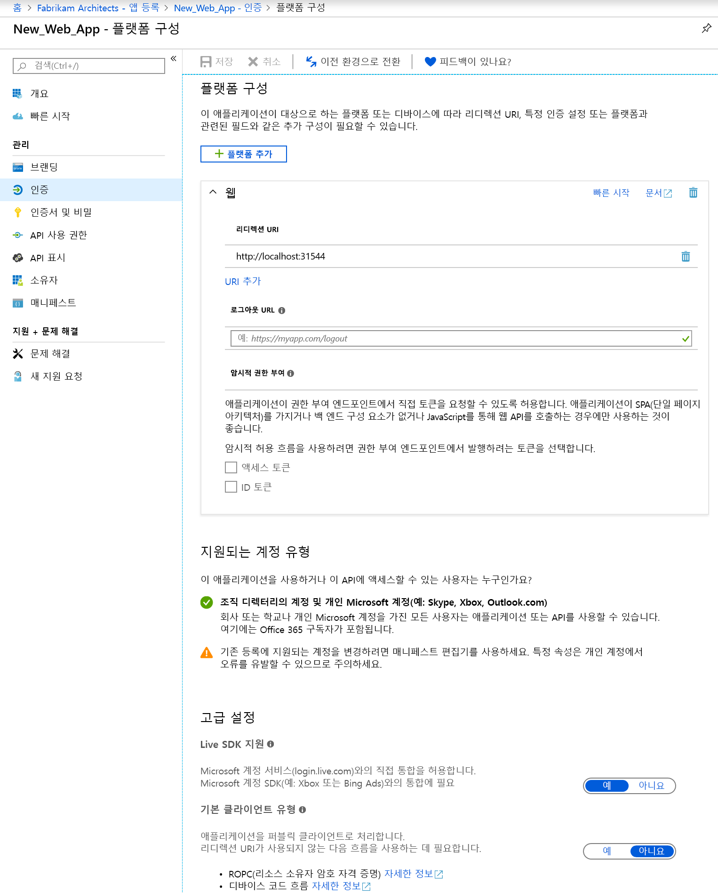
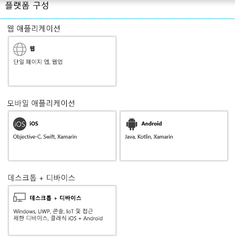

# 빠른 시작: 웹 API에 액세스하는 클라이언트 애플리케이션 구성

웹/기밀 클라이언트 애플리케이션이 인증을 요구하고 액세스 토큰을 얻는 권한 부여 흐름에 참여하려면 보안 자격 증명을 설정해야 합니다. Azure Portal에서 지원하는 기본 인증 방법은 클라이언트 ID + 비밀 키입니다.

또한 클라이언트가 리소스 애플리케이션(예: Microsoft Graph API)에서 공개한 웹 API에 액세스하기 전에 동의 프레임워크는 클라이언트에서 요청된 권한에 기반하여 필요한 권한 부여를 얻도록 합니다. 기본적으로 모든 애플리케이션은 Microsoft Graph API에서 사용 권한을 선택할 수 있습니다. [Graph API "로그인 및 읽기 사용자 프로필" 권한](https://developer.microsoft.com/graph/docs/concepts/permissions_reference#user-permissions)은 기본적으로 선택됩니다. 원하는 웹 API 각각에서 [두 가지 형식의 사용 권한](developer-glossary.md#permissions) 중에 선택할 수 있습니다.

* **애플리케이션 권한** -클라이언트 애플리케이션이 직접 웹 API에 액세스해야 합니다(사용자 컨텍스트 없음). 이 유형의 권한은 관리자의 동의가 필요하며 공용(데스크톱 및 모바일) 클라이언트 애플리케이션에 대해 사용할 수 없습니다.
* **위임된 권한** - 클라이언트 애플리케이션이 로그인된 사용자로 웹 API에 액세스해야 하지만 이 액세스는 선택한 권한에 따라 제한됩니다. 이 형식의 사용 권한은 관리자의 동의를 필요로 하지 않는 한 사용자가 부여할 수 있습니다.

  > [!NOTE]
  > 위임된 권한을 애플리케이션에 추가할 경우 테넌트 내의 사용자에게 자동으로 동의를 부여하지 않습니다. 관리자가 모든 사용자를 대신하여 동의를 허락하지 않는 한 사용자는 런타임에 추가로 위임된 사용 권한에 대해 수동으로 동의해야 합니다.

이 빠른 시작에서는 다음을 위해 앱을 구성하는 방법을 확인합니다.

* [리디렉션 URL을 애플리케이션에 추가](#add-redirect-uris-to-your-application)
* [애플리케이션에 대한 고급 설정 구성](#configure-advanced-settings-for-your-application)
* [지원되는 계정 유형 수정](#modify-supported-account-types)
* [웹 애플리케이션에 자격 증명 추가](#add-credentials-to-your-web-application)
* [웹 API에 액세스 권한 추가](#add-permissions-to-access-web-apis)

## 필수 조건

시작하려면 다음과 같은 필수 구성을 완료했는지 확인합니다.

* 지원되는 [권한 및 동의](v2-permissions-and-consent.md)를 살펴봅니다. 여기서는 다른 사용자 또는 애플리케이션에서 사용해야 하는 애플리케이션을 빌드하는 경우를 이해하는 것이 중요합니다.
* 애플리케이션이 등록된 테넌트가 있습니다.
  * 앱이 등록되지 않았다면 [Microsoft ID 플랫폼에 애플리케이션을 등록하는 방법](quickstart-register-app.md)을 살펴봅니다.

## Azure Portal에 로그인하고 앱 선택

앱을 구성하려면 먼저 다음 단계를 따릅니다.

1. [Azure Portal](https://portal.azure.com)에 회사 또는 학교 계정, 개인 Microsoft 계정으로 로그인합니다.
1. 계정에서 둘 이상의 테넌트에 액세스할 수 있는 경우 오른쪽 위 모서리에서 있는 계정을 선택하고 포털 세션을 원하는 Azure AD 테넌트로 설정합니다.
1. **Azure Active Directory**를 검색하여 선택합니다. 
1. 왼쪽 창에서 **앱 등록**을 선택합니다.
1. 구성하려는 애플리케이션을 찾아 선택합니다. 앱을 선택하면 볼 **개요** 또는 기본 등록 페이지가 나타납니다.
1. 웹 API에 액세스하도록 애플리케이션을 구성하는 단계를 따릅니다.
    * [리디렉션 URL을 애플리케이션에 추가](#add-redirect-uris-to-your-application)
    * [애플리케이션에 대한 고급 설정 구성](#configure-advanced-settings-for-your-application)
    * [지원되는 계정 유형 수정](#modify-supported-account-types)
    * [웹 애플리케이션에 자격 증명 추가](#add-credentials-to-your-web-application)
    * [웹 API에 액세스 권한 추가](#add-permissions-to-access-web-apis)

## 애플리케이션에 리디렉션 URI 추가

리디렉션 URI를 애플리케이션에 추가하려면

1. 앱의 **개요** 페이지에서 **인증** 섹션을 선택합니다.
1. 웹 및 공용 클라이언트 애플리케이션에 대한 사용자 지정 리디렉션 URI를 추가하려면 다음 단계를 따릅니다.
   1. **리디렉션 URI** 섹션을 찾습니다.
   1. 빌드하는 애플리케이션 유형을 **웹** 또는 **공용 클라이언트(모바일 및 데스크톱)** 로 선택합니다.
   1. 애플리케이션의 리디렉션 URI를 입력합니다.
      * 웹 애플리케이션의 경우 애플리케이션의 기준 URL을 제공합니다. 예를 들어 `http://localhost:31544`은 로컬 머신에서 실행 중인 웹 애플리케이션의 URL일 수 있습니다. 사용자는 이 URL을 사용하여 웹 클라이언트 애플리케이션에 로그인합니다.
      * 공용 애플리케이션의 경우 Azure AD에서 토큰 응답을 반환하는 데 사용하는 URI를 제공합니다. 애플리케이션 고유의 값을 입력합니다(예: `https://MyFirstApp`).

1. 공용 클라이언트(모바일, 데스크톱)에 대해 제안된 리디렉션 URI에서 선택하려면 다음 단계를 따릅니다.
    1. **공용 클라이언트(모바일, 데스크톱)에 대해 제안된 리디렉션 URI** 섹션을 찾습니다.
    1. 확인란을 사용하여 애플리케이션에 적합한 리디렉션 URI를 선택합니다. 사용자 지정 리디렉션 URI를 입력할 수 있습니다. 사용할 항목이 확실하지 않으면 라이브러리 설명서를 확인하세요.

리디렉션 URI에 적용되는 특정 제한 사항이 있습니다. [리디렉션 URI 한계 및 제한 사항](https://docs.microsoft.com/azure/active-directory/develop/reply-url)에 대해 자세히 알아봅니다.
> [!NOTE]
> 대상으로 지정하려는 플랫폼 또는 디바이스에 따라 애플리케이션에 대한 설정을 구성할 수 있는 새 **인증** 설정 환경을 사용해 보세요.
>
> 이 보기를 보려면 기본 **인증** 페이지 보기에서 **새 환경을 체험해 보세요.** 를 선택합니다.
>
> 
>
> 그러면 [새 **플랫폼 구성** 페이지](#configure-platform-settings-for-your-application)로 이동합니다.

### 애플리케이션에 대한 고급 설정 구성

등록하는 애플리케이션에 따라 구성해야 하는 몇 가지 추가 설정은 다음과 같습니다.

* **로그아웃 URL**
* 단일 페이지 앱의 경우 **암시적 허용**을 사용하도록 설정하고 권한 부여 엔드포인트에서 발급하려는 토큰을 선택할 수 있습니다.
* **기본 클라이언트 유형** 섹션에서 Windows 통합 인증, 디바이스 코드 흐름 또는 사용자 이름/암호를 사용하여 토큰을 획득하는 데스크톱 앱의 경우 **애플리케이션을 퍼블릭 클라이언트로 처리합니다.** 설정을 **예**로 구성합니다.
* Live SDK를 사용하여 Microsoft 계정 서비스와 통합한 기존 앱의 경우 **Live SDK 지원**을 구성합니다. 새 앱에는 이 설정이 필요하지 않습니다.
* **기본 클라이언트 유형**

### 지원되는 계정 유형 수정

**지원되는 계정 유형**은 애플리케이션을 사용하거나 API에 액세스할 수 있는 사용자를 지정합니다.

애플리케이션을 처음 등록할 때 [지원되는 계정 유형이 구성](quickstart-register-app.md)되면 다음과 같은 경우에만 애플리케이션 매니페스트 편집기를 사용하여 이 설정을 변경할 수 있습니다.

* 계정 유형을 **AzureADMyOrg** 또는 **AzureADMultipleOrgs**에서 **AzureADandPersonalMicrosoftAccount**로 변경하거나 그 반대로 변경합니다.
* 계정 유형을 **AzureADMyOrg** 에서 **AzureADMultipleOrgs**로 변경하거나 그 반대로 변경합니다.

기존 앱 등록에서 지원되는 계정 유형을 변경하려면 다음을 수행합니다.

* [애플리케이션 매니페스트 구성](reference-app-manifest.md)을 참조하고 `signInAudience` 키를 업데이트합니다.

## 애플리케이션에 대한 플랫폼 설정 구성

플랫폼 또는 디바이스에 따라 애플리케이션 설정을 구성하려면 다음을 목표로 합니다.

1. **플랫폼 구성** 페이지에서 **플랫폼 추가**를 선택하고 사용 가능한 옵션 중에서 선택합니다.

   

1. 선택한 플랫폼에 따라 설정 정보를 입력합니다.

   | 플랫폼                | 선택 사항              | 구성 설정            |
   |-------------------------|----------------------|-----------------------------------|
   | **웹 애플리케이션**    | **웹**              | 애플리케이션의 **리디렉션 URI**를 입력합니다. |
   | **모바일 애플리케이션** | **iOS**              | Info.plist의 XCode 또는 [빌드 설정]에서 찾을 수 있는 앱의 **번들 ID**를 입력합니다. 번들 ID를 추가하면 애플리케이션의 리디렉션 URI가 자동으로 만들어집니다. |
   |                         | **Android**          | * AndroidManifest.xml 파일에서 찾을 수 있는 앱의 **패키지 이름**을 제공합니다. * **서명 해시**를 생성하여 입력합니다. 서명 해시를 추가하면 애플리케이션의 리디렉션 URI가 자동으로 만들어집니다.  |
   | **데스크톱 + 디바이스**   | **데스크톱 + 디바이스** | * 선택 사항입니다. 데스크톱 및 디바이스용 애플리케이션을 빌드하는 경우 추천되는 **제안된 리디렉션 URI** 중 하나를 선택합니다. * 선택 사항입니다. Azure AD에서 인증 요청에 대한 응답으로 사용자를 리디렉션하는 위치로 사용되는 **사용자 지정 리디렉션 URI**를 입력합니다. 예를 들어 상호 작용을 원하는 .NET Core 애플리케이션의 경우 `https://localhost`를 사용합니다. |

   > [!IMPORTANT]
   > 최신 MSAL 라이브러리 또는 broker를 사용하지 않는 모바일 애플리케이션의 경우 **데스크톱 + 디바이스**에서 이러한 애플리케이션의 리디렉션 URI를 구성해야 합니다.

1. 선택한 플랫폼에 따라 구성할 수 있는 추가 설정이 있을 수 있습니다. **웹앱**의 경우 다음을 수행할 수 있습니다.
    * 리디렉션 URI를 추가합니다.
    * 권한 부여 엔드포인트에서 발급하려는 토큰을 선택하도록 **암시적 허용**을 구성합니다.
        * 단일 페이지 앱의 경우 **토큰 액세스** 및 **ID 토큰**을 모두 선택합니다.
        * 웹앱의 경우 **ID 토큰**을 선택합니다.

## 웹 애플리케이션에 자격 증명 추가

웹 애플리케이션에 자격 증명을 추가하려면

1. 앱의 **개요** 페이지에서 **인증서 및 비밀** 섹션을 선택합니다.

1. 인증서를 설치하려면 다음 단계를 따릅니다.

    1. **인증서 업로드**를 선택합니다.
    1. 업로드할 파일을 선택합니다. cer, .pem, .crt 중 한 가지 파일 형식이어야 합니다.
    1. **추가**를 선택합니다.

1. 클라이언트 비밀을 추가하려면 다음 단계를 따릅니다.

    1. **새 클라이언트 비밀**을 선택합니다.
    1. 클라이언트 비밀에 대한 설명을 추가합니다.
    1. 기간을 선택합니다.
    1. **추가**를 선택합니다.

> [!NOTE]
> 구성 변경 사항을 저장하면 맨 오른쪽 열에 클라이언트 비밀 값이 포함됩니다. 이 페이지를 벗어나면 액세스할 수 없으므로 클라이언트 애플리케이션 코드에서 사용할 **값을 복사해야 합니다**.

## 웹 API 액세스 권한 추가

클라이언트에서 리소스 API에 액세스하는 권한을 추가하려면

1. 앱 **개요** 페이지에서 **API 권한**을 선택합니다.
1. **권한 추가**를 선택합니다.
1. 기본적으로 보기에서는 **Microsoft API**로부터 선택할 수 있습니다. 관심 있는 API 섹션을 선택합니다.
    * **Microsoft API** - Microsoft Graph 등, Microsoft API에 대한 권한을 선택할 수 있습니다.
    * **내 조직에서 사용하는 API** - 조직에서 공개한 API나, 조직이 통합된 API에 대한 권한을 선택할 수 있습니다.
    * **내 API** - 내가 공개한 API에 대한 권한을 선택할 수 있습니다.
1. API를 선택한 후에는 **요청된 API 권한** 페이지가 표시됩니다. API가 위임된 권한과 애플리케이션 권한 모두를 공개할 경우 애플리케이션에 필요한 권한 유형을 선택합니다.
1. 완료되면 **권한 추가**를 선택합니다. 그러면 권한이 테이블에 저장 및 추가된 **API 권한** 페이지로 돌아갑니다.

## 다음 단계

앱에 대한 다른 관련 앱 관리 빠른 시작에 대해 알아봅니다.

* [Microsoft ID 플랫폼을 사용하여 애플리케이션 등록](quickstart-register-app.md)
* [웹 API를 공개하는 애플리케이션 구성](quickstart-configure-app-expose-web-apis.md)
* [애플리케이션에서 지원되는 계정 수정](quickstart-modify-supported-accounts.md)
* [Microsoft ID 플랫폼을 사용하여 등록된 애플리케이션 제거](quickstart-remove-app.md)

등록된 애플리케이션 및 이들 간의 관계를 나타내는 두 개의 Azure AD 개체에 대한 자세한 내용은 [애플리케이션 개체 및 서비스 주체 개체](app-objects-and-service-principals.md)를 참조하세요.

Azure Active Directory를 사용해 애플리케이션을 개발할 때 사용해야 하는 브랜딩 지침에 대해 자세히 알아보려면 [애플리케이션에 대한 브랜딩 지침](howto-add-branding-in-azure-ad-apps.md)을 참조하세요.
