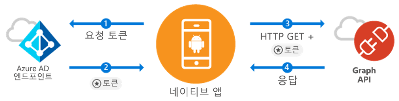

# <a name="quickstart-sign-in-users-and-call-the-microsoft-graph-api-from-an-android-app"></a>빠른 시작: Android 앱에서 사용자 로그인 및 Microsoft Graph API 호출

[!INCLUDE [active-directory-develop-applies-v1-adal](../../../includes/active-directory-develop-applies-v1-adal.md)]

Android 애플리케이션을 개발하는 분들은 Azure AD(Azure Active Directory) 사용자를 간단하게 로그인할 수 있습니다. Azure AD를 사용하면 애플리케이션이 Microsoft Graph를 통해 또는 개발자 고유의 보호되는 web API를 통해 사용자 데이터에 액세스할 수 있습니다.

Azure ADAL(AD 인증 라이브러리) Android 라이브러리는 산업 표준 OAuth 2.0 및 OpenID Connect를 통해 [Microsoft Azure Active Directory 계정](https://azure.microsoft.com/services/active-directory/)을 지원하여 앱이 [Microsoft Azure Cloud](https://cloud.microsoft.com) 및 [Microsoft Graph API](https://developer.microsoft.com/graph) 사용을 시작할 수 있도록 합니다.

이 빠른 시작에서 다음을 수행하는 방법을 알아봅니다.

* Microsoft Graph에 대한 토큰 가져오기
* 토큰 새로 고침
* Microsoft Graph 호출
* 사용자 로그아웃

## <a name="prerequisites"></a>필수 조건

시작하려면 사용자를 만들고 애플리케이션을 등록할 수 있는 Azure AD 테넌트가 필요합니다. 테넌트가 아직 없는 경우 [얻는 방법을 알아보세요](quickstart-create-new-tenant.md).

## <a name="scenario-sign-in-users-and-call-the-microsoft-graph"></a>시나리오: 사용자 로그인 및 Microsoft Graph 호출



모든 Azure AD 계정에 이 앱을 사용할 수 있습니다. 단일 테넌트 및 다중 테넌트 시나리오를 둘 다 지원합니다(단계별로 설명). 앱을 빌드하여 엔터프라이즈 사용자와 연결하고 Microsoft Graph를 통해 해당 Azure + O365 데이터에 액세스하는 방법을 보여 줍니다. 인증 흐름에서 최종 사용자는 애플리케이션에 로그인하고 사용 권한에 동의해야 하며, 경우에 따라 관리자가 앱에 동의해야 할 수도 있습니다. 이 샘플에 포함된 대부분의 논리는 최종 사용자를 인증하고 기본적인 Microsoft Graph 호출 방법을 보여줍니다.

## <a name="sample-code"></a>샘플 코드

전체 샘플 코드는 [GitHub](https://github.com/Azure-Samples/active-directory-android)에서 확인할 수 있습니다.

```Java
// Initialize your app with MSAL
AuthenticationContext mAuthContext = new AuthenticationContext(
        MainActivity.this,
        AUTHORITY,
        false);


// Perform authentication requests
mAuthContext.acquireToken(
    getActivity(),
    RESOURCE_ID,
    CLIENT_ID,
    REDIRECT_URI,
    PromptBehavior.Auto,
    getAuthInteractiveCallback());

// ...

// Get tokens to call APIs like the Microsoft Graph
mAuthResult.getAccessToken()
```

## <a name="step-1-register-and-configure-your-app"></a>1단계: 앱 등록 및 구성

[Azure Portal](https://portal.azure.com)을 사용하여 네이티브 클라이언트 애플리케이션을 Microsoft에 등록해야 합니다.

1. 앱 등록
    - [Azure Portal](https://aad.portal.azure.com)로 이동합니다.
    - ***Azure Active Directory*** > ***앱 등록***을 선택합니다.

2. 앱 만들기
    - **새 등록**을 선택합니다.
    - **이름** 필드에 앱 이름을 입력합니다.
    - **지원되는 계정 유형** 아래에서 **모든 조직 디렉터리의 계정 및 개인 Microsoft 계정**을 선택합니다.
    - **리디렉션 URI**의 드롭다운에서 **공용 클라이언트(모바일 및 데스크톱)** 를 선택하고 `http://localhost`를 입력합니다.
    - **등록**을 클릭합니다.

3. Microsoft Graph 구성
    - **API 사용 권한**을 선택합니다.
    - **사용 권한 추가**를 선택하고 **API 선택** 안에서 ***Microsoft Graph***를 선택합니다.
    - **위임된 권한**에서 사용 권한 **User.Read**를 선택한 다음, **추가**를 눌러 저장합니다.        
    
4. 축하합니다! 앱이 구성되었습니다. 그 다음 섹션에서는 다음 작업을 수행해야 합니다.
    - `Application ID`
    - `Redirect URI`

## <a name="step-2-get-the-sample-code"></a>2단계: 샘플 코드 가져오기

1. 코드를 복제합니다.
    ```
    git clone https://github.com/Azure-Samples/active-directory-android
    ```
2. Android Studio에서 샘플을 엽니다.
    - **기존 Android Studio 프로젝트 열기**를 선택합니다.

## <a name="step-3-configure-your-code"></a>3단계: 코드 구성

이 코드 샘플에 대한 모든 구성은 ***src/main/java/com/azuresamples/azuresampleapp/MainActivity.java*** 파일에서 찾을 수 있습니다.

1. 상수 `CLIENT_ID`를 `ApplicationID`로 바꿉니다.
2. 상수 `REDIRECT URI`를 앞에서 구성한 `Redirect URI`(`http://localhost`)로 바꿉니다.

## <a name="step-4-run-the-sample"></a>4단계: 샘플 실행

1. **빌드 > 프로젝트 정리**를 선택합니다.
2. **실행 > 앱 실행**을 선택합니다.
3. 앱이 빌드되고 몇 가지 기본 사용자 환경이 표시됩니다. `Call Graph API` 단추를 클릭하면 로그인하라는 메시지가 표시된 후 새 토큰을 사용하여 자동으로 Microsoft Graph API가 호출됩니다.

## <a name="next-steps"></a>다음 단계

1. [ADAL Android Wiki](https://github.com/AzureAD/azure-activedirectory-library-for-android/wiki)에서 라이브러리 메커니즘과 새로운 시나리오 및 기능을 구성하는 방법에 대한 자세한 내용을 확인하세요.
2. 네이티브 시나리오에서는 앱이 Webview를 사용하므로 앱에서 나가지 않습니다. `Redirect URI`는 임의로 지정될 수 있습니다.
3. 문제가 있거나 궁금한 점이 있나요? Stack Overflow에서 `azure-active-directory` 태그를 사용하여 문제를 작성하거나 게시할 수 있습니다.

### <a name="cross-app-sso"></a>앱 간 SSO

[ADAL을 사용하여 Android에서 앱 간 SSO를 사용하도록 설정하는 방법](howto-v1-enable-sso-android.md)을 알아봅니다.

### <a name="auth-telemetry"></a>인증 원격 분석

ADAL 라이브러리는 인증 원격 분석을 공개하여 앱 개발자가 앱의 작동 방식을 이해하고 더 나은 환경을 빌드할 수 있도록 지원합니다. 따라서 개발자는 로그인 성공, 활성 사용자 및 기타 여러 가지 흥미로운 인사이트를 캡처할 수 있습니다. 인증 원격 분석을 사용하려면 앱 개발자는 이벤트를 집계하고 저장하는 원격 분석 서비스를 설정해야 합니다.

인증 원격 분석에 대한 자세한 내용은 [ADAL Android 인증 원격 분석](https://github.com/AzureAD/azure-activedirectory-library-for-android/wiki/Telemetry)을 확인하세요.
