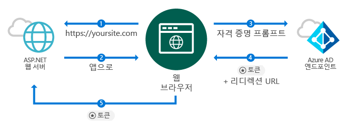
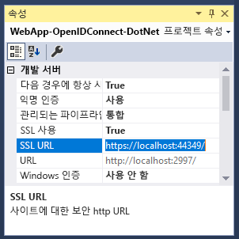
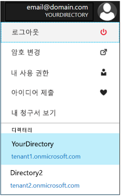
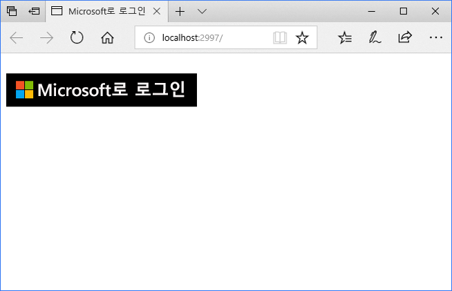
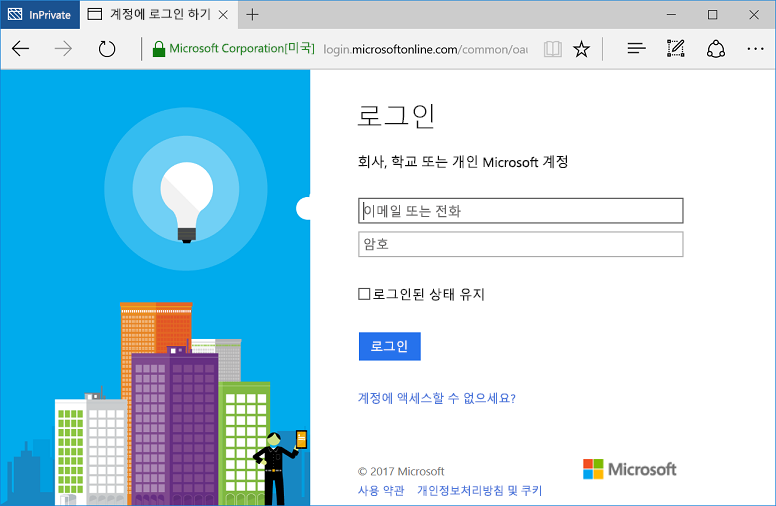

# <a name="quickstart-add-sign-in-with-microsoft-to-an-aspnet-web-app"></a>빠른 시작: ASP.NET 웹앱에 Microsoft에 로그인 추가

[!INCLUDE [active-directory-develop-applies-v1](../../../includes/active-directory-develop-applies-v1.md)]

이 빠른 시작에서는 OpenID Connect를 사용하는 기본 웹 브라우저 기반 애플리케이션을 통해 ASP.NET MVC(Model-View-Controller) 솔루션을 사용하여 Microsoft에 로그인을 구현하는 방법을 알아봅니다. ASP.NET 애플리케이션에서 회사 및 학교 계정의 로그인을 사용하도록 설정하는 방법을 알아봅니다.

이 빠른 시작을 마치면 애플리케이션에서 Azure AD(Azure Active Directory)와 통합된 조직의 회사 및 학교 계정을 사용한 로그인을 허용하게 됩니다.

> [!NOTE]
> 회사 및 학교 계정 외에 개인 계정의 로그인도 사용하도록 설정하기 위해 *[Microsoft ID 플랫폼 엔드포인트](azure-ad-endpoint-comparison.md)* 를 사용할 수 있습니다. 자세한 내용은 [이 ASP.NET 자습서](tutorial-v2-asp-webapp.md)와 *Microsoft ID 플랫폼 엔드포인트*를 설명하는 [이 문서](active-directory-v2-limitations.md)를 참조하세요.

## <a name="prerequisites"></a>필수 조건

시작하려면 다음과 같은 필수 구성을 충족하는지 확인합니다.

* Visual Studio 2015 업데이트 3 이상이 설치되어 있어야 합니다. 이 프로그램이 아직 설치되어 있지 않나요? [체험용 Visual Studio 2019 다운로드](https://www.visualstudio.com/downloads/)

## <a name="scenario-sign-in-users-from-work-and-school-accounts-in-your-aspnet-app"></a>시나리오: 사용자가 ASP.NET 앱에서 회사 및 학교 계정에 로그인



이 시나리오에서는 브라우저가 ASP.NET 웹 사이트에 액세스하고 로그인 단추를 사용하여 인증하도록 사용자에게 요청합니다. 이 시나리오에서는 웹 페이지를 렌더링하는 작업의 대부분이 서버 쪽에서 발생합니다.

빠른 시작에서는 빈 템플릿에서 시작하여 ASP.NET 웹 애플리케이션에서 사용자를 로그인하는 방법을 보여줍니다. 또한 로그인 단추와 모든 컨트롤러 및 메서드를 추가하는 등의 단계가 포함되며 이러한 작업의 배경이 되는 개념을 설명합니다. Azure AD 사용자가 [Visual Studio 웹 템플릿](https://docs.microsoft.com/aspnet/visual-studio/overview/2013/creating-web-projects-in-visual-studio#organizational-account-authentication-options)을 사용하고 **조직 계정**을 선택한 다음, 클라우드 옵션 중 하나를 선택하여 회사 및 학교 계정으로 로그인하는 프로젝트를 만들 수도 있습니다. 이 옵션에서는 추가 컨트롤러, 메서드 및 보기에 다양한 템플릿이 사용됩니다.

## <a name="libraries"></a>라이브러리

이 빠른 시작에서는 다음 패키지를 사용합니다.

| 라이브러리 | 설명 |
|---|---|
| [Microsoft.Owin.Security.OpenIdConnect](https://www.nuget.org/packages/Microsoft.Owin.Security.OpenIdConnect/) | 애플리케이션이 인증에 OpenIdConnect를 사용할 수 있게 해주는 미들웨어입니다. |
| [Microsoft.Owin.Security.Cookies](https://www.nuget.org/packages/Microsoft.Owin.Security.Cookies) |애플리케이션이 쿠키를 사용하여 사용자 세션을 유지하도록 하는 미들웨어 |
| [Microsoft.Owin.Host.SystemWeb](https://www.nuget.org/packages/Microsoft.Owin.Host.SystemWeb) | OWIN 기반 애플리케이션이 ASP.NET 요청 파이프라인을 사용하여 IIS에서 실행되도록 함 |
|  |  |

## <a name="step-1-set-up-your-project"></a>1단계: 프로젝트 설정

이 단계에서는 ASP.NET 프로젝트에서 OpenID Connect를 사용하여 OWIN 미들웨어를 통해 인증 파이프라인을 설치 및 구성하는 방법을 보여줍니다.

대신 이 샘플의 Visual Studio 프로젝트를 다운로드하려면 다음 단계를 수행합니다.
1. [GitHub에서 프로젝트를 다운로드합니다.](https://github.com/AzureADQuickStarts/WebApp-OpenIdConnect-DotNet/archive/GuidedSetup.zip)
1. 구성 단계로 건너뛰어 실행 전에 코드 샘플을 구성합니다.

## <a name="step-2-create-your-aspnet-project"></a>2단계: ASP.NET 프로젝트 만들기

1. Visual Studio에서 **파일 > 새로 만들기 > 프로젝트**로 이동합니다.
2. **프로젝트 형식**으로 **웹**을 선택한 다음, **ASP.NET 웹 애플리케이션(.NET Framework)** 을 선택합니다.
3. 애플리케이션의 이름을 지정하고 **만들기**를 선택합니다.
4. **비어 있음**을 선택한 다음, **폴더 및 핵심 참조 추가**에서 **MVC**를 선택하여 MVC 참조를 추가합니다.
5. **만들기**를 선택합니다.

## <a name="step-3-add-authentication-components"></a>3단계: 인증 구성 요소 추가

1. Visual Studio에서 **도구 > NuGet 패키지 관리자 > 패키지 관리자 콘솔**로 이동합니다.
2. [패키지 관리자 콘솔] 창에 다음 내용을 입력하여 **OWIN 미들웨어 NuGet 패키지** 를 추가합니다.

    ```powershell
    Install-Package Microsoft.Owin.Security.OpenIdConnect
    Install-Package Microsoft.Owin.Security.Cookies
    Install-Package Microsoft.Owin.Host.SystemWeb
    ```

<!--start-collapse-->
> ### <a name="about-these-packages"></a>이러한 패키지 정보
>위의 라이브러리는 쿠키 기반 인증을 통해 OpenID Connect를 사용하여 SSO(Single Sign-On)를 사용하도록 설정합니다. 인증이 완료되고 사용자를 나타내는 토큰이 애플리케이션으로 전송되면 OWIN 미들웨어가 세션 쿠키를 생성합니다. 그러면 브라우저가 후속 요청 시 이 쿠키를 사용하므로 사용자가 다시 인증할 필요가 없고 추가 확인이 필요하지 않습니다.
<!--end-collapse-->

## <a name="step-4-configure-the-authentication-pipeline"></a>4단계: 인증 파이프라인 구성

OpenID Connect 인증을 구성하기 위해 OWIN 미들웨어 *시작 클래스*를 만드는 다음 단계를 수행합니다. 이 클래스는 자동으로 실행됩니다.

> [!TIP]
> 프로젝트의 루트 폴더에 `Startup.cs` 파일이 없는 경우:<br/>
> 1. 프로젝트의 루트 폴더를 마우스 오른쪽 단추로 클릭하고 > **추가 > 새 항목... > OWIN 시작 클래스**를 클릭합니다.<br/>
> 2. 이름을 `Startup.cs`로 지정합니다.<br/>
>
>> 선택한 클래스가 표준 C# 클래스가 아니라 OWIN Startup 클래스인지 확인합니다. 네임스페이스 위에 `[assembly: OwinStartup(typeof({NameSpace}.Startup))]`가 보이면 선택하여 확인합니다.

OWIN 미들웨어 *시작 클래스*를 만들려면 다음을 수행합니다.

1. `Startup.cs`에 *OWIN* 및 *Microsoft.IdentityModel* 네임스페이스를 추가합니다.

    [!code-csharp[main](../../../WebApp-OpenIDConnect-DotNet/WebApp-OpenIDConnect-DotNet/Startup.cs?name=AddedNameSpaces "Startup.cs")]

2. Startup 클래스를 다음 코드로 바꿉니다.

    [!code-csharp[main](../../../WebApp-OpenIDConnect-DotNet/WebApp-OpenIDConnect-DotNet/Startup.cs?name=Startup "Startup.cs")]

<!--start-collapse-->
> [!NOTE]
> *OpenIDConnectAuthenticationOptions*에 제공하는 매개 변수는 애플리케이션이 Azure AD와 통신하기 위한 좌표로 사용됩니다. OpenID Connect 미들웨어는 쿠키를 사용하므로 앞의 코드에서처럼 쿠키 인증도 설정해야 합니다. *ValidateIssuer* 값은 OpenIdConnect에 특정 조직 하나로 액세스를 제한하지 않도록 지시합니다.
<!--end-collapse-->

<!--end-setup-->

<!--start-use-->

## <a name="step-5-add-a-controller-to-handle-sign-in-and-sign-out-requests"></a>5단계: 로그인 및 로그아웃 요청을 처리하는 컨트롤러 추가

로그인 및 로그아웃 메서드를 노출하는 새 컨트롤러를 만듭니다.

1.  **컨트롤러** 폴더를 마우스 오른쪽 단추로 클릭하고 **추가 > 컨트롤러**를 선택합니다.
2.  **MVC{버전} 컨트롤러 - 비어 있음**을 선택합니다.
3.  **추가**를 선택합니다.
4.  이름을 `HomeController`로 지정하고 **추가**를 선택합니다.
5.  클래스에 **OWIN** 네임스페이스를 추가합니다.

    [!code-csharp[main](../../../WebApp-OpenIDConnect-DotNet/WebApp-OpenIDConnect-DotNet/Controllers/HomeController.cs?name=AddedNameSpaces "HomeController.cs")]

6. 코드를 통해 인증 질문을 시작하여 로그인 및 로그아웃을 처리하는 다음 메서드를 컨트롤러에 추가합니다.

    [!code-csharp[main](../../../WebApp-OpenIDConnect-DotNet/WebApp-OpenIDConnect-DotNet/Controllers/HomeController.cs?name=SigInAndSignOut "HomeController.cs")]

## <a name="step-6-create-the-apps-home-page-to-sign-in-users-via-a-sign-in-button"></a>6단계: 로그인 단추를 통해 사용자를 로그인하는 앱의 홈페이지 만들기

Visual Studio에서 로그인 단추를 추가하고 인증 후 사용자 정보를 표시하는 새 보기를 만듭니다.

1. **Views\Home** 폴더를 마우스 오른쪽 단추로 클릭하고 **보기 추가**를 선택합니다.
1. 이름을 **Index**로 지정합니다.
1. 로그인 단추를 포함하는 다음 HTML을 파일에 추가합니다.

    [!code-html[main](../../../WebApp-OpenIDConnect-DotNet/WebApp-OpenIDConnect-DotNet/Views/Home/Index.cshtml "Index.cshtml")]

<!--start-collapse-->
이 페이지는 SVG 형식으로 검은색 배경의 로그인 단추를 추가합니다.<br/><br/> 더 자세한 로그인 단추는 [애플리케이션을 위한 브랜딩 지침](howto-add-branding-in-azure-ad-apps.md)으로 이동하세요.
<!--end-collapse-->

## <a name="step-7-display-users-claims-by-adding-a-controller"></a>7단계: 컨트롤러를 추가하여 사용자 클레임 표시

이 컨트롤러는 컨트롤러를 보호하는 `[Authorize]` 특성의 사용을 보여 줍니다. 이 특성은 인증된 사용자만 허용하여 컨트롤러에 대한 액세스를 제한합니다. 다음 코드에서는 이 특성을 활용하여 로그인의 일부로 검색된 사용자 클레임을 표시합니다.

1. **컨트롤러** 폴더를 마우스 오른쪽 단추로 클릭한 다음, **추가 > 컨트롤러**를 선택합니다.
1. **MVC{버전} 컨트롤러 - 비어 있음**을 선택합니다.
1. **추가**를 선택합니다.
1. 이름을 **ClaimsController**로 지정합니다.
1. 컨트롤러 클래스의 코드를 다음 코드로 바꿉니다. 이 예제에서는 클래스에 `[Authorize]` 특성이 추가됩니다.

    [!code-csharp[main](../../../WebApp-OpenIDConnect-DotNet/WebApp-OpenIDConnect-DotNet/Controllers/ClaimsController.cs?name=ClaimsController "ClaimsController.cs")]

<!--start-collapse-->
> [!NOTE]
> `[Authorize]` 특성을 사용하므로 이 컨트롤러의 모든 메서드는 사용자가 인증된 경우에만 실행할 수 있습니다. 사용자가 인증되지 않은 경우 컨트롤러에 액세스하려고 하면 OWIN에서 인증 질문을 시작하고 사용자가 강제로 인증하도록 합니다. 위 코드는 사용자의 클레임 컬렉션에서 사용자의 토큰에 포함된 특정 특성을 확인합니다. 이러한 특성에는 사용자의 전체 이름과 사용자 이름 및 전역 사용자 식별자 주체가 포함됩니다. 사용자의 조직에 대한 ID를 나타내는 *테넌트 ID*도 포함됩니다.
<!--end-collapse-->

## <a name="step-8-create-a-view-to-display-the-users-claims"></a>8단계: 사용자의 클레임을 표시하는 보기 만들기

Visual Studio에서 새 보기를 만들어 사용자의 클레임을 웹 페이지에 표시합니다.

1. **Views\Claims** 폴더를 마우스 오른쪽 단추로 클릭한 다음, **보기 추가**를 선택합니다.
1. 이름을 **Index**로 지정합니다.
1. 다음 HTML을 파일에 추가합니다.

    [!code-html[main](../../../WebApp-OpenIDConnect-DotNet/WebApp-OpenIDConnect-DotNet/Views/Claims/Index.cshtml "Index.cshtml")]

<!--end-use-->

<!--start-configure-->

## <a name="step-9-configure-your-webconfig-and-register-an-application"></a>9단계: *web.config*를 구성하고 애플리케이션을 등록합니다.

1. Visual Studio에서 루트 폴더에 있는 `configuration\appSettings`의 `web.config` 섹션 아래에 다음 내용을 추가합니다.

    ```xml
    <add key="ClientId" value="Enter_the_Application_Id_here" />
    <add key="RedirectUrl" value="Enter_the_Redirect_Url_here" />
    <add key="Tenant" value="common" />
    <add key="Authority" value="https://login.microsoftonline.com/{0}" />
    ```
2. 솔루션 탐색기에서 프로젝트를 선택하고 <i>속성</i> 창을 확인합니다([속성] 창이 보이지 않으면 <F4> 키 누르기).
3. SSL 사용을 <code>True</code>로 변경
4. 프로젝트의 SSL URL을 클립보드에 복사합니다.<br/><br/><br />
5. <code>web.config</code>에서 <code>Enter_the_Redirect_URL_here</code>를 프로젝트의 SSL URL로 바꿉니다.

### <a name="register-your-application-in-the-azure-portal-then-add-its-information-to-webconfig"></a>Azure Portal에서 애플리케이션을 등록한 다음, *web.config*에 정보 추가하기

1. [Azure Portal](https://portal.azure.com/)에 회사 또는 학교 계정, 개인 Microsoft 계정으로 로그인합니다.
2. 계정이 둘 이상의 테넌트에 대해 액세스를 제공하는 경우 오른쪽 위 모서리에 있는 계정을 선택하여 원하는 Azure AD 테넌트로 포털 세션을 설정합니다.
3. 개발자용 Microsoft ID 플랫폼 [앱 등록](https://go.microsoft.com/fwlink/?linkid=2083908) 페이지로 이동합니다.
4. **새 등록**을 선택합니다.
5. **애플리케이션 등록** 페이지가 나타나면 애플리케이션의 이름을 입력합니다.
6. **지원되는 계정 유형** 아래에서 **모든 조직 디렉터리의 계정 및 개인 Microsoft 계정**을 선택합니다.
7. **Redirect URI** 섹션에서 **웹** 플랫폼을 선택하고 값을 Visual Studio 프로젝트의 *SSL URL*(Azure AD가 토큰을 반환할 위치)로 설정합니다.
78. 작업을 마쳤으면 **등록**을 선택합니다. 앱 **개요** 페이지에서 **애플리케이션(클라이언트) ID** 값을 복사합니다.
9. Visual Studio로 돌아가서 `web.config`에서 `Enter_the_Application_Id_here`를 등록한 애플리케이션의 애플리케이션 ID로 바꿉니다.

> [!TIP]
> 여러 디렉터리에 액세스하도록 계정이 구성된 경우 Azure Portal의 오른쪽 상단에 있는 계정 이름을 클릭한 다음, 선택한 디렉터리가 표시되는지 확인하여 애플리케이션을 등록할 조직의 디렉터리를 올바로 선택해야 합니다.<br/>

## <a name="step-10-configure-sign-in-options"></a>10단계: 로그인 옵션 구성

특정 조직의 Azure AD 인스턴스에 속한 사용자만 로그인하도록 허용하거나 모든 조직에 속한 사용자의 로그인을 수락하도록 애플리케이션을 구성할 수 있습니다. 다음 항목 중 하나의 지침을 따르세요.

### <a name="configure-your-application-to-allow-sign-ins-of-work-and-school-accounts-from-any-company-or-organization-multi-tenant"></a>모든 회사 또는 조직에서 회사 및 학교 계정의 로그인을 허용하도록 애플리케이션 구성(다중 테넌트)

Azure AD와 통합된 어떠한 회사 또는 조직에서 회사 및 학교 계정의 로그인을 허용하려면 다음 단계를 수행합니다. 이 시나리오는 *SaaS 애플리케이션*에 일반적입니다.

1. [Microsoft Azure Portal - 앱 등록](https://portal.azure.com/#blade/Microsoft_AAD_IAM/ActiveDirectoryMenuBlade/RegisteredApps)으로 돌아가서 등록한 애플리케이션을 찾습니다.
2. **모든 설정**에서 **속성**을 선택합니다.
3. **다중 테넌트** 속성을 **예**로 변경한 다음, **저장**을 선택합니다.

이 설정과 다중 테넌트 애플리케이션의 개념에 대한 자세한 내용은 [다중 테넌트 개요](howto-convert-app-to-be-multi-tenant.md)를 참조하세요.

### <a name="restrict-users-from-only-one-organizations-active-directory-instance-to-sign-in-to-your-application-single-tenant"></a>한 조직의 Active Directory 인스턴스에 속한 사용자만 애플리케이션에 로그인하도록 제한(단일 테넌트)

이 옵션은 LOB(기간 업무) 애플리케이션에 대한 일반적인 시나리오입니다.

애플리케이션에서 특정 Azure AD 인스턴스에 속한 계정의 로그인만 수락하도록 하려면(해당 인스턴스의 *게스트 계정* 포함) 다음 단계를 수행합니다.

1. `Common`에서 *web.config*의 `Tenant` 매개 변수를 조직의 테넌트 이름으로 바꿉니다(예: *contoso.onmicrosoft.com*).
1. [*OWIN 시작 클래스*](#step-4-configure-the-authentication-pipeline)의 `ValidateIssuer` 인수를 `true`로 변경합니다.

특정 조직의 목록에 있는 사용자만 허용하려면 다음 단계를 수행합니다.

1. `ValidateIssuer`를 true로 설정합니다.
1. `ValidIssuers` 매개 변수를 사용하여 조직 목록을 지정합니다.

또 다른 옵션은 *IssuerValidator* 매개 변수를 사용하여 발급자의 유효성을 검사하는 사용자 지정 메서드를 구현하는 것입니다. `TokenValidationParameters`에 대한 자세한 내용은 [이 MSDN 문서](https://msdn.microsoft.com/library/system.identitymodel.tokens.tokenvalidationparameters.aspx "TokenValidationParameters MSDN 문서")를 참조하세요.

<!--end-configure-->

<!--start-configure-arp-->
<!--
## Configure your ASP.NET Web App with the application's registration information

In this step, you will configure your project to use SSL, and then use the SSL URL to configure your application’s registration information. After this, add the application’ registration information to your solution via *web.config*.

1.  In Solution Explorer, select the project and look at the `Properties` window (if you don’t see a Properties window, press F4)
2.  Change `SSL Enabled` to `True`
3.  Copy the value from `SSL URL` above and paste it in the `Redirect URL` field on the top of this page, then click *Update*:<br/><br/><br />
4.  Add the following in `web.config` file located in root’s folder, under section `configuration\appSettings`:

```xml
<add key="ClientId" value="[Enter the application Id here]" />
<add key="RedirectUri" value="[Enter the Redirect URL here]" />
<add key="Tenant" value="common" />
<add key="Authority" value="https://login.microsoftonline.com/{0}" /> 
```
-->
<!--end-configure-arp-->
<!--start-test-->

## <a name="step-11-test-your-code"></a>11단계: 코드 테스트

1. **F5** 키를 눌러 Visual Studio에서 프로젝트를 실행합니다. 브라우저가 열리고 `http://localhost:{port}`로 이동합니다. 이 페이지에는 **Microsoft에 로그인** 단추가 표시됩니다.
1. 단추를 선택하여 로그인합니다.

### <a name="sign-in"></a>로그인

테스트할 준비가 되면 회사 계정(Azure AD)을 사용하여 로그인합니다.





#### <a name="expected-results"></a>예상 결과

사용자가 로그인하면 Microsoft 애플리케이션 등록 포털의 애플리케이션 등록 정보에 지정된 HTTPS URL에 해당하는 웹 사이트의 홈페이지로 리디렉션됩니다. 이제 이 페이지에 *Hello {User}* ({User} 님, 안녕하세요?) 및 로그아웃 링크, 사용자의 클레임을 표시하는 링크(이전에 만든 권한 부여 컨트롤러에 대한 링크)가 표시됩니다.

### <a name="see-users-claims"></a>사용자의 클레임 보기

사용자의 클레임을 보려면 하이퍼링크를 선택합니다. 그러면 인증된 사용자에게만 제공되는 뷰 및 컨트롤러로 이동합니다.

#### <a name="expected-results"></a>예상 결과

 로그온한 사용자의 기본 속성을 포함하는 표가 표시됩니다.

| 자산 | 값 | 설명 |
|---|---|---|
| Name | {User Full Name} | 사용자의 이름과 성 |
| 사용자 이름 | <span>user@domain.com</span> | 로그온한 사용자를 식별하는 데 사용되는 사용자 이름 |
| 제목| {Subject} |전체 웹에서 사용자 로그온을 고유하게 식별하는 문자열 |
| 테넌트 ID | {Guid} | 사용자의 Azure AD 조직을 고유하게 나타내는 *guid*입니다. |

또한 인증 요청에 포함된 모든 사용자 클레임을 포함하는 표가 표시됩니다. ID 토큰의 모든 클레임 목록과 설명은 [ID 토큰의 클레임 목록](https://docs.microsoft.com/azure/active-directory/develop/active-directory-token-and-claims)을 참조하세요.

### <a name="optional-access-a-method-that-has-an-authorize-attribute"></a>(선택 사항) *[Authorize]* 특성이 있는 메서드에 액세스

이 단계에서는 익명 사용자로 클레임 컨트롤러 액세스를 테스트합니다.<br/>
사용자 로그아웃 링크를 선택하고 로그아웃 프로세스를 완료합니다.<br/>
이제 브라우저에서 `http://localhost:{port}/claims`를 입력하여 `[Authorize]` 특성으로 보호되는 컨트롤러에 액세스합니다.

#### <a name="expected-results"></a>예상 결과

보기를 보려면 인증하라는 메시지가 표시됩니다.

## <a name="additional-information"></a>추가 정보

<!--start-collapse-->
### <a name="protect-your-entire-web-site"></a>전체 웹 사이트 보호

전체 웹 사이트를 보호하려면 `Global.asax` `Application_Start` 메서드의 `GlobalFilters`에 `AuthorizeAttribute`를 추가합니다.

```csharp
GlobalFilters.Filters.Add(new AuthorizeAttribute());
```
<!--end-collapse-->

<div></div>
<br/>

<!--end-test-->

## <a name="next-steps"></a>다음 단계

이제 추가 시나리오로 이동할 수 있습니다.

> [!div class="nextstepaction"]
> [ASP.NET 자습서](https://docs.microsoft.com/azure/active-directory/develop/tutorial-v2-asp-webapp)
