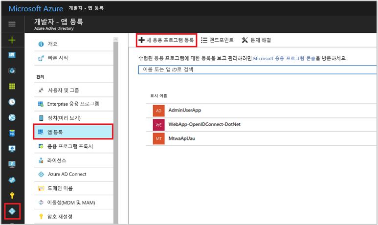
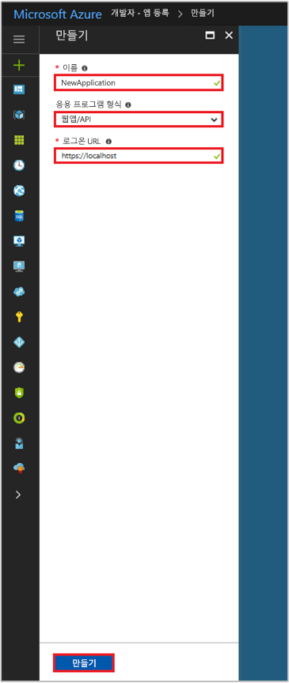

# <a name="integrating-applications-with-azure-active-directory"></a>Azure Active Directory와 응용 프로그램 통합

[!INCLUDE [active-directory-develop-applies-v1](../../../includes/active-directory-develop-applies-v1.md)]

엔터프라이즈 개발자 및 소프트웨어 SaaS(software-as-a-service) 공급자는 Azure AD(Azure Active directory)와 함께 통합되어 해당 서비스에 대한 보안 로그인 및 권한 부여를 제공하는 상용 클라우드 서비스 또는 업무용 응용 프로그램 제품군을 개발할 수 있습니다. 응용 프로그램 또는 서비스를 Azure AD와 통합하려면 개발자가 먼저 Azure AD에 응용 프로그램을 등록해야 합니다.

이 문서에서는 Azure AD에서 응용 프로그램 등록을 추가, 업데이트 또는 제거하는 방법을 보여줍니다. Azure AD와 통합할 수 있는 다양한 유형의 응용 프로그램, 웹 API 등과 같은 기타 리소스에 액세스하도록 응용 프로그램을 구성하는 방법에 대해 알아봅니다.

등록된 응용 프로그램을 나타내는 두 Azure AD 개체와 그 관계에 대한 자세한 내용은 [응용 프로그램 개체 및 서비스 주체 개체](app-objects-and-service-principals.md)를 참조하고, Azure Active Directory로 응용 프로그램을 개발할 때 사용해야 하는 브랜딩 지침에 대해 자세히 알아보려면 [통합 앱에 대한 브랜딩 지침](howto-add-branding-in-azure-ad-apps.md)을 참조하세요.

## <a name="adding-an-application"></a>응용 프로그램 추가

Azure AD의 기능을 사용하려는 모든 응용프로그램이 먼저 Azure AD 테넌트에 등록되어야 합니다. 이 등록 프로세스는 응용 프로그램이 위치한 URL, 사용자가 인증된 후 회신을 보낼 URL, 앱을 식별하는 URI 등과 같이 응용 프로그램에 대한 Azure AD 세부 정보의 제공이 포함됩니다.

### <a name="to-register-a-new-application-using-the-azure-portal"></a>Azure Portal을 사용하여 새 응용 프로그램을 등록하려면

1. [Azure Portal](https://portal.azure.com)에 로그인합니다.
2. 계정이 하나 이상의 액세스를 제공하는 경우 오른쪽 위 모서리에 있는 계정을 클릭하여 원하는 Azure AD 테넌트로 포털 세션을 설정합니다.
3. 왼쪽의 탐색 창에서 **Azure Active Directory** 서비스, **앱 등록** 및 **새 응용 프로그램 등록**을 차례로 클릭합니다.

   

4. **만들기** 페이지가 표시되면 응용 프로그램의 등록 정보를 입력합니다. 

  - **이름:** 의미 있는 응용 프로그램 이름을 입력합니다.
  - **응용 프로그램 형식:** 
    - 장치에서 로컬로 설치된 [클라이언트 응용 프로그램](developer-glossary.md#client-application)에 "네이티브"를 선택합니다. 이 설정은 OAuth 공개 [네이티브 클라이언트](developer-glossary.md#native-client)에 사용됩니다.
    - 보안 서버에 설치된 [클라이언트 응용 프로그램](developer-glossary.md#client-application) 및 [리소스/API 응용 프로그램](developer-glossary.md#resource-server)에 "웹앱/API"를 선택합니다. 이 설정은 OAuth 기밀 [웹 클라이언트](developer-glossary.md#web-client) 및 공용 [사용자 에이전트 기반 클라이언트](developer-glossary.md#user-agent-based-client)에 사용됩니다. 동일한 응용 프로그램이 클라이언트와 리소스/API를 모두 노출할 수도 있습니다.
  - **로그온 URL:** "웹앱/API" 응용 프로그램에서 앱의 기준 URL을 제공합니다. 예를 들어 `http://localhost:31544`은 로컬 컴퓨터에서 실행 중인 웹앱의 URL일 수 있습니다. 사용자는 이 URL을 사용하여 웹 클라이언트 응용 프로그램에 로그인합니다. 
  - **리디렉션 URI:** "네이티브" 응용 프로그램의 경우 Azure AD에서 토큰 응답을 반환하는 데 사용하는 URI를 제공합니다. 응용 프로그램에 고유하게 해당되는 값을 입력합니다(예: `http://MyFirstAADApp`).

   

   웹 응용 프로그램 또는 네이티브 응용 프로그램에 대한 구체적인 예제를 원하는 경우 [빠른 시작](azure-ad-developers-guide.md#get-started)을 확인합니다.

5. 작업을 마쳤으면 **만들기**를 클릭합니다. Azure AD가 응용 프로그램에 고유한 응용 프로그램 ID를 할당하면 응용 프로그램의 기본 등록 페이지로 이동합니다. 응용 프로그램이 웹 또는 네이티브 응용 프로그램인지에 따라 응용 프로그램에 기능을 추가하기 위해 다른 옵션이 제공됩니다. 동의 개요 및 응용 프로그램 등록에서 추가 구성 기능(자격 증명, 사용 권한, 다른 테넌트의 사용자 로그인 사용)을 사용하도록 설정하는 방법에 대한 세부 정보는 다음 섹션을 참조하세요.

  > [!NOTE]
  > 기본적으로 새로 등록된 웹 응용 프로그램은 동일한 테넌트의 사용자**만** 응용 프로그램에 로그인할 수 있도록 구성됩니다.

## <a name="updating-an-application"></a>응용프로그램 업데이트

응용 프로그램이 Azure AD와 등록되면 웹 API에 액세스를 제공하도록 업데이트하고 다른 조직에서 사용할 수 있게 만드는 등, 기타 작업이 필요할 수도 있습니다. 이 섹션에서는 응용 프로그램을 추가로 구성할 수 있는 다양한 방법을 설명합니다. 먼저 동의 프레임워크의 개요를 시작합니다. 여기서는 다른 사용자 또는 응용 프로그램에서 사용해야 하는 응용 프로그램을 빌드하는 경우를 이해하는 것이 중요합니다.

### <a name="overview-of-the-consent-framework"></a>동의 프레임워크의 개요

Azure AD 동의 프레임워크를 사용하면 다중 테넌트 웹 및 네이티브 클라이언트 응용 프로그램을 쉽게 개발할 수 있습니다. 이러한 응용 프로그램을 사용하면 응용 프로그램이 등록되어 있는 계정과 다르게 Azure AD 테넌트의 사용자 계정으로 로그인할 수 있습니다. 사용자 고유의 웹 API 외에도 Microsoft Graph API(Azure Active Directory, Intune 및 Office 365의 서비스에 액세스하기 위해) 및 기타 Microsoft 서비스 API와 같은 웹 API에 액세스해야 합니다. 이 프레임워크는 응용프로그램을 자신의 디렉토리에 등록하는 것에 동의하는 사용자나 관리자를 기반으로 합니다. 이 때 디렉토리 데이터 액세스가 필요할 수도 있습니다.

예를 들어 웹 클라이언트 응용 프로그램이 Office 365에서 사용자에 대한 일정 정보를 읽어야 하는 경우 해당 사용자는 먼저 클라이언트 응용 프로그램에 동의해야 합니다. 사용자가 동의해 주면 해당 클라이언트 응용 프로그램에서 사용자를 대신하여 Microsoft Graph API를 호출하고 필요한 대로 일정 정보를 사용할 수 있습니다. [Microsoft Graph API](https://graph.microsoft.io)는 Azure AD의 사용자와 그룹 및 더 많은 Microsoft 클라우드 서비스의 기타 데이터 개체뿐만 아니라 Office 365(예: Exchange의 일정 및 메시지, SharePoint의 사이트 및 목록, OneDrive의 문서, OneNote의 전자 필기장, Planner의 작업, Excel의 통합 문서 등)의 데이터에 대한 액세스를 제공합니다. 

동의 프레임워크는 공용 또는 기밀 클라이언트를 사용하여 인증 코드 부여 및 클라이언트 자격 증명 부여와 같은 다양한 흐름 및 OAuth 2.0을 기반으로 작성됩니다. OAuth 2.0을 사용하여 Azure AD는 전화기, 태블릿, 서버 또는 웹 응용 프로그램과 같은 다양한 유형의 클라이언트 응용 프로그램을 작성하고 필요한 리소스에 액세스할 수 잇습니다.

OAuth 2.0 권한 부여에서 동의 프레임워크를 사용하는 방법에 대한 자세한 내용은 [OAuth 2.0 및 Azure AD를 사용하여 웹 응용 프로그램에 대한 액세스 권한 부여](v1-protocols-oauth-code.md) 및 [Azure AD의 인증 시나리오](authentication-scenarios.md)를 참조하세요. Microsoft Graph를 통해 Office 365에 대한 액세스 권한을 부여받는 방법은 [Microsoft Graph를 사용하여 앱 인증](https://graph.microsoft.io/docs/authorization/auth_overview)을 참조하세요.

#### <a name="example-of-the-consent-experience"></a>승인 환경 예

다음 단계는 응용 프로그램 개발자와 사용자 모두에 대해 동의 경험이 어떻게 작동하는지를 보여줍니다.

1. 리소스/API에 액세스할 수 있는 특정 사용 권한을 요청해야 하는 웹 클라이언트 응용 프로그램이 있다고 가정합니다. 다음 섹션에서 이 구성을 수행하는 방법을 알아봅니다. 하지만 기본적으로 Azure Portal을 사용하여 구성 시 사용 권한 요청을 선언합니다. 다른 구성 설정과 마찬가지로 응용 프로그램 Azure AD 등록의 일부입니다.
   
  
    
2. 응용 프로그램의 사용 권한이 업데이트되었고 응용 프로그램이 실행 중이며 사용자가 처음으로 사용하는 것임을 고려하세요. 먼저 응용 프로그램은 Azure AD의 `/authorize` 엔드포인트에서 권한 부여 코드를 가져와야 합니다. 그런 다음 권한 부여 코드를 사용하여 새로운 액세스 토큰 및 새로 고침 토큰을 획득할 수 있습니다.

3. 사용자가 인증되지 않은 경우 Azure AD의 `/authorize` 엔드포인트는 로그인하라는 메시지를 표시합니다.
   
  

4. 사용자가 로그인한 후 Azure AD는 사용자를 동의 페이지에 표시해야 하는지 여부를 결정합니다. 이 결정은 사용자(또는 해당 조직의 관리자)가 응용 프로그램 동의를 부여했는지 여부에 따라 다릅니다. 아직 동의가 부여되지 않았다면 Azure AD는 사용자에게 동의 여부를 묻는 메시지를 표시하며 작동에 필요한 사용 권한을 표시합니다. 동의 대화 상자에 표시되는 사용 권한 집합은 Azure Portal의 위임된 권한에서 선택한 집합과 일치합니다.
   
  

5. 사용자가 동의를 부여하면 권한 부여 코드가 응용 프로그램에 반환되며, 이것을 교환하여 액세스 토큰 및 새로 고침 토큰을 획득할 수 있습니다. 이 흐름에 관한 자세한 정보는 [Web API]](web-api.md)를 참조하세요.

6. 관리자로 테넌트의 모든 사용자를 대신하여 응용 프로그램의 위임된 권한에 동의할 수도 있습니다. 관리 동의는 테넌트의 모든 사용자에게 동의 대화 상자가 표시되지 않도록 하고, 관리자 역할이 있는 사용자가 [Azure Portal](https://portal.azure.com)에서 이를 수행할 수 있습니다. 응용 프로그램의 **설정** 페이지에서 **필요한 사용 권한**을 클릭하고 **권한 부여** 단추를 클릭합니다. 

  
    
  > [!NOTE]
  > **권한 부여** 단추를 사용하는 명시적 동의 부여는 현재 ADAL.js를 사용하는 SPA(단일 페이지 응용 프로그램)에 필요합니다. 그렇지 않고 액세스 토큰을 요청하는 경우 응용 프로그램이 실패합니다. 

### <a name="configure-a-client-application-to-access-web-apis"></a>웹 API에 액세스하는 클라이언트 응용 프로그램 구성

웹/기밀 클라이언트 응용 프로그램이 인증을 요구하고 액세스 토큰을 얻는 권한 부여 흐름에 참여하려면 보안 자격 증명을 설정해야 합니다. Azure Portal에서 지원하는 기본 인증 방법은 클라이언트 ID + 비밀 키입니다. 이 섹션에서는 비밀 키로 클라이언트의 자격 증명을 제공하는 데 필요한 구성 단계에 대해 설명합니다.

또한 클라이언트에서 리소스 응용 프로그램(예: Microsoft Graph API)에서 공개한 웹 API에 액세스하기 전에 동의 프레임워크는 클라이언트에서 요청된 권한에 따라 필요한 권한 부여를 얻도록 합니다. 기본적으로 모든 응용 프로그램은 "Windows Azure Active Directory"(Graph API) 및 "Windows Azure Service Management API"의 사용 권한을 선택할 수 있습니다. [Graph API "로그인 및 읽기 사용자 프로필" 사용 권한](https://msdn.microsoft.com/Library/Azure/Ad/Graph/howto/azure-ad-graph-api-permission-scopes#PermissionScopeDetails)도 기본적으로 선택됩니다. Office 365를 구독한 계정이 있는 테넌트에 클라이언트를 등록하는 경우 SharePoint 및 Exchange Online에 대한 웹 API 및 권한도 선택할 수 있습니다. 원하는 웹 API 각각에서 [두 가지 형식의 사용 권한](developer-glossary.md#permissions) 중에 선택할 수 있습니다.

- 응용 프로그램 권한: 클라이언트 응용 프로그램이 직접 웹 API에 액세스해야 합니다(사용자 컨텍스트 없음). 이 유형의 권한은 관리자의 동의가 필요하며 네이티브 클라이언트 응용 프로그램에 대해 사용할 수 없습니다.

- 위임된 권한: 클라이언트 응용 프로그램이 로그인된 사용자로 웹 API에 액세스해야 하지만 이 액세스는 선택한 권한에 따라 제한됩니다. 이 형식의 사용 권한은 관리자의 동의를 필요로 하지 않는 한 사용자가 부여할 수 있습니다. 

  > [!NOTE]
  > 위임된 권한을 응용 프로그램에 추가할 경우 테넌트 내의 사용자에게 자동으로 동의를 부여하지 않습니다. 관리자가 모든 사용자를 대신하여 동의를 허락하지 않는 한 사용자는 런타임에 추가로 위임된 사용 권한에 대해 수동으로 동의해야 합니다.

#### <a name="to-add-application-credentials-or-permissions-to-access-web-apis"></a>웹 API에 액세스할 수 있는 응용 프로그램 자격 증명 또는 권한을 추가하려면

1. [Azure Portal](https://portal.azure.com)에 로그인합니다.
2. 계정이 하나 이상의 액세스를 제공하는 경우 오른쪽 위 모서리에 있는 계정을 클릭하여 원하는 Azure AD 테넌트로 포털 세션을 설정합니다.
3. 왼쪽의 탐색 창에서 **Azure Active Directory** 서비스, **앱 등록**을 차례로 클릭하고 구성하려는 새 응용 프로그램을 찾아 클릭합니다.

   

4. 응용 프로그램의 기본 등록 페이지로 이동하면 응용 프로그램의 **설정** 페이지를 엽니다. 웹 응용 프로그램에 대한 자격 증명을 추가하려면:
  - **설정** 페이지에서 **키** 섹션을 클릭합니다. 
  - 인증서를 추가하려면:
    - **공개 키 업로드**를 선택합니다.
    - 업로드할 파일을 선택합니다. cer, .pem, .crt 중 한 가지 파일 형식이어야 합니다.
  - 암호를 추가하려면:
    - 키에 대한 설명을 추가합니다.
    - 기간을 선택합니다.
    - **저장**을 클릭합니다. 구성 변경 사항을 저장하면 맨 오른쪽 열에 키 값이 포함됩니다. 이 페이지를 벗어나면 액세스할 수 없으므로 클라이언트 응용 프로그램 코드에서 사용할 **키를 복사해야 합니다**.

5. 클라이언트에서 리소스 API에 액세스하는 사용 권한을 추가하려면
  - **설정** 페이지에서 **필수 권한** 섹션을 클릭합니다. 
  - **추가** 단추를 클릭합니다.
  - **API 선택**을 클릭하고 선택할 리소스 유형을 선택합니다.
  - 사용 가능한 API 목록을 탐색하거나 검색 상자를 사용하여 Web API를 공개하는 디렉터리에서 사용 가능한 리소스 응용 프로그램 중에서 선택할 수 있습니다. 관심 있는 리소스를 클릭한 후 **선택**을 클릭합니다.
  - **액세스 사용** 페이지로 이동하게 됩니다. API에 액세스할 때 응용 프로그램에서 필요로 하는 응용 프로그램 사용 권한 및/또는 위임된 사용 권한을 선택합니다.
   
  

  

6. 작업을 마치면 **액세스 사용** 페이지에서 **선택** 단추를 클릭하고 **API 액세스 추가** 페이지에서 **완료** 단추를 클릭합니다. **필수 사용 권한** 페이지로 돌아가게 됩니다. 여기서 새 리소스를 API 목록에 추가합니다.

### <a name="configuring-a-resource-application-to-expose-web-apis"></a>웹 API를 공개하는 리소스 응용 프로그램 구성

액세스 [범위](developer-glossary.md#scopes) 및 [역할](developer-glossary.md#roles)을 공개하면 웹 API를 개발하고 클라이언트 응용 프로그램에서 사용할 수 있게 만들 수 있습니다. 올바르게 구성된 웹 API는 Graph API 및 Office 365 API와 같은 다른 Microsoft 웹 API와 마찬가지로 사용 가능합니다. 액세스 범위와 역할은 [응용 프로그램의 매니페스트](developer-glossary.md#application-manifest)를 통해 공개되며, 이 매니페스트는 응용 프로그램의 ID 구성을 나타내는 JSON 파일입니다. 

다음 섹션에서는 리소스 응용 프로그램의 매니페스트를 수정하여 액세스 범위를 공개하는 방법을 보여줍니다.

#### <a name="adding-access-scopes-to-your-resource-application"></a>리소스 응용 프로그램에 액세스 범위 추가

1. [Azure Portal](https://portal.azure.com)에 로그인합니다.
2. 계정이 하나 이상의 액세스를 제공하는 경우 오른쪽 위 모서리에 있는 계정을 클릭하여 원하는 Azure AD 테넌트로 포털 세션을 설정합니다.

3. 왼쪽의 탐색 창에서 **Azure Active Directory** 서비스, **앱 등록**을 차례로 클릭하고 구성하려는 새 응용 프로그램을 찾아 클릭합니다.

   

4. 응용 프로그램의 기본 등록 페이지로 이동하면 응용 프로그램의 **설정** 페이지를 엽니다. 응용 프로그램의 등록 페이지에서 **매니페스트**를 클릭하여 **매니페스트 편집** 페이지로 전환합니다. 웹 기반 매니페스트 편집기가 열리면 포털 내에서 매니페스트를 **편집**할 수 있습니다. 필요에 따라 **다운로드**를 클릭하고 로컬로 편집하고 **업로드**를 사용하여 응용 프로그램에 다시 적용할 수 있습니다.

5. 이 예제에서는 `oauth2Permissions` 컬렉션에 다음 JSON 요소를 추가하여 리소스/API에서 `Employees.Read.All`이라는 새 범위를 노출합니다. 등록하는 동안 기본적으로 기존 `user_impersonation` 범위가 제공됩니다. `user_impersonation`을 사용하면 클라이언트 응용 프로그램이 로그인한 사용자의 ID로 리소스에 액세스하는 사용 권한을 요청할 수 있습니다. 기존 `user_impersonation` 범위 요소 뒤에 쉼표를 추가하고 리소스의 요구 사항에 맞게 속성 값을 변경해야 합니다. 

  ```json
  {
    "adminConsentDescription": "Allow the application to have read-only access to all Employee data.",
    "adminConsentDisplayName": "Read-only access to Employee records",
    "id": "2b351394-d7a7-4a84-841e-08a6a17e4cb8",
    "isEnabled": true,
    "type": "User",
    "userConsentDescription": "Allow the application to have read-only access to your Employee data.",
    "userConsentDisplayName": "Read-only access to your Employee records",
    "value": "Employees.Read.All"
  }
  ```
  > [!NOTE]
  > “ID” 값은 [guidgen](https://msdn.microsoft.com/library/ms241442%28v=vs.80%29.aspx)과 같은 GUID 생성 도구를 사용하거나 프로그래밍 방식으로 만들어야 합니다. 이 값은 웹 API에 의해 노출되는 범위에서 고유한 식별자를 나타냅니다. 웹 API에 액세스할 수 있는 권한이 있는 클라이언트를 적절하게 구성하면 Azure AD에서 OAuth 2.0 액세스 토큰을 발급합니다. 클라이언트가 웹 API를 호출하면 해당 응용 프로그램 등록에서 요청된 권한으로 설정된 범위(scp) 클레임을 갖는 액세스 토큰을 표시합니다.
  >
  > 추가 범위를 나중에 필요한 대로 노출할 수 있습니다. 웹 API에서 다양한 기능과 관련된 여러 범위를 공개할 수도 있음을 고려하세요. 리소스에서는 OAuth 2.0 액세스 토큰에서 수신된 범위(`scp`) 클레임을 평가하여 런타임 시 웹 API에 대한 액세스를 제어할 수 있습니다.
  > 

6. 완료되면 **저장**을 클릭합니다. 이제 Web API가 디렉토리에 있는 다른 응용 프로그램에 의해 사용되도록 구성되었습니다. 

  

#### <a name="verify-the-web-api-is-exposed-to-other-applications-in-your-tenant"></a>웹 API가 테넌트의 다른 응용 프로그램에 노출되었는지 확인합니다.
1. Azure AD 테넌트로 다시 이동하고 **앱 등록**을 다시 클릭한 다음 구성하려는 클라이언트 응용 프로그램을 찾아 클릭합니다.

   

2. [웹 API에 액세스하는 클라이언트 응용 프로그램 구성](#configure-a-client-application-to-access-web-apis)에서 수행한 대로 5단계를 반복합니다. **API 선택** 단계에 도달하면 검색 필드에 해당 응용 프로그램 이름을 입력하여 리소스를 검색하고 **선택**을 클릭합니다. 

3. **액세스 사용** 페이지에서 클라이언트 권한 요청에 사용할 수 있는 새 범위가 표시되어야 합니다.

  

#### <a name="more-on-the-application-manifest"></a>응용프로그램 매니페스트에 대한 추가 정보

응용 프로그램 매니페스트는 실제로 설명한 API 액세스 범위를 포함하여, Azure AD 응용 프로그램의 ID 구성의 모든 특성을 정의하는 응용 프로그램 엔터티를 업데이트하기 위한 메커니즘으로 사용됩니다. 응용 프로그램 엔터티 및 해당 스키마에 대한 자세한 내용은 [Graph API 응용 프로그램 엔터티 설명서](https://msdn.microsoft.com/Library/Azure/Ad/Graph/api/entity-and-complex-type-reference#application-entity)를 참조하세요. 이 문서에는 다음을 비롯하여 API에 대한 사용 권한을 지정하는 데 사용되는 응용 프로그램 엔터티 멤버에 대한 전체 참조 정보가 포함됩니다.  

- 웹 API에 대한 [응용 프로그램 권한](developer-glossary.md#permissions)을 정의하는 데 사용되는 [AppRole](https://msdn.microsoft.com/Library/Azure/Ad/Graph/api/entity-and-complex-type-reference#approle-type) 엔터티의 컬렉션인 appRoles 멤버 
- 웹 API에 대한 [위임된 권한](developer-glossary.md#permissions)을 정의하는 데 사용되는 [OAuth2Permission](https://msdn.microsoft.com/Library/Azure/Ad/Graph/api/entity-and-complex-type-reference#oauth2permission-type) 엔터티의 컬렉션인 oauth2Permissions 멤버

일반적인 응용 프로그램 매니페스트 개념에 대한 자세한 내용은 [Azure Active Directory 응용 프로그램 매니페스트 이해](reference-app-manifest.md)를 참조하세요.

### <a name="accessing-the-azure-ad-graph-and-office-365-via-microsoft-graph-apis"></a>Microsoft Graph API를 통해 Azure AD Graph 및 Office 365에 액세스  

앞서 설명한 대로 고유한 응용 프로그램의 API를 노출/액세스하는 것 외에도 클라이언트 응용 프로그램을 등록하여 Microsoft 리소스에 의해 노출된 API에 액세스할 수 있습니다. 포털의 리소스/API 목록에서 "Microsoft Graph"라고도 하는 Microsoft Graph API는 Azure AD에 등록된 모든 응용 프로그램에 사용할 수 있습니다. Office 365 구독에 등록된 계정을 포함하는 테넌트에서 클라이언트 응용 프로그램을 등록하는 경우 다양한 Office 365 리소스에 의해 노출되는 범위에 액세스할 수도 있습니다.

Microsoft Graph API에서 노출되는 범위에 대한 자세한 내용은 [Microsoft Graph 권한 참조](https://developer.microsoft.com/en-us/graph/docs/concepts/permissions_reference) 문서를 참조하세요.

> [!NOTE]
> 현재 제한으로 인해 네이티브 클라이언트 응용 프로그램이 “조직의 디렉터리 액세스" 권한을 사용하는 경우 Azure AD 그래프 API만 호출할 수 있습니다. 이 제한은 웹 응용 프로그램에는 적용되지 않습니다.

### <a name="configuring-multi-tenant-applications"></a>다중 테넌트 응용 프로그램 구성

Azure AD에서 응용 프로그램을 등록하는 경우 조직 내의 사용자만 해당 응용 프로그램에 액세스할 수 있도록 제한하는 것이 좋습니다. 또는 외부 조직의 사용자가 응용 프로그램에 액세스할 수 있게 만들 수도 있습니다. 이러한 두 응용 프로그램 종류를 단일 테넌트 및 다중 테넌트 응용 프로그램이라고 합니다. 이 섹션에서는 단일 테넌트 응용 프로그램의 구성을 다중 테넌트 응용 프로그램으로 수정하는 방법을 설명합니다.

단일 테넌트와 다중 테넌트 응용 프로그램 간의 차이점을 인식하는 것이 중요합니다.  

- 단일 테넌트 응용 프로그램은 단일 조직에서 사용하기 위한 것입니다. 일반적으로 엔터프라이즈 개발자가 작성한 LoB(기간 업무) 응용 프로그램입니다. 단일 테넌트 응용 프로그램은 응용 프로그램 등록과 동일한 테넌트에 있는 계정을 사용하는 사용자에 의해서만 액세스될 수 있습니다. 결과적으로 하나의 디렉터리에서만 프로비전되어야 합니다.
- 다중 테넌트 응용 프로그램은 여러 조직에서 사용하기 위한 것입니다. 일반적으로 ISV(Independent Software Vendor)에서 작성한 SaaS(Software-as-a-Service) 웹 응용 프로그램이라고 합니다. 사용자가 액세스해야 하는 각 테넌트에서 다중 테넌트 응용 프로그램을 프로비전해야 합니다. 응용 프로그램이 등록된 테넌트가 아닌 다른 테넌트에서 해당 프로그램을 등록하기 위해 사용자 또는 관리자 동의가 필요합니다. 네이티브 클라이언트 응용 프로그램은 기본적으로 리소스 소유자의 장치에 설치된 다중 테넌트입니다. 동의 프레임워크에 대한 자세한 내용은 앞서 [동의 프레임워크 개요](#overview-of-the-consent-framework) 섹션을 참조하세요.

다중 테넌트 응용 프로그램을 만드는 작업에는 응용 프로그램 등록뿐만 아니라 웹 응용 프로그램 자체도 변경해야 합니다. 다음 섹션에서 모두 설명합니다.

#### <a name="changing-the-application-registration-to-support-multi-tenant"></a>다중 테넌트를 지원하도록 응용 프로그램 등록 변경

고객이나 조직 외부의 파트너가 사용할 수 있는 응용 프로그램을 작성 중인 경우 Azure Portal에서 응용 프로그램 정의를 업데이트해야 합니다.

> [!IMPORTANT]
> Azure AD에서는 다중 테넌트 응용 프로그램의 앱 ID URI가 전역적으로 고유해야 합니다. 앱 ID URI는 프로토콜 메시지에서 응용 프로그램을 식별하는 방법 중 하나입니다. 단일 테넌트 응용 프로그램의 경우 앱 ID URI이 해당 테넌트 내에서 고유한 것으로 충분합니다. 다중 테넌트 응용 프로그램의 경우, 앱 ID URI이 전역적으로 고유해야 Azure AD가 모든 테넌트에서 응용 프로그램을 찾을 수 있습니다. 앱 ID URI이 Azure AD 테넌트의 확인된 도메인과 일치하는 호스트 이름을 갖게 함으로써 전역 고유성이 적용됩니다. 예를 들어, 테넌트의 이름이 contoso.onmicrosoft.com이라면 유효한 앱 ID URI은 https://contoso.onmicrosoft.com/myapp이 될 것입니다. 테넌트에 contoso.com이라는 확인된 도메인이 있으면 유효한 앱 ID URI도 https://contoso.com/myapp이 됩니다. 앱 ID URI가 이 패턴을 따르지 않으면 응용 프로그램을 다중 테넌트로 설정하지 못합니다.
> 

응용 프로그램에 액세스하는 기능을 외부 사용자에게 부여하려면: 

1. [Azure Portal](https://portal.azure.com)에 로그인합니다.
2. 계정이 하나 이상의 액세스를 제공하는 경우 오른쪽 위 모서리에 있는 계정을 클릭하여 원하는 Azure AD 테넌트로 포털 세션을 설정합니다.
3. 왼쪽의 탐색 창에서 **Azure Active Directory** 서비스, **앱 등록**을 차례로 클릭하고 구성하려는 새 응용 프로그램을 찾아 클릭합니다. 응용 프로그램의 기본 등록 페이지로 이동하면 응용 프로그램의 **설정** 페이지를 엽니다.
4. **설정** 페이지에서 **속성**을 클릭하고 **다중 테넌트** 스위치를 **예**로 변경합니다.

변경한 후에는 다른 조직의 사용자와 관리자가 해당 사용자에게 응용 프로그램에 로그인하는 권한을 부여할 수 있고 응용 프로그램이 해당 테넌트에 의해 보호된 리소스에 액세스할 수 있습니다.

#### <a name="changing-the-application-to-support-multi-tenant"></a>다중 테넌트를 지원하도록 응용 프로그램 변경

다중 테넌트 응용 프로그램에 대한 지원은 Azure AD 동의 프레임워크에 크게 의존합니다. 동의는 다른 테넌트의 사용자가 사용자의 테넌트에서 보호되는 리소스에 대한 응용 프로그램 액세스 권한을 부여할 수 있게 하는 메커니즘입니다. 이 환경은 "사용자 동의"라고 합니다.

웹 응용 프로그램은 다음 기능을 제공할 수도 있습니다.

- 관리자가 "회사를 등록"하는 기능 "관리자 동의"라고 하는 이 환경은 조직의 *모든 사용자*를 대신하여 관리자에게 동의를 부여할 수 있는 기능을 제공합니다. 전역 관리자 역할에 속해 있는 계정으로 인증하는 사용자만이 관리자 동의를 제공할 수 있으며, 다른 사용자에게는 오류가 발생합니다.

- 사용자의 등록 환경입니다. 사용자에게 Azure AD OAuth2.0 `/authorize` 엔드포인트 또는 OpenID Connect `/userinfo` 엔드포인트에 브라우저를 리디렉션하는 "등록" 단추를 제공할 예정입니다. 이러한 엔드포인트는 id_token을 검사하여 응용 프로그램이 새 사용자에 대한 정보를 얻을 수 있도록 지원합니다. 등록 단계를 따라 [동의 프레임워크 개요](#overview-of-the-consent-framework) 섹션에 표시된 프롬프트와 유사한 동의 프롬프트가 사용자에게 표시됩니다.

다중 테넌트 액세스 및 로그인/등록 환경을 지원하는 데 필요한 응용 프로그램 변경 내용에 대한 자세한 내용은 다음을 참조하세요.

- [다중 테넌트 응용 프로그램 패턴을 사용하여 모든 Azure AD(Active Directory) 사용자를 로그인하는 방법](howto-convert-app-to-be-multi-tenant.md)
- [다중 테넌트 코드 샘플](https://azure.microsoft.com/documentation/samples/?service=active-directory&term=multi-tenant) 목록 
- [빠른 시작: Azure AD에서 로그인 페이지에 회사 브랜딩 추가](../fundamentals/customize-branding.md)

### <a name="enabling-oauth-20-implicit-grant-for-single-page-applications"></a>단일 페이지 응용 프로그램에 OAuth 2.0 암시적 허용 사용

SPA(단일 페이지 응용 프로그램)는 일반적으로 브라우저에서 실행되는 JavaScript 기반 프런트 엔드로 구성됩니다. 이러한 프런트 엔드는 응용 프로그램의 웹 API를 다시 호출하여 비즈니스 논리를 수행합니다. Azure AD에서 호스트되는 SPA의 경우, OAuth 2.0 암시적 권한 부여를 사용하여 Azure AD에서 사용자를 인증하고, 응용 프로그램의 JavaScript 클라이언트에서 해당 백 엔드 웹 API로의 보안 호출을 사용할 수 있는 토큰을 가져옵니다. 

사용자가 승인하면 이 동일한 인증 프로토콜을 사용하여 클라이언트와 응용 프로그램에 대해 구성된 다른 웹 API 리소스 간의 보안 호출을 위해 토큰을 가져올 수 있습니다. 암시적 권한 부여에 관한 자세한 내용을 확인하고 자신의 응용 프로그램 시나리오에 적절한지 판단하려면 [Azure Active Directory에서 OAuth2 암시적 권한 부여 흐름 이해](v1-oauth2-implicit-grant-flow.md)를 참조하세요.

기본적으로 응용 프로그램에 대해 OAuth 2.0 암시적 허용이 사용되지 않도록 설정됩니다. 해당 [응용 프로그램 매니페스트](reference-app-manifest.md)에서 `oauth2AllowImplicitFlow` 값을 설정하여 응용 프로그램에 OAuth 2.0 암시적 권한 부여를 사용할 수 있습니다.

#### <a name="to-enable-oauth-20-implicit-grant"></a>OAuth 2.0 암시적 허용을 사용하도록 설정하려면

> [!NOTE]
> 응용 프로그램 매니페스트를 편집하는 방법에 대한 세부 정보는 먼저 이전 섹션인 [웹 API를 노출하도록 리소스 응용 프로그램 구성](#configuring-a-resource-application-to-expose-web-apis)을 검토해야 합니다.

1. [Azure Portal](https://portal.azure.com)에 로그인합니다.
2. 계정이 하나 이상의 액세스를 제공하는 경우 오른쪽 위 모서리에 있는 계정을 클릭하여 원하는 Azure AD 테넌트로 포털 세션을 설정합니다.
3. 왼쪽의 탐색 창에서 **Azure Active Directory** 서비스, **앱 등록**을 차례로 클릭하고 구성하려는 새 응용 프로그램을 찾아 클릭합니다. 응용 프로그램의 기본 등록 페이지로 이동하면 응용 프로그램의 **설정** 페이지를 엽니다.
4. 응용 프로그램의 등록 페이지에서 **매니페스트**를 클릭하여 **매니페스트 편집** 페이지로 전환합니다. 웹 기반 매니페스트 편집기가 열리면 포털 내에서 매니페스트를 **편집**할 수 있습니다. "oauth2AllowImplicitFlow" 값을 찾아 "true"로 설정합니다. 기본적으로 "false"로 설정됩니다.
   
  ```json
  "oauth2AllowImplicitFlow": true,
  ```
5. 업데이트된 매니페스트를 저장합니다. 저장되면 웹 API는 이제 OAuth 2.0 암시적 허용을 사용하여 사용자를 인증하도록 구성된 것입니다.

## <a name="removing-an-application"></a>응용 프로그램 제거

이 섹션에서는 Azure AD 테넌트에서 응용 프로그램의 등록을 제거하는 방법을 설명합니다.

### <a name="removing-an-application-authored-by-your-organization"></a>조직이 작성한 응용프로그램 제거

조직에서 등록한 응용 프로그램은 테넌트의 기본 "앱 등록" 페이지에 있는 "내 앱" 필터 아래에 표시됩니다. 이러한 응용 프로그램은 Azure Portal을 통해 수동으로 또는 PowerShell 또는 Graph API를 통해 프로그래밍 방식으로 등록한 응용 프로그램입니다. 구체적으로 말하면, 테넌트의 응용프로그램 및 서비스 주체 개체 모두에 의해 제공됩니다. 자세한 내용은 [응용 프로그램 개체 및 서비스 사용자 개체](app-objects-and-service-principals.md)를 참조하세요.

#### <a name="to-remove-a-single-tenant-application-from-your-directory"></a>디렉터리에서 단일 테넌트 응용 프로그램을 제거하려면

1. [Azure Portal](https://portal.azure.com)에 로그인합니다.
2. 계정이 하나 이상의 액세스를 제공하는 경우 오른쪽 위 모서리에 있는 계정을 클릭하여 원하는 Azure AD 테넌트로 포털 세션을 설정합니다.
3. 왼쪽의 탐색 창에서 **Azure Active Directory** 서비스, **앱 등록**을 차례로 클릭하고 구성하려는 새 응용 프로그램을 찾아 클릭합니다. 응용 프로그램의 기본 등록 페이지로 이동하면 응용 프로그램의 **설정** 페이지를 엽니다.
4. 응용 프로그램의 기본 등록 페이지에서 **삭제**를 클릭합니다.
5. 확인 메시지에서 **예** 를 클릭합니다.

#### <a name="to-remove-a-multi-tenant-application-from-its-home-directory"></a>홈 디렉터리에서 다중 테넌트 응용 프로그램을 제거하려면

1. [Azure Portal](https://portal.azure.com)에 로그인합니다.
2. 계정이 하나 이상의 액세스를 제공하는 경우 오른쪽 위 모서리에 있는 계정을 클릭하여 원하는 Azure AD 테넌트로 포털 세션을 설정합니다.
3. 왼쪽의 탐색 창에서 **Azure Active Directory** 서비스, **앱 등록**을 차례로 클릭하고 구성하려는 새 응용 프로그램을 찾아 클릭합니다. 응용 프로그램의 기본 등록 페이지로 이동하면 응용 프로그램의 **설정** 페이지를 엽니다.
4. **설정** 페이지에서 **속성**을 선택하고 **다중 테넌트** 스위치를 **아니요**로 변경하여 먼저 응용 프로그램을 단일 테넌트로 변경한 다음 **저장**을 클릭합니다. 응용 프로그램의 서비스 주체 개체는 이미 동의한 모든 조직의 테넌트에 남아 있습니다.
5. 응용 프로그램의 기본 등록 페이지에서 **삭제** 단추를 클릭합니다.
6. 확인 메시지에서 **예** 를 클릭합니다.

### <a name="removing-a-multi-tenant-application-authorized-by-another-organization"></a>다른 조직이 권한을 부여한 다중 테넌트 응용프로그램 제거

테넌트의 기본 "앱 등록" 페이지에 있는 "모든 앱" 필터("내 앱" 등록 제외) 아래에 표시되는 응용 프로그램의 하위 집합은 다중 테넌트 응용 프로그램입니다. 기술적인 측면에서 이러한 다중 테넌트 응용 프로그램은 다른 테넌트에서 비롯되어 동의 프로세스 중에 테넌트에 등록되었습니다. 구체적으로 말하면 해당하는 응용 프로그램 개체 없이 테넌트의 서비스 주체 개체에 의해서만 제공됩니다. 응용 프로그램 및 서비스 주체 개체의 차이에 대한 자세한 내용은 [Azure AD의 응용 프로그램 및 서비스 주체 개체](app-objects-and-service-principals.md)를 참조하세요.

(동의를 표시한 후에) 자사의 디렉토리에 대한 다중 테넌트 응용 프로그램 액세스 권한을 제거하려면 회사 관리자는 해당 서비스 주체를 제거해야 합니다. 관리자에게 전역 관리자 액세스 권한이 있어야 하고, Azure Portal 또는 [Azure AD PowerShell Cmdlet](http://go.microsoft.com/fwlink/?LinkId=294151)을 사용하여 해당 권한을 제거할 수 있습니다.

## <a name="next-steps"></a>다음 단계

- Azure AD에서 인증이 작동하는 방법에 대한 자세한 내용은 [Azure AD에 대한 인증 시나리오](authentication-scenarios.md)를 참조하세요.
- 앱의 시각적 지침에 대한 팁은 [통합 앱에 대한 브랜딩 지침](howto-add-branding-in-azure-ad-apps.md)을 참조하세요.
- 응용 프로그램의 응용 프로그램 개체와 서비스 주체 개체 간의 관계에 대한 자세한 내용은 [응용 프로그램 개체 및 서비스 주체 개체](app-objects-and-service-principals.md)를 참조하세요.
- 앱 매니페스트에서 수행하는 역할에 대한 자세한 내용은 [Azure Active Directory 응용 프로그램 매니페스트 이해](reference-app-manifest.md)를 참조하세요.
- 핵심 Azure AD 개발자 개념 중 일부에 대한 정의는 [Azure AD 개발자 용어집](developer-glossary.md)을 참조하세요.
- 모든 개발자 관련 콘텐츠에 대한 개요는 [Active Directory 개발자 가이드](azure-ad-developers-guide.md)를 참조하세요.
