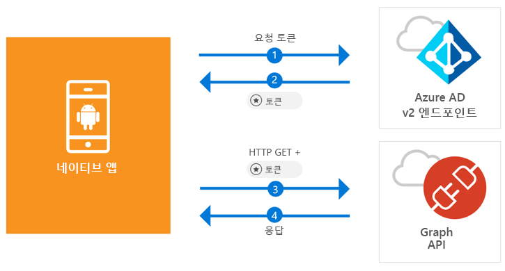

# <a name="quickstart-sign-in-users-and-call-the-microsoft-graph-api-from-an-android-app"></a>빠른 시작: Android 앱에서 사용자 로그인 및 Microsoft Graph API 호출

[!INCLUDE [active-directory-develop-applies-v2-msal](../../../includes/active-directory-develop-applies-v2-msal.md)]

이 빠른 시작에는 Android 애플리케이션이 개인 또는 회사 및 학교 계정에 로그인하고, 액세스 토큰을 가져오고, Microsoft Graph API를 호출할 수 있는 방법을 보여 주는 코드 샘플이 포함되어 있습니다.



> [!NOTE]
> **필수 구성 요소**
> * Android Studio 3 이상
> * Android SDK 21 이상이 필요합니다(SDK 27 권장).

> [!div renderon="docs"]
> ## <a name="register-and-download"></a>등록 및 다운로드
> ### <a name="register-and-configure-your-application-and-code-sample"></a>애플리케이션 및 코드 샘플 등록 및 구성
> #### <a name="step-1-register-your-application"></a>1단계: 애플리케이션 등록
> 애플리케이션을 등록하고 애플리케이션 등록 정보를 솔루션에 추가하려면 다음을 수행합니다.
> 1. [Microsoft 응용 프로그램 등록 포털](https://apps.dev.microsoft.com/portal/register-app)로 이동하여 응용 프로그램을 등록합니다.
> 1. **응용 프로그램 이름** 상자에서 응용 프로그램의 이름을 입력합니다.
> 1. **단계별 설치** 확인란의 선택을 취소한 다음 **만들기**를 선택하도록 합니다.
> 1. **플랫폼 추가**를 선택하고, **네이티브 응용 프로그램**을 선택한 다음 **저장**을 선택합니다.

> [!div renderon="portal" class="sxs-lookup"]
> #### <a name="step-1-configure-your-application"></a>1단계: 애플리케이션 구성
> 이 빠른 시작의 코드 샘플이 작동하려면 회신 URL을 **msal{AppId}://auth**로 추가해야 합니다. 여기서 {AppId}는 앱의 애플리케이션 ID입니다.
> > [!div renderon="portal" id="makechanges" class="nextstepaction"]
> > [자동 변경]()
>
> > [!div id="appconfigured" class="alert alert-info"]
> >  이러한 특성을 사용하여 응용 프로그램을 구성합니다.

#### <a name="step-2-download-the-project"></a>2단계: 프로젝트 다운로드

* [Android Studio 프로젝트 다운로드](https://github.com/Azure-Samples/active-directory-android-native-v2/archive/master.zip)

#### <a name="step-3-configure-your-project"></a>3단계: 프로젝트 구성

1. Android Studio에서 프로젝트를 추출하여 엽니다.
1. **앱** > **java** > **<i>{host}.{namespace}</i>** 아래에서 **MainActivity**를 엽니다.
1. `final static String CLIENT_ID`로 시작하는 줄을 다음으로 바꿉니다.

    > [!div renderon="portal" class="sxs-lookup"]
    > ```java
    > final static String CLIENT_ID = "ENTER_THE_APPLICATION_ID_HERE";
    > ```

    > [!div renderon="docs"]
    > ```java
    > final static String CLIENT_ID = "<ENTER_THE_APPLICATION_ID_HERE>";
    > ```

1. 열기: **앱** > **매니페스트** > **AndroidManifest.xml**.
1. 다음 작업을 **manifest\application** 노드에 추가합니다. 이 코드 조각은 OS에서 인증 완료 후 애플리케이션을 다시 시작할 수 있도록 **BrowserTabActivity**를 등록합니다.

    > [!div renderon="docs"]
    > ```xml
    > <!--Intent filter to capture System Browser calling back to our app after Sign In-->
    > <activity
    >     android:name="com.microsoft.identity.client.BrowserTabActivity">
    >     <intent-filter>
    >         <action android:name="android.intent.action.VIEW" />
    >         <category android:name="android.intent.category.DEFAULT" />
    >         <category android:name="android.intent.category.BROWSABLE" />
    > 
    >         <!--Add in your scheme/host from registered redirect URI-->
    >         <!--By default, the scheme should be similar to 'msal[appId]' -->
    >         <data android:scheme="msal<ENTER_THE_APPLICATION_ID_HERE>"
    >             android:host="auth" />
    >     </intent-filter>
    > </activity>
    > ```

    > [!div renderon="portal" class="sxs-lookup"]
    > ```xml
    > <!--Intent filter to capture System Browser calling back to our app after Sign In-->
    > <activity
    >     android:name="com.microsoft.identity.client.BrowserTabActivity">
    >     <intent-filter>
    >         <action android:name="android.intent.action.VIEW" />
    >         <category android:name="android.intent.category.DEFAULT" />
    >         <category android:name="android.intent.category.BROWSABLE" />
    > 
    >         <!--Add in your scheme/host from registered redirect URI-->
    >         <!--By default, the scheme should be similar to 'msal[appId]' -->
    >         <data android:scheme="msalENTER_THE_APPLICATION_ID_HERE"
    >             android:host="auth" />
    >     </intent-filter>
    > </activity>
    > ```

> [!div renderon="docs"]
> <span>6.</span> `<ENTER_THE_APPLICATION_ID_HERE>`를 응용 프로그램에 대한 *응용 프로그램 ID*로 바꿉니다. *응용 프로그램 ID*를 찾아야 하는 경우, *개요* 페이지로 이동하세요.

## <a name="more-information"></a>추가 정보

이 빠른 시작에 대한 자세한 내용은 다음 섹션을 읽어보세요.

### <a name="msal"></a>MSAL

MSAL([com.microsoft.identity.client](https://javadoc.io/doc/com.microsoft.identity.client/msal))은 사용자가 로그인하고 Microsoft Azure AD(Azure Active Directory)에 의해 보호되는 API에 액세스하기 위해 사용하는 토큰을 요청하는 데 사용되는 라이브러리입니다. Gradle을 사용하면 **종속성** 아래의 **Gradle 스크립트** > **build.gradle(모듈: 앱)** 에 다음을 추가하여 설치할 수 있습니다.

```gradle  
implementation 'com.android.volley:volley:1.1.1'
implementation 'com.microsoft.identity.client:msal:0.1.+'
```

### <a name="msal-initialization"></a>MSAL 초기화

다음 코드를 추가하여 MSAL에 대한 참조를 추가할 수 있습니다.

```java
import com.microsoft.identity.client.*;
```

그런 다음, 아래 코드를 사용하여 MSAL을 초기화합니다.

```java
sampleApp = new PublicClientApplication(
        this.getApplicationContext(),
        CLIENT_ID);
```

> |위치: ||
> |---------|---------|
> |`CLIENT_ID` | *portal.azure.com*에 등록된 응용 프로그램의 응용 프로그램 ID |

### <a name="requesting-tokens"></a>토큰 요청

MSAL에는 토큰 획득에 사용되는 두 가지 메서드인 `acquireToken` 및 `acquireTokenSilentAsync`가 있습니다.

#### <a name="getting-a-user-token-interactively"></a>대화형으로 사용자 토큰 가져오기

일부 상황에서는 사용자가 Azure AD v2.0 엔드포인트를 조작해야 하며, 이로 인해 사용자 자격 증명의 유효성을 검사하거나 동의를 얻기 위해 시스템 브라우저로 컨텍스트가 전환됩니다. 일부 사례:

* 처음으로 사용자가 애플리케이션에 로그인한 경우
* 암호가 만료되어 사용자가 자격 증명을 다시 입력해야 할 경우
* 애플리케이션이 사용자 동의가 필요한 리소스에 액세스를 요청하고 있는 경우
* 2단계 인증이 필요한 경우

```java
sampleApp.acquireToken(this, SCOPES, getAuthInteractiveCallback());
```

> |위치:||
> |---------|---------|
> | `SCOPES` | 요청된 범위(즉, Microsoft Graph의 경우 `{ "user.read" }`, 사용자 지정 Web API(즉, `api://<Application ID>/access_as_user`)의 경우 `{ "<Application ID URL>/scope" }`)를 포함합니다. |
> | `getAuthInteractiveCallback` | 인증 후 애플리케이션으로 컨트롤을 다시 줄 때 실행되는 콜백 |

#### <a name="getting-a-user-token-silently"></a>자동으로 사용자 토큰 가져오기

사용자가 리소스에 액세스해야 할 때마다 자격 증명의 유효성을 검사할 필요가 없도록 하려고 합니다. 대부분은 사용자 개입 없이 토큰 획득 및 갱신을 자동으로 처리하려고 합니다. 초기 `acquireToken` 메서드 다음에 `AcquireTokenSilentAsync` 메서드를 사용하여 토큰을 가져오면 보호된 리소스에 액세스할 수 있습니다.

```java
sampleApp.acquireToken(getActivity(), SCOPES, getAuthInteractiveCallback());
```

> |위치:||
> |---------|---------|
> | `SCOPES` | 요청된 범위(즉, Microsoft Graph의 경우 `{ "user.read" }`, 사용자 지정 Web API(즉, `api://<Application ID>/access_as_user`)의 경우 `{ "<Application ID URL>/scope" }`)를 포함합니다. |
> | `getAuthInteractiveCallback` | 인증 후 애플리케이션으로 컨트롤을 다시 줄 때 실행되는 콜백 |

## <a name="next-steps"></a>다음 단계

### <a name="learn-the-steps-to-create-the-application-used-in-this-quickstart"></a>이 빠른 시작에 사용되는 애플리케이션을 만드는 단계 알아보기

이 빠른 시작의 전체 설명을 포함하여 애플리케이션 및 새로운 기능 빌드에 대한 완전한 단계별 가이드를 제공하는 Android 자습서를 사용해 보세요.

> [!div class="nextstepaction"]
> [Graph API Android 자습서 호출](https://docs.microsoft.com/azure/active-directory/develop/guidedsetups/active-directory-android)

### <a name="msal-for-android-library-wiki"></a>Android용 MSAL 라이브러리 wiki

Android용 MSAL 라이브러리에 대한 자세한 정보를 읽어보세요.

> [!div class="nextstepaction"]
> [Android용 MSAL 라이브러리 wiki](https://github.com/AzureAD/microsoft-authentication-library-for-android/wiki)

[!INCLUDE [Help and support](../../../includes/active-directory-develop-help-support-include.md)]