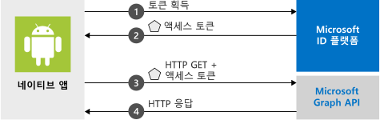

# <a name="quickstart-sign-in-users-and-call-the-microsoft-graph-api-from-an-android-app"></a>빠른 시작: Android 앱에서 사용자 로그인 및 Microsoft Graph API 호출

[!INCLUDE [active-directory-develop-applies-v2-msal](../../../includes/active-directory-develop-applies-v2-msal.md)]

이 빠른 시작에는 Android 애플리케이션이 개인 또는 회사 및 학교 계정에 로그인하고, 액세스 토큰을 가져오고, Microsoft Graph API를 호출할 수 있는 방법을 보여 주는 코드 샘플이 포함되어 있습니다.



> [!NOTE]
> **필수 구성 요소**
> * Android Studio 
> * Android 16 이상이 필요합니다. 


> [!div renderon="docs"]
> ## <a name="register-and-download-your-quickstart-app"></a>빠른 시작 앱 등록 및 다운로드
> 빠른 시작 애플리케이션을 시작하는 옵션은 두 가지가 있습니다.
> * [기본] [옵션 1: 앱을 등록하고 자동 구성한 다음, 코드 샘플 다운로드](#option-1-register-and-auto-configure-your-app-and-then-download-your-code-sample)
> * [수동] [옵션 2: 애플리케이션 및 코드 샘플을 등록하고 수동으로 구성](#option-2-register-and-manually-configure-your-application-and-code-sample)
>
> ### <a name="option-1-register-and-auto-configure-your-app-and-then-download-your-code-sample"></a>옵션 1: 앱을 등록하고 자동 구성한 다음, 코드 샘플 다운로드
> #### <a name="step-1-register-your-application"></a>1단계: 애플리케이션 등록
> 앱을 등록하려면
> 1. 새 [Azure Portal - 앱 등록](https://portal.azure.com/#blade/Microsoft_AAD_RegisteredApps/applicationsListBlade/quickStartType/AndroidQuickstartPage/sourceType/docs) 창으로 이동합니다.
> 1. 애플리케이션 이름을 입력하고 **등록**을 선택합니다.
> 1. 지침에 따라 클릭 한 번으로 새 애플리케이션을 다운로드하고 자동으로 구성합니다.
>
> ### <a name="option-2-register-and-manually-configure-your-application-and-code-sample"></a>옵션 2: 애플리케이션 및 코드 샘플을 등록하고 수동으로 구성
>
> #### <a name="step-1-register-your-application"></a>1단계: 애플리케이션 등록
> 애플리케이션을 등록하고 앱의 등록 정보를 솔루션에 수동으로 추가하려면 다음 단계를 따르세요.
>
> 1. 개발자용 Microsoft ID 플랫폼 [앱 등록](https://aka.ms/MobileAppReg) 페이지로 이동합니다.
> 1. **새 등록**을 선택합니다.
> 1. **애플리케이션 등록** 페이지가 표시되면 애플리케이션의 등록 정보를 입력합니다.
>      - **이름** 섹션에서 앱의 사용자에게 표시되는 의미 있는 애플리케이션 이름(예: `AndroidQuickstart`)을 입력합니다.
>      - 이 페이지에서 다른 구성을 건너뛸 수 있습니다. 
>      - `Register` 단추를 누릅니다.
> 1. 새 앱을 클릭 > `Authentication` > `Add Platform` > `Android`로 이동합니다.    
>      - Android Studio 프로젝트에서 패키지 이름을 입력합니다. 
>      - 서명 해시를 생성합니다. 지침에 대한 포털을 참조하세요.
> 1. 나중에 사용할 수 있도록 `Configure`를 선택하고 ***MSAL 구성*** JSON을 저장합니다. 

> [!div renderon="portal" class="sxs-lookup"]
> #### <a name="step-1-configure-your-application"></a>1단계: 애플리케이션 구성
> 이 빠른 시작의 코드 샘플이 작동하려면 인증 broker와 호환되는 리디렉션 URI를 추가해야 합니다. 
> > [!div renderon="portal" id="makechanges" class="nextstepaction"]
> > [자동 변경]()
>
> > [!div id="appconfigured" class="alert alert-info"]
> >  이러한 특성을 사용하여 애플리케이션을 구성합니다.

#### <a name="step-2-download-the-project"></a>2단계: 프로젝트를 다운로드합니다.

* [샘플 코드 다운로드](https://github.com/Azure-Samples/active-directory-android-native-v2/archive/master.zip)

#### <a name="step-3-configure-your-project"></a>3단계: 프로젝트 구성

> [!div renderon="docs"]
> 위의 옵션 1을 선택한 경우 이러한 단계를 건너뛸 수 있습니다. 

> [!div renderon="portal" class="sxs-lookup"]
> 1. Android Studio에서 프로젝트를 추출하여 엽니다.
> 1. **app** > **src** > **main** > **res** > **raw** 내에서 **auth_config.json**을 엽니다.
> 1. **auth_config.json**을 편집하고 Azure Portal에서 JSON으로 바꿉니다. 대신 수동으로 변경하려는 경우:
>    ```javascript
>    {
>       "client_id" : "Enter_the_Application_Id_Here",
>       "authorization_user_agent" : "DEFAULT",
>       "redirect_uri" : "Enter_the_Redirect_Uri_Here",
>       "authorities" : [
>          {
>             "type": "AAD",
>             "audience": {
>                "type": "Enter_the_Audience_Info_Here",
>                "tenant_id": "Enter_the_Tenant_Info_Here"
>             }
>          }
>       ]
>    }
> 1. Inside **app** > **manifests**, open  **AndroidManifest.xml**.
> 1. Paste the following activity to the **manifest\application** node: 
>    ```xml
>    <!--Intent filter to catch Microsoft's callback after Sign In-->
>    <activity
>        android:name="com.microsoft.identity.client.BrowserTabActivity">
>        <intent-filter>
>            <action android:name="android.intent.action.VIEW" />
>            <category android:name="android.intent.category.DEFAULT" />
>            <category android:name="android.intent.category.BROWSABLE" />
>            <data android:scheme="msauth"
>                android:host="Enter_the_Package_Name"
>                android:path="/Enter_the_Signature_Hash" />
>        </intent-filter>
>    </activity>
>    ```
> > 1. 앱을 실행하세요! 

> [!div renderon="docs"]
> 1. Android Studio에서 프로젝트를 추출하여 엽니다.
> 1. **app** > **res** > **raw** 내에서 **auth_config.json**을 엽니다.
> 1. **auth_config.json**을 편집하고 Azure Portal에서 JSON으로 바꿉니다. 대신 이러한 변경 내용을 수동으로 수행하려는 경우:
>    ```javascript
>    "client_id" : "ENTER_YOUR_APPLICATION_ID",
>    "redirect_uri": "ENTER_YOUR_REDIRECT_URI", 
>     ```
> 1. **app** > **manifests** 내에서 **AndroidManifest.xml**을 엽니다.
> 1. 다음 작업을 **manifest\application** 노드에 추가합니다. 이 코드 조각은 OS에서 인증 완료 후 애플리케이션을 다시 시작할 수 있도록 **BrowserTabActivity**를 등록합니다.
>    ```xml
>    <!--Intent filter to catch Microsoft's callback after Sign In-->
>    <activity
>        android:name="com.microsoft.identity.client.BrowserTabActivity">
>        <intent-filter>
>            <action android:name="android.intent.action.VIEW" />
>            <category android:name="android.intent.category.DEFAULT" />
>            <category android:name="android.intent.category.BROWSABLE" />
>            <data android:scheme="msauth"
>                android:host="Enter_the_Package_Name"
>                android:path="/Enter_the_Decoded_Signature_Hash" />
>        </intent-filter>
>    </activity>
>    ```
> 1. `Enter_the_Package_Name` 및 `Enter_the_Signature_Hash`를 Azure Portal에 등록한 값으로 바꿉니다. 
> 1. 앱을 실행하세요! 

## <a name="more-information"></a>추가 정보

이 빠른 시작에 대한 자세한 내용은 다음 섹션을 읽어보세요.

### <a name="getting-msal"></a>MSAL 가져오기

MSAL([com.microsoft.identity.client](https://javadoc.io/doc/com.microsoft.identity.client/msal))은 사용자를 로그인하고 Microsoft ID 플랫폼으로 보호되는 API 액세스에 사용되는 토큰을 요청할 때 사용되는 라이브러리입니다. Gradle 3.0+를 사용하면 **종속성** 아래의 **Gradle 스크립트** > **build.gradle(모듈: 앱)** 에 다음을 추가하여 설치할 수 있습니다.

```gradle  
implementation 'com.android.volley:volley:1.1.1'
implementation 'com.microsoft.identity.client:msal:0.3.+'
```

### <a name="msal-initialization"></a>MSAL 초기화

다음 코드를 추가하여 MSAL에 대한 참조를 추가할 수 있습니다.

```java
import com.microsoft.identity.client.*;
```

그런 다음, 아래 코드를 사용하여 MSAL을 초기화합니다.

```java
    sampleApp = new PublicClientApplication(
        this.getApplicationContext(),
        R.raw.auth_config);
```

> |위치: ||
> |---------|---------|
> |`R.raw.auth_config` | 이 파일에는 앱/클라이언트 ID, 로그인 대상 그룹, 리디렉션 URI 및 여러 다른 사용자 지정 옵션을 포함한 애플리케이션의 구성이 포함됩니다. |

### <a name="requesting-tokens"></a>토큰 요청

MSAL에는 토큰 획득에 사용되는 두 가지 메서드인 `acquireToken` 및 `acquireTokenSilentAsync`가 있습니다.

#### <a name="acquiretoken-getting-a-token-interactively"></a>acquireToken: 대화형으로 토큰 가져오기

상황에 따라 사용자가 Microsoft ID 플랫폼과 상호 작용해야 합니다. 이러한 경우 최종 사용자는 해당 계정을 선택하거나, 해당 자격 증명을 입력하거나, 앱이 요청한 사용 권한에 동의해야 할 수 있습니다. 예를 들면 다음과 같습니다. 

* 처음으로 사용자가 애플리케이션에 로그인한 경우
* 사용자가 암호를 다시 설정하는 경우 자격 증명을 입력해야 합니다. 
* 동의가 해지된 경우 
* 앱에 동의가 명시적으로 필요한 경우 
* 애플리케이션이 처음으로 리소스에 대한 액세스를 요청하는 경우
* MFA 또는 기타 조건부 액세스 정책이 필요한 경우

```java
sampleApp.acquireToken(this, SCOPES, getAuthInteractiveCallback());
```

> |위치:||
> |---------|---------|
> | `SCOPES` | 요청된 범위(즉, Microsoft Graph의 경우 `{ "user.read" }`, 사용자 지정 Web API(즉, `api://<Application ID>/access_as_user`)의 경우 `{ "<Application ID URL>/scope" }`)를 포함합니다. |
> | `getAuthInteractiveCallback` | 인증 후 애플리케이션으로 컨트롤을 다시 줄 때 실행되는 콜백 |

#### <a name="acquiretokensilent-getting-a-user-token-silently"></a>acquireTokenSilent: 자동으로 사용자 토큰 가져오기

앱은 사용자가 토큰을 요청할 때마다 로그인하도록 요구해서는 안됩니다. 사용자가 이미 로그인한 경우 다음 메서드를 사용하면 앱에서 토큰을 자동으로 요청할 수 있습니다.

```java
    sampleApp.getAccounts(new PublicClientApplication.AccountsLoadedCallback() {
        @Override
        public void onAccountsLoaded(final List<IAccount> accounts) {

            if (!accounts.isEmpty()) {
                sampleApp.acquireTokenSilentAsync(SCOPES, accounts.get(0), getAuthSilentCallback());
            } else {
                /* No accounts */
            }
        }
    });
```

> |위치:||
> |---------|---------|
> | `SCOPES` | 요청된 범위(즉, Microsoft Graph의 경우 `{ "user.read" }`, 사용자 지정 Web API(즉, `api://<Application ID>/access_as_user`)의 경우 `{ "<Application ID URL>/scope" }`)를 포함합니다. |
> | `getAccounts(...)` | 자동으로 토큰을 가져오려는 계정이 포함됩니다. |
> | `getAuthSilentCallback()` | 인증 후 애플리케이션으로 컨트롤을 다시 줄 때 실행되는 콜백 |

## <a name="next-steps"></a>다음 단계

### <a name="learn-the-steps-to-create-the-application-used-in-this-quickstart"></a>이 빠른 시작에 사용되는 애플리케이션을 만드는 단계 알아보기

이 빠른 시작의 전체 설명을 포함하여 애플리케이션 및 새로운 기능 빌드에 대한 완전한 단계별 가이드를 제공하는 Android 자습서를 사용해 보세요.

> [!div class="nextstepaction"]
> [Graph API Android 자습서 호출](https://docs.microsoft.com/azure/active-directory/develop/guidedsetups/active-directory-android)

### <a name="msal-for-android-library-wiki"></a>Android용 MSAL 라이브러리 wiki

Android용 MSAL 라이브러리에 대한 자세한 정보를 읽어보세요.

> [!div class="nextstepaction"]
> [Android용 MSAL 라이브러리 wiki](https://github.com/AzureAD/microsoft-authentication-library-for-android/wiki)

[!INCLUDE [Help and support](../../../includes/active-directory-develop-help-support-include.md)]
