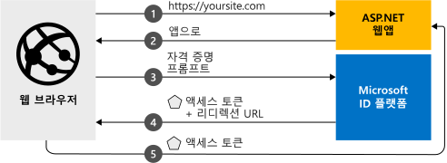

# <a name="quickstart-add-sign-in-with-microsoft-to-an-aspnet-web-app"></a>빠른 시작: ASP.NET 웹앱에 Microsoft에 로그인 추가

[!INCLUDE [active-directory-develop-applies-v2](../../../includes/active-directory-develop-applies-v2.md)]

이 빠른 시작에서는 ASP.NET 웹 앱이 모든 Azure Active Directory(Azure AD) 인스턴스에서 개인 계정(hotmail.com, outlook.com, 기타)과 회사 및 학교 계정에 로그인하는 방법을 배웁니다.



> [!div renderon="docs"]
> ## <a name="register-and-download-your-quickstart-app"></a>빠른 시작 앱 등록 및 다운로드
> 빠른 시작 애플리케이션을 시작하는 옵션은 두 가지가 있습니다.
> * [기본] [옵션 1: 앱을 등록하고 자동 구성한 다음, 코드 샘플 다운로드](#option-1-register-and-auto-configure-your-app-and-then-download-your-code-sample)
> * [수동] [옵션 2: 애플리케이션 및 코드 샘플을 등록하고 수동으로 구성](#option-2-register-and-manually-configure-your-application-and-code-sample)
>
> ### <a name="option-1-register-and-auto-configure-your-app-and-then-download-your-code-sample"></a>옵션 1: 앱을 등록하고 자동 구성한 다음, 코드 샘플 다운로드
>
> 1. 새 [Azure Portal - 앱 등록](https://portal.azure.com/#blade/Microsoft_AAD_RegisteredApps/applicationsListBlade/quickStartType/AspNetWebAppQuickstartPage/sourceType/docs) 창으로 이동합니다.
> 1. 애플리케이션 이름을 입력하고 **등록**을 클릭합니다.
> 1. 지침에 따라 클릭 한 번으로 새 애플리케이션을 다운로드하고 자동으로 구성합니다.
>
> ### <a name="option-2-register-and-manually-configure-your-application-and-code-sample"></a>옵션 2: 애플리케이션 및 코드 샘플을 등록하고 수동으로 구성
>
> #### <a name="step-1-register-your-application"></a>1단계: 애플리케이션 등록
> 애플리케이션을 등록하고 앱의 등록 정보를 솔루션에 수동으로 추가하려면 다음 단계를 따르세요.
>
> 1. [Azure Portal](https://portal.azure.com)에 회사 또는 학교 계정, 개인 Microsoft 계정으로 로그인합니다.
> 1. 계정이 둘 이상의 테넌트에 대해 액세스를 제공하는 경우 오른쪽 위 모서리에 있는 계정을 선택하여 원하는 Azure AD 테넌트로 포털 세션을 설정합니다.
> 1. 개발자용 Microsoft ID 플랫폼 [앱 등록](https://go.microsoft.com/fwlink/?linkid=2083908) 페이지로 이동합니다.
> 1. **새 등록**을 선택합니다.
> 1. **애플리케이션 등록** 페이지가 표시되면 애플리케이션의 등록 정보를 입력합니다.
>      - **이름** 섹션에서 앱의 사용자에게 표시되는 의미 있는 애플리케이션 이름(예: `ASPNET-Quickstart`)을 입력합니다.
>      - **리디렉션 URI**에 `https://localhost:44368/`을 추가하고 **등록**을 클릭합니다.
**인증** 메뉴를 선택하고 **암시적 허용** 아래에서 **ID 토큰**을 설정한 후 **저장을 선택합니다**.

> [!div class="sxs-lookup" renderon="portal"]
> #### <a name="step-1-configure-your-application-in-azure-portal"></a>1단계: Azure Portal에서 애플리케이션 구성
> 이 빠른 시작용 코드 샘플이 작동하려면 회신 URL을 `https://localhost:44368/`으로 추가해야 합니다.
> > [!div renderon="portal" id="makechanges" class="nextstepaction"]
> > [자동 변경]()
>
> > [!div id="appconfigured" class="alert alert-info"]
> >  이 특성을 사용하여 애플리케이션을 구성합니다.

#### <a name="step-2-download-your-project"></a>2단계: 프로젝트 다운로드

[Visual Studio 2017 솔루션 다운로드](https://github.com/AzureADQuickStarts/AppModelv2-WebApp-OpenIDConnect-DotNet/archive/master.zip)

#### <a name="step-3-configure-your-visual-studio-project"></a>3단계: Visual Studio 프로젝트 구성

1. Zip 파일을 루트 폴더에 가까운 로컬 폴더(예: **C:\Azure-Samples**)로 추출합니다.
1. Visual Studio(AppModelv2-WebApp-OpenIDConnect-DotNet.sln)에서 솔루션 열기
1. Visual Studio 버전에 따라 프로젝트 `AppModelv2-WebApp-OpenIDConnect-DotNet` 및 **NuGet 패키지 복원**을 마우스 오른쪽 단추로 클릭해야 할 수 있습니다.
1. **Web.config**를 편집하고 매개 변수 `ClientId` 및 `Tenant`를 다음으로 바꿉니다.

    ```xml
    <add key="ClientId" value="Enter_the_Application_Id_here" />
    <add key="Tenant" value="Enter_the_Tenant_Info_Here" />
    ```

> [!div renderon="docs"]
> 위치:
> - `Enter_the_Application_Id_here` - 등록한 애플리케이션의 애플리케이션 ID입니다.
> - `Enter_the_Tenant_Info_Here` - 아래 옵션 중 하나입니다.
>   - 애플리케이션이 **내 조직만** 지원하는 경우 이 값을 **테넌트 ID** 또는 **테넌트 이름**(예: contoso.microsoft.com)으로 바꿉니다.
>   - 애플리케이션이 **모든 조직 디렉터리의 계정**을 지원하는 경우 이 값을 `organizations`로 바꾸세요.
>   - 애플리케이션이 **모든 Microsoft 계정 사용자**를 지원하는 경우 이 값을 `common`으로 바꾸세요.
>
> > [!TIP]
> > *애플리케이션 ID*, *디렉터리(테넌트) ID* 및 *지원되는 계정 유형*의 값을 찾아보려면 **개요** 페이지로 이동합니다.

## <a name="more-information"></a>자세한 정보

이 섹션에서는 로그인 사용자에 필요한 코드에 대한 개요를 제공합니다. 이는 작동 방식과 기본 인수를 이해하고 기존 ASP.NET 애플리케이션에 로그인을 추가하려는 경우에도 유용합니다.

### <a name="owin-middleware-nuget-packages"></a>OWIN 미들웨어 NuGet 패키지

OWIN 미들웨어 패키지로 ASP.NET의 OpenID Connect를 사용하는 쿠키 기반 인증을 가지고 인증 파이프라인을 설정할 수 있습니다. Visual Studio의 **패키지 관리자 콘솔**에서 다음 명령을 실행하여 이 패키지를 설치할 수 있습니다.

```powershell
Install-Package Microsoft.Owin.Security.OpenIdConnect
Install-Package Microsoft.Owin.Security.Cookies
Install-Package Microsoft.Owin.Host.SystemWeb  
```

### <a name="owin-startup-class"></a>OWIN 시작 클래스

OWIN 미들웨어는 호스팅 프로세스를 초기화하는 경우 실행되는 *시작 클래스*(빠른 시작의 경우, 루트 폴더의 *startup.cs* 파일)를 사용합니다. 다음 코드는 빠른 시작에서 사용하는 매개 변수를 보여줍니다.

```csharp
public void Configuration(IAppBuilder app)
{
    app.SetDefaultSignInAsAuthenticationType(CookieAuthenticationDefaults.AuthenticationType);

    app.UseCookieAuthentication(new CookieAuthenticationOptions());
    app.UseOpenIdConnectAuthentication(
        new OpenIdConnectAuthenticationOptions
        {
            // Sets the ClientId, authority, RedirectUri as obtained from web.config
            ClientId = clientId,
            Authority = authority,
            RedirectUri = redirectUri,
            // PostLogoutRedirectUri is the page that users will be redirected to after sign-out. In this case, it is using the home page
            PostLogoutRedirectUri = redirectUri,
            Scope = OpenIdConnectScope.OpenIdProfile,
            // ResponseType is set to request the id_token - which contains basic information about the signed-in user
            ResponseType = OpenIdConnectResponseType.IdToken,
            // ValidateIssuer set to false to allow personal and work accounts from any organization to sign in to your application
            // To only allow users from a single organizations, set ValidateIssuer to true and 'tenant' setting in web.config to the tenant name
            // To allow users from only a list of specific organizations, set ValidateIssuer to true and use ValidIssuers parameter
            TokenValidationParameters = new TokenValidationParameters()
            {
                ValidateIssuer = false // Simplification (see note below)
            },
            // OpenIdConnectAuthenticationNotifications configures OWIN to send notification of failed authentications to OnAuthenticationFailed method
            Notifications = new OpenIdConnectAuthenticationNotifications
            {
                AuthenticationFailed = OnAuthenticationFailed
            }
        }
    );
}
```

> |Where  |  |
> |---------|---------|
> | `ClientId`     | Azure Portal에 등록된 애플리케이션의 애플리케이션 ID |
> | `Authority`    | 사용자가 인증하는 STS 엔드포인트 일반적으로 공용 클라우드의 경우 <https://login.microsoftonline.com/{tenant}/v2.0>입니다. 여기서 {tenant}는 테넌트 이름, 테넌트 ID, 또는 공통 엔드포인트(다중 테넌트 애플리케이션에 사용)에 대한 참조인 경우 *common*입니다. |
> | `RedirectUri`  | Microsoft ID 플랫폼 엔드포인트에 인증한 후 사용자가 전송되는 URL |
> | `PostLogoutRedirectUri`     | 서명 해제 후 사용자가 전송되는 URL |
> | `Scope`     | 요청되는 범위 목록이며 공백으로 구분 |
> | `ResponseType`     | 인증에서의 응답이 ID 토큰을 포함하는 요청 |
> | `TokenValidationParameters`     | 토큰 유효성 검사에 대한 매개 변수 목록. 이 경우, `ValidateIssuer`는 `false`로 설정되어 모든 개인이나 회사 또는 학교 계정 형식에서 로그인을 사용할 수 있음을 나타냄 |
> | `Notifications`     | 여러 *OpenIdConnect* 메시지에서 실행할 수 있는 대리자 목록 |


> [!NOTE]
> 이 빠른 시작을 간단하게 수행할 수 있도록 `ValidateIssuer = false`로 설정했습니다. 실제 애플리케이션에서는 발급자의 유효성을 검사해야 합니다.
> 자세한 방법은 샘플을 참조하세요.

### <a name="initiate-an-authentication-challenge"></a>인증 질문 시작

컨트롤러에서 다른 사용자에게 인증 질문을 요청하여 로그인하게 할 수 있습니다.

```csharp
public void SignIn()
{
    if (!Request.IsAuthenticated)
    {
        HttpContext.GetOwinContext().Authentication.Challenge(
            new AuthenticationProperties{ RedirectUri = "/" },
            OpenIdConnectAuthenticationDefaults.AuthenticationType);
    }
}
```

> [!TIP]
> 위의 메서드를 사용하여 인증 질문을 요청하는 것은 선택 사항이며 일반적으로 보기에서 인증되거나 인증되지 않은 모든 사용자가 액세스할 수 있도록 하려는 경우 사용됩니다. 또는 다음 섹션에 설명된 메서드를 사용하여 컨트롤러를 보호할 수 있습니다.

### <a name="protect-a-controller-or-a-controllers-method"></a>컨트롤러 또는 컨트롤러 메서드 보호하기

`[Authorize]` 특성을 사용하여 컨트롤러나 컨트롤러 작업을 보호할 수 있습니다. 이 특성은 컨트롤러나 작업에 액세스를 제한하여, *인증되지 않은* 사용자가 `[Authorize]` 특성으로 데코레이팅된 작업이나 컨트롤러 중 하나에 액세스하려고 할 때 인증 질문이 자동으로 발생하여, 인증된 사용자만 컨트롤러의 작업에 액세스하게 합니다.

## <a name="next-steps"></a>다음 단계

이 빠른 시작의 전체 설명이 포함된 애플리케이션 및 새로운 기능 구축의 완전한 단계별 가이드를 위한 ASP.NET 자습서를 사용해 보세요.

### <a name="learn-the-steps-to-create-the-application-used-in-this-quickstart"></a>이 빠른 시작에 사용되는 애플리케이션을 만드는 단계 알아보기

> [!div class="nextstepaction"]
> [로그인 자습서](./tutorial-v2-asp-webapp.md)

[!INCLUDE [Help and support](../../../includes/active-directory-develop-help-support-include.md)]
