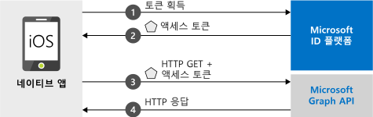

# <a name="quickstart-sign-in-users-and-call-the-microsoft-graph-api-from-an-ios-app"></a>빠른 시작: iOS 앱에서 사용자 로그인 및 Microsoft Graph API 호출

[!INCLUDE [active-directory-develop-applies-v2-msal](../../../includes/active-directory-develop-applies-v2-msal.md)]

이 빠른 시작에는 네이티브 iOS 애플리케이션이 개인, 회사 및 학교 계정에 로그인하고, 액세스 토큰을 가져오고, Microsoft Graph API를 호출할 수 있는 방법을 보여 주는 코드 샘플이 포함되어 있습니다.



> [!NOTE]
> **필수 구성 요소**
> * XCode 10 이상
> * iOS 10 이상 

> [!div renderon="docs"]
> ## <a name="register-and-download-your-quickstart-app"></a>빠른 시작 앱 등록 및 다운로드
> 빠른 시작 애플리케이션을 시작하는 옵션은 두 가지가 있습니다.
> * [기본] [옵션 1: 앱을 등록하고 자동 구성한 다음, 코드 샘플 다운로드](#option-1-register-and-auto-configure-your-app-and-then-download-your-code-sample)
> * [수동] [옵션 2: 애플리케이션 및 코드 샘플을 등록하고 수동으로 구성](#option-2-register-and-manually-configure-your-application-and-code-sample)
>
> ### <a name="option-1-register-and-auto-configure-your-app-and-then-download-your-code-sample"></a>옵션 1: 앱을 등록하고 자동 구성한 다음, 코드 샘플 다운로드
> #### <a name="step-1-register-your-application"></a>1단계: 애플리케이션 등록
> 앱을 등록하려면
> 1. 새 [Azure Portal - 앱 등록](https://portal.azure.com/#blade/Microsoft_AAD_RegisteredApps/applicationsListBlade/quickStartType/IosQuickstartPage/sourceType/docs) 창으로 이동합니다.
> 1. 애플리케이션 이름을 입력하고 **등록**을 선택합니다.
> 1. 지침에 따라 클릭 한 번으로 새 애플리케이션을 다운로드하고 자동으로 구성합니다.
>
> ### <a name="option-2-register-and-manually-configure-your-application-and-code-sample"></a>옵션 2: 애플리케이션 및 코드 샘플을 등록하고 수동으로 구성
>
> #### <a name="step-1-register-your-application"></a>1단계: 애플리케이션 등록
> 애플리케이션을 등록하고 앱의 등록 정보를 솔루션에 수동으로 추가하려면 다음 단계를 따르세요.
>
> 1. 개발자용 Microsoft ID 플랫폼 [앱 등록](https://aka.ms/MobileAppReg) 페이지로 이동합니다.
> 1. **새 등록**을 선택합니다.
> 1. **애플리케이션 등록** 페이지가 표시되면 애플리케이션의 등록 정보를 입력합니다.
>      - **이름** 섹션에서 앱에 로그인하거나 동의할 때 앱 사용자에게 표시할 의미 있는 애플리케이션 이름(예: `iOSQuickstart`)을 입력합니다.
>      - 이 페이지의 다른 구성은 건너뜁니다. 
>      - `Register` 단추를 누릅니다.
> 1. 새 앱을 클릭하고, `Authentication` > `Add Platform` > `iOS`로 차례로 이동합니다.    
>      - 애플리케이션에 대한 ***번들 식별자***를 입력합니다. 
> 1. 나중에 사용할 수 있도록 `Configure`를 선택하고 ***MSAL 구성*** 세부 정보를 저장합니다. 

> [!div renderon="portal" class="sxs-lookup"]
>
> #### <a name="step-1-configure-your-application"></a>1단계: 애플리케이션 구성
> 이 빠른 시작의 코드 샘플이 작동하려면 인증 broker와 호환되는 리디렉션 URI를 추가해야 합니다. 
> > [!div renderon="portal" id="makechanges" class="nextstepaction"]
> > [자동 변경]()
>
> > [!div id="appconfigured" class="alert alert-info"]
> >  이러한 특성을 사용하여 애플리케이션을 구성합니다.

#### <a name="step-2-download-your-web-server-or-project"></a>2단계: 웹 서버 또는 프로젝트 다운로드

- [코드 샘플 다운로드](https://github.com/Azure-Samples/active-directory-ios-swift-native-v2/archive/master.zip)

#### <a name="step-3-configure-your-project"></a>3단계: 프로젝트 구성

> [!div renderon="docs"]
> 위의 옵션 1을 선택한 경우 이러한 단계를 건너뛸 수 있습니다. 

> [!div renderon="portal" class="sxs-lookup"]
> 1. Zip 파일을 추출하고 XCode에서 프로젝트를 엽니다.
> 1. **ViewController.swift**를 편집하고 ‘let kClientID’로 시작하는 줄을 다음 코드 조각으로 바꿉니다.
>    ```swift
>    let kClientID = "Enter_the_Application_Id_here"
>    let kAuthority = "https://login.microsoftonline.com/Enter_the_Tenant_Info_Here"
>
>    ```
> 1. 마우스 오른쪽 단추로 **Info.plist**를 클릭하고, **파일 열기 형식** > **소스 코드**를 차례로 선택합니다.
> 1. dict 루트 노드 아래에서 ***번들 ID***로 바꿉니다.
>
>    ```xml
>    <key>CFBundleURLTypes</key>
>    <array>
>       <dict>
>          <key>CFBundleURLSchemes</key>
>          <array>
>             <string>msauth.Enter_the_Bundle_Id_Here</string>
>          </array>
>       </dict>
>    </array>
> 
>    ```
> 1. 앱을 빌드하고 실행합니다! 

> [!div renderon="docs"]
>
> 1. Zip 파일을 추출하고 XCode에서 프로젝트를 엽니다.
> 1. **ViewController.swift**를 편집하고, 'let kClientID'로 시작하는 줄을 다음 코드 조각으로 바꿉니다.
>
>    ```swift
>    let kClientID = "<ENTER_YOUR_APPLICATION/CLIENT_ID>"
> 
>    ```
> 1. 마우스 오른쪽 단추로 **Info.plist**를 클릭하고, **파일 열기 형식** > **소스 코드**를 차례로 선택합니다.
> 1. dict 루트 노드 아래에서 ***번들 ID***로 바꿉니다.
>
>    ```xml
>    <key>CFBundleURLTypes</key>
>    <array>
>       <dict>
>          <key>CFBundleURLSchemes</key>
>          <array>
>             <string>msauth.<ENTER_YOUR_BUNDLE_ID></string>
>          </array>
>       </dict>
>    </array>
>
>    ```
> 1. 앱을 빌드하고 실행합니다! 

## <a name="more-information"></a>추가 정보

이 빠른 시작에 대한 자세한 내용은 다음 섹션을 참조하세요.

### <a name="getting-msal"></a>MSAL 가져오기

MSAL([MSAL.framework](https://github.com/AzureAD/microsoft-authentication-library-for-objc))은 사용자를 로그인하고 Microsoft ID 플랫폼에서 보호되는 API 액세스에 사용되는 토큰을 요청하는 데 사용되는 라이브러리입니다. 다음 프로세스를 사용하여 애플리케이션에 MSAL을 추가할 수 있습니다.

```
$ vi Podfile

```
다음을 이 podfile에 추가합니다(프로젝트의 대상 포함).

```
use_frameworks!

target 'MSALiOS' do
   pod 'MSAL', '~> 0.4.0'
end

```

### <a name="msal-initialization"></a>MSAL 초기화

다음 코드를 추가하여 MSAL에 대한 참조를 추가할 수 있습니다.

```swift
import MSAL
```

그런 다음, 아래 코드를 사용하여 MSAL을 초기화합니다.

```swift
let authority = try MSALAADAuthority(url: URL(string: kAuthority)!)
            
let msalConfiguration = MSALPublicClientApplicationConfig(clientId: kClientID, redirectUri: nil, authority: authority)
self.applicationContext = try MSALPublicClientApplication(configuration: msalConfiguration)

```

> |위치: ||
> |---------|---------|
> | `clientId` | *portal.azure.com*에 등록된 애플리케이션의 애플리케이션 ID |
> | `authority` | Microsoft ID 플랫폼 엔드포인트. 대부분의 경우 *https<span/>://login.microsoftonline.com/common*입니다. |
> | `redirectUri` | 애플리케이션의 리디렉션 URI입니다. 'nil'을 전달하여 기본값을 사용하거나 사용자 지정 리디렉션 URI를 사용할 수 있습니다. |

### <a name="additional-app-requirements"></a>추가 앱 요구 사항  

앱의 `AppDelegate`에도 다음이 있어야 합니다. 이렇게 하면 인증을 수행할 때 MSAL SDK에서 인증 broker 앱의 토큰 응답을 처리할 수 있습니다.

 ```swift
 func application(_ app: UIApplication, open url: URL, options: [UIApplication.OpenURLOptionsKey : Any] = [:]) -> Bool {
         guard let sourceApplication = options[UIApplication.OpenURLOptionsKey.sourceApplication] as? String else {
             return false
         }
         
         return MSALPublicClientApplication.handleMSALResponse(url, sourceApplication: sourceApplication)
     }

```

마지막으로 앱의 ***Info.plist***에 `CFBundleURLTypes`와 함께 `LSApplicationQueriesSchemes` 항목이 있어야 합니다. 샘플에는 이 항목이 포함되어 있습니다. 

   ```xml 
   <key>LSApplicationQueriesSchemes</key>
   <array>
      <string>msauth</string>
      <string>msauthv2</string>
   </array>
   ```

### <a name="sign-in-users--request-tokens"></a>사용자 로그인 및 토큰 요청

MSAL에는 토큰 가져오기에 사용되는 두 가지 메서드인 `acquireToken` 및 `acquireTokenSilent`가 있습니다.

#### <a name="acquiretoken-getting-a-token-interactively"></a>acquireToken: 대화형으로 토큰 가져오기

상황에 따라 사용자가 Microsoft ID 플랫폼과 상호 작용해야 합니다. 이러한 경우 최종 사용자는 해당 계정을 선택하거나, 해당 자격 증명을 입력하거나, 앱의 권한에 동의해야 할 수 있습니다. 예를 들면 다음과 같습니다. 

* 처음으로 사용자가 애플리케이션에 로그인한 경우
* 사용자가 자신의 암호를 다시 설정하는 경우 해당 자격 증명을 입력해야 합니다. 
* 애플리케이션에서 처음으로 리소스에 대한 액세스를 요청하는 경우
* MFA 또는 기타 조건부 액세스 정책이 필요한 경우

```swift
let parameters = MSALInteractiveTokenParameters(scopes: kScopes)
applicationContext.acquireToken(with: parameters) { (result, error) in /* Add your handling logic */}
```

> |위치:||
> |---------|---------|
> | `scopes` | 요청된 범위(즉 Microsoft Graph의 경우 `[ "user.read" ]`, 사용자 지정 Web API(`api://<Application ID>/access_as_user`)의 경우 `[ "<Application ID URL>/scope" ]`)가 포함됩니다. |

#### <a name="acquiretokensilent-getting-an-access-token-silently"></a>acquireTokenSilent: 자동으로 액세스 토큰 가져오기

사용자가 토큰을 요청할 때마다 앱에서 사용자가 로그인하도록 요구하지 않아야 합니다. 사용자가 이미 로그인한 경우 다음 메서드를 사용하면 앱에서 토큰을 자동으로 요청할 수 있습니다. 

```swift
let parameters = MSALSilentTokenParameters(scopes: kScopes, account: applicationContext.allAccounts().first)
applicationContext.acquireTokenSilent(with: parameters) { (result, error) in /* Add your handling logic */}
```

> |위치: ||
> |---------|---------|
> | `scopes` | 요청된 범위(즉 Microsoft Graph의 경우 `[ "user.read" ]`, 사용자 지정 Web API(`api://<Application ID>/access_as_user`)의 경우 `[ "<Application ID URL>/scope" ]`가 포함됩니다. |
> | `account` | 토큰을 요청하는 계정입니다. 이 빠른 시작은 단일 계정 애플리케이션입니다. 다중 계정 앱을 빌드하려면 `applicationContext.account(forHomeAccountId: self.homeAccountId)` 토큰 요청에 사용할 계정을 식별하는 논리를 정의해야 합니다. |

## <a name="next-steps"></a>다음 단계

이 빠른 시작에 대한 전체 설명을 포함하여 애플리케이션 빌드에 대한 완전한 단계별 가이드로서 iOS 자습서를 사용해 보세요.

### <a name="learn-the-steps-to-create-the-application-used-in-this-quickstart"></a>이 빠른 시작에 사용되는 애플리케이션을 만드는 단계 알아보기

> [!div class="nextstepaction"]
> [Graph API 호출 iOS 자습서](https://docs.microsoft.com/azure/active-directory/develop/guidedsetups/active-directory-ios)

[!INCLUDE [Help and support](../../../includes/active-directory-develop-help-support-include.md)]