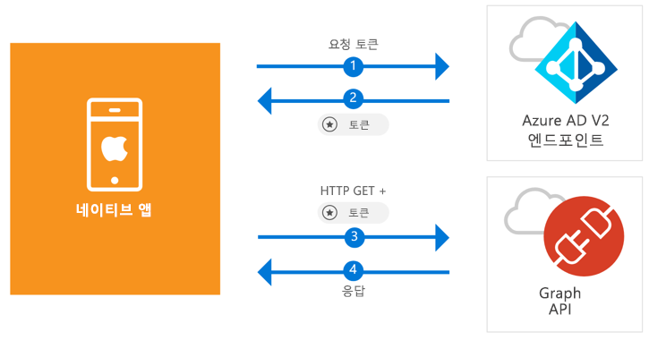

# <a name="quickstart-sign-in-users-and-call-the-microsoft-graph-api-from-an-ios-native-app"></a>빠른 시작: iOS 네이티브 앱에서 사용자 로그인 및 Microsoft Graph API 호출

[!INCLUDE [active-directory-develop-applies-v2-msal](../../../includes/active-directory-develop-applies-v2-msal.md)]

이 빠른 시작에는 네이티브 iOS 애플리케이션이 개인, 회사 및 학교 계정에 로그인하고, 액세스 토큰을 가져오고, Microsoft Graph API를 호출할 수 있는 방법을 보여 주는 코드 샘플이 포함되어 있습니다.



> [!div renderon="docs"]
> ## <a name="register-and-download"></a>등록 및 다운로드
> ### <a name="register-and-configure-your-application-and-code-sample"></a>애플리케이션 및 코드 샘플 등록 및 구성
> #### <a name="step-1-register-your-application"></a>1단계: 애플리케이션 등록
> 애플리케이션을 등록하고 애플리케이션 등록 정보를 솔루션에 추가하려면 다음을 수행합니다.
> 1. [Microsoft 응용 프로그램 등록 포털](https://apps.dev.microsoft.com/portal/register-app)로 이동하여 응용 프로그램을 등록합니다.
> 1. **애플리케이션 이름** 상자에서 애플리케이션의 이름을 입력합니다.
> 1. **단계별 설치** 확인란의 선택을 취소한 다음 **만들기**를 선택하도록 합니다.
> 1. **플랫폼 추가**를 선택하고, **네이티브 애플리케이션**을 선택한 다음, **저장**을 선택합니다.

> [!div renderon="portal" class="sxs-lookup"]
> #### <a name="step-1-configure-your-application"></a>1단계: 애플리케이션 구성
> 이 빠른 시작의 코드 샘플이 작동하려면 회신 URL을 `msal<AppId>://auth`로 추가해야 합니다. 여기서 msal<AppId>은 이 애플리케이션 ID입니다.
> > [!div renderon="portal" id="makechanges" class="nextstepaction"]
> > [자동 변경]()
>
> > [!div id="appconfigured" class="alert alert-info"]
> >  이 특성을 사용하여 애플리케이션을 구성합니다.

#### <a name="step-2-download-your-web-server-or-project"></a>2단계: 웹 서버 또는 프로젝트 다운로드

- [XCode 프로젝트 다운로드](https://github.com/Azure-Samples/active-directory-ios-swift-native-v2/archive/master.zip)

#### <a name="step-3-configure-your-project"></a>3단계: 프로젝트 구성

1. Zip 파일을 추출하고 XCode에서 프로젝트를 엽니다.
1. **ViewController.swift**를 편집하고 ‘let kClientID’로 시작하는 줄을 다음 코드 조각으로 바꿉니다.

    > [!div renderon="portal" class="sxs-lookup"]
    > ```swift
    > let kClientID = "Enter_the_Application_Id_here"
    > ```

    > [!div renderon="docs"]
    > ```swift
    > let kClientID = "<ENTER_THE_APPLICATION_ID_HERE>"
    > ```   
1. Ctrl 키를 누른 채 **Info.plist**를 클릭하여 상황에 맞는 메뉴를 표시하고 **다음으로 열기** > **소스 코드**를 선택합니다.
1. dict 루트 노드 아래에 다음 코드를 추가합니다.

    > [!div renderon="portal" class="sxs-lookup"]
    > ```xml
    > <key>CFBundleURLTypes</key>
    > <array>
    >     <dict>
    >         <key>CFBundleTypeRole</key>
    >         <string>Editor</string>
    >         <key>CFBundleURLName</key>
    >         <string>$(PRODUCT_BUNDLE_IDENTIFIER)</string>
    >         <key>CFBundleURLSchemes</key>
    >         <array>
    >             <string>msalEnter_the_Application_Id_here</string>
    >         </array>
    >     </dict>
    > </array>
    > ```

    > [!div renderon="docs"]
    > ```xml
    > <key>CFBundleURLTypes</key>
    > <array>
    >     <dict>
    >         <key>CFBundleTypeRole</key>
    >         <string>Editor</string>
    >         <key>CFBundleURLName</key>
    >         <string>$(PRODUCT_BUNDLE_IDENTIFIER)</string>
    >         <key>CFBundleURLSchemes</key>
    >         <array>
    >             <string>msal<ENTER_THE_APPLICATION_ID_HERE></string>
    >         </array>
    >     </dict>
    > </array>
    > ```
    
> [!div renderon="docs"]
> <span>5.</span> `<ENTER_THE_APPLICATION_ID_HERE>`를 응용 프로그램에 대한 *응용 프로그램 ID*로 바꿉니다. *응용 프로그램 ID*를 찾아야 하는 경우, *개요* 페이지로 이동하세요.

## <a name="more-information"></a>추가 정보

이 빠른 시작에 대한 자세한 내용은 다음 섹션을 참조하세요.

### <a name="msal"></a>MSAL

MSAL([MSAL.framework](https://github.com/AzureAD/microsoft-authentication-library-for-objc))은 사용자를 로그인하고 Microsoft Azure Active Directory로 보호된 API 액세스에 사용하는 토큰을 요청하는 데 사용되는 라이브러리입니다. 다음 프로세스를 사용하여 응용 프로그램에 MSAL을 추가할 수 있습니다.

```
$ vi Podfile
```
이 podfile에 다음을 추가합니다.

```
 target 'QuickStart' do
   use_frameworks!
 pod 'MSAL'
 end
```

### <a name="msal-initialization"></a>MSAL 초기화

다음 코드를 추가하여 MSAL에 대한 참조를 추가할 수 있습니다.

```swift
import MSAL
```

그런 다음, 아래 코드를 사용하여 MSAL을 초기화합니다.

```swift
let authority = MSALAuthority(url: URL(string: kAuthority)!)
self.applicationContext = try MSALPublicClientApplication(clientId: kClientID, authority: authority)
```

> |위치: ||
> |---------|---------|
> | `clientId` | *portal.azure.com*에 등록된 응용 프로그램의 응용 프로그램 ID |
> | `authority` | Azure AD v2.0 엔드포인트. 대부분의 경우 *https<span/>://login.microsoftonline.com/common*입니다. |

### <a name="requesting-tokens"></a>토큰 요청

MSAL에는 토큰 가져오기에 사용되는 두 가지 메서드인 `acquireToken` 및 `acquireTokenSilent`가 있습니다.

#### <a name="getting-an-access-token-interactively"></a>대화형으로 액세스 토큰 가져오기

일부 상황에서는 사용자가 Azure AD(Azure Active Directory) v2.0 엔드포인트를 조작해야 하며, 이로 인해 사용자 자격 증명의 유효성을 검사하거나 동의를 얻기 위해 시스템 브라우저로 컨텍스트 전환이 발생합니다. 일부 사례:

* 처음으로 사용자가 응용 프로그램에 로그인한 경우
* 암호가 만료되어 사용자가 자격 증명을 다시 입력해야 할 경우
* 애플리케이션이 사용자 동의가 필요한 리소스에 액세스를 요청하고 있는 경우
* 2단계 인증이 필요한 경우

```swift
applicationContext.acquireToken(forScopes: self.kScopes) { (result, error) in /* Add your handling logic */}
```

> |위치:||
> |---------|---------|
> | `forScopes` | 요청된 범위(즉, [ "user.read" ]` for Microsoft Graph or `[ "<Application ID URL>/scope" ]` for custom Web APIs (i.e. `api://<Application ID>/access_as_user`))를 포함합니다. |

#### <a name="getting-an-access-token-silently"></a>자동으로 액세스 토큰 가져오기

사용자가 리소스에 액세스해야 할 때마다 자격 증명의 유효성을 검사할 필요가 없도록 하려고 합니다. 대부분은 사용자 개입 없이 토큰 가져오기 및 갱신을 자동으로 처리하려고 합니다. 초기 `acquireToken` 메서드 다음에 `acquireTokenSilent` 메서드를 사용하여 토큰을 가져와서 보호된 리소스에 액세스할 수 있습니다.

```swift
applicationContext.acquireTokenSilent(forScopes: self.kScopes, account: applicationContext.allAccounts().first) { (result, error) in /* Add your handling logic */}
```

> |위치: ||
> |---------|---------|
> | `forScopes` | 요청된 범위(즉, Microsoft Graph의 경우 `[ "user.read" ]`, 사용자 지정 Web API(즉, `api://<Application ID>/access_as_user`)의 경우 `[ "<Application ID URL>/scope" ]`)를 포함합니다. |
> | `account` | 토큰을 요청하는 계정입니다(MSAL은 단일 앱에서 여러 계정을 지원함). 이 빠른 시작에서는 값이 캐시의 첫 번째 계정(`applicationContext.allAccounts().first`)을 가리킵니다. |

## <a name="next-steps"></a>다음 단계

iOS 자습서에서 이 빠른 시작의 전체 설명을 포함하여 응용 프로그램 및 새로운 기능 빌드에 대한 전체 단계별 가이드를 확인하세요.

### <a name="learn-the-steps-to-create-the-application-used-in-this-quickstart"></a>이 빠른 시작에 사용되는 애플리케이션을 만드는 단계 알아보기

> [!div class="nextstepaction"]
> [Graph API 호출 iOS 자습서](https://docs.microsoft.com/azure/active-directory/develop/guidedsetups/active-directory-ios)

[!INCLUDE [Help and support](../../../includes/active-directory-develop-help-support-include.md)]
