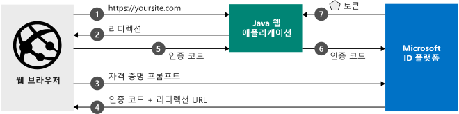

# <a name="quickstart-add-sign-in-with-microsoft-to-a-java-web-app"></a>빠른 시작: Java 웹앱에 Microsoft로 로그인 추가

[!INCLUDE [active-directory-develop-applies-v2](../../../includes/active-directory-develop-applies-v2.md)]

이 자습서에서는 Java 웹 애플리케이션을 Microsoft ID 플랫폼에 통합하는 방법을 알아봅니다. 개발자의 앱은 사용자를 로그인하고, Microsoft Graph API를 호출하기 위한 액세스 토큰을 가져오고, Microsoft Graph API를 요청합니다. 

이 가이드를 완료했으면 애플리케이션에서 Azure Active Directory를 사용하는 모든 회사 또는 조직의 회사 또는 학교 계정뿐만 아니라 개인 Microsoft 계정(outlook.com, live.com 등)의 로그인을 수락하게 됩니다.



## <a name="prerequisites"></a>필수 조건

이 샘플을 실행하려면 다음이 필요합니다.
- [JDK(Java Development Kit)](https://openjdk.java.net/) 8 이상 및 [Maven](https://maven.apache.org/).

> [!div renderon="docs"]
> ## <a name="register-and-download-your-quickstart-app"></a>빠른 시작 앱 등록 및 다운로드
> 빠른 시작 애플리케이션을 시작할 수 있는 기본(옵션 1) 또는 수동(옵션 2)의 두 가지 옵션이 있습니다.
> 
> ### <a name="option-1-register-and-auto-configure-your-app-and-then-download-your-code-sample"></a>옵션 1: 앱을 등록하고 자동 구성한 다음, 코드 샘플 다운로드
>
> 1. [Azure Portal - 앱 등록](https://portal.azure.com/#blade/Microsoft_AAD_IAM/ActiveDirectoryMenuBlade/RegisteredApps)으로 이동합니다.
> 1. 애플리케이션 이름을 입력하고 **등록**을 선택합니다.
> 1. 지침에 따라 새 애플리케이션을 다운로드하고 자동으로 구성합니다.
>
> ### <a name="option-2-register-and-manually-configure-your-application-and-code-sample"></a>옵션 2: 애플리케이션 및 코드 샘플을 등록하고 수동으로 구성
> 
>
> #### <a name="step-1-download-the-code-sample"></a>1단계: 코드 샘플 다운로드
> 
> - [코드 샘플 다운로드](https://github.com/Azure-Samples/ms-identity-java-webapp/archive/master.zip)
>
> #### <a name="step-2-open-applicationproperties"></a>2단계: application.properties 열기
>
> 1. zip 파일을 로컬 폴더에 추출합니다.
> 1. (선택 사항) 통합 개발 환경을 사용하는 경우 원하는 IDE에서 샘플을 엽니다.
> 1. *application.properties* 파일을 엽니다. 다음 단계에서 애플리케이션을 등록할 때 `aad.clientId`, `aad.authority` 및 `aad.secretKey`에 대한 값을 삽입합니다.


> #### <a name="step-3-register-your-application"></a>3단계: 애플리케이션 등록
> 애플리케이션을 등록하고 앱의 등록 정보를 솔루션에 수동으로 추가하려면 다음 단계를 따르세요.
>
> 1. [Azure Portal](https://portal.azure.com)에 회사 또는 학교 계정, 개인 Microsoft 계정으로 로그인합니다.
> 1. 계정이 둘 이상의 테넌트에 대해 액세스를 제공하는 경우 오른쪽 위 모서리에 있는 계정을 선택하여 원하는 Azure AD 테넌트로 포털 세션을 설정합니다.
> 1. 개발자용 Microsoft ID 플랫폼 [앱 등록](https://go.microsoft.com/fwlink/?linkid=2083908) 페이지로 이동합니다.
> 1. **새 등록**을 선택합니다.
> 1. **애플리케이션 등록** 페이지가 표시되면 애플리케이션의 등록 정보를 입력합니다.
>    - **이름** 섹션에서 앱의 사용자에게 표시되는 의미 있는 애플리케이션 이름(예: `java-webapp`)을 입력합니다.
>    - 지금은 **Redirect URI**를 비워 두고 **등록**을 선택합니다.
> 1. 애플리케이션의 **애플리케이션(클라이언트) ID** 값을 찾습니다. *application.properties* 파일에서 `Enter_the_Application_Id_here` 값을 업데이트합니다.
> 1. 애플리케이션의 **디렉터리(테넌트) ID** 값을 찾습니다. *application.properties* 파일에서 `Enter_the_Tenant_Info_Here` 값을 업데이트합니다. 
> 1. **인증** 메뉴를 선택한 후 다음 정보를 추가합니다.
>    - **리디렉션 URI**에 `http://localhost:8080/msal4jsamples/secure/aad` 및 `https://localhost:8080/msal4jsamples/graph/users`를 추가합니다.
>    - **저장**을 선택합니다.
> 1. 왼쪽 메뉴에서 **인증서 및 비밀**을 선택하고 **클라이언트 비밀** 섹션에서 **새 클라이언트 비밀**을 클릭합니다.
>     
>    - 키 설명(인스턴스 앱 비밀)을 입력합니다.
>    - **1년 후** 키 기간을 선택합니다.
>    - **추가**를 클릭하면 키 값이 표시됩니다. 
>    - 키 값을 복사합니다. 이전에 다운로드한 *application.properties* 파일을 열고 `Enter_the_Client_Secret_Here` 값을 키 값으로 업데이트합니다. 
>
> [!div class="sxs-lookup" renderon="portal"]
> #### <a name="step-1-configure-your-application-in-the-azure-portal"></a>1단계: Azure Portal에서 애플리케이션 구성
> 빠른 시작용 코드 샘플이 작동하려면 다음을 수행해야 합니다.
> 1. 회신 URL을 `http://localhost:8080/msal4jsamples/secure/aad` 및 `https://localhost:8080/msal4jsamples/graph/users`로 추가합니다.
> 1. 클라이언트 비밀을 만듭니다.
> > [!div renderon="portal" id="makechanges" class="nextstepaction"]
> > [자동 변경]()
>
> > [!div id="appconfigured" class="alert alert-info"]
> >  이러한 특성을 사용하여 애플리케이션을 구성합니다.
> 
> #### <a name="step-2-download-the-code-sample"></a>2단계: 코드 샘플 다운로드
> 
> - [코드 샘플 다운로드](https://github.com/Azure-Samples/ms-identity-java-webapp/archive/master.zip)
> 
> #### <a name="step-3-configure-the-code-sample"></a>3단계: 코드 샘플 구성 
> 
> 1. zip 파일을 로컬 폴더에 추출합니다.
> 1. 통합 개발 환경을 사용하는 경우 원하는 IDE에서 샘플을 엽니다(선택 사항).
> 1. **application.properties** 파일을 엽니다. 이 파일은 *src/main/resources/* 에서 찾을 수 있습니다.
> 1. 애플리케이션 속성을 바꿉니다.
>   1. `aad.clientId`를 찾아 등록한 애플리케이션의 **애플리케이션(클라이언트) ID** 값으로 `Enter_the_Application_Id_here` 값을 업데이트합니다. 
>   1. `aad.authority`를 찾아서 `Enter_the_Tenant_Name_Here` 값을 등록한 애플리케이션의 **디렉터리(테넌트) ID** 값으로 업데이트합니다.
>   1. `aad.secretKey`를 찾아 등록한 애플리케이션에 대해 **인증서 및 비밀**에서 만든 **클라이언트 비밀**로 `Enter_the_Client_Secret_Here` 값을 업데이트합니다.

#### <a name="step-4-run-the-code-sample"></a>4단계: 코드 샘플 실행
1. 코드 샘플을 실행하고 브라우저를 열어서 *http://localhost:8080* 으로 이동합니다.
1. 첫 페이지 **로그인** 단추가 있습니다, **로그인** 단추를 클릭하여 Azure Active Directory로 리디렉션합니다. 자격 증명을 입력하라는 메시지가 사용자에게 표시됩니다.  
1. Azure Active Directory에서 인증에 성공하면 *http://localhost:8080/msal4jsamples/secure/aad* 로 리디렉션됩니다. 애플리케이션에 공식적으로 로그인되고, 로그인한 계정에 대한 정보가 페이지에 표시됩니다. 다음을 위한 단추도 포함됩니다. 
    - *로그아웃*: 현재 사용자를 애플리케이션에서 로그아웃하고 홈페이지로 리디렉션합니다.
    - *사용자 표시*: Microsoft Graph에 대한 토큰을 얻은 다음, 요청에 첨부된 토큰으로 Microsoft Graph를 호출하여 테넌트의 모든 사용자를 가져옵니다.


## <a name="more-information"></a>자세한 정보

### <a name="getting-msal"></a>MSAL 가져오기
MSAL4J는 사용자를 로그인하고 Microsoft ID 플랫폼으로 보호되는 API 액세스에 사용되는 토큰을 요청할 때 사용되는 라이브러리입니다. Maven이나 Gradle을 사용하여 MSAL4J를 애플리케이션에 추가하고 애플리케이션에서 pom.xml 또는 build.gradle 파일을 다음과 같이 변경하여 종속성을 관리할 수 있습니다. 

```XML
<dependency>
    <groupId>com.microsoft.azure</groupId>
    <artifactId>msal4j</artifactId>
    <version>0.5.0-preview</version>
</dependency>
```

```$xslt
compile group: 'com.microsoft.azure', name: 'msal4j', version: '0.5.0-preview'
```


### <a name="msal-initialization"></a>Msal 초기화
MSAL4J를 사용할 파일 맨 위에 다음 코드를 추가하여 MSAL4J에 대한 참조를 추가할 수 있습니다. 

```Java
import com.microsoft.aad.msal4j.*;
```

## <a name="next-steps"></a>다음 단계

권한 및 동의에 대한 자세한 정보:

> [!div class="nextstepaction"]
> [권한 및 동의](https://docs.microsoft.com/en-us/azure/active-directory/develop/v2-permissions-and-consent)

이 시나리오의 인증 흐름에 대해 알아보려면 Oauth 2.0 인증 코드 흐름을 참조하세요.

> [!div class="nextstepaction"]
> [인증 코드 Oauth 흐름](https://docs.microsoft.com/en-us/azure/active-directory/develop/v2-oauth2-auth-code-flow)

Microsoft ID 플랫폼을 개선할 수 있도록 도와주세요. 간단한 두 가지 설문 조사를 완료하여 의견을 알려주세요.

> [!div class="nextstepaction"]
> [Microsoft ID 플랫폼 설문 조사](https://forms.office.com/Pages/ResponsePage.aspx?id=v4j5cvGGr0GRqy180BHbRyKrNDMV_xBIiPGgSvnbQZdUQjFIUUFGUE1SMEVFTkdaVU5YT0EyOEtJVi4u)

[!INCLUDE [Help and support](../../../includes/active-directory-develop-help-support-include.md)]
