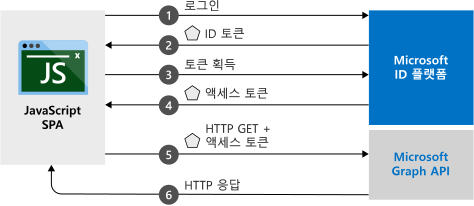

# <a name="quickstart-sign-in-users-and-acquire-an-access-token-from-a-javascript-single-page-application-spa"></a>빠른 시작: JavaScript SPA(단일 페이지 애플리케이션)에서 사용자를 로그인하고 액세스 토큰 획득

이 빠른 시작에서는 JavaScript SPA(단일 페이지 애플리케이션)에서 개인 계정과 회사 및 학교 계정에 로그인하고, Microsoft Graph API 또는 웹 API를 호출할 때 사용되는 액세스 토큰을 가져오는 방법을 보여주는 코드 샘플 사용 방법을 알아보겠습니다.



## <a name="prerequisites"></a>필수 조건

이 빠른 시작을 수행하려면 다음과 같은 앱을 설치해야 합니다.
* node.js 서버를 사용하여 프로젝트를 실행하려면
    * [Node.js](https://nodejs.org/en/download/)
    * 프로젝트 파일을 편집하려면 [Visual Studio Code](https://code.visualstudio.com/download)를 설치합니다.
* 프로젝트를 Visual Studio 솔루션으로 실행하려면 [Visual Studio 2019](https://visualstudio.microsoft.com/downloads/)를 설치합니다.

> [!div renderon="docs"]
> ## <a name="register-and-download-your-quickstart-application"></a>빠른 시작 애플리케이션 등록 및 다운로드
> 빠른 시작 애플리케이션을 시작하는 옵션은 두 가지가 있습니다.
> * [기본] [옵션 1: 앱을 등록하고 자동 구성한 다음, 코드 샘플 다운로드](#option-1-register-and-auto-configure-your-app-and-then-download-your-code-sample)
> * [수동] [옵션 2: 애플리케이션 및 코드 샘플을 등록하고 수동으로 구성](#option-2-register-and-manually-configure-your-application-and-code-sample)
>
> ### <a name="option-1-register-and-auto-configure-your-app-and-then-download-your-code-sample"></a>옵션 1: 앱을 등록하고 자동 구성한 다음, 코드 샘플 다운로드
>
> 1. [Azure Portal](https://portal.azure.com)에 회사 또는 학교 계정, 개인 Microsoft 계정으로 로그인합니다.
> 1. 계정이 둘 이상의 테넌트에 대해 액세스를 제공하는 경우 오른쪽 위 모서리에 있는 계정을 선택하여 원하는 Azure AD 테넌트로 포털 세션을 설정합니다.
> 1. 새 [Azure Portal - 앱 등록](https://portal.azure.com/#blade/Microsoft_AAD_RegisteredApps/ApplicationsListBlade/quickStartType/JavascriptSpaQuickstartPage/sourceType/docs) 창으로 이동합니다.
> 1. 애플리케이션 이름을 입력하고 **등록**을 클릭합니다.
> 1. 지침에 따라 클릭 한 번으로 새 애플리케이션을 다운로드하고 자동으로 구성합니다.
>
> ### <a name="option-2-register-and-manually-configure-your-application-and-code-sample"></a>옵션 2: 애플리케이션 및 코드 샘플을 등록하고 수동으로 구성
>
> #### <a name="step-1-register-your-application"></a>1단계: 애플리케이션 등록
>
> 1. [Azure Portal](https://portal.azure.com)에 회사 또는 학교 계정, 개인 Microsoft 계정으로 로그인합니다.
> 1. 계정이 둘 이상의 테넌트에 대해 액세스를 제공하는 경우 오른쪽 위 모서리에 있는 계정을 선택하여 원하는 Azure AD 테넌트로 포털 세션을 설정합니다.
> 1. 개발자용 Microsoft ID 플랫폼 [앱 등록](https://go.microsoft.com/fwlink/?linkid=2083908) 페이지로 이동합니다.
> 1. **새 등록**을 선택합니다.
> 1. **애플리케이션 등록** 페이지가 나타나면 애플리케이션의 이름을 입력합니다.
> 1. **지원되는 계정 유형** 아래에서 **모든 조직 디렉터리의 계정 및 개인 Microsoft 계정**을 선택합니다.
> 1. **리디렉션 URI** 섹션 아래에서 **웹** 플랫폼을 선택하고 해당 값을 `http://localhost:30662/`로 설정합니다.
> 1. 작업을 마쳤으면 **등록**을 선택합니다.  앱 **개요** 페이지에서 **애플리케이션(클라이언트) ID** 값을 기록해 둡니다.
> 1. 이 빠른 시작에서는 [암시적 허용 흐름](v2-oauth2-implicit-grant-flow.md)을 사용하도록 설정해야 합니다. 등록된 애플리케이션의 왼쪽 탐색 창에서 **인증**을 선택합니다.
> 1. **고급 설정**의 **암시적 허용**에서 **ID 토큰** 및 **액세스 토큰** 확인란을 둘 다 사용하도록 설정합니다. 이 앱은 사용자를 로그인하고 API를 호출해야 하므로 ID 토큰 및 액세스 토큰이 필요합니다.
> 1. **저장**을 선택합니다.

> [!div class="sxs-lookup" renderon="portal"]
> #### <a name="step-1-configure-your-application-in-the-azure-portal"></a>1단계: Azure Portal에서 애플리케이션 구성
> 이 빠른 시작의 코드 샘플이 작동하려면 리디렉션 URI를 `http://localhost:30662/`로 추가하고 **암시적 허용**을 사용하도록 설정해야 합니다.
> > [!div renderon="portal" id="makechanges" class="nextstepaction"]
> > [이러한 변경 내용 적용]()
>
> > [!div id="appconfigured" class="alert alert-info"]
> >  이러한 특성을 사용하여 애플리케이션을 구성합니다.

#### <a name="step-2-download-the-project"></a>2단계: 프로젝트를 다운로드합니다.

개발 환경에 적합한 이러한 옵션 중 하나를 선택할 수 있습니다.
* Node.js를 사용하여 웹 서버에서 실행할 [주요 프로젝트 파일을 다운로드](https://github.com/Azure-Samples/active-directory-javascript-graphapi-v2/archive/quickstart.zip)합니다. 파일을 열려면 [Visual Studio Code](https://code.visualstudio.com/) 같은 편집기를 사용합니다.

* (선택 사항) IIS 서버에서 실행할 [Visual Studio 프로젝트를 다운로드](https://github.com/Azure-Samples/active-directory-javascript-graphapi-v2/archive/vsquickstart.zip)합니다. 로컬 폴더(예: **C:\Azure-Samples**)에 zip 파일 압축을 풉니다.


#### <a name="step-3-configure-your-javascript-app"></a>3단계: JavaScript 앱 구성

> [!div renderon="docs"]
> *JavaScriptSPA* 폴더 아래에서 `index.html`을 편집하고, `msalConfig` 아래에 `clientID` 및 `authority` 값을 설정합니다.

> [!div class="sxs-lookup" renderon="portal"]
> *JavaScriptSPA* 폴더 아래에서 `index.html`을 편집하고 `msalConfig`를 다음으로 바꿉니다.

```javascript
var msalConfig = {
    auth: {
        clientId: "Enter_the_Application_Id_here",
        authority: "https://login.microsoftonline.com/Enter_the_Tenant_Info_Here"
    },
    cache: {
        cacheLocation: "localStorage",
        storeAuthStateInCookie: true
    }
};

```
> [!div renderon="docs"]
>
> 위치:
> - `Enter_the_Application_Id_here` - 등록한 애플리케이션의 **애플리케이션(클라이언트) ID**입니다.
> - `Enter_the_Tenant_Info_Here` - 다음 옵션 중 하나로 설정됩니다.
>   - 애플리케이션이 **이 조직 디렉터리의 계정**을 지원하는 경우 이 값을 **테넌트 ID** 또는 **테넌트 이름**(예: contoso.microsoft.com)으로 바꿉니다.
>   - 애플리케이션이 **모든 조직 디렉터리의 계정**을 지원하는 경우 이 값을 `organizations`로 바꾸세요.
>   - 애플리케이션에서 **모든 조직 디렉터리의 계정 및 개인 Microsoft 계정**을 지원하는 경우 이 값을 `common`으로 바꿉니다. *개인 Microsoft 계정만* 지원하도록 제한하려면 이 값을 `consumers`로 바꿉니다.
>
> > [!TIP]
> > **애플리케이션(클라이언트) ID**, **디렉터리(테넌트) ID** 및 **지원되는 계정 유형**의 값을 찾아보려면 Azure Portal에서 앱의 **개요** 페이지로 이동합니다.
>

#### <a name="step-4-run-the-project"></a>4단계: 프로젝트 실행

* [Node.js](https://nodejs.org/en/download/)를 사용하는 경우 다음을 수행합니다.

    1. 프로젝트의 디렉터리에서 다음 명령을 실행하여 서버를 시작합니다.

        ```batch
        npm install
        node server.js
        ```

    1. 웹 브라우저를 열고 `http://localhost:30662/`로 이동합니다.
    1. **로그인** 단추를 클릭하여 로그인을 시작한 다음, Microsoft Graph API를 호출합니다.


* [Visual Studio](https://visualstudio.microsoft.com/downloads/)를 사용하는 경우 프로젝트 솔루션을 선택한 다음, **F5** 키를 눌러 프로젝트를 실행합니다.

브라우저가 애플리케이션을 로드한 후에는 **로그인**을 클릭합니다.  사용자가 처음으로 로그인하면 애플리케이션이 사용자 프로필에 액세스하고 로그인할 수 있도록 동의하라는 메시지가 표시됩니다. 로그인에 성공하면 사용자 프로필 정보가 페이지에 표시됩니다.

## <a name="more-information"></a>추가 정보

### <a name="msaljs"></a>*msal.js*

MSAL은 사용자를 로그인하고 Microsoft ID 플랫폼으로 보호되는 API 액세스에 사용되는 토큰을 요청할 때 사용되는 라이브러리입니다. 빠른 시작의 *index.html*에는 라이브러리에 대한 참조가 포함됩니다.

```html
<script src="https://secure.aadcdn.microsoftonline-p.com/lib/1.0.0/js/msal.min.js"></script>
```
> [!TIP]
> 위의 버전을 최근에 출시된 [MSAL.js 릴리스](https://github.com/AzureAD/microsoft-authentication-library-for-js/releases) 버전으로 바꿀 수 있습니다.


또는 Node가 설치된 경우 다음과 같이 npm을 통해 최신 버전을 다운로드할 수 있습니다.

```batch
npm install msal
```

### <a name="msal-initialization"></a>MSAL 초기화

빠른 시작 코드에서는 라이브러리를 초기화하는 방법도 보여줍니다.

```javascript
var msalConfig = {
    auth: {
        clientId: "Enter_the_Application_Id_here",
        authority: "https://login.microsoftonline.com/Enter_the_Tenant_Info_Here"
    },
    cache: {
        cacheLocation: "localStorage",
        storeAuthStateInCookie: true
    }
};

var myMSALObj = new Msal.UserAgentApplication(msalConfig);
```

> |Where  |  |
> |---------|---------|
> |`ClientId`     |Azure Portal에 등록된 애플리케이션의 애플리케이션 ID|
> |`authority`    | (선택 사항) 위의 구성 섹션에 설명된 대로 계정 유형을 지원하는 기관 URL입니다. 기본 기관은 `https://login.microsoftonline.com/common`입니다. |
> |`cacheLocation`  | (선택 사항) 인증 상태에 사용되는 브라우저 스토리지를 설정합니다. 기본값은 sessionStorage입니다.   |
> |`storeAuthStateInCookie`  | (선택 사항) 라이브러리는 브라우저 쿠키에서 인증 흐름의 유효성을 검사하는 데 필요한 인증 요청 상태를 저장합니다. [알려진 특정 이슈](https://github.com/AzureAD/microsoft-authentication-library-for-js/wiki/Known-issues-on-IE-and-Edge-Browser#issues)를 완화하기 위해 IE 및 Edge 브라우저에 대해 설정됩니다. |

 사용할 수 있는 구성 가능한 옵션에 대한 자세한 내용은 [클라이언트 애플리케이션 초기화](msal-js-initializing-client-applications.md)를 참조하세요.

### <a name="sign-in-users"></a>사용자 로그인

다음 코드 조각에서는 사용자에게 로그인하는 방법을 보여줍니다.

```javascript
var requestObj = {
    scopes: ["user.read"]
};

myMSALObj.loginPopup(requestObj).then(function (loginResponse) {
    //Login Success callback code here
}).catch(function (error) {
    console.log(error);
});
```

> |Where  |  |
> |---------|---------|
> | `scopes`   | (선택 사항) 로그인 시 사용자 동의를 요청하는 범위가 포함됩니다. 예를 들어 Microsoft Graph의 경우 `[ "user.read" ]` 또는 사용자 지정 Web API의 경우 `[ "<Application ID URL>/scope" ]`(즉, `api://<Application ID>/access_as_user`)입니다. |

> [!TIP]
> 또는 `loginRedirect` 메서드를 사용하여 현재 페이지를 팝업 창 대신 로그인 페이지로 리디렉션할 수 있습니다.

### <a name="request-tokens"></a>토큰 요청

MSAL에는 토큰을 획득하는 데 사용되는 세 가지 메서드인 `acquireTokenRedirect`, `acquireTokenPopup` 및 `acquireTokenSilent`가 있습니다.

#### <a name="get-a-user-token-silently"></a>자동으로 사용자 토큰 가져오기

`acquireTokenSilent` 메서드는 사용자 개입 없이 토큰 획득 및 갱신을 자동으로 처리합니다. `loginRedirect` 또는 `loginPopup` 메서드가 처음으로 실행된 후에 후속 호출 시 보호되는 리소스에 액세스하는 데 사용되는 토큰을 가져오는 데 일반적으로 사용되는 메서드가 `acquireTokenSilent`입니다. 요청 또는 갱신 토큰에 대한 호출은 자동으로 수행됩니다.

```javascript
var requestObj = {
    scopes: ["user.read"]
};

myMSALObj.acquireTokenSilent(requestObj).then(function (tokenResponse) {
    // Callback code here
    console.log(tokenResponse.accessToken);
}).catch(function (error) {
    console.log(error);
});
```

> |Where  |  |
> |---------|---------|
> | `scopes`   | API에 대한 액세스 토큰에서 반환되도록 요청되는 범위가 포함됩니다. 예를 들어 Microsoft Graph의 경우 `[ "user.read" ]` 또는 사용자 지정 Web API의 경우 `[ "<Application ID URL>/scope" ]`(즉, `api://<Application ID>/access_as_user`)입니다.|

#### <a name="get-a-user-token-interactively"></a>대화형으로 사용자 토큰 가져오기

상황에 따라 사용자가 Microsoft ID 플랫폼 엔드포인트와 상호 작용해야 하는 경우도 있습니다. 예: 
* 암호가 만료되어 사용자가 자격 증명을 다시 입력해야 합니다.
* 애플리케이션이 사용자 동의가 필요한 추가 리소스 범위에 대한 액세스를 요청하고 있습니다.
* 2단계 인증이 필요합니다.

대부분의 애플리케이션에 대해 권장되는 일반적인 패턴은 먼저 `acquireTokenSilent`를 호출하고, 예외를 catch한 다음, `acquireTokenPopup`(또는 `acquireTokenRedirect`)를 호출하여 대화형 요청을 시작하는 것입니다.

`acquireTokenPopup`을 호출하면 로그인하라는 팝업 창이 표시되며(또는 `acquireTokenRedirect`를 호출하면 사용자가 Microsoft ID 플랫폼 엔드포인트로 리디렉션됨), 이때 사용자는 자격 증명을 확인하고 필수 리소스에 동의하거나 2단계 인증을 완료하는 방식으로 상호 작용해야 합니다.

```javascript
var requestObj = {
    scopes: ["user.read"]
};

myMSALObj.acquireTokenPopup(requestObj).then(function (tokenResponse) {
    // Callback code here
    console.log(tokenResponse.accessToken);
}).catch(function (error) {
    console.log(error);
});
```

> [!NOTE]
> 이 빠른 시작에서는 사용된 브라우저가 Internet Explorer인 경우 Internet Explorer 브라우저의 팝업 창 처리와 관련하여 [알려진 이슈](https://github.com/AzureAD/microsoft-authentication-library-for-js/wiki/Known-issues-on-IE-and-Edge-Browser#issues) 때문에 `loginRedirect` 및 `acquireTokenRedirect` 메서드를 사용합니다.

## <a name="next-steps"></a>다음 단계

이 빠른 시작의 애플리케이션을 빌드하는 방법에 대한 자세한 단계별 가이드에서는 아래 JavaScript 자습서를 사용해 보세요.

### <a name="learn-the-steps-to-create-the-application-for-this-quickstart"></a>이 빠른 시작의 애플리케이션을 만드는 단계 알아보기

> [!div class="nextstepaction"]
> [MS Graph에 로그인하고 호출하는 자습서](https://docs.microsoft.com/azure/active-directory/develop/guidedsetups/active-directory-javascriptspa)

### <a name="browse-the-msal-repo-for-documentation-faq-issues-and-more"></a>설명서, FAQ, 문제 등에 대한 MSAL 리포지토리 찾아보기

> [!div class="nextstepaction"]
> [MSAL.js GitHub 리포지토리](https://github.com/AzureAD/microsoft-authentication-library-for-js)
