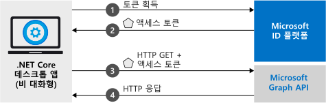

# <a name="quickstart-acquire-a-token-and-call-microsoft-graph-api-from-a-console-app-using-apps-identity"></a>빠른 시작: 앱의 ID를 사용하여 콘솔 앱에서 토큰 가져오기 및 Microsoft Graph API 호출

이 빠른 시작에서는 앱의 ID를 사용하여 액세스 토큰을 가져온 다음, 디렉터리에 [사용자 목록](https://docs.microsoft.com/graph/api/user-list)을 표시하도록 Microsoft Graph API를 호출할 수 있는 .NET Core 애플리케이션을 작성하는 방법을 알아봅니다. 이 시나리오는 헤드리스, 무인 작업 또는 Windows 서비스를 사용자의 ID 대신 애플리케이션 ID를 사용하여 실행해야 하는 경우에 유용합니다.



## <a name="prerequisites"></a>필수 조건

이 빠른 시작에는 [.NET Core 2.2](https://www.microsoft.com/net/download/dotnet-core/2.2)가 필요합니다.

> [!div renderon="docs"]
> ## <a name="register-and-download-your-quickstart-app"></a>빠른 시작 앱 등록 및 다운로드

> [!div renderon="docs" class="sxs-lookup"]
>
> 빠른 시작 애플리케이션을 시작하는 옵션은 두 가지가 있습니다.
> * [기본] [옵션 1: 앱을 등록하고 자동 구성한 다음, 코드 샘플 다운로드](#option-1-register-and-auto-configure-your-app-and-then-download-your-code-sample)
> * [수동] [옵션 2: 애플리케이션 및 코드 샘플을 등록하고 수동으로 구성](#option-2-register-and-manually-configure-your-application-and-code-sample)
>
> ### <a name="option-1-register-and-auto-configure-your-app-and-then-download-your-code-sample"></a>옵션 1: 앱을 등록하고 자동 구성한 다음, 코드 샘플 다운로드
>
> 1. 새 [Azure Portal - 앱 등록](https://portal.azure.com/?Microsoft_AAD_RegisteredApps=true#blade/Microsoft_AAD_RegisteredApps/applicationsListBlade/quickStartType/DotNetCoreDaemonQuickstartPage/sourceType/docs) 창으로 이동합니다.
> 1. 애플리케이션 이름을 입력하고 **등록**을 선택합니다.
> 1. 지침에 따라 클릭 한 번으로 새 애플리케이션을 다운로드하고 자동으로 구성합니다.
>
> ### <a name="option-2-register-and-manually-configure-your-application-and-code-sample"></a>옵션 2: 애플리케이션 및 코드 샘플을 등록하고 수동으로 구성

> [!div renderon="docs"]
> #### <a name="step-1-register-your-application"></a>1단계: 애플리케이션 등록
> 애플리케이션을 등록하고 앱의 등록 정보를 솔루션에 수동으로 추가하려면 다음 단계를 따르세요.
>
> 1. [Azure Portal](https://portal.azure.com)에 회사 또는 학교 계정, 개인 Microsoft 계정으로 로그인합니다.
> 1. 계정이 둘 이상의 테넌트에 대해 액세스를 제공하는 경우 오른쪽 위 모서리에 있는 계정을 선택하여 원하는 Azure AD 테넌트로 포털 세션을 설정합니다.
> 1. 개발자용 Microsoft ID 플랫폼 [앱 등록](https://go.microsoft.com/fwlink/?linkid=2083908) 페이지로 이동합니다.
> 1. **새 등록**을 선택합니다.
> 1. **애플리케이션 등록** 페이지가 표시되면 애플리케이션의 등록 정보를 입력합니다. 
> 1. **이름** 섹션에서 앱의 사용자에게 표시되는 의미 있는 애플리케이션 이름(예: `Daemon-console`)을 입력한 다음, **등록**을 선택하여 애플리케이션을 만듭니다.
> 1. 등록되면 **인증서 및 비밀** 메뉴를 선택합니다.
> 1. **클라이언트 비밀** 아래에서 **+ 새 클라이언트 비밀**을 선택합니다. 이름을 지정하고 **추가**를 선택합니다. 비밀을 안전한 위치에 복사합니다. 코드에서 사용하기 위해 필요합니다.
> 1. 이제 **API 사용 권한** 메뉴를 선택하고, **+ 권한 추가** 단추를 선택하고, **Microsoft Graph**를 선택합니다.
> 1. **애플리케이션 권한**을 선택합니다.
> 1. **사용자** 노드 아래에서 **User.Read.All**을 선택한 다음, **권한 추가**를 선택합니다.

> [!div class="sxs-lookup" renderon="portal"]
> ### <a name="download-and-configure-your-quickstart-app"></a>빠른 시작 앱 다운로드 및 구성
> 
> #### <a name="step-1-configure-your-application-in-azure-portal"></a>1단계: Azure Portal에서 애플리케이션 구성
> 이 빠른 시작에 대한 코드 샘플을 작동시키려면 클라이언트 비밀을 만들고, Graph API의 **User.Read.All** 애플리케이션 권한에 추가해야 합니다.
> > [!div renderon="portal" id="makechanges" class="nextstepaction"]
> > [이러한 변경 내용 적용]()
>
> > [!div id="appconfigured" class="alert alert-info"]
> >  이러한 특성을 사용하여 애플리케이션을 구성합니다.

#### <a name="step-2-download-your-visual-studio-project"></a>2단계: Visual Studio 프로젝트 다운로드

[Visual Studio 프로젝트 다운로드](https://github.com/Azure-Samples/active-directory-dotnetcore-daemon-v2/archive/msal3x.zip)

#### <a name="step-3-configure-your-visual-studio-project"></a>3단계: Visual Studio 프로젝트 구성

1. zip 파일을 디스크 루트에 가까운 로컬 폴더(예: **C:\Azure-Samples**)로 추출합니다.
1. Visual Studio - **daemon-console.sln**에서 솔루션을 엽니다(선택 사항).
1. **appsettings.json**을 편집하고 `ClientId`, `Tenant` 및 `ClientSecret` 필드의 값을 다음으로 바꿉니다.

    ```json
    "Tenant": "Enter_the_Tenant_Id_Here",
    "ClientId": "Enter_the_Application_Id_Here",
    "ClientSecret": "Enter_the_Client_Secret_Here"
    ```
    > > [!div renderon="portal" id="certandsecretspage" class="sxs-lookup"]
    > > [새 클라이언트 비밀 생성]()
    
    > [!div renderon="docs"]
    >> 위치:
    >> * `Enter_the_Application_Id_Here` - 등록한 응용 프로그램의 **응용 프로그램(클라이언트) ID**입니다.
    >> * `Enter_the_Tenant_Id_Here` - 이 값을 **테넌트 ID** 또는 **테넌트 이름**(예: contoso.microsoft.com)으로 바꿉니다.
    >> * `Enter_the_Client_Secret_Here` - 1단계에서 만든 클라이언트 비밀로 이 값을 바꿉니다.

    > [!div renderon="docs"]
    > > [!TIP]
    > > **애플리케이션(클라이언트) ID**, **디렉터리(테넌트) ID**의 값을 찾아보려면 Azure Portal에서 앱의 **개요** 페이지로 이동합니다. 새 키를 생성하려면 **인증서 및 비밀** 페이지로 이동합니다.
    
#### <a name="step-4-admin-consent"></a>4단계: 관리자 동의

이 시점에서 애플리케이션을 실행하려고 시도하면 *HTTP 403 - 사용할 수 없음* 오류: `Insufficient privileges to complete the operation` 메시지가 표시됩니다. 모든 *앱 전용 권한*에는 관리자 동의가 필요하기 때문에 이 오류가 발생합니다. 즉, 디렉터리의 글로벌 관리자가 애플리케이션에 동의해야 합니다. 역할에 따라 아래 옵션 중 하나를 선택합니다.

##### <a name="global-tenant-administrator"></a>글로벌 테넌트 관리자

> [!div renderon="docs"]
> 글로벌 테넌트 관리자인 경우 Azure Portal의 애플리케이션 등록(미리 보기)에서 **API 사용 권한** 페이지로 이동하고 **{테넌트 이름}에 대한 관리자 동의 부여**(여기서 {테넌트 이름}은 디렉터리의 이름)를 선택합니다.

> [!div renderon="portal" class="sxs-lookup"]
> 글로벌 관리자인 경우 **API 사용 권한** 페이지로 이동하고 **Enter_the_Tenant_Name_Here에 대한 관리자 동의 부여**를 선택합니다.
> > [!div id="apipermissionspage"]
> > [API 사용 권한 페이지로 이동]()

##### <a name="standard-user"></a>표준 사용자

테넌트의 표준 사용자인 경우 글로벌 관리자에게 애플리케이션에 대한 관리자 동의 부여를 요청해야 합니다. 이렇게 하려면 관리자에게 다음 URL을 제공합니다.

```url
https://login.microsoftonline.com/Enter_the_Tenant_Id_Here/adminconsent?client_id=Enter_the_Application_Id_Here
```

> [!div renderon="docs"]
>> 위치:
>> * `Enter_the_Tenant_Id_Here` - 이 값을 **테넌트 ID** 또는 **테넌트 이름**(예: contoso.microsoft.com)으로 바꿉니다.
>> * `Enter_the_Application_Id_Here` - 등록한 애플리케이션의 **애플리케이션(클라이언트) ID**입니다.

> [!NOTE]
> 위의 URL을 사용하여 앱에 동의를 부여한 후 오류 *'AADSTS50011: 애플리케이션에 대해 등록된 회신 주소가 없습니다.'* 가 표시될 수 있습니다. 이는 이 애플리케이션 및 URL에 리디렉션 URI가 없기 때문에 발생합니다. 오류를 무시하세요.

#### <a name="step-5-run-the-application"></a>5단계: 애플리케이션 실행

Visual Studio를 사용하는 경우 **F5** 키를 눌러 애플리케이션을 실행합니다. 그렇지 않은 경우 명령 프롬프트 또는 콘솔을 통해 애플리케이션을 실행합니다.

```console
cd {ProjectFolder}\daemon-console
dotnet run
```

> 위치:
> * *{ProjectFolder}* 는 zip 파일의 압축을 푼 폴더입니다. 예제 **C:\Azure-Samples\active-directory-dotnetcore-daemon-v2**

이로 인해 Azure AD 디렉터리에 사용자 목록이 표시됩니다.

> [!IMPORTANT]
> 이 빠른 시작 애플리케이션에서는 클라이언트 비밀을 사용하여 자체를 기밀 클라이언트로 식별합니다. 클라이언트 비밀은 보안상의 이유로 프로젝트 파일에 일반 텍스트로 추가되므로, 이 애플리케이션을 프로덕션 애플리케이션으로 사용하는 방안을 고려하기 전에 클라이언트 비밀 대신 인증서를 사용하는 것이 좋습니다. 인증서를 사용하는 방법에 대한 자세한 내용은 이 샘플에 대한 GitHub 리포지토리의 [지침](https://github.com/Azure-Samples/active-directory-dotnetcore-daemon-v2/#variation-daemon-application-using-client-credentials-with-certificates)을 참조하세요.

## <a name="more-information"></a>자세한 정보

### <a name="msalnet"></a>MSAL.NET

MSAL([Microsoft.Identity.Client](https://www.nuget.org/packages/Microsoft.Identity.Client))은 사용자를 로그인하고 Microsoft ID 플랫폼으로 보호되는 API 액세스에 사용되는 토큰을 요청할 때 사용되는 라이브러리입니다. 설명한 것과 같이 이 빠른 시작은 위임된 권한 대신 애플리케이션 소유 ID를 사용하여 토큰을 요청합니다. 이 경우에 사용되는 인증 흐름을 *[클라이언트 자격 증명 oauth 흐름](v2-oauth2-client-creds-grant-flow.md)* 이라고 합니다. 클라이언트 자격 증명 흐름과 함께 MSAL.NET을 사용하는 방법에 대한 자세한 내용은 [이 문서](https://aka.ms/msal-net-client-credentials)를 참조하세요.

 Visual Studio의 **패키지 관리자 콘솔**에서 다음 명령을 실행하여 MSAL.NET을 설치할 수 있습니다.

```powershell
Install-Package Microsoft.Identity.Client -Pre
```

또는 Visual Studio를 사용하지 않는 경우 다음 명령을 실행하여 프로젝트에 MSAL을 추가할 수 있습니다.

```console
dotnet add package Microsoft.Identity.Client
```

### <a name="msal-initialization"></a>MSAL 초기화

다음 코드를 추가하여 MSAL에 대한 참조를 추가할 수 있습니다.

```csharp
using Microsoft.Identity.Client;
```

그런 다음, 아래 코드를 사용하여 MSAL을 초기화합니다.

```csharp
IConfidentialClientApplication app;
app = ConfidentialClientApplicationBuilder.Create(config.ClientId)
                                          .WithClientSecret(config.ClientSecret)
                                          .WithAuthority(new Uri(config.Authority))
                                          .Build();
);
```

> | 위치: ||
> |---------|---------|
> | `config.ClientSecret` | Azure Portal에서 애플리케이션에 대한 클라이언트 비밀이 생성됩니다. |
> | `config.ClientId` | Azure Portal에 등록된 응용 프로그램의 **응용 프로그램(클라이언트) ID**입니다. 이 값은 Azure Portal에서 앱의 **개요** 페이지에 있습니다. |
> | `config.Authority`    | (선택 사항) 사용자가 인증하는 STS 엔드포인트 일반적으로 공용 클라우드에 대한 <https://login.microsoftonline.com/{tenant}>입니다. 여기서 {tenant}는 테넌트의 이름 또는 테넌트 ID입니다.|

자세한 내용은 [`ConfidentialClientApplication`에 대한 참조 설명서](https://docs.microsoft.com/dotnet/api/microsoft.identity.client.iconfidentialclientapplication?view=azure-dotnet)를 참조하세요.

### <a name="requesting-tokens"></a>토큰 요청

앱의 ID를 사용하여 토큰을 요청하려면 `AcquireTokenForClient` 메서드를 사용합니다.

```csharp
result = await app.AcquireTokenForClient(scopes)
                  .ExecuteAsync();
```

> |위치:| |
> |---------|---------|
> | `scopes` | 요청된 범위를 포함합니다. 비밀 클라이언트의 경우 요청되는 범위가 Azure Portal에서 설정된 앱 개체에서 정적으로 정의된 것임을 나타내기 위해 `{Application ID URI}/.default`와 유사한 양식을 사용해야 합니다(Microsoft Graph의 경우 `{Application ID URI}`는 `https://graph.microsoft.com`을 가리킴). 사용자 지정 Web API의 경우 `{Application ID URI}`는 Azure Portal의 애플리케이션 등록(미리 보기)에서 **API 노출** 섹션 아래에서 정의됩니다. |

자세한 내용은 [`AcquireTokenForClient`에 대한 참조 설명서](https://docs.microsoft.com/dotnet/api/microsoft.identity.client.confidentialclientapplication.acquiretokenforclientasync?view=azure-dotnet#Microsoft_Identity_Client_ConfidentialClientApplication_AcquireTokenForClientAsync_System_Collections_Generic_IEnumerable_System_String__)를 참조하세요.

[!INCLUDE [Help and support](../../../includes/active-directory-develop-help-support-include.md)]

## <a name="next-steps"></a>다음 단계

> [!div class="nextstepaction"]
> [.NET Core 디먼 샘플](https://github.com/Azure-Samples/active-directory-dotnetcore-daemon-v2)

권한 및 동의에 대한 자세한 정보:

> [!div class="nextstepaction"]
> [권한 및 동의](v2-permissions-and-consent.md)

이 시나리오의 인증 흐름에 대해 알아보려면 Oauth 2.0 클라이언트 자격 증명 흐름을 참조하세요.

> [!div class="nextstepaction"]
> [클라이언트 자격 증명 Oauth 흐름](v2-oauth2-client-creds-grant-flow.md)

> [!div class="nextstepaction"]
> [MSAL.NET을 사용하여 클라이언트 자격 증명 흐름](https://aka.ms/msal-net-client-credentials)
