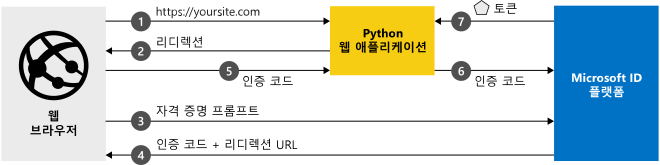

# <a name="quickstart-add-sign-in-with-microsoft-to-a-python-web-app"></a>빠른 시작: Python 웹앱에 Microsoft로 로그인 추가

이 자습서에서는 Python 웹 애플리케이션을 Microsoft ID 플랫폼에 통합하는 방법을 알아봅니다. 개발자의 앱은 사용자를 로그인하고, Microsoft Graph API를 호출하기 위한 액세스 토큰을 가져오고, Microsoft Graph API를 요청합니다.

이 가이드를 완료했으면 애플리케이션에서 Azure Active Directory를 사용하는 모든 회사 또는 조직의 회사 또는 학교 계정뿐만 아니라 개인 Microsoft 계정(outlook.com, live.com 등)의 로그인을 수락하게 됩니다. (자세한 내용은 [샘플 작동 방식 ](#how-the-sample-works)을 참조하세요.)

## <a name="prerequisites"></a>사전 요구 사항

이 샘플을 실행하려면 다음이 필요합니다.

- [Python 2.7+](https://www.python.org/downloads/release/python-2713) 또는 [Python 3+](https://www.python.org/downloads/release/python-364/)
- [Flask](http://flask.pocoo.org/), [Flask-세션](https://pythonhosted.org/Flask-Session/), [요청](https://requests.kennethreitz.org/en/master/)
- [MSAL Python](https://github.com/AzureAD/microsoft-authentication-library-for-python)

> [!div renderon="docs"]
>
> ## <a name="register-and-download-your-quickstart-app"></a>빠른 시작 앱 등록 및 다운로드
>
> 빠른 시작 애플리케이션을 시작할 수 있는 기본(옵션 1) 및 수동(옵션 2)의 두 가지 옵션이 있습니다.
>
> ### <a name="option-1-register-and-auto-configure-your-app-and-then-download-your-code-sample"></a>옵션 1: 앱을 등록하고 자동 구성한 다음, 코드 샘플 다운로드
>
> 1. [Azure Portal - 앱 등록](https://portal.azure.com/#blade/Microsoft_AAD_RegisteredApps/applicationsListBlade/quickStartType/PythonQuickstartPage/sourceType/docs)으로 이동합니다.
> 1. 애플리케이션 이름을 입력하고 **등록**을 선택합니다.
> 1. 지침에 따라 새 애플리케이션을 다운로드하고 자동으로 구성합니다.
>
> ### <a name="option-2-register-and-manually-configure-your-application-and-code-sample"></a>옵션 2: 애플리케이션 및 코드 샘플을 등록하고 수동으로 구성
>
> #### <a name="step-1-register-your-application"></a>1단계: 애플리케이션 등록
>
> 애플리케이션을 등록하고 앱의 등록 정보를 솔루션에 수동으로 추가하려면 다음 단계를 따르세요.
>
> 1. [Azure Portal](https://portal.azure.com)에 회사 또는 학교 계정, 개인 Microsoft 계정으로 로그인합니다.
> 1. 계정이 둘 이상의 테넌트에 대해 액세스를 제공하는 경우 오른쪽 위 모서리에 있는 계정을 선택하여 원하는 Azure AD 테넌트로 포털 세션을 설정합니다.
> 1. 개발자용 Microsoft ID 플랫폼 [앱 등록](https://go.microsoft.com/fwlink/?linkid=2083908) 페이지로 이동합니다.
> 1. **새 등록**을 선택합니다.
> 1. **애플리케이션 등록** 페이지가 표시되면 애플리케이션의 등록 정보를 입력합니다.
>      - **이름** 섹션에서 앱의 사용자에게 표시되는 의미 있는 애플리케이션 이름(예: `python-webapp`)을 입력합니다.
>      - **지원되는 계정 유형** 아래에서 **모든 조직 디렉터리의 계정 및 개인 Microsoft 계정**을 선택합니다.
>      - **등록**을 선택합니다.
>      - 나중에 사용할 수 있도록 앱 **개요** 페이지에서 **애플리케이션(클라이언트) ID** 값을 기록해 둡니다.
> 1. 메뉴에서 **인증**을 선택한 후 다음 정보를 추가합니다.
>    - **웹** 플랫폼 구성을 추가합니다. `http://localhost:5000/getAToken`을 **리디렉션 URI**로 추가합니다.
>    - **저장**을 선택합니다.
> 1. 왼쪽 메뉴에서 **인증서 및 비밀**을 선택하고 **클라이언트 비밀** 섹션에서 **새 클라이언트 비밀**을 클릭합니다.
>
>      - 키 설명(인스턴스 앱 비밀)을 입력합니다.
>      - **1년 후** 키 기간을 선택합니다.
>      - **추가**를 클릭하면 키 값이 표시됩니다.
>      - 키 값을 복사합니다. 이 시간은 나중에 필요합니다.
> 1. **API 사용 권한** 섹션을 선택합니다.
>
>      - **권한 추가** 단추를 클릭한 다음,
>      - **Microsoft API** 탭을 선택합니다.
>      - *일반적으로 사용되는 Microsoft API* 섹션에서 **Microsoft Graph**를 클릭합니다.
>      - **위임된 권한** 섹션에서 적절한 권한, 즉, **User.ReadBasic.All**. 필요한 경우 검색 상자를 사용합니다.
>      - **권한 추가** 단추를 선택합니다.
>
> [!div class="sxs-lookup" renderon="portal"]
>
> #### <a name="step-1-configure-your-application-in-azure-portal"></a>1단계: Azure Portal에서 애플리케이션 구성
>
> 빠른 시작용 코드 샘플이 작동하려면 다음을 수행해야 합니다.
>
> 1. 회신 URL을 `http://localhost:5000/getAToken`으로 입력합니다.
> 1. 클라이언트 비밀을 만듭니다.
> 1. Microsoft Graph API의 User.ReadBasic.All 위임된 권한을 추가합니다.
>
> > [!div renderon="portal" id="makechanges" class="nextstepaction"]
> > [이러한 변경 내용 적용]()
> > [!div id="appconfigured" class="alert alert-info"]
> >  이 특성을 사용하여 애플리케이션을 구성합니다.

#### <a name="step-2-download-your-project"></a>2단계: 프로젝트 다운로드
> [!div renderon="docs"]
> [코드 샘플 다운로드](https://github.com/Azure-Samples/ms-identity-python-webapp/archive/master.zip)

> [!div class="sxs-lookup" renderon="portal"]
> 프로젝트를 다운로드하고 zip 파일을 루트 폴더에 가까운 로컬 폴더(예제: **C:\Azure-Samples**)로 추출합니다.
> [!div renderon="portal" id="autoupdate" class="nextstepaction"]
> [코드 샘플 다운로드](https://github.com/Azure-Samples/ms-identity-python-webapp/archive/master.zip)

> [!div class="sxs-lookup" renderon="portal"]
> > [!NOTE]
> > `Enter_the_Supported_Account_Info_Here`

> [!div renderon="docs"]
> #### <a name="step-3-configure-the-application"></a>3단계: 애플리케이션 구성
>
> 1. Zip 파일을 루트 폴더에 가까운 로컬 폴더(예: **C:\Azure-Samples**)로 추출합니다.
> 1. 통합 개발 환경을 사용하는 경우 원하는 IDE에서 샘플을 엽니다(선택 사항).
> 1. 루트 폴더에 있는 **app_config.py** 파일을 열고 다음 코드 조각으로 바꿉니다.
>
> ```python
> CLIENT_ID = "Enter_the_Application_Id_here"
> CLIENT_SECRET = "Enter_the_Client_Secret_Here"
> AUTHORITY = "https://login.microsoftonline.com/Enter_the_Tenant_Name_Here"
> ```
> 위치:
>
> - `Enter_the_Application_Id_here` - 등록한 애플리케이션의 애플리케이션 ID입니다.
> - `Enter_the_Client_Secret_Here` - 등록한 애플리케이션의 **인증서 및 비밀**에서 만든 **클라이언트 비밀**입니다.
> - `Enter_the_Tenant_Name_Here` - 등록한 애플리케이션의 **디렉터리(테넌트 ) ID** 값입니다.

> [!div class="sxs-lookup" renderon="portal"]
> #### <a name="step-3-run-the-code-sample"></a>3단계: 코드 샘플 실행

> [!div renderon="docs"]
> #### <a name="step-4-run-the-code-sample"></a>4단계: 코드 샘플 실행

1. 다음과 같이 pip를 사용하여 MSAL Python 라이브러리, Flask 프레임워크, 서버 쪽 세션 관리 및 요청을 위한 Flask 세션을 설치해야 합니다.

    ```Shell
    pip install -r requirements.txt
    ```

2. 셸 또는 명령줄에서 app.py를 실행합니다.

    ```Shell
    python app.py
    ```
   > [!IMPORTANT]
   > 이 빠른 시작 애플리케이션에서는 클라이언트 비밀을 사용하여 자체를 기밀 클라이언트로 식별합니다. 클라이언트 비밀은 보안상의 이유로 프로젝트 파일에 일반 텍스트로 추가되므로, 이 애플리케이션을 프로덕션 애플리케이션으로 사용하는 방안을 고려하기 전에 클라이언트 비밀 대신 인증서를 사용하는 것이 좋습니다. 인증서를 사용하는 방법에 대한 자세한 내용은 [다음 지침](https://docs.microsoft.com/azure/active-directory/develop/active-directory-certificate-credentials)을 참조하세요.

## <a name="more-information"></a>자세한 정보

### <a name="how-the-sample-works"></a>샘플 작동 방법


### <a name="getting-msal"></a>MSAL 가져오기
MSAL은 사용자를 로그인하고 Microsoft ID 플랫폼으로 보호되는 API 액세스에 사용되는 토큰을 요청할 때 사용되는 라이브러리입니다.
Pip을 사용하여 애플리케이션에 MSAL Python을 추가할 수 있습니다.

```Shell
pip install msal
```

### <a name="msal-initialization"></a>MSAL 초기화
MSAL을 사용할 파일 맨 위에 다음 코드를 추가하여 MSAL Python에 대한 참조를 추가할 수 있습니다.

```Python
import msal
```

## <a name="next-steps"></a>다음 단계

사용자가 로그인한 다음, 웹 API를 호출하는 웹앱에 대해 자세히 알아봅니다.

> [!div class="nextstepaction"]
> [시나리오: 사용자가 로그인하는 웹앱](scenario-web-app-sign-user-overview.md)

[!INCLUDE [Help and support](../../../includes/active-directory-develop-help-support-include.md)]
