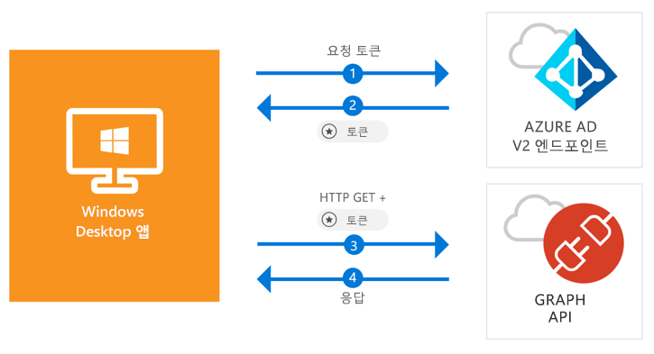

# <a name="quickstart-acquire-a-token-and-call-microsoft-graph-api-from-a-windows-desktop-app"></a>빠른 시작: Windows 데스크톱 앱에서 토큰 가져오기 및 Microsoft Graph API 호출

[!INCLUDE [active-directory-develop-applies-v2-msal](../../../includes/active-directory-develop-applies-v2-msal.md)]

이 빠른 시작에서는 Windows 데스크톱 .NET(WPF) 응용 프로그램이 개인, 회사 및 학교 계정에 로그인하고, 액세스 토큰을 가져오고, Microsoft Graph API를 호출할 수 있는 방법을 알아봅니다.



> [!div renderon="docs"]
> ## <a name="register-and-download"></a>등록 및 다운로드
> ### <a name="register-and-configure-your-application-and-code-sample"></a>응용 프로그램 및 코드 샘플 등록 및 구성
> #### <a name="step-1-register-your-application"></a>1단계: 응용 프로그램 등록
> 응용 프로그램을 등록하고 응용 프로그램 등록 정보를 솔루션에 추가하려면 다음을 수행합니다.
> 1. [Microsoft 응용 프로그램 등록 포털](https://apps.dev.microsoft.com/portal/register-app)로 이동하여 응용 프로그램을 등록합니다.
> 1. **응용 프로그램 이름** 상자에서 응용 프로그램의 이름을 입력합니다.
> 1. **단계별 설치** 확인란의 선택을 취소한 다음 **만들기**를 선택하도록 합니다.
> 1. **플랫폼 추가**를 선택하고, **네이티브 응용 프로그램**을 선택한 다음 **저장**을 선택합니다.

> [!div renderon="portal" class="sxs-lookup"]
> #### <a name="step-1-configure-your-application"></a>1단계: 응용 프로그램 구성
> 이 빠른 시작의 코드 샘플이 작동하려면 회신 URL을 **urn:ietf:wg:oauth:2.0:oob**로 추가해야 합니다.
> > [!div renderon="portal" id="makechanges" class="nextstepaction"]
> > [자동 변경]()
>
> > [!div id="appconfigured" class="alert alert-info"]
> >  이러한 특성을 사용하여 응용 프로그램을 구성합니다.

#### <a name="step-2-download-your-visual-studio-project"></a>2단계: Visual Studio 프로젝트 다운로드

[Visual Studio 2017 프로젝트 다운로드](https://github.com/Azure-Samples/active-directory-dotnet-desktop-msgraph-v2/archive/master.zip)

#### <a name="step-3-configure-your-visual-studio-project"></a>3단계: Visual Studio 프로젝트 구성

1. zip 파일을 로컬 폴더(예: **C:\Azure-Samples**)에 추출합니다.
1. Visual Studio에서 프로젝트를 엽니다.
1. **App.Xaml.cs**를 편집하고 `private static string ClientId`로 시작하는 줄을 방금 등록한 응용 프로그램의 응용 프로그램 ID로 바꿉니다.

```csharp
private static string ClientId = "Enter_the_Application_Id_here";
```

## <a name="more-information"></a>자세한 정보

### <a name="msalnet"></a>MSAL.NET

MSAL([Microsoft.Identity.Client](https://www.nuget.org/packages/Microsoft.Identity.Client))은 사용자가 로그인하고 Microsoft Azure AD(Azure Active Directory)에 의해 보호되는 API에 액세스하기 위해 사용하는 토큰을 요청하는 데 사용되는 라이브러리입니다. Visual Studio의 **패키지 관리자 콘솔**에서 다음 명령을 실행하여 설치할 수 있습니다.

```powershell
Install-Package Microsoft.Identity.Client -Pre
```

### <a name="msal-initialization"></a>MSAL 초기화

다음 코드를 추가하여 MSAL에 대한 참조를 추가할 수 있습니다.

```csharp
using Microsoft.Identity.Client;
```

그런 다음, 아래 코드를 사용하여 MSAL을 초기화합니다.

```csharp
public static PublicClientApplication PublicClientApp = new PublicClientApplication(ClientId);
```

> |위치: ||
> |---------|---------|
> | `ClientId` | *portal.microsoft.com*에 등록된 응용 프로그램의 응용 프로그램 ID |

### <a name="requesting-tokens"></a>토큰 요청

MSAL에는 토큰 가져오기에 사용되는 두 가지 메서드인 `AcquireTokenAsync` 및 `AcquireTokenSilentAsync`가 있습니다.

#### <a name="get-a-user-token-interactively"></a>대화형으로 사용자 토큰 가져오기

일부 상황에서는 사용자가 팝업 창을 통해 Azure AD v2.0 엔드포인트를 조작하여 자격 증명의 유효성을 검사하거나 동의를 제공해야 합니다. 일부 사례:

- 처음으로 사용자가 응용 프로그램에 로그인한 경우
- 암호가 만료되어 사용자가 자격 증명을 다시 입력해야 할 경우
- 응용 프로그램이 사용자 동의가 필요한 리소스에 액세스를 요청하고 있는 경우
- 2단계 인증이 필요한 경우

```csharp
authResult = await App.PublicClientApp.AcquireTokenAsync(_scopes);
```

> |위치:||
> |---------|---------|
> | `_scopes` | 요청된 범위(즉, Microsoft Graph의 경우 `{ "user.read" }`, 사용자 지정 Web API의 경우 `{ "api://<Application ID>/access_as_user" }`)를 포함합니다. |

#### <a name="get-a-user-token-silently"></a>자동으로 사용자 토큰 가져오기

사용자가 리소스에 액세스해야 할 때마다 자격 증명의 유효성을 검사할 필요가 없도록 하려고 합니다. 대부분은 사용자 개입 없이 토큰 가져오기 및 갱신을 자동으로 처리하려고 합니다. 초기 `AcquireTokenAsync` 메서드 다음에 `AcquireTokenSilentAsync` 메서드를 사용하여 토큰을 가져와서 보호된 리소스에 액세스할 수 있습니다.

```csharp
var accounts = await App.PublicClientApp.GetAccountsAsync();
authResult = await App.PublicClientApp.AcquireTokenSilentAsync(scopes, accounts.FirstOrDefault());
```

> |위치: ||
> |---------|---------|
> |범위 | 요청된 범위(즉, Microsoft Graph의 경우 `{ "user.read" }`, 사용자 지정 Web API의 경우 `{ "api://<Application ID>/access_as_user" }`)를 포함합니다. |
> |accounts.FirstOrDefault() | 캐시의 첫 번째 사용자입니다(MSAL은 단일 앱에서 여러 사용자를 지원함). |

## <a name="next-steps"></a>다음 단계

이 빠른 시작의 전체 설명을 포함하여 응용 프로그램 및 새로운 기능 빌드에 대한 완전한 단계별 가이드를 제공하는 Windows 데스크톱 자습서를 사용해 보세요.

### <a name="learn-the-steps-to-create-the-application-used-in-this-quickstart"></a>이 빠른 시작에 사용되는 응용 프로그램을 만드는 단계 알아보기

> [!div class="nextstepaction"]
> [Graph API 호출 자습서](https://docs.microsoft.com/azure/active-directory/develop/guidedsetups/active-directory-windesktop)

[!INCLUDE [Help and support](../../../includes/active-directory-develop-help-support-include.md)]
