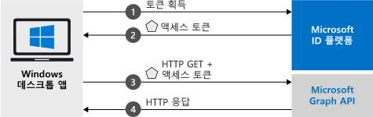

# <a name="quickstart-acquire-a-token-and-call-microsoft-graph-api-from-a-windows-desktop-app"></a>빠른 시작: Windows 데스크톱 앱에서 토큰 가져오기 및 Microsoft Graph API 호출

이 빠른 시작에서는 개인, 회사 및 학교 계정에 로그인하고, 액세스 토큰을 가져오고, Microsoft Graph API를 호출할 수 있는 Windows 데스크톱 .NET(WPF) 애플리케이션을 작성하는 방법을 알아봅니다.



> [!div renderon="docs"]
> ## <a name="register-and-download-your-quickstart-app"></a>빠른 시작 앱 등록 및 다운로드
> 빠른 시작 애플리케이션을 시작하는 옵션은 두 가지가 있습니다.
> * [기본] [옵션 1: 앱을 등록하고 자동 구성한 다음, 코드 샘플 다운로드](#option-1-register-and-auto-configure-your-app-and-then-download-your-code-sample)
> * [수동] [옵션 2: 애플리케이션 및 코드 샘플을 등록하고 수동으로 구성](#option-2-register-and-manually-configure-your-application-and-code-sample)
>
> ### <a name="option-1-register-and-auto-configure-your-app-and-then-download-your-code-sample"></a>옵션 1: 앱을 등록하고 자동 구성한 다음, 코드 샘플 다운로드
>
> 1. 새 [Azure Portal - 앱 등록](https://portal.azure.com/#blade/Microsoft_AAD_RegisteredApps/applicationsListBlade/quickStartType/WinDesktopQuickstartPage/sourceType/docs)으로 이동합니다.
> 1. 애플리케이션 이름을 입력하고 **등록**을 선택합니다.
> 1. 지침에 따라 클릭 한 번으로 새 애플리케이션을 다운로드하고 자동으로 구성합니다.
>
> ### <a name="option-2-register-and-manually-configure-your-application-and-code-sample"></a>옵션 2: 애플리케이션 및 코드 샘플을 등록하고 수동으로 구성
>
> #### <a name="step-1-register-your-application"></a>1단계: 애플리케이션 등록
> 애플리케이션을 등록하고 앱의 등록 정보를 솔루션에 수동으로 추가하려면 다음 단계를 따르세요.
>
> 1. [Azure Portal](https://portal.azure.com)에 회사 또는 학교 계정, 개인 Microsoft 계정으로 로그인합니다.
> 1. 계정이 둘 이상의 테넌트에 대해 액세스를 제공하는 경우 오른쪽 위 모서리에 있는 계정을 선택하여 원하는 Azure AD 테넌트로 포털 세션을 설정합니다.
> 1. 개발자용 Microsoft ID 플랫폼 [앱 등록](https://aka.ms/MobileAppReg) 페이지로 이동합니다.
> 1. **새 등록**을 선택합니다.
>      - **이름** 섹션에서 앱의 사용자에게 표시되는 의미 있는 애플리케이션 이름(예: `Win-App-calling-MsGraph`)을 입력합니다.
>      - **지원되는 계정 유형** 섹션에서 **모든 조직 디렉터리의 계정 및 개인 Microsoft 계정(예: Skype, Xbox, Outlook.com)** 을 선택합니다.
>      - **등록**을 선택하여 애플리케이션을 만듭니다.
> 1. 앱의 페이지 목록에서 **인증**을 선택합니다.
> 1. **데스크톱 + 디바이스** 섹션을 확장합니다.  (**데스크톱 + 디바이스**가 보이지 않으면, 먼저 위쪽 배너를 클릭하여 미리 보기 인증 환경을 표시합니다.)
> 1. **리디렉션 URI** 섹션에서 **URI 추가**를 선택합니다.  **urn:ietf:wg:oauth:2.0:oob**를 입력합니다.
> 1. **저장**을 선택합니다.

> [!div class="sxs-lookup" renderon="portal"]
> #### <a name="step-1-configure-your-application-in-azure-portal"></a>1단계: Azure Portal에서 애플리케이션 구성
> 이 빠른 시작의 코드 샘플이 작동하려면 회신 URL을 **urn:ietf:wg:oauth:2.0:oob**로 추가해야 합니다.
> > [!div renderon="portal" id="makechanges" class="nextstepaction"]
> > [자동 변경]()
>
> > [!div id="appconfigured" class="alert alert-info"]
> >  이러한 특성을 사용하여 애플리케이션을 구성합니다.

#### <a name="step-2-download-your-visual-studio-project"></a>2단계: Visual Studio 프로젝트 다운로드

[Visual Studio 프로젝트 다운로드](https://github.com/Azure-Samples/active-directory-dotnet-desktop-msgraph-v2/archive/msal3x.zip)([Github에서 프로젝트 보기](https://github.com/Azure-Samples/active-directory-dotnet-desktop-msgraph-v2/))

#### <a name="step-3-configure-your-visual-studio-project"></a>3단계: Visual Studio 프로젝트 구성

1. zip 파일을 디스크 루트에 가까운 로컬 폴더(예: **C:\Azure-Samples**)로 추출합니다.
1. Visual Studio에서 프로젝트를 엽니다.
1. **App.Xaml.cs**를 편집하고 `ClientId` 및 `Tenant` 필드의 값을 다음 코드로 바꿉니다.

    ```csharp
    private static string ClientId = "Enter_the_Application_Id_here";
    private static string Tenant = "Enter_the_Tenant_Info_Here";
    ```

> [!div renderon="docs"]
> 위치:
> - `Enter_the_Application_Id_here` - 등록한 애플리케이션의 **애플리케이션(클라이언트) ID**입니다.
> - `Enter_the_Tenant_Info_Here` - 다음 옵션 중 하나로 설정됩니다.
>   - 애플리케이션이 **이 조직 디렉터리의 계정**을 지원하는 경우 이 값을 **테넌트 ID** 또는 **테넌트 이름**(예: contoso.microsoft.com)으로 바꿉니다.
>   - 애플리케이션이 **모든 조직 디렉터리의 계정**을 지원하는 경우 이 값을 `organizations`로 바꾸세요.
>   - 애플리케이션이 **모든 조직 디렉터리의 계정 및 개인 Microsoft 계정**을 지원하는 경우 이 값을 `common`으로 바꿉니다.
>
> > [!TIP]
> > **애플리케이션(클라이언트) ID**, **디렉터리(테넌트) ID** 및 **지원되는 계정 유형**의 값을 찾아보려면 Azure Portal에서 앱의 **개요** 페이지로 이동합니다.

## <a name="more-information"></a>자세한 정보

### <a name="msalnet"></a>MSAL.NET

MSAL([Microsoft.Identity.Client](https://www.nuget.org/packages/Microsoft.Identity.Client))은 사용자를 로그인하고 Microsoft ID 플랫폼으로 보호되는 API 액세스에 사용되는 토큰을 요청할 때 사용되는 라이브러리입니다. Visual Studio의 **패키지 관리자 콘솔**에서 다음 명령을 실행하여 MSAL을 설치할 수 있습니다.

```powershell
Install-Package Microsoft.Identity.Client -IncludePrerelease
```

### <a name="msal-initialization"></a>MSAL 초기화

다음 코드를 추가하여 MSAL에 대한 참조를 추가할 수 있습니다.

```csharp
using Microsoft.Identity.Client;
```

그런 다음, 아래 코드를 사용하여 MSAL을 초기화합니다.

```csharp
public static IPublicClientApplication PublicClientApp;
PublicClientApplicationBuilder.Create(ClientId)
                .WithAuthority(AzureCloudInstance.AzurePublic, Tenant)
                .Build();
```

> |위치: ||
> |---------|---------|
> | `ClientId` | Azure Portal에 등록된 애플리케이션의 **애플리케이션(클라이언트) ID**입니다. 이 값은 Azure Portal에서 앱의 **개요** 페이지에 있습니다. |

### <a name="requesting-tokens"></a>토큰 요청

MSAL에는 토큰 가져오기에 사용되는 두 가지 메서드인 `AcquireTokenInteractive` 및 `AcquireTokenSilent`가 있습니다.

#### <a name="get-a-user-token-interactively"></a>대화형으로 사용자 토큰 가져오기

상황에 따라 사용자가 팝업 창을 통해 Microsoft ID 플랫폼 엔드포인트와 상호 작용하여 자격 증명의 유효성을 검사하거나 동의를 제공해야 합니다. 일부 사례:

- 처음으로 사용자가 응용 프로그램에 로그인한 경우
- 암호가 만료되어 사용자가 자격 증명을 다시 입력해야 할 경우
- 애플리케이션이 사용자 동의가 필요한 리소스에 액세스를 요청하고 있는 경우
- 2단계 인증이 필요한 경우

```csharp
authResult = await App.PublicClientApp.AcquireTokenInteractive(_scopes)
                                      .ExecuteAsync();
```

> |위치:||
> |---------|---------|
> | `_scopes` | 요청된 범위(예: Microsoft Graph의 경우 `{ "user.read" }`, 사용자 지정 Web API의 경우 `{ "api://<Application ID>/access_as_user" }`)를 포함합니다. |

#### <a name="get-a-user-token-silently"></a>자동으로 사용자 토큰 가져오기

사용자가 리소스에 액세스해야 할 때마다 자격 증명의 유효성을 검사할 필요가 없도록 하려고 합니다. 대부분은 사용자 개입 없이 토큰 가져오기 및 갱신을 자동으로 처리하려고 합니다. 초기 `AcquireTokenInteractive` 메서드 다음에 `AcquireTokenSilentAsync` 메서드를 사용하여 토큰을 가져와서 보호된 리소스에 액세스할 수 있습니다.

```csharp
var accounts = await App.PublicClientApp.GetAccountsAsync();
var firstAccount = accounts.FirstOrDefault();
authResult = await App.PublicClientApp.AcquireTokenSilent(scopes, firstAccount)
                                      .ExecuteAsync();
```

> |위치: ||
> |---------|---------|
> | `scopes` | 요청된 범위(예: Microsoft Graph의 경우 `{ "user.read" }`, 사용자 지정 Web API의 경우 `{ "api://<Application ID>/access_as_user" }`)를 포함합니다. |
> | `firstAccount` | 캐시의 첫 번째 사용자를 지정합니다(MSAL은 단일 앱에서 여러 사용자를 지원함). |

[!INCLUDE [Help and support](../../../includes/active-directory-develop-help-support-include.md)]

## <a name="next-steps"></a>다음 단계

이 빠른 시작의 전체 설명을 포함하여 애플리케이션 및 새로운 기능 빌드에 대한 완전한 단계별 가이드를 제공하는 Windows 데스크톱 자습서를 사용해 보세요.

> [!div class="nextstepaction"]
> [Graph API 호출 자습서](https://docs.microsoft.com/azure/active-directory/develop/guidedsetups/active-directory-windesktop)

