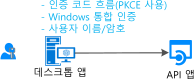
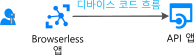

# 시나리오: Web API를 호출하는 데스크톱 앱

하기만 하면 web Api를 호출 하는 데스크톱 앱 빌드에 대해 알아봅니다

## 전제 조건

[!INCLUDE [Pre-requisites](../../../includes/active-directory-develop-scenarios-prerequisites.md)]

## 시작

이미 않았다면.NET 데스크톱 빠른 시작 또는 UWP 빠른 시작을 수행 하 여 첫 번째 응용 프로그램을 만듭니다.

> [!div class="nextstepaction"]
> [빠른 시작: 토큰을 획득 하 고 Windows 데스크톱 앱에서 Microsoft Graph API 호출](./quickstart-v2-windows-desktop.md)

> [!div class="nextstepaction"]
> [빠른 시작: 토큰 획득 및 UWP 앱에서 Microsoft Graph API 호출](./quickstart-v2-uwp.md)

## 개요

데스크톱 응용 프로그램을 작성 하 고 응용 프로그램에 사용자를 로그인 하 고 web Api와 같은 Microsoft Graph, 기타 Microsoft Api 또는 사용자 고유의 웹 API 호출 합니다. 여러 가지 가능성을 사용할 수 있습니다.

- 대화형 토큰 획득을 사용할 수 있습니다.

  - 데스크톱 응용 프로그램 예를 들어 그래픽 컨트롤을 지원 하는지는 Windows.Form 응용 프로그램 또는 WPF 응용 프로그램입니다.
  - .NET Core 응용 프로그램 및 하도록 동의 하는 경우 Azure AD 사용 하 여 인증 상호 작용을 브라우저에서 수행할 시스템

- 호스팅되는 Windows 응용 프로그램에 대 한 것도 가능 Windows 도메인에 가입 된 컴퓨터에서 실행 중인 응용 프로그램 또는 통합 Windows 인증을 사용 하 여 토큰을 자동으로 가져오려고 AAD 가입 합니다.
- 마지막으로 공용 클라이언트 응용 프로그램에서 사용자 이름/암호를 사용할 수 있지만 권장 하지 않습니다. (DevOps) 같은 일부 시나리오에서는 여전히 필요할 그러나 사용 하 여 응용 프로그램에 대 한 제약 조건을 적용 됩니다. 예를 들어이 multi-factor authentication (조건부 액세스)를 수행 해야 하는 사용자 로그인 수 없습니다. 또한 응용 프로그램에서 single sign-on (SSO)에서 이점을 제공 하지 않습니다.

  최신 인증의 원칙에 대해 이기도 하 고 레거시 용도로 제공 됩니다.

  

- -아마도.NET Core 응용 프로그램을 Linux 또는 Mac에서 실행 중인-이식 가능한 명령줄 도구를 작성 하는 경우 및 인증 시스템 브라우저에 위임할 수는 동의 하는 경우 대화형 인증을 사용할 수 없게 됩니다. (.NET core 제공 하지 않습니다 아직 [웹 브라우저](https://aka.ms/msal-net-uses-web-browser) 되며 따라서 인증 시스템 브라우저에서), 그렇지 않으면 장치 코드 흐름을 사용 하는 경우 것이 가장 좋습니다. 이 흐름 없이 IoT 응용 프로그램과 같은 브라우저 응용 프로그램에도 사용 됩니다.

  

## 세부 정보

데스크톱 응용 프로그램 많은 specificities, 주로 응용 프로그램에서는 대화형 인증 여부에 따라 달라 집니다.

## 다음 단계

> [!div class="nextstepaction"]
> [데스크톱 앱-앱 등록](scenario-desktop-app-registration.md)
