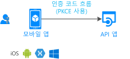

# 시나리오: 웹 Api를 호출 하는 모바일 응용 프로그램

웹 Api를 호출 하는 모바일 앱을 빌드하는 알아야 할 모든에 대해 알아봅니다.

## 필수 조건

[!INCLUDE [Prerequisites](../../../includes/active-directory-develop-scenarios-prerequisites.md)]

## 시작

첫 번째 모바일 응용 프로그램을 만들고 빠른 시작을 사용해 보십시오!

> [!div class="nextstepaction"]
> [빠른 시작: 토큰을 획득 하 고 Android 앱에서 Microsoft Graph API 호출](./quickstart-v2-android.md)
>
> [빠른 시작: 토큰을 획득 하 고 iOS 앱에서 Microsoft Graph API 호출](./quickstart-v2-ios.md)
>
> [빠른 시작: 토큰을 획득 하 고 Xamarin iOS 및 Android 앱에서 Microsoft Graph API 호출](https://github.com/Azure-Samples/active-directory-xamarin-native-v2)

## 개요

모바일 앱에 대 한 개인 설정 된 원활한 사용자 경험을 반드시 필요 합니다.  Microsoft id 플랫폼에는 모바일 개발자가 iOS 및 Android 사용자에 대 한 해당 환경을 만들 수 있습니다. 응용 프로그램이 Azure Active Directory (Azure AD) 사용자, 개인 Microsoft 계정 사용자 및 Azure AD B2C 사용자를 로그인 하 고 사용자 대신 web API를 호출 하는 토큰을 획득할 수 있습니다. Microsoft 인증 라이브러리 (MSAL) 업계 표준을 구현 하는 이러한 흐름을 구현 하려면 사용 [oauth 2.0 권한 부여 코드 흐름](v2-oauth2-auth-code-flow.md)합니다.

모바일 앱에 대 한 고려 사항:

- **사용자 환경은 키**: 사용자가 로그인을 요청 하기 전에 앱의 값을 확인할 수 있도록 하 고 필요한 사용 권한만 요청 합니다.
- **모든 사용자 구성을 지원**: 많은 모바일 비즈니스 사용자가 장치 준수 정책 및 조건부 액세스 됩니다. 이러한 주요 시나리오를 지원 해야 합니다.
- **구현에서 single sign-on (SSO)**: MSAL 및 Microsoft id 플랫폼 간단 하 게에서 single sign-on 사용 하도록 설정 하면 장치의 브라우저 또는 Microsoft Authenticator (및 Android에서 Intune 회사 포털)을 통해.

## 세부 정보

Microsoft id 플랫폼에서 모바일 앱을 빌드하는 경우 이러한 고려 사항을 염두에 두십시오.

- 플랫폼에 따라서는 일부 사용자 상호 작용 해야 할 수 있습니다 처음에 로그인 합니다. 예를 들어 iOS에서는 앱이 Microsoft Authenticator (및 Android에서 Intune 회사 포털)를 통해 처음으로 SSO를 사용 하는 경우 사용자 상호 작용을 표시 합니다.
- IOS 및 Android에서 MSAL 사용자 로그인에 (앱을 기반으로 표시 될 수 있습니다)는 외부 브라우저를 사용할 수 있습니다. 앱은 웹 보기를 대신 사용 하도록 구성을 사용자 지정할 수 있습니다.
- 모바일 응용 프로그램에서 비밀을 사용 하지 않습니다. 모든 사용자에 게 액세스할 수 있는 것입니다.

## 다음 단계

> [!div class="nextstepaction"]
> [앱 등록](scenario-mobile-app-registration.md)
