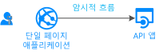

# 시나리오: 단일 페이지 애플리케이션

하기만 하면 단일 페이지 응용 프로그램 (SPA) 빌드에 대해 알아봅니다.

## 필수 조건

[!INCLUDE [Prerequisites](../../../includes/active-directory-develop-scenarios-prerequisites.md)]

## 시작

JavaScript SPA 빠른 시작을 수행 하 여 첫 번째 응용 프로그램을 만들 수 있습니다.

> [!div class="nextstepaction"]
> [빠른 시작: 단일 페이지 응용 프로그램](./quickstart-v2-javascript.md)

## 개요

많은 최신 웹 응용 프로그램은 JavaScript 또는 Angular, Vue.js, React.js 등 SPA 프레임 워크를 사용 하 여 작성 하는 클라이언트 쪽 단일 페이지 응용 프로그램으로 빌드됩니다. 이러한 응용 프로그램이은 웹 브라우저에서 실행 하 고 기존 서버 쪽 웹 응용 프로그램 보다 다양 한 인증 특징이. Microsoft id 플랫폼에 단일 페이지 응용 프로그램 백 엔드 서비스 또는 웹 Api를 사용 하 여 액세스 토큰을 가져오고 사용자 로그인을 사용 하도록 설정 합니다 [OAuth 2.0 암시적 흐름](./v2-oauth2-implicit-grant-flow.md)합니다. 암시적 흐름을 응용 프로그램을을 보호 된 Api를 호출 하는 데 필요한 토큰에 액세스할 수도 및 인증된 된 사용자를 나타내는 ID 토큰을 가져올 수 있습니다.

이 인증 흐름 등 전자, React Native 같은 플랫폼 간 JavaScript 프레임 워크를 사용 하 여 응용 프로그램 시나리오를 다루지 않습니다. 이후 필요 추가 기능 네이티브 플랫폼과 상호 작용 합니다.

## 세부 정보

다음과 같은 측면을 응용 프로그램에 대 한이 시나리오를 사용 하도록 설정 하려면 필요 합니다.

* Azure AD 사용 하 여 응용 프로그램 등록 암시적 흐름을 사용 하도록 설정 하 고 토큰 반환 되는 리디렉션 URI를 설정 해야 합니다.
* 응용 프로그램 id입니다. 같은 등록된 응용 프로그램 속성을 사용 하 여 응용 프로그램 구성
* MSAL 라이브러리를 사용 하 여 로그인 하 고 토큰을 획득 하는 인증 흐름을 수행 합니다.

## 다음 단계

> [!div class="nextstepaction"]
> [앱 등록](scenario-spa-app-registration.md)
