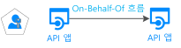

# 시나리오: 웹 API를 호출하는 Web API

하기만 하면 web API 빌드를 호출 하는 웹 Api에 알아봅니다.

## 필수 조건

이 시나리오에서는 웹 Api를 호출 되는 보호 된 web API "web API 보호" 시나리오를 기반으로 합니다. 이 기본 시나리오에 대 한 자세한 내용은 참조 하세요 [Web API 보호-시나리오](scenario-protected-web-api-overview.md) 첫 번째입니다.

## 개요

- -아래 다이어그램에 나타나지 않습니다-클라이언트 (웹, 데스크톱, 모바일 또는 단일 페이지 응용 프로그램)는 보호 된 web API를 호출 하 고 "인증" Http 헤더에 JWT 전달자 토큰을 제공 합니다.
- 보호 된 web API는 토큰의 유효성을 검사 하 고는 MSAL을 사용 하 여 `AcquireTokenOnBehalfOf` 요청 (Azure AD)에서 다른 토큰 자체 수 있도록 하는 방법 사용자를 대신 하 여 두 번째 web API (명명 된 다운스트림 웹 API)를 호출 합니다.
- 이 토큰을 사용 하 여 다운스트림 API를 호출 하는 보호 된 web API입니다. 호출할 수도 있습니다 `AcquireTokenSilent`나중에 토큰을 요청 다른 다운스트림 Api에 대 한 (하지만 여전히 동일한 사용자 대신). `AcquireTokenSilent` 필요한 경우 토큰을 새로 고칩니다.

## 세부 정보

앱 등록 API 사용 권한과 관련 된 부분은 고전입니다. 응용 프로그램 구성에서는 다운스트림 API에 대 한 토큰에 대 한 JWT 전달자 토큰을 교환 하는 OAuth 2.0에서-대리 흐름을 사용 합니다. 이 토큰은 토큰 캐시, web API 컨트롤러에서 사용할 수 있습니다 하 고 다운스트림 Api를 호출 하는 자동으로 토큰을 획득할 수 있습니다에 추가 됩니다.

## 다음 단계

> [!div class="nextstepaction"]
> [앱 등록](scenario-web-api-call-api-app-registration.md)
