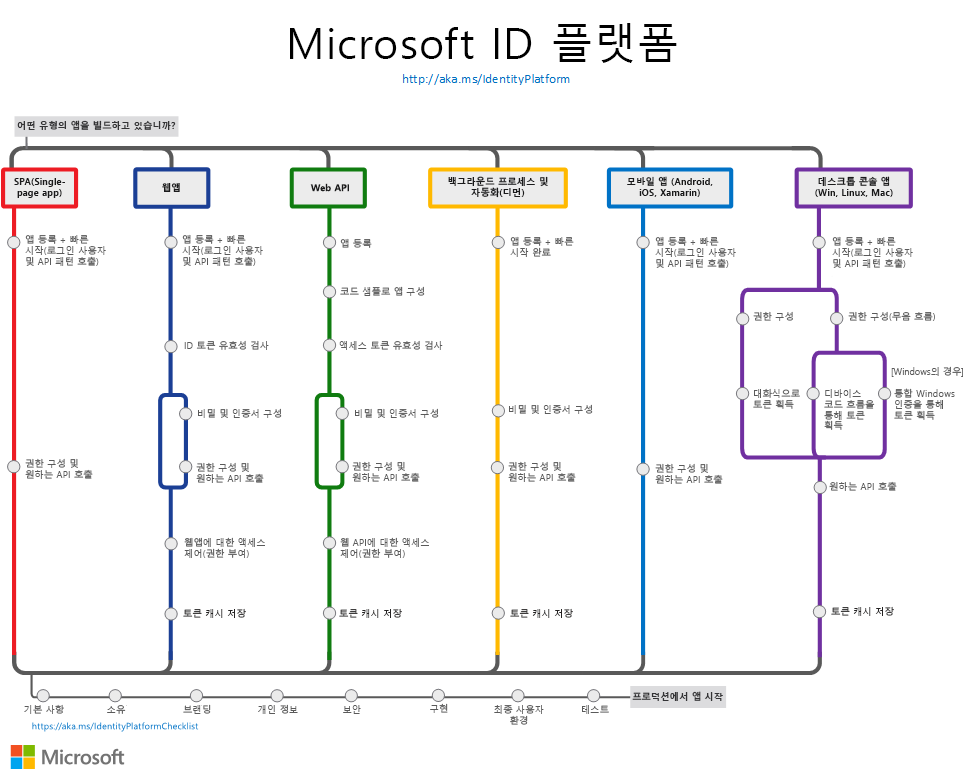

# Microsoft ID 플랫폼(v2.0) 개요

Microsoft ID 플랫폼은 Azure AD(Azure Active Directory) 개발자 플랫폼의 발전된 형태입니다. 이 플랫폼을 사용하면 개발자가 모든 Microsoft ID에 로그인하고, Microsoft Graph와 같은 Microsoft API 또는 개발자가 빌드한 API를 호출하기 위한 토큰을 가져오는 애플리케이션을 빌드할 수 있습니다. Microsoft ID 플랫폼은 다음으로 구성됩니다.

- **OAuth 2.0 및 OpenID Connect 표준 규격 인증 서비스**: 개발자가 다음을 비롯한 Microsoft ID를 인증할 수 있습니다.
  - 회사 또는 학교 계정(Azure AD를 통해 프로비저닝됨)
  - 개인 Microsoft 계정(예: Skype, Xbox 및 Outlook.com)
  - 소셜 또는 로컬 계정(Azure AD B2C를 통함)
- **오픈 소스 라이브러리**: MSAL(Microsoft 인증 라이브러리) 및 기타 표준 규격 라이브러리 지원
- **애플리케이션 관리 포털**: 다른 모든 Azure 관리 기능과 함께 Azure Portal에 구축된 등록 및 구성 환경입니다.
- **애플리케이션 구성 API 및 PowerShell**: REST API(Microsoft Graph 및 Azure Active Directory Graph 1.6)와 PowerShell을 통해 프로그래밍 방식으로 애플리케이션을 구성할 수 있기 때문에 DevOps 작업을 자동화할 수 있습니다.
- **개발자 콘텐츠**: 개념 및 참조 설명서, 빠른 시작 샘플, 코드 샘플, 자습서 및 방법 가이드입니다.

Microsoft ID 플랫폼은 개발자를 위해 ID 및 보안 공간의 혁신(예: 암호 없는 인증, 스텝업 인증 및 조건부 액세스)에 완벽하게 통합됩니다.  이러한 기능을 직접 구현할 필요가 없습니다. Microsoft ID 플랫폼에 통합된 애플리케이션은 이러한 기술 혁신의 이점을 기본적으로 활용합니다.

Microsoft ID 플랫폼에서는 코드를 한 번에 작성하여 사용자를 연결할 수 있습니다. 앱을 한 번에 작성하여 여러 플랫폼에서 작동하거나, 클라이언트는 물론 리소스 애플리케이션(API)으로 작동하는 앱을 빌드할 수 있습니다.

## 시작

ID 관련 작업이 어려울 필요는 없습니다. 내게 맞는 시나리오를 선택하면 됩니다. 각 시나리오 경로는 빠른 시작과 개요 페이지로 연결되기 때문에 몇 분 안에 작동과 실행이 가능합니다.

- [단일 페이지 앱 빌드](scenario-spa-overview.md)
- [사용자가 로그인하는 웹앱 빌드](scenario-web-app-sign-user-overview.md)
- [Web API를 호출하는 웹앱 빌드](scenario-web-app-call-api-overview.md)
- [보호된 웹 API 빌드](scenario-protected-web-api-overview.md)
- [웹 API를 호출하는 웹 API 빌드](scenario-web-api-call-api-overview.md)
- [데스크톱 앱 빌드](scenario-desktop-overview.md)
- [디먼 앱 빌드](scenario-daemon-overview.md)
- [모바일 앱 빌드](scenario-mobile-overview.md)

다음 차트는 일반적인 인증 앱 시나리오를 간략하게 보여줍니다. 이 차트는 Microsoft ID 플랫폼을 앱과 통합할 때 참조할 수 있습니다.

## 다음 단계

핵심적인 인증 개념에 대해 자세히 알아보려면 다음 항목을 시작하는 것이 좋습니다.

- [인증 기본 사항](authentication-scenarios.md)
- [애플리케이션 및 서비스 주체](app-objects-and-service-principals.md)
- [대상 그룹](v2-supported-account-types.md)
- [권한 및 동의](v2-permissions-and-consent.md)
- [ID 토큰](id-tokens.md) 및 [액세스 토큰](access-tokens.md)

[Microsoft Graph](https://docs.microsoft.com/graph/overview)를 호출하는 데이터가 풍부한 애플리케이션을 빌드합니다.

**프로덕션 환경**에서 앱을 시작할 준비가 되면, 다음과 같은 모범 사례를 검토하세요.

- 애플리케이션에 [로그인이 가능하도록 설정](msal-logging.md)합니다.
- 애플리케이션에 원격 분석이 가능하도록 설정합니다.
- [프록시를 사용하도록 설정하고 HTTP 클라이언트를 사용자 지정](msal-net-provide-httpclient.md)합니다.
- [Microsoft ID 플랫폼 통합 검사 목록](identity-platform-integration-checklist.md)에 따라 통합을 테스트합니다.

## 자세한 정보

소셜 및 로컬 ID로 로그인하는 고객용 애플리케이션을 빌드할 계획이면 [Azure AD B2C 개요](https://docs.microsoft.com/azure/active-directory-b2c/tutorial-add-identity-providers)를 참조하세요.
