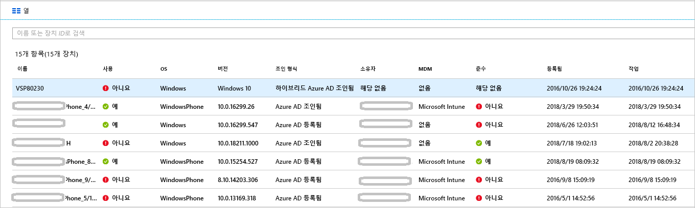

# <a name="how-to-manage-stale-devices-in-azure-ad"></a>방법: Azure AD에서 부실 디바이스 관리

이상적으로 수명 주기를 완료하려면 등록된 디바이스가 더 이상 필요하지 않은 경우 해당 디바이스를 등록 취소해야 합니다. 그러나 분실, 도난, 손상된 디바이스 또는 OS 재설치로 인해 일반적으로 환경에는 부실 디바이스가 있습니다. 아마도 IT 관리자는 부실 디바이스를 제거하여 실제로 관리가 필요한 디바이스를 관리하는 데 리소스를 집중할 수 있기를 원할 것입니다.

이 문서에서는 환경에서 부실 디바이스를 효율적으로 관리하는 방법에 대해 알아봅니다.
  

## <a name="what-is-a-stale-device"></a>부실 디바이스란?

부실 디바이스는 Azure AD에 등록되었지만 특정 시간 범위 동안 모든 클라우드 앱에 액세스하는 데 사용되지 않은 디바이스입니다. 부실 디바이스로 인해 테넌트의 디바이스 및 사용자를 관리하고 지원하는 능력에 영향을 주는 이유는 다음과 같습니다. 

- 중복 디바이스로 인해 기술 지원팀 직원이 현재 어떤 디바이스가 활성 상태인지 파악하기 어려울 수 있습니다.

- 디바이스 수가 증가하면 불필요한 디바이스 쓰기 저장을 만들어 AAD 연결 동기화 시간이 늘어납니다.

- 일반적인 예방 조치 및 규정 준수를 위해 디바이스를 원래의 무결 상태로 유지하는 것이 좋습니다. 


Azure AD의 부실 디바이스는 조직의 디바이스에 대한 일반적인 수명 주기 정책을 방해할 수 있습니다.


## <a name="detect-stale-devices"></a>부실 디바이스 검색

부실 디바이스는 특정 시간 범위 동안 모든 클라우드 앱에 액세스하는 데 사용되지 않은 등록된 디바이스로 정의되므로 부실 디바이스를 검색하려면 타임스탬프 관련 속성이 필요합니다. Azure AD에서 이 속성은 **ApproximateLastLogonTimestamp** 또는 **활동 타임스탬프**라고 합니다. 현재와 **활동 타임스탬프**의 값 사이의 델타가 활성 디바이스에 대해 정의한 시간 범위를 초과하는 경우 해당 디바이스는 부실 디바이스로 간주됩니다. 이 **활동 타임스탬프**는 현재 공개 미리 보기로 있습니다.

## <a name="how-is-the-value-of-the-activity-timestamp-managed"></a>활동 타임스탬프의 값은 어떻게 관리되나요?  

활동 타임스탬프의 평가는 디바이스의 인증 시도를 통해 트리거됩니다. Azure AD에서 평가하는 활동 타임스탬프는 다음과 같습니다.

- [관리 디바이스](../conditional-access/require-managed-devices.md) 또는 [승인된 클라이언트 앱](../conditional-access/app-based-conditional-access.md)을 요구하는 조건부 액세스 정책이 트리거되었습니다.

- Azure AD 또는 하이브리드 Azure AD에 조인된 Windows 10 디바이스가 네트워크에서 활성 상태로 있습니다. 

- Intune 관리 디바이스가 서비스에 체크 인했습니다.


활동 타임스탬프의 기존 값과 현재 값 사이의 델타가 14일을 초과하면 기존 값이 새 값으로 바뀝니다.
    

## <a name="how-do-i-get-the-activity-timestamp"></a>활동 타임스탬프를 받으려면 어떻게 할까요?

활동 타임스탬프의 값을 검색하는 두 가지 옵션이 있습니다.

- Azure Portal의 [디바이스 페이지](https://portal.azure.com/#blade/Microsoft_AAD_IAM/DevicesMenuBlade/Devices)에 있는 **활동** 열

    


- [Get-MsolDevice](https://docs.microsoft.com/powershell/module/msonline/get-msoldevice?view=azureadps-1.0) cmdlet

    


## <a name="plan-the-cleanup-of-your-stale-devices"></a>부실 디바이스 정리 계획

사용자 환경에서 부실 디바이스를 효율적으로 정리하려면 관련 정책을 정의해야 합니다. 이 정책은 부실 디바이스와 관련된 모든 고려 사항을 캡처하도록 지원합니다. 다음 섹션에서는 일반적인 정책 고려 사항에 대한 예를 제공합니다. 

### <a name="cleanup-account"></a>계정 정리

Azure AD에서 디바이스를 업데이트하려면 다음 역할 중 하나가 할당된 계정이 필요합니다.

- 전역 관리자

- 클라우드 디바이스 관리자(현재 새 역할 출시!)

- Intune 서비스 관리자

정리 정책에서 필요한 역할이 할당된 계정을 선택합니다. 


### <a name="timeframe"></a>시간 범위

부실 디바이스에 대한 표시기인 시간 범위를 정의합니다. 시간 범위를 정의할 때는 활동 타임스탬프를 사용자의 값으로 업데이트하기 위한 기간으로 14일을 사용하는 것이 좋습니다. 예를 들어 부실 디바이스에 대한 표시기인 14일보다 짧은 타임스탬프는 고려하지 않아야 합니다. 디바이스가 오래되지 않았지만 오래된 것처럼 보이게 할 수 있는 시나리오가 있습니다. 예를 들어 영향을 받는 디바이스의 소유자가 휴가 중이거나 병가 상태로 있을 수 있습니다.  이로 인해 부실 디바이스에 대한 시간 범위를 초과할 수 있습니다.

### <a name="disable-devices"></a>디바이스 비활성화

거짓 긍정의 경우 삭제를 취소할 수 없으므로 오래된 것으로 보이는 디바이스를 즉시 삭제하는 것은 권장하지 않습니다. 유예 기간 동안 디바이스를 삭제하기 전에 사용하지 않도록 설정하는 것이 가장 좋습니다. 정책에서 디바이스를 삭제하기 전에 사용하지 않도록 설정할 시간대를 정의합니다.


### <a name="mdm-controlled-devices"></a>MDM 제어 디바이스

디바이스가 Intune 또는 다른 MDM 솔루션으로 제어되는 경우 먼저 관리 시스템에서 디바이스를 사용 중지한 후에 디바이스를 사용하지 않도록 설정하거나 삭제합니다.


### <a name="system-managed-devices"></a>시스템 관리 디바이스

시스템 관리 디바이스는 삭제하지 마세요. 이러한 디바이스는 일반적으로 자동 파일럿과 같은 디바이스이며, 일단 삭제되면 다시 프로비전할 수 없습니다. 새 `get-msoldevice` cmdlet은 기본적으로 시스템 관리 디바이스를 제외합니다. 


### <a name="hybrid-azure-ad-joined-devices"></a>하이브리드 Azure AD 가입 디바이스

하이브리드 Azure AD 조인 디바이스는 온-프레미스 부실 디바이스 관리에 대한 정책을 따라야 합니다. 

Azure AD를 정리하려면 다음을 수행합니다.

- **Windows 10 디바이스** - 온-프레미스 AD에서 Windows 10 디바이스를 사용하지 않도록 설정하거나 삭제하고, Azure AD Connect에서 변경된 디바이스 상태를 Azure AD에 동기화하도록 합니다.

- **Windows 7/8** - Azure AD에서 Windows 7/8 디바이스를 사용하지 않도록 설정하거나 삭제합니다. Azure AD Connect는 Azure AD에서 Windows 7/8 디바이스를 사용하지 않도록 설정하거나 삭제하는 데 사용할 수 없습니다.


### <a name="azure-ad-joined-devices"></a>Azure AD 조인 디바이스

Azure AD에서 Azure AD 조인 디바이스를 사용하지 않도록 설정하거나 삭제합니다.


### <a name="azure-ad-registered-devices"></a>Azure AD 등록 디바이스

Azure AD에서 Azure AD 등록 디바이스를 사용하지 않도록 설정하거나 삭제합니다.


## <a name="clean-up-stale-devices-in-the-azure-portal"></a>Azure Portal에서 부실 디바이스 정리  

부실 디바이스는 Azure Portal에서 정리할 수 있지만, 이 프로세스는 PowerShell 스크립트를 사용하여 처리하는 것이 더 효율적입니다. 최신 PowerShell V1 모듈을 통해 타임스탬프 필터를 사용하고 자동 파일럿과 같은 시스템 관리 디바이스를 필터링합니다. 이 시점에서 PowerShell V2는 사용하지 않는 것이 좋습니다.


일반적인 루틴은 다음 단계로 구성됩니다.

1. [Connect-MsolService](https://docs.microsoft.com/powershell/module/msonline/connect-msolservice?view=azureadps-1.0) cmdlet을 사용하여 Azure Active Directory에 연결합니다.

2. 디바이스 목록을 가져옵니다.

3. [Disable-MsolDevice](https://docs.microsoft.com/powershell/module/msonline/disable-msoldevice?view=azureadps-1.0) cmdlet을 사용하여 디바이스를 사용하지 않도록 설정합니다. 

4. 디바이스를 삭제하기 전에 선택한 며칠 동안의 유예 기간 동안 기다립니다.

5. [Remove-MsolDevice](https://docs.microsoft.com/powershell/module/msonline/remove-msoldevice?view=azureadps-1.0) cmdlet을 사용하여 디바이스를 제거합니다.

### <a name="get-the-list-of-devices"></a>디바이스 목록을 가져옵니다.

모든 디바이스를 가져오고 반환된 데이터를 CSV 파일에 저장하려면 다음을 수행합니다.

```powershell
Get-MsolDevice -all | select-object -Property Enabled, DeviceId, DisplayName, DeviceTrustType, Approxi
mateLastLogonTimestamp | export-csv devicelist-summary.csv
```

디렉터리에 많은 수의 디바이스가 있는 경우 반환되는 디바이스의 수를 줄이기 위해 타임스탬프 필터를 사용합니다. 특정 날짜보다 오래된 타임스탬프가 있는 모든 디바이스를 가져오고 반환된 데이터를 CSV 파일에 저장하려면 다음을 수행합니다. 

```powershell
$dt = [datetime]’2017/01/01’
Get-MsolDevice -all -LogonTimeBefore $dt | select-object -Property Enabled, DeviceId, DisplayName, DeviceTrustType, ApproximateLastLogonTimestamp | export-csv devicelist-olderthan-Jan-1-2017-summary.csv
```


## <a name="what-you-should-know"></a>알아야 할 사항

### <a name="why-is-the-timestamp-not-updated-more-frequently"></a>타임스탬프가 더 자주 업데이트되지 않는 이유는 무엇인가요?

타임스탬프는 디바이스 수명 주기 시나리오를 지원하도록 업데이트됩니다. 이는 감사가 아닙니다. 로그인 감사 로그를 사용하면 디바이스에서 더 자주 업데이트할 수 있습니다.

### <a name="why-should-i-worry-about-my-bitlocker-keys"></a>BitLocker 키에 대해 걱정해야 하는 이유는 무엇인가요?

구성된 Windows 10 디바이스용 BitLocker 키는 Azure AD의 디바이스 개체에 저장됩니다. 이로 인해 부실 디바이스가 삭제되면 이 디바이스에 저장된 BitLocker 키도 삭제됩니다. 따라서 부실 디바이스를 삭제하려면 먼저 정리 정책이 디바이스의 실제 수명 주기와 일치하는지 여부를 결정해야 합니다. 

### <a name="how-do-i-know-all-the-type-of-devices-joined"></a>조인된 모든 유형의 디바이스를 확인하려면 어떻게 할까요?

다양한 유형에 대한 자세한 내용은 [디바이스 관리 개요](overview.md)를 참조하세요.

### <a name="what-happens-when-i-disable-a-device"></a>디바이스를 사용하지 않도록 설정하면 어떻게 되나요?

디바이스에서 Azure AD를 인증하는 데 사용되는 모든 인증이 거부됩니다. 일반적인 예제는 다음과 같습니다.

- **하이브리드 Azure AD 조인 디바이스** - 사용자는 이 디바이스를 사용하여 해당 온-프레미스 도메인에 로그인할 수 있습니다. 그러나 Office 365와 같은 Azure AD 리소스에는 액세스할 수 없습니다.

- **Azure AD 조인 디바이스** - 사용자는 이 디바이스를 사용하여 로그인할 수 없습니다. 

- **모바일 디바이스** - 사용자는 Office 365와 같은 Azure AD 리소스에 액세스할 수 없습니다. 


## <a name="next-steps"></a>다음 단계

Azure Portal에서 디바이스를 관리하는 방법에 대한 개요를 보려면 [Azure Portal을 사용하여 디바이스 관리](device-management-azure-portal.md)를 참조하세요.


