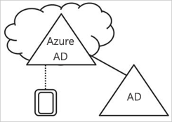
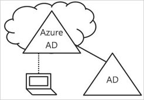
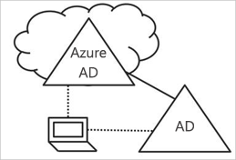

# Azure Active Directory의 장치 관리 소개

모바일 우선, 클라우드 우선 세계에서 Azure AD(Active Directory)는 어디에서나 장치, 앱 및 서비스에 대한 Single Sign-On을 가능하게 합니다. BYOD(Bring Your Own Device)를 포함하는 장치의 확산에 따라 IT 전문가는 다음 두 가지 대립되는 목표에 직면하고 있습니다.

- 최종 사용자가 언제 어디서나 생산성을 높일 수 있도록 지원
- 언제든지 회사 자산 보호

장치를 통해 사용자가 회사 자산에 액세스하게 됩니다. IT 관리자로써 회사 자산을 보호하기 위해 이러한 장치를 제어할 수 있어야 합니다. 이 기능을 사용하면 보안 및 규정 준수에 대한 표준을 충족하는 장치에서 사용자 리소스에 사용자가 액세스할 수 있습니다. 

장치 관리는 [장치 기반 조건부 액세스](../active-directory-conditional-access-policy-connected-applications.md)의 토대이기도 합니다. 장치 기반 조건부 액세스를 사용할 경우 관리 장치를 통해서만 환경의 리소스에 액세스하도록 할 수 있습니다.   

이 문서에서는 Azure Active Directory에서 장치 관리가 작동되는 방식을 설명합니다.

## Azure AD에서 제어하는 장치 얻기

Azure AD에서 제어하는 장치를 얻으려면 두 가지 옵션이 있습니다.

- 등록 
- 가입

Azure AD에 장치를 **등록**하면 장치의 ID를 관리할 수 있습니다. 장치가 등록되면 Azure AD 장치 등록은 사용자가 Azure AD에 로그인할 때 장치를 인증하는 데 사용되는 ID와 함께 장치를 제공합니다. ID를 사용하여 장치를 사용하도록 설정하거나 설정 해제할 수 있습니다.

Microsoft Intune과 같은 MDM(모바일 장치 관리) 솔루션과 함께 사용할 경우 Azure AD의 장치 특성이 장치에 대한 추가 정보로 업데이트됩니다. 이렇게 하면 장치의 액세스를 적용하여 보안 및 규정 준수에 대한 표준을 충족하는 조건부 액세스 규칙을 만들 수 있습니다. Microsoft Intune에서 장치를 등록하는 방법에 대한 자세한 내용은 Intune에서 관리를 위한 장치 등록을 참조하세요.

장치 **가입**은 장치를 등록하는 것에 대한 확장입니다. 즉, 장치 등록 혜택을 모두 제공하면서, 추가로 장치의 로컬 상태를 변경합니다. 로컬 상태를 변경하면 사용자가 개인 계정 대신 조직 회사 또는 학교 계정을 사용하여 장치에 로그인할 수 있습니다.

## Azure AD 등록 장치   

Azure AD 등록 장치의 목표는 **BYOD(Bring Your Own Device)** 시나리오를 지원하는 것입니다. 이 시나리오에서 사용자는 개인 장치를 사용하여 조직의 Azure Active Directory 제어 리소스에 액세스할 수 있습니다.  

액세스는 장치에서 입력된 회사 또는 학교 계정을 기반으로 합니다.  
예를 들어 Windows 10을 사용하면 사용자가 회사 또는 학교 계정을 개인용 컴퓨터, 태블릿 또는 휴대폰에 추가할 수 있습니다.  
사용자가 회사 또는 학교 계정을 추가하면 장치가 Azure AD에 등록되고 필요에 따라 조직이 구성한 MDM(모바일 장치 관리) 시스템에 등록됩니다. 조직의 사용자가 회사 또는 학교 계정을 개인 장치에 매우 간편하게 추가할 수 있습니다.

- 처음으로 회사 응용 프로그램에 액세스 하는 경우
- Windows 10의 경우 **설정** 메뉴를 통해 수동으로 

Windows 10, iOS, Android 및 macOS용 Azure AD 등록 장치를 구성할 수 있습니다.

## Azure AD 가입 장치

Azure AD 가입 장치의 목표는 단순화하는 것입니다.

- 회사 소유 장치의 Windows 배포 
- 모든 Windows 장치에서 조직의 앱 및 리소스에 액세스
- 회사 소유 장치의 클라우드 기반 관리

다음 방법 중 하나를 사용하여 Azure AD Join을 배포할 수 있습니다. 
 - [Windows Autopilot](https://docs.microsoft.com/windows/deployment/windows-autopilot/windows-10-autopilot)
 - [대량 배포](https://docs.microsoft.com/intune/windows-bulk-enroll)
 - [셀프 서비스 환경](azuread-joined-devices-frx.md) 

**Azure AD Join**은 클라우드 우선(즉, 온-프레미스 인프라 사용을 줄이기 위해 주로 클라우드 서비스를 사용) 또는 클라우드 전용(온-프레미스 인프라가 없음)을 원하는 조직을 위해 개발되었습니다. Azure AD Join을 배포할 수 있는 조직의 크기 또는 종류에 대한 제한은 없습니다. Azure AD Join은 하이브리드 환경에서도 잘 작동하며, 클라우드 및 온-프레미스 앱과 리소스에도 액세스할 수 있습니다.

Azure AD 가입 장치를 구현하면 다음과 같은 이점이 제공됩니다.

- Azure 관리 SaaS 앱 및 서비스에 대한 **SSO(Single Sign-On)**. 사용자가 회사 리소스에 액세스할 때 추가 인증 메시지가 표시되지 않습니다. SSO 기능은 사용할 수 있는 도메인 네트워크에 연결되지 않은 경우에도 동일합니다.

- 가입 장치 간 사용자 설정의 **엔터프라이즈 규정 준수 로밍**. 사용자는 장치 간에 설정을 보기 위해 Microsoft 계정(예: Hotmail)을 연결할 필요가 없습니다.

- Azure AD 계정을 사용하여 **비즈니스용 Windows 스토어에 액세스**합니다. 사용자가 조직에서 미리 선택된 응용 프로그램의 인벤토리에서 선택할 수 있습니다.

- **Windows Hello**는 회사 리소스에 대한 안전하고 편리한 액세스를 지원합니다.

- 앱에 대한 **액세스 제한**은 규정 준수 정책을 충족하는 장치에만 해당합니다.

- 장치가 온-프레미스 도메인 컨트롤러에 대한 시야를 갖고 있는 경우 **온-프레미스 리소스에 원활하게 액세스**됩니다. 

Azure AD 가입은 기본적으로 온-프레미스 Windows Server Active Directory 인프라가 없는 조직을 위해 고안되었으나, 다음과 같은 시나리오에서 확실히 사용할 수 있습니다.

- Azure AD 및 Intune 같은 MDM을 사용하여 클라우드 기반 인프라로 전환하려 합니다.

- 온-프레미스 도메인 가입을 사용할 수 없습니다. 예를 들어 제어되는 태블릿 및 휴대폰과 같은 모바일 장치가 필요한 경우입니다.

- 사용자가 기본적으로 Office 365 또는 Azure AD와 통합된 다른 SaaS 앱에 액세스해야 합니다.

- Active Directory 대신 Azure AD에서 사용자 그룹을 관리하고자 합니다. 이는 예를 들어 계절 노동자, 하청업체 또는 학생에 적용할 수 있습니다.

- 제한된 온-프레미스 인프라를 사용하는 원격 지사에서 작업자에게 조인 기능을 제공하려고 합니다.

Windows 10 장치에 대한 Azure AD 가입 장치를 구성할 수 있습니다.

## 하이브리드 Azure AD 가입 장치

10년 이상, 많은 조직은 다음을 가능케 하기 위해 온-프레미스 Active Directory에 도메인 가입을 사용했습니다.

- IT 부서가 중앙 위치에서 회사 소유 장치를 관리하도록

- 사용자가 Active Directory 회사 또는 학교 계정으로 자신의 장치에 로그인하도록 

온-프레미스 공간이 있는 조직에서는 일반적으로 이미징 메서드에 의존하여 장치를 프로비전하며, 이를 관리하는 데 **SCCM(System Center Configuration Manager)** 또는 **GP(그룹 정책)** 를 사용하기도 합니다.

사용자 환경에 온-프레미스 AD 공간이 있고 Azure Active Directory에서 제공하는 기능의 혜택을 활용하려는 경우 하이브리드 Azure AD 가입 장치를 구현할 수 있습니다. 이는 온-프레미스 Azure Active Directory 및 Azure Active Directory에 모두 가입되어 있는 장치입니다.

다음과 같은 경우에 Azure AD 하이브리드 가입 장치를 사용해야 합니다.

- Active Directory 컴퓨터 인증을 사용하는 장치에 Win32 앱을 배포했습니다.

- 장치를 관리하는 데 GP가 필요합니다.

- 직원에 대해 장치를 구성하도록 이미징 솔루션을 계속 사용하려고 합니다.

Windows 10 및 하위 수준 장치(예: Windows 8 및 Windows 7)에 대한 하이브리드 Azure AD 가입 장치를 구성할 수 있습니다.

## 요약

Azure AD의 장치 관리를 사용하면 다음과 같은 작업을 수행할 수 있습니다. 

- Azure AD의 제어를 받는 장치를 가져오는 프로세스를 단순화

- 사용자가 조직의 클라우드 기반 리소스에 대한 액세스를 편리하게 사용할 수 있도록 제공

thumb의 규칙으로 인해 다음을 사용해야 합니다.

- Azure AD 등록 장치:

    - 개인 장치 

    - 수동으로 Azure AD에 장치를 등록하려면

- Azure AD 조인 장치: 

    - 조직에서 소유한 장치

    - 온-프레미스 AD에 조인하지 **않은** 장치

    - 수동으로 Azure AD에 장치를 등록하려면

    - 장치의 로컬 상태를 변경하려면

- 온-프레미스 AD에 가입된 장치를 위한 하이브리드 Azure AD 가입 장치     

    - 조직에서 소유한 장치

    - 온-프레미스 AD에 조인한 장치

    - 자동으로 Azure AD에 장치를 등록하려면

    - 장치의 로컬 상태를 변경하려면

## 다음 단계

- Azure Portal에서 장치를 관리하는 방법에 대한 개요를 보려면 [Azure Portal을 사용하여 장치 관리](device-management-azure-portal.md)를 참조하세요.

- 장치 기반 조건부 액세스에 대한 자세한 내용은 [Azure Active Directory 장치 기반 조건부 액세스 정책 구성](../active-directory-conditional-access-policy-connected-applications.md)을 참조하세요.

- 설정:
    - Azure Active Directory Windows 10 장치를 설정하려면 [Azure Active Directory 등록 Windows 10 장치를 구성하는 방법](../user-help/device-management-azuread-registered-devices-windows10-setup.md) 참조
    - Azure Active Directory 조인 장치를 설정하려면 [Azure Active Directory 조인 장치를 구성하는 방법](../user-help/device-management-azuread-joined-devices-setup.md) 참조
    - 하이브리드 Azure AD 조인 장치는 [하이브리드 Azure Active Directory 조인 구현을 계획하는 방법](hybrid-azuread-join-plan.md)을 참조하세요.

