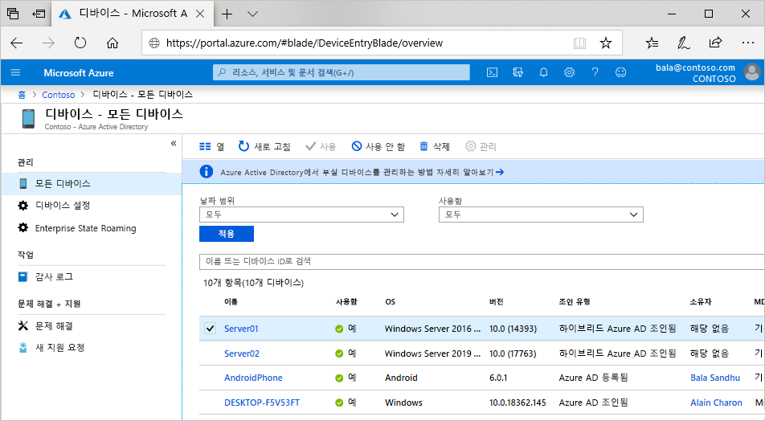

# 디바이스 ID란?

모든 형태와 크기의 디바이스 및 BYOD(Bring Your Own Device) 개념이 확산됨에 따라 IT 전문가는 다음 두 가지 대립되는 목표에 직면하고 있습니다.

- 최종 사용자가 언제 어디서나 생산성을 높일 수 있도록 허용
- 조직의 자산 보호

이와 같은 자산을 보호하려면 IT 직원이 먼저 디바이스 ID를 관리해야 합니다. IT 직원은 Microsoft Intune 같은 도구를 통해 디바이스 ID를 기반으로 빌드하여 보안 및 규정 준수의 표준을 충족하는지 확인할 수 있습니다. Azure AD(Azure Active Directory)에서는 이 디바이스를 통해 어디에서든지 디바이스, 앱 및 서비스에 대해 Single Sign-On을 수행할 수 있습니다.

- 사용자가 필요한 조직 자산에 액세스할 수 있습니다. 
- IT 직원은 조직을 보호하는 데 필요한 컨트롤을 얻습니다.

디바이스 ID 관리는 [디바이스 기반의 조건부 액세스](../conditional-access/require-managed-devices.md)에 대한 기반입니다. 디바이스 기반의 조건부 액세스 정책을 사용할 경우 관리 디바이스를 통해서만 환경의 리소스에 액세스하도록 할 수 있습니다.

## Azure AD에서 디바이스 가져오기

Azure AD에서 디바이스를 가져올 수 있는 여러 가지 옵션이 있습니다.

- **Azure AD 등록**
   - Azure AD 등록 상태의 디바이스는 일반적으로 개인 소유이거나 모바일 디바이스이며 개인 Microsoft 계정 또는 다른 로컬 계정으로 로그인됩니다.
      - 윈도우 10
      - iOS
      - Android
      - MacOS
- **Azure AD 조인**
   - Azure AD 조인 디바이스는 조직이 소유하며 조직에 속한 Azure AD 계정으로 로그인됩니다. 이 디바이스는 클라우드에만 존재합니다.
      - 윈도우 10 
      - Windows Server 2019(서버 코어는 지원되지 않음)
- **하이브리드 Azure AD 조인**
   - 하이브리드 Azure AD 조인 디바이스는 조직이 소유하며 조직에 속한 Azure AD 계정으로 로그인됩니다. 이 디바이스는 클라우드와 온-프레미스에 존재합니다.
      - Windows 7, 8.1 또는 10
      - Windows Server 2008 이상

> [!NOTE]
> 하이브리드 상태는 디바이스 상태를 초과하는 것을 나타냅니다. 하이브리드 상태가 유효하려면 유효한 Azure AD 사용자도 필요합니다.

## 디바이스 관리

Azure AD의 디바이스는 Microsoft Intune, Microsoft Endpoint Configuration Manager, 그룹 정책(하이브리드 Azure AD 조인), MAM(모바일 애플리케이션 관리) 도구 또는 기타 타사 도구와 같은 MDM(모바일 디바이스 관리) 도구를 사용하여 관리할 수 있습니다.

## 리소스 액세스

디바이스를 Azure AD에 등록하고 조인하면 사용자에게 클라우드 리소스에 대한 SSO(Seamless Sign-on)가 제공됩니다. 또한 이 프로세스를 통해 액세스하는 디바이스에 따라 리소스에 조건부 액세스 정책을 적용할 수 있습니다. 

> [!NOTE]
> 디바이스 기반 조건부 액세스 정책에는 하이브리드 Azure AD 조인 디바이스 또는 호환되는 Azure AD 조인 디바이스 또는 Azure AD 등록 디바이스가 필요합니다.

PRT(기본 새로 고침 토큰)는 디바이스에 대한 정보를 포함하며 SSO에 필요합니다. PRT 없이 애플리케이션에 디바이스 기반 조건부 액세스 정책이 설정된 경우 액세스가 거부됩니다. 하이브리드 조건부 액세스 정책에는 하이브리드 상태 디바이스 및 로그인한 유효한 사용자가 필요합니다.

Azure AD 조인 디바이스 또는 하이브리드 Azure AD 조인 디바이스는 클라우드 리소스뿐 아니라 조직의 온-프레미스 리소스에 SSO를 이용할 수 있습니다. 자세한 내용은 [온-프레미스 리소스에 대한 SSO가 Azure AD 조인 디바이스에서 작동하는 방식](azuread-join-sso.md) 문서를 참조하세요.

## 디바이스 보안

- **Azure AD 등록 디바이스**는 최종 사용자가 관리하는 계정을 사용하며, 이 계정은 Microsoft 계정이거나 다음 중 하나 이상으로 보안이 지정된 다른 로컬 관리형 자격 증명입니다.
   - 암호
   - PIN
   - 패턴
   - Windows Hello
- **Azure AD 조인 디바이스 또는 하이브리드 Azure AD 조인 디바이스**는 다음 중 하나 이상으로 보안이 지정된 Azure AD의 조직 계정을 사용합니다.
   - 암호
   - 비즈니스용 Windows Hello

## 프로비전

디바이스를 Azure AD로 가져오는 작업은 셀프 서비스 방식으로 수행하거나 관리자가 제어하는 프로비저닝 프로세스로 수행할 수 있습니다.

## 요약

Azure AD의 디바이스 ID 관리를 사용하면 다음과 같은 작업을 수행할 수 있습니다.

- Azure AD에서 디바이스 가져오기 및 관리 프로세스 간소화
- 사용자가 조직의 클라우드 기반 리소스에 대한 액세스를 편리하게 사용할 수 있도록 제공

## 라이선스 요구 사항

[!INCLUDE [Active Directory P1 license](../../../includes/active-directory-p1-license.md)]

## 다음 단계

- [Azure AD 등록 디바이스](concept-azure-ad-register.md)에 대한 자세한 정보
- [Azure AD 조인 디바이스](concept-azure-ad-join.md)에 대한 자세한 정보
- [하이브리드 Azure AD 조인 디바이스](concept-azure-ad-join-hybrid.md)에 대한 자세한 정보
- Azure Portal에서 디바이스 ID를 관리하는 방법에 대한 개요를 보려면 [Azure Portal을 사용하여 디바이스 ID 관리](device-management-azure-portal.md)를 참조하세요.
- 디바이스 기반의 조건부 액세스에 대한 자세한 내용은 [Azure Active Directory 디바이스 기반 조건부 액세스 정책 구성](../conditional-access/require-managed-devices.md)을 참조하세요.
