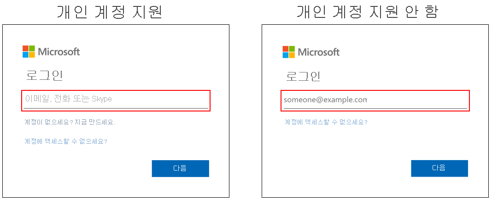

# Azure Active Directory의 Microsoft 계정에 대한 로그인 옵션

Azure AD(Azure Active Directory)용 Microsoft 365 로그인 페이지는 회사 또는 학교 계정과 Microsoft 계정을 지원하지만 사용자의 상황에 따라 하나 또는 둘 다 지원할 수 있습니다. 예를 들어 Azure AD 로그인 페이지는 다음을 지원합니다.

* 두 가지 유형의 계정 모두에서 로그인을 허용하는 앱
* 게스트를 수락하는 조직

## Identification(식별)
사용자 이름 필드의 힌트 텍스트를 살펴보면 조직에서 사용하는 페이지가 Microsoft 계정을 지원하는지 알 수 있습니다. 힌트 텍스트에 "이메일, 휴대폰 또는 Skype"가 표시되면 로그인 페이지는 Microsoft 계정을 지원합니다.

[추가 로그인 옵션은 개인 Microsoft 계정에 대해서만 작동](https://azure.microsoft.com/updates/microsoft-account-signin-options/ )하지만 회사 또는 학교 계정 리소스에 로그인 하는 데 사용할 수 없습니다.

## 다음 단계

[로그인 브랜딩 사용자 지정](../fundamentals/add-custom-domain.md)