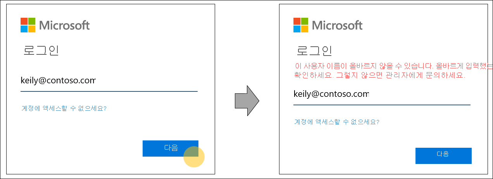
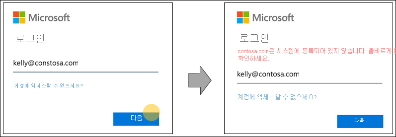
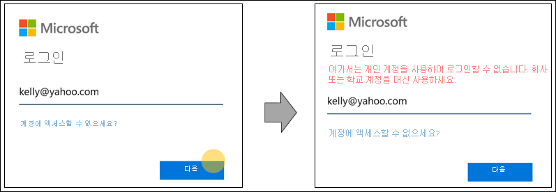
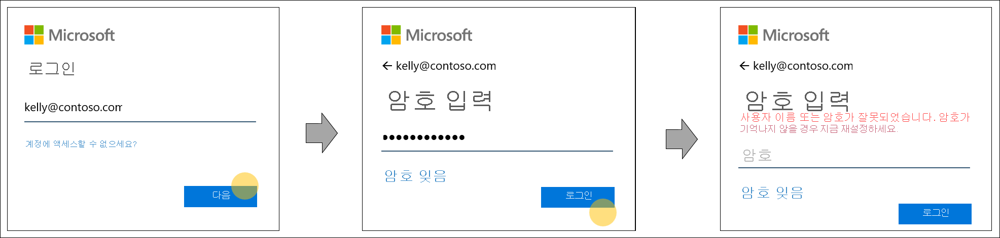

# Azure Active Directory 로그인 페이지에 대한 홈 영역 검색

새 인증 방법을 위한 공간을 확보하고 유용성을 향상시키기 위해 Azure AD(Azure Active Directory) 로그인 동작을 변경하고 있습니다. 로그인하는 동안 Azure AD는 사용자가 인증해야 하는 위치를 결정합니다. Azure AD는 로그인 페이지에 입력한 사용자 이름에 대한 조직 및 사용자 설정을 읽어 지능적 결정을 내립니다. 이는 FIDO 2.0과 같은 추가 자격 증명을 사용하는 암호 없는 미래를 위한 단계입니다.

## 홈 영역 검색 동작

지금까지 홈 영역 검색은 일부 레거시 애플리케이션에 대한 홈 영역 검색 정책 또는 로그인 시 제공되는 도메인에 의해 제어됩니다. 예를 들어 검색 동작에서 Azure Active Directory 사용자가 자신의 사용자 이름을 잘못 입력하더라도 해당 조직의 자격 증명 컬렉션 화면이 표시될 수 있습니다. 이는 사용자가 조직의 도메인 이름 “contoso.com”을 정확히 제공하는 경우 발생합니다. 이 동작은 세분성으로 인해 개별 사용자에 대한 경험이 사용자 정의되는 것을 허용하지 않습니다.

더 광범위한 자격 증명을 지원하고 유용성을 높이기 위해 로그인 프로세스 동안의 Azure Active Directory의 사용자 이름 조회 동작이 업데이트되었습니다. 새로운 동작으로 로그인 페이지에 입력한 사용자 이름을 기반으로 한 조직 수준 및 사용자 수준 설정을 읽어 지능적 결정을 내립니다. 이를 위해 Azure Active Directory는 로그인 페이지에 입력된 사용자 이름이 지정된 도메인에 있는지 확인하거나 사용자에게 자격 증명을 제공하도록 리디렉션합니다.

이 작업의 추가적인 혜택은 향상된 오류 메시지입니다. Azure Active Directory 사용자만 지원하는 애플리케이션에 로그인하는 경우의 향상된 오류 메시징의 몇 가지 예제는 다음과 같습니다.

- 사용자 이름의 철자가 잘못되었거나 사용자 이름이 아직 Azure AD와 동기화되지 않았습니다.
  
    
  
- 도메인 이름이 잘못 입력되었습니다.
  
    
  
- 사용자가 알려진 소비자 도메인으로 로그인하려고 합니다.
  
    
  
- 암호를 잘못 입력했지만 사용자 이름이 정확합니다.  
  
    
  
> [!IMPORTANT]
> 이 기능은 페더레이션을 강제로 적용하기 위해 이전 도메인 수준 홈 영역 검색에 의존하는 페더레이션된 도메인에 영향을 미칠 수 있습니다. 페더레이션된 도메인 지원을 추가하는 경우에 대한 업데이트는 [Microsoft 365 서비스에 로그인 시 홈 영역 검색](https://azure.microsoft.com/updates/signin-hrd/)을 참조하세요. 한편, 일부 조직에서는 Azure Active Directory에 없지만 올바른 도메인 이름을 포함하는 사용자 이름으로 로그인하도록 직원을 교육했습니다. 도메인 이름은 현재 조직의 도메인 엔드포인트로 사용자를 라우팅하기 때문입니다. 새 로그인 동작은 이를 허용하지 않습니다. 사용자에게 사용자 이름을 수정하라는 알림이 표시되고 Azure Active Directory에 없는 사용자 이름으로 로그인할 수 없습니다.
>
> 사용자 또는 조직에서 이전 동작에 의존하는 사례를 실행한다면 조직 관리자가 직원 로그인 및 인증 설명서를 업데이트하고, 직원들이 본인의 Azure Active Directory 사용자 이름을 사용하여 로그인하도록 교육하는 것이 중요합니다.
  
새 동작에 문제가 있는 경우 이 문서의 **피드백** 섹션에 의견을 남겨 주세요.  

## 다음 단계

[로그인 브랜딩 사용자 지정](../fundamentals/add-custom-domain.md)
