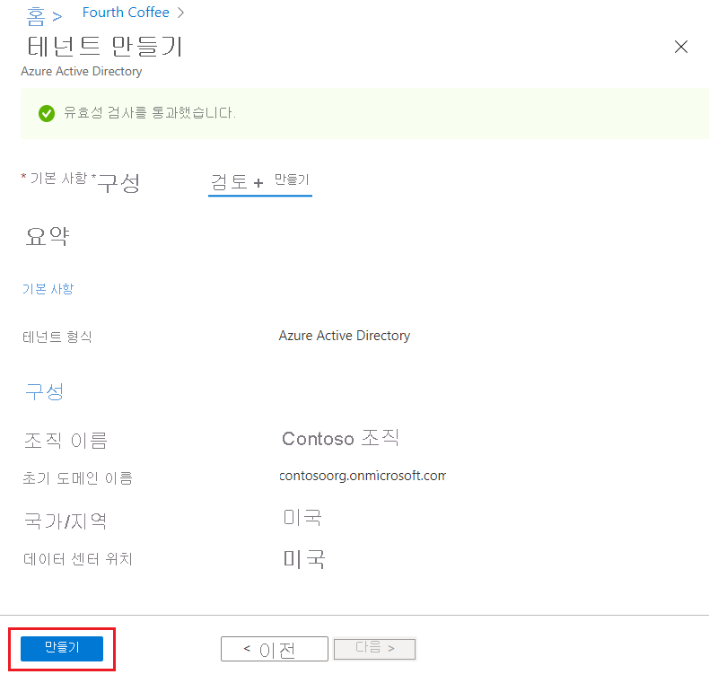

# 빠른 시작: Azure Active Directory에서 새 테넌트 만들기

Azure AD(Azure Active Directory) 포털을 사용하여 조직의 테넌트를 새로 만드는 작업을 비롯한 모든 관리 작업을 수행할 수 있습니다. 

이 빠른 시작에서는 Azure Portal과 Azure Active Directory에 액세스하는 방법과 조직의 기본 테넌트를 만드는 방법을 배웁니다.

Azure 구독이 아직 없는 경우 시작하기 전에 [체험 계정](https://azure.microsoft.com/free/)을 만듭니다.

## 조직의 테넌트 새로 만들기

Azure Portal에 로그인한 후에 조직의 테넌트를 새로 만들 수 있습니다. 새 테넌트는 조직을 대표하며 내외부 사용자를 위한 Microsoft 클라우드 서비스의 특정 인스턴스를 관리하는 데 도움이 됩니다.

### 새 테넌트를 만들려면

1. 조직의 [Azure Portal](https://portal.azure.com/)에 로그인합니다.

1. Azure Portal 메뉴에서 **Azure Active Directory** 를 선택합니다.  

    <kbd></kbd>  

1. **테넌트 만들기** 를 선택합니다.

1. 기본 사항 탭에서 만들려는 테넌트의 유형을 **Azure Active Directory** 또는 **Azure Active Directory(B2C)** 중에서 선택합니다.

1. 완료되면 **다음: 구성** 을 선택하여 구성 탭으로 이동합니다.

    <kbd></kbd>

1.  구성 탭에서 다음 정보를 입력합니다.
    
    - **조직 이름** 상자에 _Contoso 조직_ 을 입력합니다.

    - **초기 도메인 이름** 상자에 _Contosoorg_ 를 입력합니다.

    - **국가 또는 지역** 상자의 _미국_ 옵션은 그대로 사용합니다.

1. 완료되면 **다음: 검토 + 만들기** 를 선택합니다. 입력한 정보를 검토하여 정보가 올바르면 **만들기** 를 선택합니다.

    <kbd></kbd>

도메인 contoso.onmicrosoft.com으로 새 테넌트가 생성되었습니다.

## 새 테넌트의 사용자 계정

새 Azure AD 테넌트를 만들면 해당 테넌트의 첫 번째 사용자가 됩니다. 첫 번째 사용자는 [전역 관리자](https://docs.microsoft.com/azure/active-directory/roles/permissions-reference#global-administrator) 역할이 자동으로 할당됩니다. [**사용자**](https://portal.azure.com/#blade/Microsoft_AAD_IAM/UsersManagementMenuBlade/MsGraphUsers) 페이지로 이동하여 사용자 계정을 확인합니다.

기본적으로 테넌트의 [기술 담당자](https://docs.microsoft.com/microsoft-365/admin/manage/change-address-contact-and-more?view=o365-worldwide#what-do-these-fields-mean)로도 나열됩니다. 기술 연락처 정보는 [**속성**](https://portal.azure.com/#blade/Microsoft_AAD_IAM/ActiveDirectoryMenuBlade/Properties)에서 변경할 수 있습니다.

> [!WARNING]
> 디렉터리에 전역 관리자 권한이 할당된 계정이 두 개 이상 있는지 확인합니다. 이렇게 하면 전역 관리자 한명이 잠겨 있는 경우에 도움이 됩니다. 자세한 내용은 [Azure AD의 응급 액세스 계정 관리](../roles/security-emergency-access.md) 문서를 참조하세요.

## 리소스 정리

이 애플리케이션을 계속 사용하지 않으려면 다음 절차를 사용하여 테넌트를 삭제할 수 있습니다.

- Azure Portal의 **디렉터리 + 구독** 필터를 통해 삭제할 디렉터리에 로그인했는지 확인합니다. 필요한 경우 대상 디렉터리로 전환합니다.
- **Azure Active Directory** 를 선택한 다음, **Contoso - 개요** 페이지에서 **디렉터리 삭제** 를 선택합니다.

    테넌트 및 연결된 정보가 삭제됩니다.

    <kbd></kbd>

## 다음 단계

- 도메인 이름 변경 또는 추가 - [Azure Active Directory에 사용자 지정 도메인 이름을 추가하는 방법](add-custom-domain.md)을 참조하세요.

- 사용자 추가 - [새 사용자 추가 또는 삭제](add-users-azure-active-directory.md)를 참조하세요.

- 그룹 및 멤버 추가 - [기본 그룹 만들기 및 멤버 추가](active-directory-groups-create-azure-portal.md)를 참조하세요.

- 조직의 애플리케이션 및 리소스 액세스를 관리하는 데 도움이 되는 [PIM(Privileged Identity Management)을 사용한 역할 기반 액세스](../../role-based-access-control/best-practices.md) 및 [조건부 액세스](../../role-based-access-control/conditional-access-azure-management.md)에 대해 알아봅니다.

- [기본 라이선스 정보, 용어, 관련 기능](active-directory-whatis.md) 등, Azure AD에 대해 알아봅니다.
