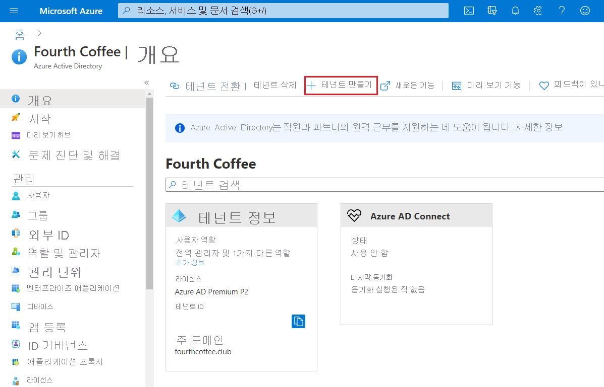
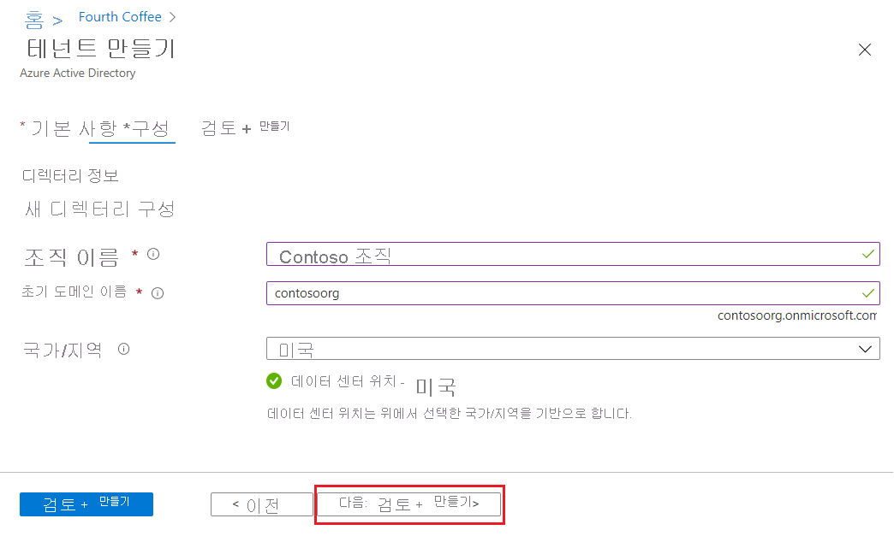
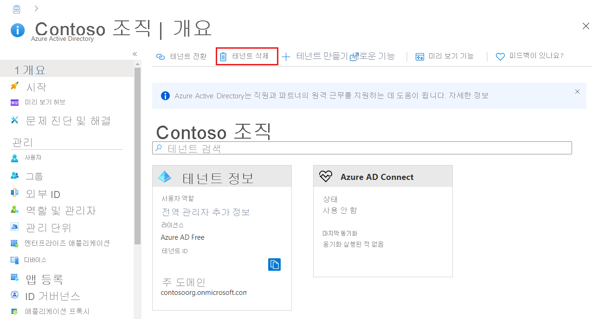

# 빠른 시작: Azure Active Directory에서 새 테넌트 만들기
Azure AD(Azure Active Directory) 포털을 사용하여 조직의 테넌트를 새로 만드는 작업을 비롯한 모든 관리 작업을 수행할 수 있습니다. 

이 빠른 시작에서는 Azure Portal과 Azure Active Directory에 액세스하는 방법과 조직의 기본 테넌트를 만드는 방법을 배웁니다.

Azure 구독이 아직 없는 경우 시작하기 전에 [무료 계정](https://azure.microsoft.com/free/) 을 만듭니다.

## Azure Portal에 로그인
전역 관리자 계정을 사용하여 조직의 [Azure Portal](https://portal.azure.com/)에 로그인합니다.

## 조직의 테넌트 새로 만들기
Azure Portal에 로그인한 후에 조직의 테넌트를 새로 만들 수 있습니다. 새 테넌트는 조직을 대표하며 내외부 사용자를 위한 Microsoft 클라우드 서비스의 특정 인스턴스를 관리하는 데 도움이 됩니다.

### 새 테넌트를 만들려면
1. **Azure Active Directory**를 선택하고 **리소스 만들기**를 선택한 다음, **ID**를 선택하고 **Azure Active Directory**를 선택합니다.

    **디렉터리 만들기** 페이지가 나타납니다.

    

2.  **디렉터리 만들기** 페이지에서 다음 정보를 입력합니다.
    
    - **조직 이름** 상자에 _Contoso_를 입력합니다.

    - **초기 도메인 이름** 상자에 _Contoso_를 입력합니다.

    - **국가 또는 지역** 상자의 _미국_ 옵션은 그대로 사용합니다.

3. **만들기**를 선택합니다.

도메인 contoso.onmicrosoft.com으로 새 테넌트가 생성되었습니다.

## 리소스 정리
이 응용 프로그램을 계속 사용하지 않으려면 다음 절차를 사용하여 테넌트를 삭제할 수 있습니다.

- **Azure Active Directory**를 선택한 다음, **Contoso - 개요** 페이지에서 **디렉터리 삭제**를 선택합니다.

    테넌트 및 연결된 정보가 삭제됩니다.

    

## 다음 단계
- 도메인 이름 변경 또는 추가 - [Azure Active Directory에 사용자 지정 도메인 이름을 추가하는 방법](add-custom-domain.md)을 참조하세요.

- 사용자 추가 - [새 사용자 추가 또는 삭제](add-users-azure-active-directory.md)를 참조하세요.

- 그룹 및 멤버 추가 - [기본 그룹 만들기 및 멤버 추가](active-directory-groups-create-azure-portal.md)를 참조하세요.

- 조직의 응용 프로그램 및 리소스 액세스를 관리하는 데 도움이 되는 [PIM(Privileged Identity Management)을 사용한 역할 기반 액세스](../../role-based-access-control/pim-azure-resource.md) 및 [조건부 액세스](../../role-based-access-control/conditional-access-azure-management.md)에 대해 알아봅니다.

- [기본 라이선스 정보, 용어, 관련 기능](active-directory-whatis.md) 등, Azure AD에 대해 알아봅니다.
