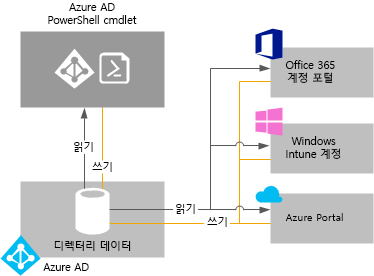

# Azure Active Directory 테넌트 관리

## Azure AD 테넌트란?
Azure AD(Azure Active Directory)에서 테넌트는 조직이 Azure 또는 Office 365와 같은 Microsoft 클라우드 서비스에 등록할 때 수신하는 Azure AD 디렉터리의 전용 인스턴스입니다. 각 Azure AD 디렉터리는 고유하며 다른 Azure AD 디렉터리와 구분됩니다. 회사 사무실 건물이 해당 조직에게만 속하는 안전한 자산인 것처럼 Azure AD 디렉터리도 조직에서만 사용하기 위해 자산을 보호하도록 설계되었습니다. Azure AD 디렉터리의 사용자 및 관리자가 실수로 또는 악의적으로 다른 디렉터리의 데이터에 액세스할 수 없도록 Azure AD 아키텍처는 고객 데이터와 ID 정보를 격리합니다.

## Azure AD 디렉터리를 받으려면 어떻게 하나요?
Azure AD는 다음을 포함하여 대부분의 Microsoft 클라우드 서비스 뒤에 핵심 디렉터리 및 ID 관리 기능을 제공합니다.

* Azure
* Microsoft Office 365
* Microsoft Dynamics CRM Online
* Microsoft Intune

Azure AD 디렉터리는 이러한 Microsoft 클라우드 서비스에 등록하면 제공됩니다. 필요에 따라 추가 디렉터리를 만들 수 있습니다. 예를 들어 첫 번째 디렉터리는 프로덕션 디렉터리로 유지 관리하고 테스트나 준비용으로 다른 디렉터리를 만들 수 있습니다.

### 새 Azure 구독과 함께 제공되는 Azure AD 디렉터리 사용

다른 Microsoft 서비스에 등록하는 경우 첫 번째 서비스에 사용한 관리자 계정을 사용하는 것이 좋습니다. 처음으로 Microsoft 서비스에 등록할 때 제공하는 정보는 조직에서 새로운 Azure AD 디렉터리 인스턴스를 만드는 데 사용됩니다. 다른 Microsoft 서비스를 구독할 때 로그인 시도를 인증하는 데 해당 디렉터리를 사용하는 경우 기본 디렉터리에서 구성한 기존 사용자 계정, 정책, 설정 또는 온-프레미스 디렉터리 통합을 사용할 수 있습니다.

예를 들어, Microsoft Intune 구독에 등록한 다음 추가 온-프레미스 Active Directory를 Azure AD 디렉터리와 동기화하는 경우 Office 365와 같은 다른 Microsoft 서비스에 등록하고 쉽게 Microsoft Intune에 포함된 동일한 디렉터리 통합 혜택을 얻을 수 있습니다.

Azure AD와 온-프레미스 디렉터리 통합에 대한 자세한 내용은 [Azure AD Connect와 디렉터리 통합](../hybrid/whatis-hybrid-identity.md)을 참조하세요.

### 새 Azure 구독과 기존 Azure AD 디렉터리 연결
기존 Office 365 또는 Microsoft Intune 구독에 대한 로그인을 인증한 동일한 디렉터리와 새 Azure 구독을 연결할 수 있습니다. 이 시나리오에 대한 자세한 내용은 [다른 계정에 Azure 구독의 소유권 이전](../../billing/billing-subscription-transfer.md)을 참조하세요.

### 조직으로 Microsoft 클라우드 서비스에 등록하여 Azure AD 디렉터리 만들기
아직 Microsoft 클라우드 서비스에 대한 구독이 없는 경우 다음 링크 중 하나를 사용하여 등록하면 됩니다. 첫 번째 서비스에 등록하면 Azure AD 디렉터리가 자동으로 만들어집니다.

* [Microsoft Azure](https://account.azure.com/organization)
* [Office 365](https://products.office.com/business/compare-office-365-for-business-plans/)
* [Microsoft Intune](https://portal.office.com/Signup/Signup.aspx?OfferId=40BE278A-DFD1-470a-9EF7-9F2596EA7FF9&dl=INTUNE_A&ali=1#0%20)

### 구독의 기본 디렉터리를 변경하는 방법

1. 구독 소유권을 이전할 구독의 계정 관리자인 계정으로 [Azure 계정 센터](https://account.azure.com/Subscriptions)에 로그인합니다.
2. 구독 소유자로 선택한 사용자가가 대상 디렉터리에 있는지 확인합니다.
3. **구독 이전**을 클릭합니다.
4. 받는 사람을 지정합니다. 받는 사람은 수락 링크가 포함된 전자 메일을 자동으로 받게 됩니다.
5. 받는 사람은 링크를 클릭하고 지불 정보 입력 등의 지침을 따릅니다. 받는 사람이 성공하면 구독이 이전됩니다. 
6. 구독 소유권 양도가 성공하면 구독의 기본 디렉터리는 해당 사용자가 있는 디렉터리로 변경됩니다.

자세한 내용은 [Azure 구독 소유권을 다른 계정에 양도](../../billing/billing-subscription-transfer.md)를 참조하세요.

### Azure에서 기본 디렉터리 관리
Azure에 등록하면 기본 Azure AD 디렉터리가 구독과 연결됩니다. Azure AD를 사용하는 비용이 청구되지 않고 디렉터리는 체험용 리소스입니다. 별도로 사용이 허가되고 로그인 시 회사 브랜딩 및 셀프 서비스 암호 재설정과 같은 추가 기능을 제공하는 Azure AD 서비스에는 비용이 청구됩니다. 기본 *.onmicrosoft.com 도메인 대신 소유한 DNS 이름을 사용하여 사용자 지정 도메인을 만들 수도 있습니다.

## 디렉터리 데이터를 관리하는 방법
하나 이상의 Microsoft 클라우드 서비스 구독을 관리하려면 [Azure AD 관리 센터](https://aad.portal.azure.com), Microsoft Intune 계정 포털 또는 [Office 365 관리 센터](https://portal.office.com/)를 사용하여 조직의 디렉터리 데이터를 관리할 수 있습니다. 또한 [Azure Active Directory PowerShell cmdlet](https://docs.microsoft.com/powershell/azure/active-directory)을 사용하여 Azure AD에 저장된 데이터를 관리할 수 있습니다.

이러한 포털(또는 cmdlet)에서는 다음을 수행할 수 있습니다.

* 사용자 및 그룹 계정 만들기 및 관리
* 조직의 구독에서 관련 클라우드 서비스 관리
* Azure AD ID 및 인증 서비스와 온-프레미스 통합 설정

Azure AD 관리 센터, Office 365 관리 센터, Microsoft Intune 계정 포털 및 Azure AD cmdlet은 모두 조직의 디렉터리와 연결된 Azure AD의 단일 공유 인스턴스에서 읽고 씁니다. 해당 도구는 각각 디렉터리 데이터를 가져오거나 변경하는 프런트 엔드 인터페이스로 작동합니다.
이러한 서비스 중 하나의 컨텍스트에서 로그인한 동안 포털 또는 cmdlet 중 하나를 사용하여 조직의 데이터를 변경한 경우 변경 내용은 다음에 로그인할 때 다른 포털에도 표시됩니다. 이 데이터는 구독하는 Microsoft 클라우드 서비스에서 공유됩니다.

예를 들어 Office 365 관리 센터를 사용하여 사용자의 로그인을 차단한 경우 조직에서 현재 구독하는 다른 모든 서비스에 대한 사용자의 로그인도 차단됩니다. Microsoft Intune 계정 포털에서 동일한 사용자 계정을 보면 사용자가 차단되었음을 알 수 있습니다.

## 여러 디렉터리를 추가하고 관리하려면 어떻게 하나요?
[Azure Portal에서 Azure AD 디렉터리를 추가](https://portal.azure.com/#create/Microsoft.AzureActiveDirectory)할 수 있습니다. 정보를 입력하고 **만들기**를 선택합니다.

각 디렉터리를 완전히 독립된 리소스로 관리할 수 있습니다. 각 디렉터리는 관리하는 다른 디렉터리와 논리적으로 독립된 완전한 기능을 갖춘 피어이며, 디렉터리 간에는 부모 자식 관계가 없습니다. 디렉터리 간 독립성에는 리소스 독립성, 관리 독립성 및 동기화 독립성이 포함됩니다.

* **리소스 독립성**. 외부 사용자를 부분적으로 제외하고 한 디렉터리에서 리소스를 만들거나 삭제해도 다른 디렉터리의 리소스에 영향을 주지 않습니다. 한 디렉터리에서 사용자 지정 도메인 'contoso.com'을 사용하는 경우 다른 디렉터리에서 사용할 수 없습니다.
* **관리 독립성**.  'Contoso' 디렉터리의 관리자가 아닌 사용자가 테스트 디렉터리 ‘Test’를 만들면 다음과 같이 수행됩니다.
  
  * 'Contoso' 디렉터리의 관리자는 'Test'의 관리자가 'Test' 디렉터리에 대한 관리 권한을 특별히 부여하지 않는 한 이 디렉터리에 대한 직접 관리 권한이 없습니다. 'Contoso'의 관리자는 'Test'를 만든 사용자 계정에 대한 제어 권한을 통해 'Test' 디렉터리에 대한 액세스를 제어할 수 있습니다.
    
  * 또한 한 디렉터리에서 사용자의 관리자 역할을 할당하거나 제거하는 경우 변경 내용은 사용자가 다른 디렉터리에서 가질 수 있는 관리자 역할에 영향을 주지 않습니다.
* **동기화 독립성**. 각 Azure AD 테넌트를 독립적으로 구성하여 Azure AD Connect 디렉터리 동기화 도구의 단일 인스턴스에서 데이터를 동기화할 수 있습니다.

다른 Azure 리소스와 달리 디렉터리는 Azure 구독의 자식 리소스가 아닙니다. 따라서 Azure 구독을 취소하거나 만료를 허용하는 경우에도 Azure AD PowerShell, Azure Graph API 또는 Office 365 관리 센터와 같은 다른 인터페이스를 사용하여 디렉터리 데이터에 계속 액세스할 수 있습니다. 다른 구독을 디렉터리와 연결할 수도 있습니다.

## Azure AD 디렉터리를 삭제하려면 어떻게 준비해야 하나요?
전역 관리자는 포털에서 Azure AD 디렉터리를 삭제할 수 있습니다. 디렉터리가 삭제되는 경우 디렉터리에 포함된 리소스는 모두 삭제됩니다. 디렉터리를 삭제하기 전에 필요하지 않는지 확인합니다.

> [!NOTE]
> 사용자가 회사 또는 학교 계정을 사용하여 로그인하는 경우 사용자는 해당 홈 디렉터리를 삭제하지 않습니다. 예를 들어 사용자가 joe@contoso.onmicrosoft.com으로 로그인한 경우 해당 사용자는 contoso.onmicrosoft.com을 기본 도메인으로 사용하는 디렉터리를 삭제할 수 없습니다.

Azure AD에서 디렉터리를 삭제하려면 특정 조건을 충족해야 합니다. 이렇게 하면 디렉터리 삭제로 인해 Office 365에 로그인하거나 Azure의 리소스에 액세스하는 사용자의 기능 등 사용자나 응용 프로그램에 부정적인 영향을 주는 위험을 줄일 수 있습니다. 예를 들어 구독의 디렉터리가 의도하지 않게 삭제된 경우 사용자가 해당 구독에 대한 Azure 리소스에 액세스할 수 없습니다.

다음과 같은 조건을 확인합니다.

* 디렉터리의 유일한 사용자가 디렉터리를 삭제할 전역 관리자여야 합니다. 디렉터리를 삭제하려면 먼저 다른 모든 사용자를 삭제해야 합니다. 사용자가 온-프레미스에서 동기화된 경우 동기화를 해제해야 하며 Azure Portal 또는 Azure PowerShell cmdlet을 사용하여 클라우드 디렉터리에서 사용자를 삭제해야 합니다. Office 365 관리 센터에서 추가된 연락처와 같은 그룹이나 연락처를 삭제하는 요구 사항은 없습니다.
* 디렉터리에 응용 프로그램이 없을 수 있습니다. 디렉터리를 삭제하려면 먼저 응용 프로그램을 모두 삭제해야 합니다.
* Multi-Factor Authentication 공급자를 디렉터리에 연결할 수 없습니다.
* Microsoft Azure, Office 365 또는 Azure AD Premium 등 Microsoft Online Services에 대한 구독이 디렉터리에 연결되어 있지 않습니다. 예를 들어 Azure에서 직접 기본 디렉터리를 만든 경우 Azure 구독에서 인증에 이 디렉터리를 계속 사용하면 이 디렉터리를 삭제할 수 없습니다. 마찬가지로 다른 사용자가 구독을 연결한 경우 디렉터리를 삭제할 수 없습니다. 

## 다음 단계
* [Azure AD 포럼](https://social.msdn.microsoft.com/forums/azure/en-US/home?forum=windowsazuread)
* [Azure Multi-Factor Authentication Forum](https://social.msdn.microsoft.com/Forums/azure/en-US/home?forum=windowsazureactiveauthentication)
* [Azure 질문에 대한 StackOverflow](https://stackoverflow.com/questions/tagged/azure-active-directory)
* [Azure Active Directory PowerShell](https://docs.microsoft.com/powershell/azure/active-directory)
* [Azure AD에서 관리자 역할 할당](../users-groups-roles/directory-assign-admin-roles.md)
