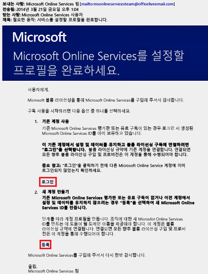
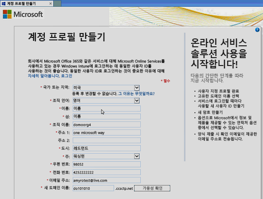
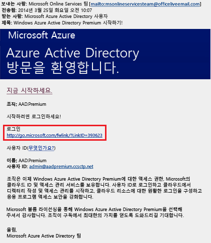
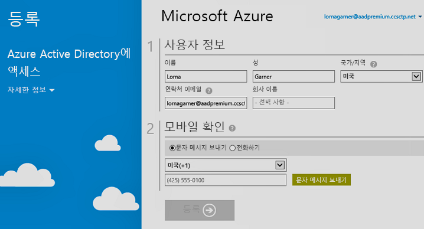

# Azure Active Directory Premium Edition에 가입
Azure AD(Azure Active Directory) Premium Edition을 구매하고 Azure 구독에 연결할 수 있습니다. 새로운 Azure 구독을 만들어야 하는 경우 라이선싱 계획 및 Azure AD 서비스 액세스도 활성화해야 합니다.

> [!NOTE]
>Azure AD Premium 및 Basic 버전은 Azure Active Directory의 전 세계 인스턴스를 사용하여 중국의 고객에게 제공됩니다. Azure AD Premium 및 Basic 버전은 현재 중국 21Vianet이 운영하는 Azure 서비스에서 지원되지 않습니다. 자세한 내용은 [Azure Active Directory 포럼](https://feedback.azure.com/forums/169401-azure-active-directory/)을 사용하여 문의하세요.

Active Directory Premium 1 또는 Premium 2에 등록하기 전에 먼저 기존 구독 또는 플랜 중 사용할 항목을 결정해야 합니다.

- 기존 Azure 또는 Office 365 구독을 통해

- Enterprise Mobility + Security 라이선싱 플랜을 통해

- Microsoft 볼륨 라이선싱 플랜을 통해

이전에 구매하고 활성화한 Azure AD 라이선스와 함께 Azure 구독을 사용하여 등록하면 동일 디렉터리에서 라이선스가 자동으로 활성화됩니다. 그렇지 않은 경우에는 라이선스 플랜 및 Azure AD 액세스를 활성화해야 합니다. 라이선스 플랜을 활성화하는 방법에 대한 자세한 내용은 [새 라이선스 플랜 활성화](#activate-your-new-license-plan)를 참조하세요. Azure AD 액세스를 활성화하는 방법에 대한 자세한 내용은 [Azure AD 액세스 활성화](#activate-your-azure-ad-access)를 참조하세요. 

## 기존 Azure 또는 Office 365 구독을 사용하여 등록
Azure 또는 Office 365 구독자는 Azure Active Directory Premium Edition을 온라인으로 구매할 수 있습니다. 자세한 단계는 [Azure Active Directory Premium을 구입하는 방법 - 기존 고객](https://channel9.msdn.com/Series/Azure-Active-Directory-Videos-Demos/How-to-Purchase-Azure-Active-Directory-Premium-Existing-Customer) 또는 [Azure Active Directory Premium을 구입하는 방법 - 새로운 고객](https://channel9.msdn.com/Series/Azure-Active-Directory-Videos-Demos/How-to-Purchase-Azure-Active-Directory-Premium-New-Customers)을 참조하세요.

## Enterprise Mobility + Security 라이선싱 플랜을 사용하여 등록
Enterprise Mobility + Security는 Azure AD Premium, Azure Information Protection 및 Microsoft Intune으로 구성된 제품군입니다. 이미 EMS 라이선스가 있다면 다음 라이선싱 옵션 중 하나를 사용하여 Azure AD로 시작할 수 있습니다.

EMS에 대한 자세한 내용은 [Enterprise Mobility + Security 웹 사이트](https://www.microsoft.com/cloud-platform/enterprise-mobility-security)를 참조하세요.

- 무료 [Enterprise Mobility + Security E5 평가판 구독](https://signup.microsoft.com/Signup?OfferId=87dd2714-d452-48a0-a809-d2f58c4f68b7&ali=1)으로 EMS 사용해 보기

- [Enterprise Mobility + Security E5 라이선스](https://signup.microsoft.com/Signup?OfferId=e6de2192-536a-4dc3-afdc-9e2602b6c790&ali=1) 구매

- [Enterprise Mobility + Security E3 라이선스](https://signup.microsoft.com/Signup?OfferId=4BBA281F-95E8-4136-8B0F-037D6062F54C&ali=1) 구매

## Microsoft 볼륨 라이선싱 플랜을 사용하여 등록
Microsoft 볼륨 라이선싱 플랜을 통해 가져오려는 라이선스 수에 따라 다음 두 프로그램 중 하나를 사용하여 Azure AD Premium에 등록할 수 있습니다.

- **250개 이상 라이선스.** [Microsoft 기업계약](https://www.microsoft.com/en-us/licensing/licensing-programs/enterprise.aspx)

- **5~250개 라이선스.** [오픈 볼륨 라이선스](https://www.microsoft.com/en-us/licensing/licensing-programs/open-license.aspx)

볼륨 라이선싱 구매 옵션에 대한 자세한 내용은 [볼륨 라이선싱을 통해 구매하는 방법](https://www.microsoft.com/en-us/licensing/how-to-buy/how-to-buy.aspx)을 참조하세요.

## 새 라이선스 플랜 활성화
새 Azure AD 라이선스 플랜을 사용하여 등록한 경우에는 구매 후에 받은 확인 메일을 사용하여 조직을 위해 해당 라이선스 플랜을 활성화해야 합니다.

### 라이선스 플랜을 활성화하려면
- 등록한 후 Microsoft에서 받은 확인 메일을 열고 **로그인** 또는 **등록**을 클릭합니다.
   
    

    - **로그인.** 기존 테넌트가 있는 경우 이 링크를 선택한 후 기존 관리자 계정을 사용하여 로그인합니다. 라이선스가 활성화되는 테넌트의 글로벌 관리자여야 합니다.

    - **등록.** **계정 프로필 만들기** 페이지를 열려면 이 링크를 선택하고 라이선싱 플랜을 위한 새 Azure AD 테넌트를 만듭니다.

        

작업을 마치면 테넌트의 라이선스 플랜을 활성화할 수 있는 확인 상자가 표시됩니다.

## Azure AD 액세스 활성화
기존 구독에 새 Azure AD Premium 라이선스를 추가하는 경우 Azure AD 액세스가 이미 활성화되어 있어야 합니다. 그렇지 않으면 **환영 전자 메일**을 받은 후 Azure AD 액세스를 활성화해야 합니다.  

라이선스를 구매하고 디렉터리에서 프로비전한 후 **환영 메일**을 받게 됩니다. 이 메일은 Azure AD Premium 또는 Enterprise Mobility + Security 라이선스 및 기능에 대한 관리를 시작할 수 있다는 것을 확인해 줍니다. 

> [!TIP]
> 환영 메일에서 Azure AD 디렉터리 액세스를 활성화할 때까지 새 테넌트에 대한 Azure AD에 액세스할 수 없습니다.

### Azure AD 액세스를 활성화하려면

1. **환영 메일**을 연 후 **로그인**을 클릭합니다.
   
    

2. 성공적으로 로그인한 후 모바일 디바이스를 사용하여 2단계 확인을 거칩니다.
   
    

일반적으로 몇 분 만에 활성화 프로세스가 완료된 후 Azure AD 테넌트를 사용할 수 있습니다. 

## 다음 단계
이제 Azure AD Premium이 있으므로 [도메인을 사용자 지정하고](add-custom-domain.md), [회사 브랜딩](customize-branding.md)을 추가하고, [테넌트를 만들고](active-directory-access-create-new-tenant.md), [그룹](active-directory-groups-create-azure-portal.md) 및 [사용자를 추가](add-users-azure-active-directory.md)할 수 있습니다.
