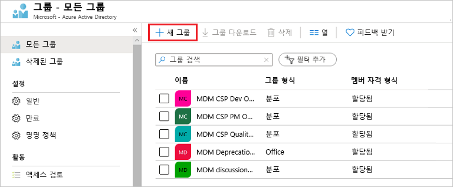
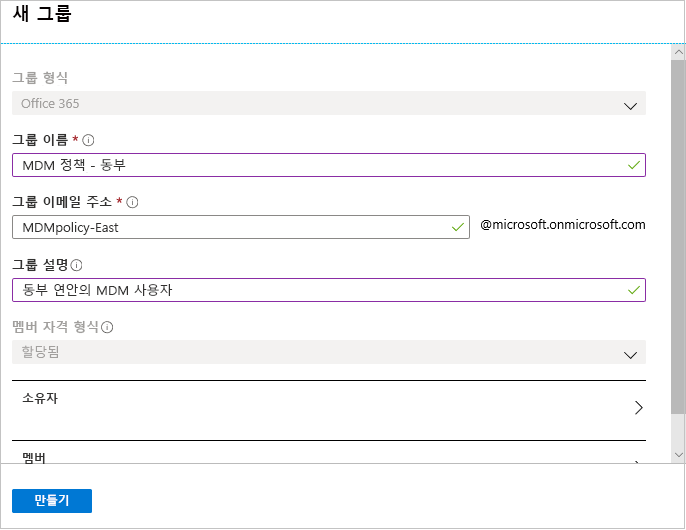
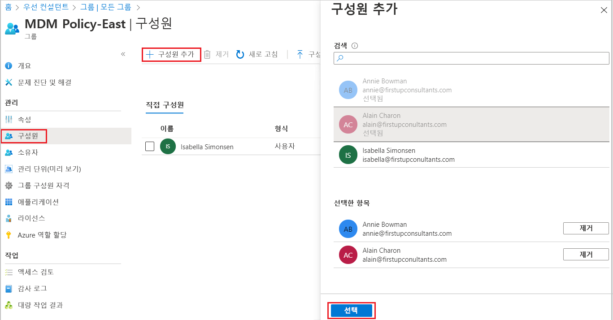
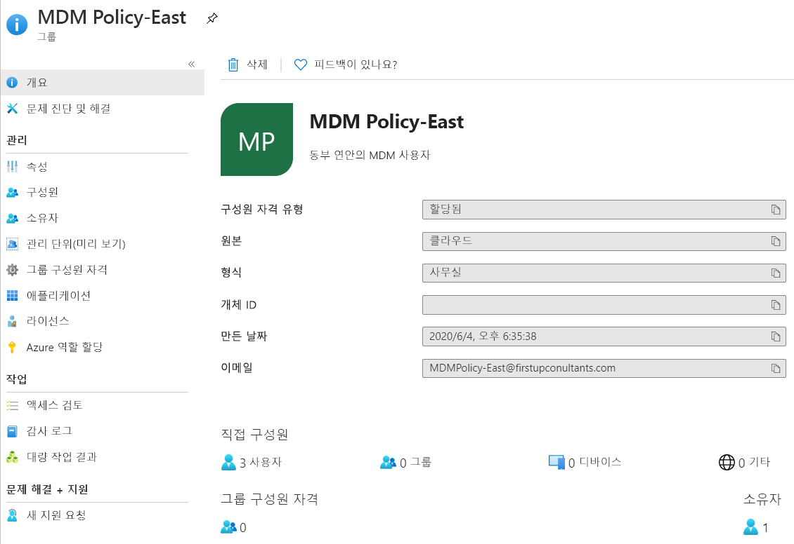

# Azure Active Directory를 사용하여 기본 그룹 만들기 및 멤버 추가
Azure AD(Azure Active Directory) 포털을 사용하여 기본 그룹을 만들 수 있습니다. 이 문서에서 기본 그룹은 리소스 소유자(관리자)에 의해 단일 리소스에 추가되고 해당 리소스에 액세스해야 하는 특정 멤버(직원)를 포함합니다. 동적 멤버 자격 및 규칙 만들기를 포함한 더 복잡한 시나리오의 경우 [Azure Active Directory 사용자 관리 설명서](../users-groups-roles/index.yml)를 참조하세요.

## 기본 그룹 만들기 및 멤버 추가
기본 그룹을 만들고 동시에 멤버를 추가할 수 있습니다.

### 기본 그룹을 만들고 멤버를 추가하려면
1. 해당 디렉터리에 대한 글로벌 관리자 계정을 사용하여 [Azure Portal](https://portal.azure.com)에 로그인합니다.

2. **Azure Active Directory**, **그룹**을 선택한 다음, **새 그룹**을 선택합니다.

    

3. **그룹** 페이지에서 필요한 정보를 입력합니다.

    

    - **그룹 유형(필수).** 미리 정의된 그룹 유형을 선택합니다. 다음 내용이 포함됩니다.
        
        - **보안**. 사용자 그룹의 공유 리소스에 대한 멤버 및 컴퓨터 액세스를 관리하는 데 사용됩니다. 예를 들어 특정 보안 정책의 보안 그룹을 만들 수 있습니다. 이렇게 하면 각 멤버에 개별적으로 권한을 추가할 필요 없이 한 번에 모든 멤버에게 권한 집합을 제공할 수 있습니다. 리소스의 액세스 관리 방법에 대한 자세한 내용은 [Azure Active Directory 그룹을 사용하여 리소스에 대한 액세스 관리](active-directory-manage-groups.md)를 참조하세요.
        
        - **Office 365**. 공유 사서함, 일정, 파일, SharePoint 사이트 등에 대한 액세스를 멤버에게 부여하여 공동 작업 기회를 제공합니다. 이 옵션을 통해 조직 외부에 있는 사용자에게 그룹에 대한 액세스를 제공할 수 있습니다. Office 365 그룹에 대한 자세한 내용은 [Learn for Office 365 Groups](https://support.office.com/article/learn-about-office-365-groups-b565caa1-5c40-40ef-9915-60fdb2d97fa2)(Office 365 그룹에 대한 자세한 정보)를 참조하세요.

    - **그룹 이름(필수).** 기억하기 쉽고 의미 있는 그룹 이름을 추가합니다.

    - **그룹 설명.** 그룹에 선택적 설명을 추가합니다.

    - **멤버 자격 유형(필수).** 미리 정의된 멤버 자격 유형을 선택합니다. 다음 내용이 포함됩니다.

        - **할당됨.** 특정 사용자를 이 그룹의 멤버로서, 고유한 권한을 가지도록 추가할 수 있습니다. 이 문서에서는 이 옵션을 사용합니다.

        - **동적 사용자.** 동적 그룹 규칙을 사용하여 멤버를 자동으로 추가하고 제거할 수 있습니다. 멤버의 특성이 변경되면 시스템은 디렉터리의 동적 그룹 규칙을 확인하여 멤버가 규칙 요구 사항을 충족하는지(추가됨), 아니면 더 이상 규칙 요구 사항을 충족하지 않는지(제거됨) 확인합니다.

        - **동적 디바이스.** 동적 그룹 규칙을 사용하여 디바이스를 자동으로 추가하고 제거할 수 있습니다. 디바이스의 특성이 변경되면 시스템은 디렉터리의 동적 그룹 규칙을 확인하여 디바이스가 규칙 요구 사항을 충족하는지(추가됨), 아니면 더 이상 규칙 요구 사항을 충족하지 않는지(제거됨) 확인합니다.

        >[!Important]
        >디바이스 또는 사용자 중 하나의 동적 그룹만 만들 수 있습니다. 또한 디바이스 소유자의 특성을 기반으로 디바이스 그룹을 만들 수는 없습니다. 디바이스 멤버 자격 규칙은 디바이스 특성만 참조할 수 있습니다. 사용자 및 디바이스의 동적 그룹을 만드는 방법에 대한 자세한 내용은 [동적 그룹 만들기 및 상태 확인](../users-groups-roles/groups-create-rule.md)을 참조하세요.

4. **만들기**를 선택합니다.

    그룹이 만들어지고 멤버를 추가할 준비가 되었습니다.

5. **그룹** 페이지에서 **멤버** 영역을 선택한 후 **멤버 선택** 페이지에서 그룹에 추가할 멤버를 검색하기 시작합니다.

    

6. 멤버 추가를 마치면 **선택**을 선택합니다.

    **그룹 개요** 페이지는 현재 그룹에 추가된 멤버 수를 표시하도록 업데이트됩니다.

    

## 다음 단계
이제 그룹과 하나 이상의 사용자를 추가했으므로 다음을 수행할 수 있습니다.

- [그룹 및 멤버 보기](active-directory-groups-view-azure-portal.md)

- [그룹 멤버 자격 관리](active-directory-groups-membership-azure-portal.md)

- [그룹의 사용자에 대한 동적 규칙 관리](../users-groups-roles/groups-create-rule.md)

- [그룹 설정 편집](active-directory-groups-settings-azure-portal.md)

- [그룹을 사용하여 리소스에 대한 액세스 관리](active-directory-manage-groups.md)

- [그룹을 사용하여 SaaS 앱에 대한 액세스 관리](../users-groups-roles/groups-saasapps.md)

- [PowerShell 명령을 사용하여 그룹 관리](../users-groups-roles/groups-settings-v2-cmdlets.md)

- [Azure Active Directory에 Azure 구독 연결 또는 추가](active-directory-how-subscriptions-associated-directory.md)