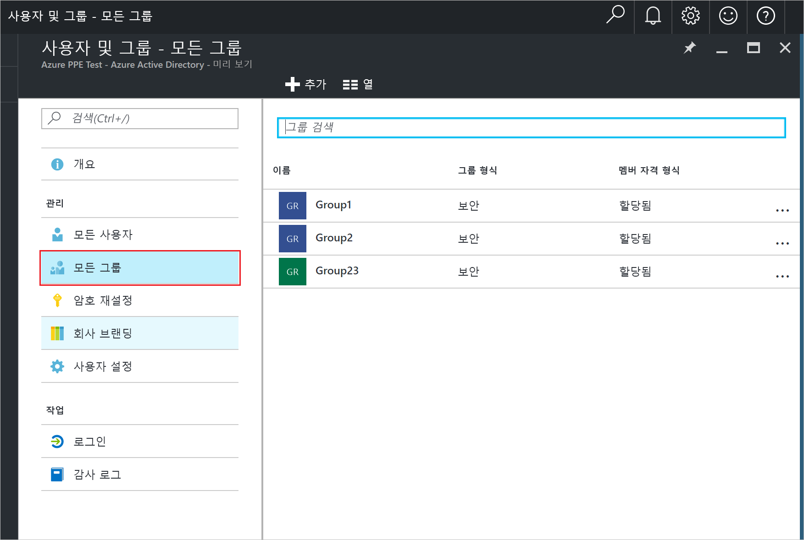
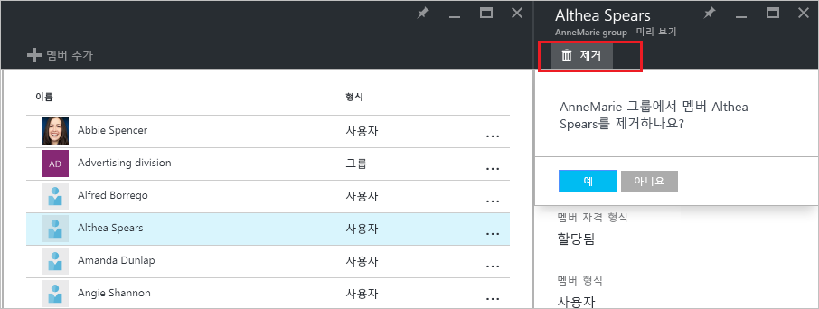

# Azure Active Directory 테넌트의 사용자에 대한 그룹 멤버 자격 관리
이 문서는 Azure AD(Azure Active Directory)에서 그룹의 멤버를 관리하는 방법을 설명합니다.

## 어떻게 멤버를 찾고 관리하나요?
1. 디렉터리에 대한 전역 관리자인 계정으로 [Azure Portal](https://portal.azure.com)에 로그인합니다.
2. **모든 서비스**를 선택하고 텍스트 상자에 **사용자 및 그룹**을 입력한 다음, **입력**을 선택합니다.

   
3. **사용자 및 그룹** 블레이드에서 **모든 그룹**을 선택합니다.

   
4. **사용자 및 그룹 - 모든 그룹** 블레이드에서 그룹을 선택합니다.
5. **그룹 - *groupname*** 블레이드에서 **멤버**를 선택합니다.

   
6. 그룹에 멤버를 추가하려면 **그룹 - 멤버** 블레이드에서 **멤버 추가**를 선택합니다.

   
7. **멤버** 블레이드에서 그룹에 추가할 하나 이상의 사용자 또는 장치를 선택하고 블레이드 아래쪽의 **선택** 단추를 선택하여 그룹에 추가합니다. **사용자** 상자는 사용자 또는 장치 이름 부분에 대한 항목 일치를 기반으로 한 표시를 필터링합니다. 와일드카드 문자는 해당 상자에서 허용되지 않습니다.
8. 그룹에서 멤버를 제거하려면 **그룹 - 멤버** 블레이드에서 멤버를 선택합니다.
9. ***membername*** 블레이드에서 **제거** 명령을 선택하고 프롬프트에서 선택 내용을 확인합니다.

   
10. 그룹의 멤버 변경을 마치면 **저장**을 선택합니다.

## 추가 정보
이러한 문서는 Azure Active Directory에 대한 추가 정보를 제공합니다.

* [기존 그룹 보기](active-directory-groups-view-azure-portal.md)
* [새 그룹을 만들고 멤버 추가](active-directory-groups-create-azure-portal.md)
* [그룹의 설정 관리](active-directory-groups-settings-azure-portal.md)
* [그룹의 멤버 자격 관리](active-directory-groups-membership-azure-portal.md)
* [그룹의 사용자에 대한 동적 규칙 관리](../users-groups-roles/groups-dynamic-membership.md)
