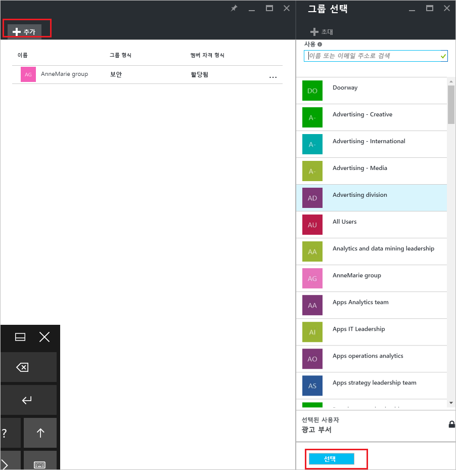
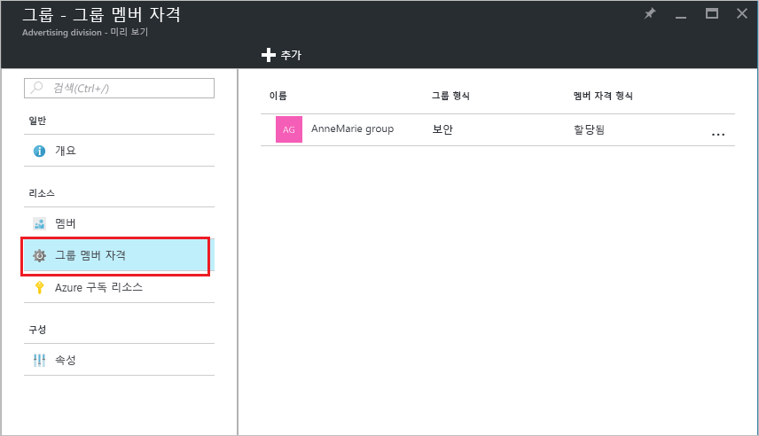

# 방법: Azure Active Directory를 사용하여 다른 그룹에서 그룹 추가 또는 제거
이 문서는 Azure Active Directory를 사용하여 다른 그룹에서 그룹을 추가 및 제거하는 데 도움이 됩니다.

>[!Note]
>부모 그룹을 삭제하려는 경우 [그룹 및 해당 멤버를 업데이트하거나 삭제하는 방법](active-directory-groups-delete-group.md)을 참조하세요.

## 다른 그룹에 그룹 추가
기존 보안 그룹을 다른 기존 그룹(중첩 그룹이라고도 함)에 추가하여 멤버 그룹(하위 그룹) 및 부모 그룹을 만들 수 있습니다. 멤버 그룹은 부모 그룹의 특성과 속성을 상속하므로 구성 시간이 절약됩니다.

>[!Important]
>다음 작업은 현재 지원되지 않습니다.<ul><li>Office 365 그룹에 보안 그룹 추가</li><li>보안 그룹 또는 다른 Office 365 그룹에 Office 365 그룹 추가</li><li>중첩된 그룹에 앱 할당</li><li>중첩된 그룹에 라이선스 적용</li></ul>

### 그룹을 다른 그룹의 멤버로 추가하려면

1. 디렉터리에 대한 글로벌 관리자 계정을 사용하여 [Azure Portal](https://portal.azure.com)에 로그인합니다.

2. **Azure Active Directory**를 선택한 다음, **그룹**을 선택합니다.

3. **그룹 - 모든 그룹** 페이지에서 다른 그룹의 멤버가 될 그룹을 검색하여 선택합니다. 이 연습에서는 **MDM 정책 - 서부** 그룹을 사용합니다.

    >[!Note]
    >한 번에 하나의 그룹에만 그룹을 멤버로 추가할 수 있습니다. 또한 **그룹 선택** 상자는 사용자 또는 장치 이름의 모든 부분에 대한 항목 일치 기준의 표시를 필터링합니다. 그러나 와일드카드 문자는 지원하지 않습니다.

    

4. **MDM 정책 - 서부 - 그룹 멤버 자격** 페이지에서 **그룹 멤버 자격**, **추가**를 차례로 선택하고, 멤버가 되도록 하려는 그룹을 찾은 다음, **선택**을 선택합니다. 이 연습에서는 **MDM 정책 - 모든 조직** 그룹을 사용합니다.

    **MDM 정책 - 서부** 그룹은 이제 [MDM 정책 - 모든 조직] 그룹의 모든 속성과 구성을 상속하는 **MDM 정책 - 모든 조직** 그룹의 멤버입니다.

    

5. **MDM 정책 - 서부 - 그룹 멤버 자격** 페이지를 검토하여 그룹 및 멤버 관계를 확인합니다.

    

6. 그룹 및 멤버 관계에 대한 자세한 내용을 보려면 그룹 이름(**MDM 정책 - 모든 조직**)을 선택하고 **MDM 정책 - 서부** 페이지 세부 정보를 살펴봅니다.

    

## 다른 그룹에서 그룹 제거
다른 보안 그룹에서 기존 보안 그룹을 제거할 수 있습니다. 그러나 그룹을 제거하면 멤버에 대해 상속된 특성과 속성도 제거됩니다.

### 다른 그룹에서 멤버 그룹을 제거하려면
1. **그룹 - 모든 그룹** 페이지에서 다른 그룹의 멤버로 제거할 그룹을 검색하여 선택합니다. 이 연습에서는 **MDM 정책 - 서부** 그룹을 다시 사용합니다.

2. **MDM 정책 - 서부 개요** 페이지에서 **그룹 멤버 자격**을 선택합니다.

    

3. **MDM 정책 - 서부 그룹 멤버 자격** 페이지에서 **MDM 정책 - 모든 조직** 그룹을 선택한 다음, **MDM 정책 - 서부** 페이지 세부 정보에서 **제거**를 선택합니다.

    

## 추가 정보
이러한 문서는 Azure Active Directory에 대한 추가 정보를 제공합니다.

- [그룹 및 멤버 보기](active-directory-groups-view-azure-portal.md)

- [기본 그룹 만들기 및 멤버 추가](active-directory-groups-create-azure-portal.md)

- [그룹에서 멤버 추가 또는 제거](active-directory-groups-members-azure-portal.md)

- [그룹 설정 편집](active-directory-groups-settings-azure-portal.md)

- [SaaS 응용 프로그램에 대한 액세스를 관리할 그룹 사용](../users-groups-roles/groups-saasapps.md)

- [Azure Active Directory에서 라이선스 관리를 위해 그룹을 사용하는 경우 시나리오, 제한 사항 및 알려진 문제](../users-groups-roles/licensing-group-advanced.md#limitations-and-known-issues)
