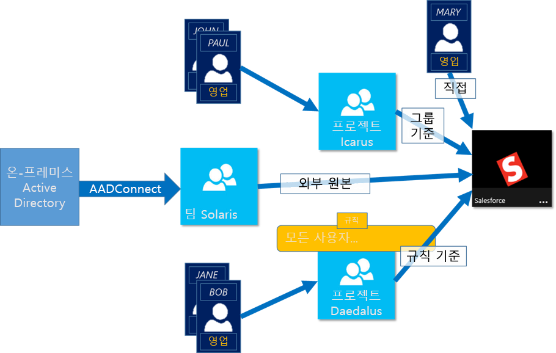
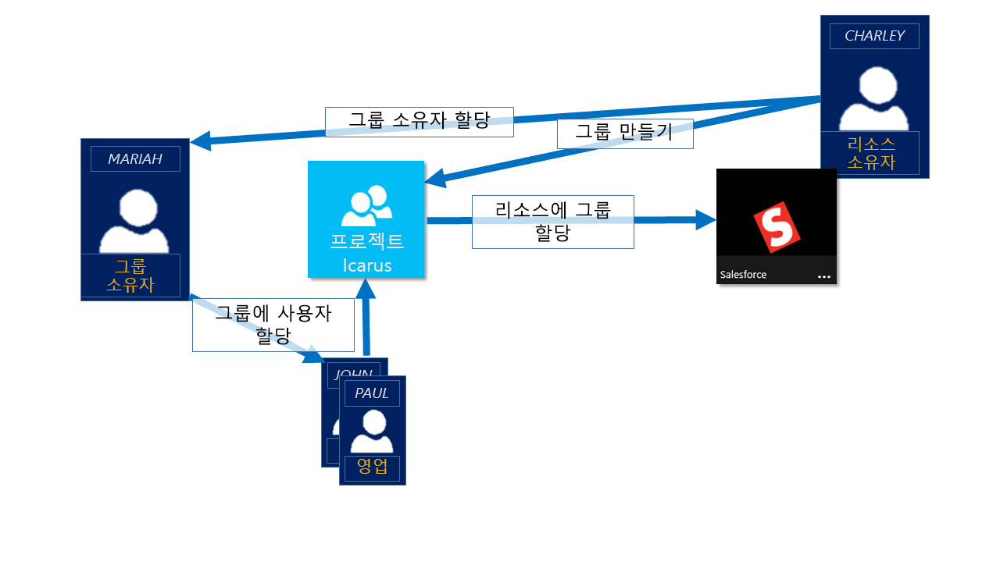

# Azure Active Directory 그룹을 사용하여 리소스에 대한 액세스 관리
Azure Active Directory(Azure AD)는 Office 365와 같은 Microsoft 온라인 서비스 및 수많은 비 Microsoft SaaS 응용 프로그램을 포함하여 온-프레미스와 클라우드 응용 프로그램 및 리소스에 대한 액세스를 관리하는 강력한 기능을 제공하는 포괄적인 ID 및 액세스 관리 솔루션입니다. 이 문서에서는 개요를 제공하지만 지금 바로 Azure AD 그룹 사용을 시작하려는 경우 [Azure AD에서 보안 그룹 관리](active-directory-groups-create-azure-portal.md)의 지침을 따릅니다. PowerShell을 사용하여 Azure Active directory에서 그룹을 관리하는 방법을 보려면 자세한 내용은 [그룹 관리를 위한 Azure Active Directory cmdlet](../users-groups-roles/groups-settings-v2-cmdlets.md)을 참조하세요.

> [!NOTE]
> Azure Active Directory를 사용하려면 Azure 계정이 필요합니다. 계정이 없으면 [무료 Azure 계정을 등록](https://azure.microsoft.com/pricing/free-trial/)할 수 있습니다.
>
>

Azure AD 내에서 주요 기능 중 하나는 리소스에 대한 액세스를 관리하는 기능입니다. 이러한 리소스는 디렉터리에서 역할을 통해 개체를 관리하는 권한이나 SaaS 응용 프로그램, Azure 서비스 및 SharePoint 사이트 또는 온-프레미스 리소스와 같이 디렉터리 외부에 있는 리소스의 경우처럼 디렉터리의 일부일 수 있습니다. 다음 네 가지 방법으로 사용자에게 리소스에 대한 액세스 권한을 할당할 수 있습니다.

1. 직접 할당

    해당 리소스의 소유자가 사용자에게 직접 리소스를 할당할 수 있습니다.
2. 그룹 멤버 자격

    리소스 소유자가 그룹에 리소스를 지정할 수 있고, 이렇게 함으로써 해당 그룹의 멤버에게 리소스에 대한 액세스 권한을 부여할 수 있습니다. 그러면 그룹의 소유자가 그룹의 멤버 자격을 관리할 수 있습니다. 실질적으로 리소스 소유자는 사용자를 해당 리소스에 할당할 권한을 그룹 소유자에게 위임합니다.
3. 규칙 기반

    리소스 소유자는 규칙을 사용하여 어느 사용자에게 리소스에 대한 액세스 권한을 할당해야 하는지를 나타낼 수 있습니다. 규칙 결과는 해당 규칙에 사용된 특성 및 특정 사용자에 대한 값에 따라 다르며, 이렇게 함으로써 리소스 소유자는 자신의 리소스에 대한 액세스 관리 권한을 규칙에 사용된 특성에 대한 권한 있는 원본으로 효과적으로 위임할 수 있습니다. 리소스 소유자는 여전히 규칙 자체를 관리하고 해당 리소스에 대한 액세스를 제공하는 특성 및 값을 결정합니다.
4. 외부 기관

    리소스에 대한 액세스 권한은 외부 소스에서 파생됩니다. 예를 들면 온-프레미스 디렉터리와 같은 권한이 있는 원본이나 WorkDay와 같은 SaaS 앱에서 동기화되는 그룹이 있습니다. 리소스 소유자는 리소스에 대한 액세스 권한을 제공하는 그룹을 할당하고 외부 소스는 그룹의 구성원을 관리합니다.

   

## 액세스 관리를 설명하는 비디오 보기
이에 대해 자세히 설명하는 짧은 비디오를 볼 수 있습니다.

**Azure AD: 그룹의 동적 멤버 자격 소개**

> [!VIDEO https://channel9.msdn.com/Series/Azure-Active-Directory-Videos-Demos/Azure-AD--Introduction-to-Dynamic-Memberships-for-Groups/player]
>
>

## Azure Active Directory에서 액세스 관리는 어떻게 작동합니까?
Azure AD의 액세스 관리 솔루션 센터에 보안 그룹이 있습니다. 리소스에 대한 액세스 관리에 보안 그룹을 사용하는 것은 잘 알려진 전형적인 예로, 이를 통해 의도한 사용자 그룹에 리소스에 대한 액세스 권한을 제공하는 방법을 유연하고 쉽게 이해할 수 있습니다. 리소스 소유자(또는 디렉터리 관리자)는 특정한 액세스 권한을 제공할 그룹을 자신이 소유한 리소스에 할당할 수 있습니다. 그룹 구성원에게 액세스 권한이 제공되며, 리소스 소유자는 부서 관리자 또는 기술 지원팀 관리자와 같은 다른 사람에게 그룹 구성원 목록을 관리할 권한을 위임할 수 있습니다.

그룹 소유자는 해당 그룹이 셀프 서비스 요청을 이용하도록 할 수 있습니다. 이 과정에서 최종 사용자가 그룹을 검색하고 찾을 수 있으며, 참여하도록 요청하여 그룹을 통해 관리되는 리소스에 액세스할 수 있는 권한을 효과적으로 검색할 수 있습니다. 그룹의 소유자는 참가 요청을 자동으로 승인하거나 그룹 소유자의 승인을 요구하도록 그룹을 설정할 수 있습니다. 사용자가 그룹 가입을 요청하면 가입 요청이 그룹 소유자에게 전달됩니다. 소유자 중 한 명이 요청을 승인하면 요청한 사용자에게 알리고 사용자가 그룹에 가입됩니다. 소유자 중 한 명이 요청을 거부하면 요청한 사용자에게 알리지만 사용자가 그룹에 가입되지 않습니다.

## 액세스 관리 시작
시작할 준비가 되셨습니까? Azure AD 그룹으로 수행할 수 있는 기본 작업 중 일부를 시도해야 합니다. 이러한 기능을 사용하여 조직의 다른 리소스에 다른 사용자 그룹에 대한 특별한 액세스 권한을 제공합니다. 다음은 기본 첫 단계 목록입니다.

* [그룹에 대한 동적 구성원을 구성하는 간단한 규칙 만들기](active-directory-groups-create-azure-portal.md)
* [SaaS 응용 프로그램에 대한 액세스를 관리할 그룹 사용](../users-groups-roles/groups-saasapps.md)
* [최종 사용자 셀프서비스에 사용할 수 있는 그룹 만들기](../users-groups-roles/groups-self-service-management.md)
* [Azure AD Connect를 사용하여 Azure에 온-프레미스 그룹 동기화](../connect/active-directory-aadconnect.md)
* [그룹에 대한 소유자 관리](active-directory-accessmanagement-managing-group-owners.md)

## 다음 단계
액세스 관리의 기본 사항을 이해했으므로, 다음은 Azure Active Directory에서 추가 응용 프로그램 및 리소스에 대한 액세스를 관리하는 데 사용할 수 있는 몇 가지 고급 추가 기능입니다.

* [특성을 사용하여 고급 규칙 만들기](../users-groups-roles/groups-dynamic-membership.md)
* [Azure AD의 보안 그룹 관리](active-directory-groups-create-azure-portal.md)
* [그룹에 대한 그래프 API 참조](https://msdn.microsoft.com/Library/Azure/Ad/Graph/api/groups-operations#GroupFunctions)
* [그룹 설정을 구성하는 Azure Active Directory cmdlets](../users-groups-roles/groups-settings-cmdlets.md)
