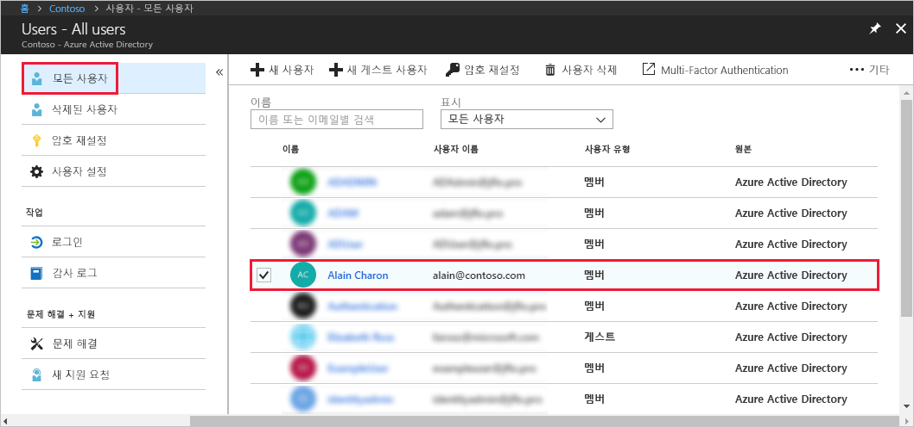

# Azure Active Directory에서 관리자 역할에 사용자 할당
이 문서는 Azure AD(Azure Active Directory)에서 사용자에게 관리 역할을 할당하는 방법을 설명합니다. 조직 내에서 새 사용자 추가에 대한 자세한 내용은 [Azure Active Directory에 새 사용자 추가](../add-users-azure-active-directory.md)를 참조하세요. 기본적으로 추가된 사용자에게는 관리자 권한이 없지만 언제든 역할을 할당할 수 있습니다.

## 사용자에게 역할 할당
1. 디렉터리에 대한 전역 관리자 또는 권한 있는 역할 계정으로 [Azure Portal](https://portal.azure.com) 에 로그인합니다.

2. **Azure Active Directory** 및 **사용자**를 선택한 다음, 목록에서 특정 사용자를 선택합니다.

    

3. 선택된 사용자의 경우 **디렉터리 역할** 및 **역할 추가**를 선택한 다음, **조건부 액세스 관리자** 같은 **디렉터리 역할** 목록에서 적절한 관리자 역할을 선택합니다. 관리자 역할에 대한 자세한 내용은 [Azure AD에서 관리자 역할 할당](../active-directory-assign-admin-roles-azure-portal.md)을 참조하세요. 

    

1. **선택**을 눌러 저장합니다.

## 다음 단계
* [빠른 시작: Azure Active Directory에서 사용자 추가 또는 삭제](add-users-azure-active-directory.md)
* [사용자 프로필 관리](active-directory-users-profile-azure-portal.md)
* [다른 디렉터리에서 게스트 사용자 추가](../b2b/what-is-b2b.md) 
* [Azure AD의 역할에 사용자 할당](active-directory-users-assign-role-azure-portal.md)
* [삭제된 사용자 복원](active-directory-users-restore.md)
