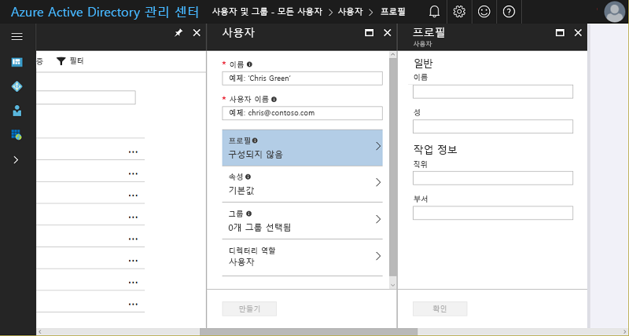
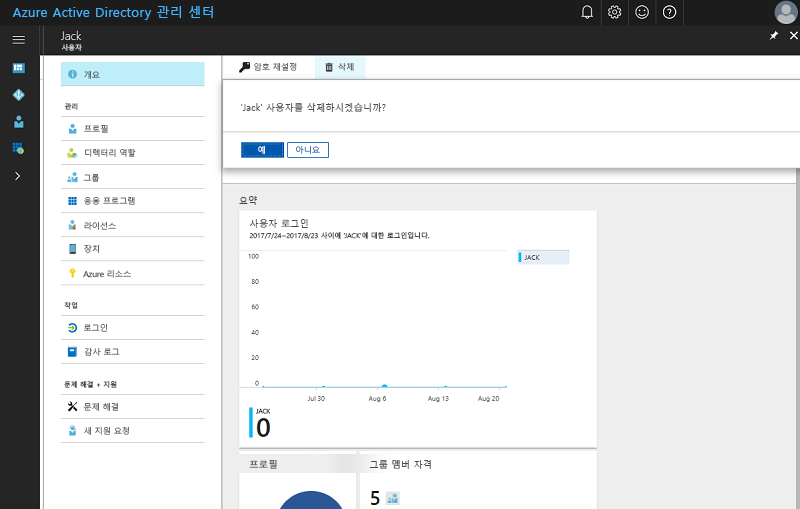

# 빠른 시작: Azure Active Directory에 새 사용자 추가
이 문서에서는 Azure Porta을 사용하거나 온-프레미스 Windows Server AD 사용자 계정 데이터를 동기화하여 조직의 Azure AD(Azure Active Directory) 테넌트에서 조직의 사용자를 삭제 또는 추가하는 방법을 설명합니다. 

## 클라우드 기반 사용자 추가
1. 디렉터리에 대한 전역 관리자인 계정으로 [Azure Active Directory 관리 센터](https://aad.portal.azure.com)에 로그인합니다.
2. **Azure Active Directory**를 선택한 후 **사용자 및 그룹**을 선택합니다.
3. **사용자 및 그룹**에서 **모든 사용자**를 선택한 다음 **새 사용자**를 선택합니다.
   
4. **이름** 및 **사용자 이름**과 같은 사용자에 대한 세부 정보를 입력합니다. 사용자 이름의 도메인 이름 부분은 초기 기본 도메인 이름 "[domain name].onmicrosoft.com" 또는 "contoso.com"과 같은 확인된 페더레이션되지 않은 [사용자 지정 도메인 이름](add-custom-domain.md)이어야 합니다.
5. 이 프로세스가 완료된 후 사용자에게 제공할 수 있도록 복사하거나 그렇지 않은 경우 생성된 사용자 암호를 기록합니다.
6. 필요에 따라 **프로필**, **그룹** 또는 사용자에 대한 **디렉터리 역할**의 정보를 열고 입력할 수 있습니다. 사용자 및 관리자 역할에 대한 자세한 내용은 [Azure AD에서 관리자 역할 할당](../users-groups-roles/directory-assign-admin-roles.md)을 참조하세요.
7. **사용자**에서 **만들기**를 선택합니다.
8. 사용자가 로그인할 수 있도록 새 사용자에게 생성된 암호를 안전하게 배포합니다.

> [!TIP]
> 또한 온-프레미스 Windows Server AD에서 사용자 계정 데이터를 동기화할 수도 있습니다. Microsoft의 ID 솔루션은 온-프레미스 및 클라우드 기반 기능을 확장하며 이는 위치에 관계 없이 모든 리소스에 인증 및 권한 부여에 대한 단일 사용자 ID를 만듭니다. 하이브리드 ID라고 합니다. 하이브리드 ID 시나리오에서는 [Azure AD Connect](https://docs.microsoft.com/azure/active-directory/connect/active-directory-aadconnect)를 사용하여 온-프레미스 디렉터리를 Azure Active Directory에 통합할 수 있습니다. 이렇게 하면 Azure AD와 통합된 Office 365, Azure 및 SaaS 응용 프로그램 사용자를 위한 공통 ID를 제공할 수 있습니다. 

## Azure AD에서 사용자 삭제
1. 디렉터리에 대한 전역 관리자인 계정으로 [Azure Active Directory 관리 센터](https://aad.portal.azure.com)에 로그인합니다.
2. **사용자 및 그룹**을 선택합니다.
3. **사용자 및 그룹** 블레이드의 목록에서 삭제할 사용자를 선택합니다. 
4. 선택한 사용자에 대한 블레이드에서 **개요**를 선택한 다음 명령 모음에서 **삭제**를 선택합니다.
   

### 자세한 정보 
* [다른 디렉터리에서 게스트 사용자 추가](../b2b/what-is-b2b.md) 
* [Azure AD의 역할에 사용자 할당](active-directory-users-assign-role-azure-portal.md)
* [사용자 프로필 관리](active-directory-users-profile-azure-portal.md)
* [삭제된 사용자 복원](active-directory-users-restore.md)

## 다음 단계
이 빠른 시작에서는 Azure AD Premium에 새 사용자를 추가하는 방법을 알아보았습니다. 

다음 링크를 사용하여 Azure Portal에서 Azure AD에 새로운 사용자를 만들 수 있습니다.

>[!div class="nextstepaction"]
>[Azure AD에 사용자 추가](https://aad.portal.azure.com/#blade/Microsoft_AAD_IAM/UserManagementMenuBlade/)