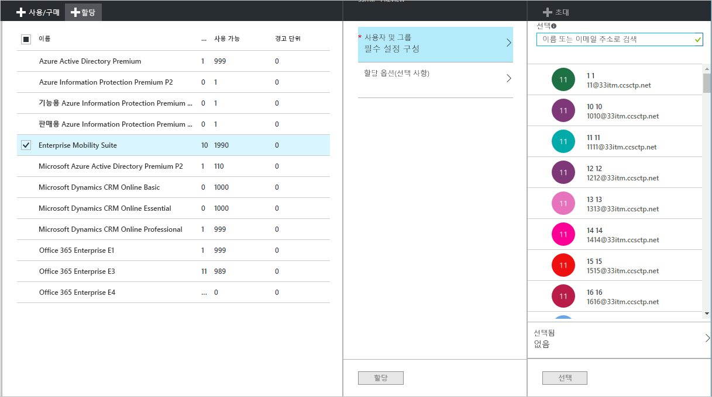
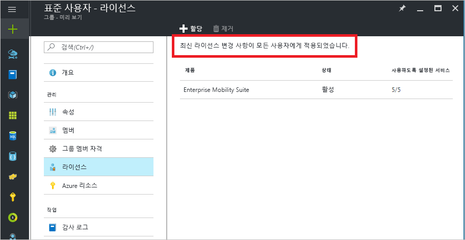
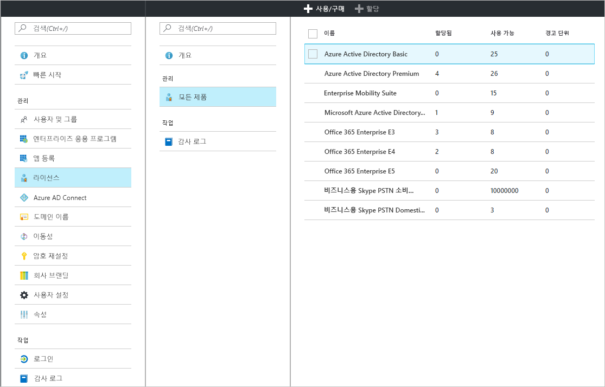
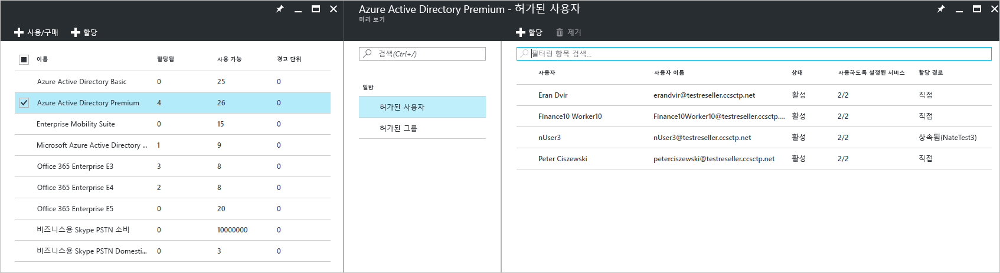
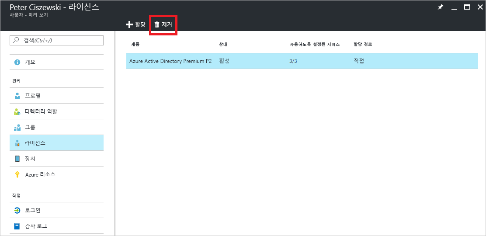

# 빠른 시작: Azure Active Directory에서 사용자의 라이선스
라이선스 기반 Azure AD 서비스는 Azure 테넌트에서 Azure AD(Active Directory) 구독을 활성화하면 작동됩니다. 구독이 활성화된 후 서비스 기능은 Azure AD 관리자가 관리하고 사용이 허가된 사용자가 사용합니다. Enterprise Mobility + Security, Azure AD Premium 또는 Azure AD Basic을 구매하면 디렉터리의 유효 기간 및 선불 라이선스를 포함하여 테넌트가 구독으로 업데이트됩니다. 할당되거나 사용 가능한 라이선스 수를 포함한 구독 정보는 **라이선스** 타일을 열어 **Azure Active Directory** 아래에서 Azure Portal을 통해 사용할 수 있습니다. **라이선스** 블레이드는 사용자 라이선스 할당을 관리하기에 가장 적합한 위치이기도 합니다.

유료 기능을 구성하기 위해서는 구독을 얻기만 하면 되지만, Azure AD 유료 기능에 대한 사용자 라이선스를 배포해야 합니다. 액세스 권한이 있어야 하거나 Azure AD 유료 기능을 통해 관리되는 모든 사용자에게 라이선스가 할당되어야 합니다. 라이선스 할당은 Azure AD Premium, Basic 또는 Enterprise Mobility + Security 등의 구매한 서비스와 사용자 간의 매핑입니다.

[그룹 기반 라이선스 할당](active-directory-licensing-whatis-azure-portal.md)을 사용하여 다음과 같은 규칙을 설정할 수 있습니다.
* 디렉터리의 모든 사용자가 자동으로 라이선스를 얻습니다.
* 해당하는 직위를 가진 모든 사용자가 라이선스를 얻습니다.
* [셀프 서비스 그룹](../users-groups-roles/groups-self-service-management.md)을 사용하여 조직의 다른 관리자에게 의사 결정을 위임할 수 있습니다.

> [!TIP]
> 고급 시나리오 및 Office 365 라이선스 시나리오를 비롯한 그룹에 대한 라이선스 할당의 자세한 내용은 [Azure Active Directory에서 그룹 멤버 자격에 따라 사용자에게 라이선스 할당](../active-directory-licensing-group-assignment-azure-portal.md)을 참조하세요.

## 사용자 및 그룹에 라이선스 할당
활성 구독을 사용하면 먼저 자신에게 라이선스를 할당하고 구독에 포함된 예상된 기능을 모두 표시하도록 브라우저를 새로 고쳐야 합니다. 다음 단계는 유료 Azure AD 기능에 액세스해야 할 사용자에게 라이선스를 할당하는 것입니다. 라이선스를 할당하는 쉬운 방법은 개인 대신 사용자의 그룹에 라이선스를 할당하는 것입니다. 그룹에게 라이선스를 할당하면 모든 그룹 구성원에게 라이선스가 할당됩니다. 사용자가 그룹에서 추가 또는 제거될 경우 해당 라이선스가 자동으로 할당 또는 제거됩니다. 

> [!NOTE]
> 일부 Microsoft 서비스는 모든 위치에서 사용할 수 없습니다. 사용자에게 라이선스를 할당하려면 먼저 관리자가 해당 사용자에 대해 “**사용 위치**” 속성을 지정해야 합니다. Azure Portal의 **사용자** &gt; **프로필** &gt; **설정**에서 이 속성을 설정할 수 있습니다. 그룹 라이선스 할당을 사용할 때 사용 위치가 지정되지 않은 사용자는 디렉터리의 위치를 상속합니다.

라이선스를 할당하려면 **Azure Active Directory** &gt; **라이선스** &gt; **모든 제품** 아래에서 제품을 하나 이상 선택하고 명령 모음에서 **할당** 단추를 선택합니다.

**사용자 및 그룹** 블레이드를 사용하여 여러 사용자나 그룹을 선택하거나 제품의 서비스 계획을 사용하지 않도록 설정할 수 있습니다. 맨 위에 있는 검색 상자를 사용하여 사용자 및 그룹 이름을 검색합니다.

라이선스를 그룹에 할당할 때는 모든 사용자가 라이선스를 상속하기 전에 그룹 크기에 따라 다소 시간이 소요될 수 있습니다. **그룹** 블레이드의 **라이선스** 타일 아래에서 처리 상태를 확인할 수 있습니다.

Azure AD 라이선스 할당 중에 할당 오류가 발생할 수 있지만 Azure AD 및 Enterprise Mobility + Security 제품을 관리할 경우에는 상대적으로 드물게 오류가 발생합니다. 잠재적 할당 오류는 다음으로 제한됩니다.
- 할당 충돌: 사용자에게 이전에 할당된 라이선스가 현재 라이선스와 호환되지 않는 경우. 이런 경우, 새 라이선스를 할당하려면 현재 라이선스를 제거해야 합니다.
- 사용 가능한 라이선스 수 초과: 할당된 그룹의 사용자 수가 사용 가능한 라이선스 수를 초과한 경우 없는 라이선스로 인해 사용자의 할당 상태가 할당 실패로 표시됩니다.

### Azure AD B2B 공동 작업 라이선스

B2B 공동 작업을 통해 게스트 사용자를 Azure AD 테넌트로 초대해서 Azure AD 서비스 및 사용 가능하게 설정할 Azure 리소스에 대한 액세스 권한을 제공할 수 있습니다.  

B2B 사용자를 초대한 후 Azure AD에서 응용 프로그램에 할당하는 과정은 무료입니다. 게스트 사용자당 최대 10개 앱과 3개의 기본 보고서도 B2B 공동 작업 사용자에게 무료로 제공됩니다. 파트너의 Azure AD 테넌트에서 게스트 사용자에게 적절한 라이선스가 할당되어 있으면 여러분의 테넌트에서도 게스트 사용자에게 사용이 허가됩니다.

필수는 아니지만 유료 Azure AD 기능에 대한 액세스 권한을 제공하려면 해당 B2B 게스트 사용자는 적절한 Azure AD 라이선스의 사용 허가를 받아야 합니다. Azure AD 유료 라이선스가 있는 초대하는 테넌트는 테넌트에 초대된 5명의 추가 게스트 사용자에게 B2B 공동 작업 사용자 권한을 할당할 수 있습니다. 시나리오와 정보는 [B2B 공동 작업 라이선스 지침](../b2b/licensing-guidance.md)을 참조하세요.

## 할당된 라이선스 보기

할당된 라이선스 및 사용 가능한 라이선스에 대한 요약 보기는 **Azure Active Directory** &gt; **라이선스** &gt; **모든 제품** 아래 표시됩니다.

특정 제품을 선택할 때 사용 가능한 할당된 사용자 및 그룹의 자세한 목록입니다. **허가된 사용자**에는 현재 라이선스를 사용 중인 모든 사용자와 함께 라이선스가 사용자에게 직접 할당되었는지, 그룹에서 상속되는지 여부가 표시됩니다.

마찬가지로 **허가된 그룹**은 라이선스가 할당된 모든 그룹을 보여 줍니다. 사용자 또는 그룹을 선택하면 해당 개체에 할당된 모든 라이선스를 보여 주는 **라이선스** 블레이드가 열립니다.

## 라이선스 제거

라이선스를 제거하려면 사용자 또는 그룹으로 이동하고 **라이선스** 타일이 열립니다. 라이선스를 선택하고 **제거**를 클릭합니다.

그룹에서 사용자에 상속된 라이선스는 직접 제거할 수 없습니다. 대신, 라이선스를 상속하는 그룹에서 사용자를 제거합니다.

## 다음 단계
이 빠른 시작에서는 Azure AD 디렉터리의 사용자 및 그룹에 라이선스를 할당하는 방법을 배웠습니다. 

다음 링크를 통해 Azure Portal에서 Azure AD에 구독 라이선스 할당을 구성할 수 있습니다.

> [!div class="nextstepaction"]
> [Azure AD 라이선스 할당](https://aad.portal.azure.com/#blade/Microsoft_AAD_IAM/LicensesMenuBlade/Overview) 