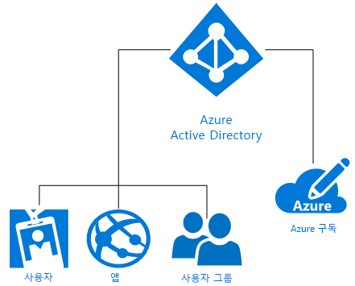

# Azure ID 솔루션 이해
Microsoft Azure AD(Azure Active Directory)는 디렉터리 서비스, ID 관리 및 응용 프로그램 액세스 관리를 제공하는 ID 및 액세스 관리 클라우드 솔루션입니다. Azure AD는 [Azure AD 응용 프로그램 갤러리](https://azure.microsoft.com/marketplace/active-directory/all/)에 있는 수천 개의 사전 통합된 상용 및 사용자 지정 앱에 대해 신속하게 [SSO(single sign-on)를 사용](https://docs.microsoft.com/azure/active-directory/active-directory-enterprise-apps-manage-sso)합니다. 이러한 앱은 대부분 Office 365, Salesforce.com, Box, ServiceNow 및 Workday와 같이 이미 사용하고 있는 앱들입니다.

단일 Azure AD 디렉터리가 만들어질 때 자동으로 Azure 구독과 연결됩니다. Azure에서 ID 서비스인 Azure AD는 다음 클라우드 기반 리소스에 대한 모든 ID 관리 및 액세스 제어 기능을 제공합니다. 이러한 리소스에는 다음 다이어그램에 나와 있는 것처럼 사용자, 앱 및 개별 테넌트(조직)에 대한 그룹이 포함될 수 있습니다.

Microsoft Azure는 개별 조직의 요구 사항에 맞게 다양한 수준의 복잡성을 가진 IDaaS(identity as a service)를 활용하는 여러 가지 방법을 제공합니다. 이 문서의 나머지 부분에서는 기본적인 Azure ID 용어 및 개념뿐만 아니라 사용 가능한 옵션 중에서 가장 적합한 선택을 위한 권장 사항을 이해할 수 있습니다.

## 관련 용어

조직에서 Azure ID 솔루션을 결정하기 전에 Azure ID 서비스에 대해 설명하는 경우 일반적으로 사용되는 용어를 기본적으로 이해해야 합니다.

|관련 용어| 설명|
|-----|-----|
|Azure 구독 |구독은 Azure Cloud Services에 대한 요금을 지불하는 데 사용되고 일반적으로 신용 카드와 연결됩니다. 여러 구독이 있지만 구독 간에 리소스를 공유하기 어려울 수 있습니다.|
|Azure 테넌트 | Azure AD 테넌트는 단일 조직을 대표합니다. 조직이 Azure, Intune 또는 Office 365와 같은 Microsoft 클라우드 서비스 구독에 등록할 때 자동으로 생성되는 Azure AD의 신뢰할 수 있는 전용 인스턴스입니다. 테넌트는 전용 환경(단일 테넌트) 또는 다른 조직과 공유 환경(다중 테넌트)에서 서비스에 액세스할 수 있습니다.|
|Azure AD Directory | 각 Azure 테넌트에는 테넌트의 사용자, 그룹 및 응용 프로그램을 포함하는 신뢰할 수 있는 전용 Azure AD 디렉터리가 있습니다. 테넌트 리소스에 대한 ID 및 액세스 관리 기능을 수행하는 데 사용됩니다. 고유한 Azure AD 디렉터리가 Azure, Microsoft Intune 또는 Office 365와 같은 Microsoft 클라우드 서비스에 등록할 때 조직을 나타내도록 자동으로 프로비전되기 때문에 때로는 *테넌트*, *Azure AD* 및 *Azure AD 디렉터리*와 같은 용어를 구분 없이 표시합니다. |
|사용자 지정 도메인 | 먼저 Microsoft 클라우드 서비스 구독에 등록할 때 테넌트(조직)에서는 *.onmicrosoft.com* 도메인 이름을 사용합니다. 그러나 대부분의 조직에서는 비즈니스에 사용되는 하나 이상의 도메인 이름 및 회사 리소스에 액세스하는 데 사용하는 최종 사용자가 있습니다. 도메인 이름이 *alice@contoso.onmicrosoft.com* 대신 *alice@contoso.com*과 같이 친숙해질 수 있도록 Azure AD에 사용자 지정 도메인 이름을 추가할 수 있습니다. |
|Azure AD 계정 | Azure AD 또는 Office 365와 같은 다른 Microsoft 클라우드 서비스를 사용하여 만들어진 ID입니다. 해당 ID는 Azure AD에 저장되고 조직의 클라우드 서비스 구독에 액세스할 수 있습니다. |
|Azure 구독 관리자| 계정 관리자는 Azure 구독을 등록 또는 구입한 사람입니다. 이러한 사용자는 [계정 센터](https://account.azure.com/Subscriptions)를 사용하여, 구독 만들기, 구독 취소, 구독에 대한 청구 변경 또는 서비스 관리자 변경 등의 다양한 관리 작업을 수행할 수 있습니다. |
|Azure AD 전역 관리자 | Azure AD 전역 관리자는 Azure AD 관리 기능에 대한 완전한 액세스 권한을 가집니다. 자동으로 Microsoft 클라우드 서비스 구독에 등록한 사용자는 기본적으로 전역 관리자가 됩니다. 둘 이상의 전역 관리자가 있을 수 있지만 전역 관리자만이 [다른 관리자 역할](https://docs.microsoft.com/azure/active-directory/active-directory-assign-admin-roles-azure-portal)을 사용자에게 할당할 수 있습니다. |
|Microsoft 계정 | Microsoft 계정(개인 용도로 직접 생성함)은 소비자 지향 Microsoft 제품 및 클라우드 서비스(예: Outlook(Hotmail), OneDrive, Xbox LIVE 또는 Office 365)에 대한 액세스 권한을 제공합니다. 이러한 ID는 Microsoft에서 실행하는 Microsoft 소비자 ID 계정 시스템에 생성되고 저장됩니다.|
|회사 또는 학교 계정 | 회사 또는 학교 계정(관리자가 업무용/학습용으로 발급함)은 Azure, Intune, Office 365 등의 기업 비즈니스 수준의 Microsoft 클라우드 서비스에 대한 액세스 권한을 제공합니다.|

## 개념 이해

이제 기본적인 Azure ID 용어를 이해했으며 적절한 Azure ID 서비스를 결정하는 데 도움이 되는 Azure ID 개념에 대해 알아보겠습니다.

|개념 이해 |설명|
|-----|-----|
|[Azure 구독과 Azure Active Directory의 연관 관계](https://docs.microsoft.com/azure/active-directory/active-directory-how-subscriptions-associated-directory) |모든 Azure 구독은 사용자, 서비스 및 장치를 인증하는 Azure AD 디렉터리와 신뢰 관계가 있습니다. *여러 구독은 동일한 Azure AD 디렉터리를 트러스트할 수 있지만 구독은 단일 Azure AD 디렉터리만을 신뢰합니다*. 이 트러스트 관계는 구독이 다른 Azure 리소스(웹 사이트, 데이터베이스 등)와 갖는 관계와 다르며 구독의 하위 리소스와 더 유사합니다. 구독이 만료되면 Azure AD가 아닌 구독과 연결된 리소스에 대한 액세스도 중지됩니다. 하지만 Azure AD 디렉터리는 Azure에 남아 있으므로 해당 디렉터리와 다른 구독을 연결하여 테넌트 리소스를 계속 관리할 수 있습니다.|
|[Azure AD 라이선스 작동 방식](https://docs.microsoft.com/azure/active-directory/active-directory-licensing-get-started-azure-portal) | Enterprise Mobility Suite, Azure AD Premium 또는 Azure AD Basic을 구매 또는 활성화하면 디렉터리의 유효 기간 및 선불 라이선스를 포함하여 디렉터리가 구독으로 업데이트됩니다. 구독이 활성화되면 Azure AD 전역 관리자가 서비스를 관리하고 허가된 사용자가 사용할 수 있습니다. 할당되거나 사용 가능한 라이선스 수를 포함한 구독 정보는 **Azure Active Directory** > **라이선스** 블레이드의 Azure Portal에서 사용할 수 있습니다. 또한 이 탭은 사용자 라이선스 할당을 관리하기에 가장 적합한 위치이기도 합니다.|
|[Azure Portal의 역할 기반 Access Control](https://docs.microsoft.com/azure/role-based-access-control/overview)|Azure 역할 기반 Access Control(RBAC)을 통해 Azure 리소스에 대한 세밀한 액세스 관리를 제공할 수 있습니다. 권한이 너무 많으면 공격자에게 계정이 노출될 수 있고, 권한이 너무 적으면 직원이 업무를 효율적으로 수행할 수 없습니다. RBAC를 사용하여 모든 리소스 그룹(소유자, 참가자, 판독기)에 적용되는 세 가지 기본 역할을 기반으로 필요한 정확한 사용 권한을 직원에게 제공할 수 있습니다. 최대 2,000개의 고유한 [사용자 지정 RBAC 역할](https://docs.microsoft.com/azure/role-based-access-control/custom-roles)을 만들어 특정 요구 사항을 충족할 수도 있습니다. |
|[하이브리드 ID](https://docs.microsoft.com/azure/active-directory/connect/active-directory-aadconnect)|하이브리드 ID는 [Azure AD Connect](https://docs.microsoft.com/azure/active-directory/connect/active-directory-aadconnect)를 사용하는 Azure AD에서 온-프레미스 AD DS(Windows Server Active Directory)를 통합하여 이뤄집니다. 이렇게 하면 Azure AD와 통합된 Office 365, Azure 및 온-프레미스 앱이나 SaaS 응용 프로그램 사용자를 위한 공통 ID를 제공할 수 있습니다. 하이브리드 ID를 사용하여 ID 및 액세스를 위해 효과적으로 클라우드로 온-프레미스 환경을 확장합니다.|

### Windows Server AD DS와 Azure AD 간의 차이
Azure AD(Azure Active Directory)와 온-프레미스 Active Directory(Active Directory Domain Services 또는 AD DS)는 디렉터리 데이터를 저장하고 사용자와 리소스 간의 통신(사용자 로그온 프로세스, 인증 및 디렉터리 검색 포함)을 관리하는 시스템입니다.

Windows 2000 Server와 함께 처음 도입된 온-프레미스 Windows Server AD DS(Active Directory Domain Services)에 익숙한 경우 ID 서비스의 기본 개념을 이해할 것입니다. 하지만 Azure AD가 클라우드에서 단지 도메인 컨트롤러에 그치지 않는다는 것을 이해해야 합니다. 이 기능은 Azure에서 IDaaS(identity as a service)를 제공하는 완전히 새로운 방법으로써 클라우드 기반 기능을 완전히 포용하고 최신 위협으로부터 조직을 보호한다는 완전히 새로운 사고 방식이 필요합니다. 

AD DS는 Windows Server의 서버 역할로, 물리적 컴퓨터 또는 가상 머신에 배포할 수 있습니다. 또한 X.500 기반 계층 구조를 갖습니다. DNS를 사용하여 개체를 찾고, LDAP를 사용하여 상호 작용할 수 있으며 인증에는 Kerberos를 주로 사용합니다. Active Directory에서는 컴퓨터가 도메인에 가입될 수 있을 뿐 아니라 OU(조직 구성 단위) 및 GPO(그룹 정책 개체)를 사용할 수 있으며 도메인 간에 트러스트가 형성됩니다.

IT는 AD DS를 사용하여 몇 년 간 자신의 보안 경계를 보호했지만 경계 없는 기업 지원 ID에는 직원, 고객 및 파트너에게 새로운 컨트롤 평면이 필요합니다. Azure AD는 ID 제어 평면입니다. 보안은 사용자(온-프레미스 또는 클라우드)에게 하나의 일반적인 ID를 제공하여 Azure AD가 회사 리소스 및 액세스를 보호한 클라우드에 대한 회사 방화벽 이상의 개념입니다. 이 기능은 사용자가 거의 모든 장치에서 업무를 수행할 수 있도록 필요한 앱에 안전하게 액세스할 수 있는 유연성을 제공합니다. 기계 학습 기능 및 심층 보고가 지원되는 완벽한 위험 기반 데이터 보호 컨트롤을 제공하여 IT에서 회사 데이터를 안전하게 보호할 수 있도록 합니다.

Azure AD는 다중 고객 공용 디렉터리 서비스이므로, Azure AD 내에서 클라우드 서버 및 응용 프로그램에 대해 Office 365와 같은 테넌트를 만들 수 있습니다. 사용자 및 그룹은 OU나 GPO 없는 플랫 구조로 만들어집니다. 인증은 SAML, WS-Federation 및 OAuth와 같은 프로토콜을 통해 수행됩니다. Azure AD를 쿼리할 수 있지만 대신 LDAP를 사용하여 AD Graph API라고 하는 REST API를 사용해야 합니다. 이러한 모든 기능은 HTTP 및 HTTPS를 통해 작동합니다.

### Office 365 관리 및 보안 기능 확장
이미 Office 365를 사용하고 있나요? 모든 리소스를 보호하기 위해 기본 제공 Office 365 기능 및 Azure AD를 확장하여 디지털 변환을 가속화할 수 있고 전체 직원에 대한 안전한 생산성을 보장하게 됩니다. Office 365 기능 외에도 Azure AD를 사용하는 경우 모든 앱에 Single Sign-On을 활성화하는 하나의 ID를 사용하여 전체 응용 프로그램 포트폴리오를 보호할 수 있습니다. 장치 상태, 사용자, 위치, 응용 프로그램 및 위험에 기반하여 조건부 액세스 기능을 확장할 수 있습니다. MFA(Multi-Factor Authentication) 기능은 필요할 때 더 많은 보호를 제공합니다. 사용자 권한을 추가로 감시하고 주문형 Just-In-Time 관리 액세스를 제공합니다. 잊어버린 암호 재설정, 응용 프로그램 액세스 요청 및 그룹 만들기 및 관리와 같은 Azure AD에서 제공하는 셀프 서비스 기능 덕분에 사용자가 생산성을 향상시키고 기술 지원팀 티켓이 적어지게 됩니다.

> [!TIP]
> Office 365에서 Azure AD ID 관리를 사용하는 방법에 대한 자세한 내용을 보려면 어떻게 하나요? [전자책을 가져옵니다](https://info.microsoft.com/Extend-Office-365-security-with-EMS.html).

## Microsoft Azure ID 솔루션

Microsoft Azure에서는 온-프레미스나 클라우드 또는 양쪽 어딘가에서 완벽하게 유지되는지 여부에 따라 사용자의 ID를 관리하는 여러 가지 방법을 제공합니다. 이러한 옵션에는 Azure의 DIY(do-it-yourself) AD DS, Azure AD(Azure Active Directory), 하이브리드 ID 및 Azure AD Domain Services가 포함됩니다.

### DIY(do-it-yourself) AD DS
클라우드에서 일부가 필요한 회사의 경우 Azure에서 **DIY(do-it-yourself) AD DS**를 사용할 수 있습니다. 이 옵션은 Azure에서 가상 머신(VM)로 배포하기에 적합한 많은 Windows Server AD DS 시나리오를 지원합니다. 예를 들어, 원격 네트워크에 연결되어 있는 멀리 떨어진 데이터 센터에서 실행하는 도메인 컨트롤러로 Azure VM을 만들 수 있습니다. 여기에서 VM은 원격 사용자의 인증 요청을 지원하고 인증 성능을 향상시킬 수 있게 됩니다. 이 옵션은 적은 수의 도메인 컨트롤러와 Azure의 단일 가상 네트워크를 호스트하여 다른 비용이 드는 재해 복구 사이트에 비해 비교적 저렴한 대안으로 적합합니다. 마지막으로 Azure에서 SharePoint와 같은 Windows Server AD DS가 필요하지만 온-프레미스 네트워크 또는 회사 Windows Server Active Directory에 의존하지 않는 응용 프로그램을 배포해야 할 수도 있습니다. 이 경우 SharePoint 서버 팜의 요구 사항을 충족하기 위해 Azure에서 분리된 포리스트를 배포할 수 있습니다. 또한 온-프레미스 네트워크와 회사 Active Directory에 대한 연결이 필요한 네트워크 응용 프로그램을 배포하도록 지원됩니다.

### Azure AD(Azure Active Directory)
**Azure AD 독립 실행형**은 완전한 클라우드 기반 IDaaS(Identity and access management as a Service) 솔루션입니다. Azure AD는 강력한 기능을 제공하여 사용자 및 그룹을 관리할 수 있습니다. Office 365와 같은 Microsoft 웹 서비스와 다양한 타사 SaaS(Software as-a Service) 응용 프로그램을 포함한 온-프레미스 및 클라우드 응용 프로그램에 대한 안전한 액세스를 돕습니다. Azure AD는 Free, Basic 및 Premium의 세 가지 버전으로 제공됩니다. Azure AD는 조직 효율성을 향상시키고 Azure Machine Learning 및 기타 고급 보안 기능에서 보호되는 새 컨트롤 평면에 대한 경계 방화벽 너머로 보안을 확장합니다.

### 하이브리드 ID
온-프레미스 또는 클라우드 기반 ID 솔루션 중에서 선택하는 것보다 회사의 장기적인 방향을 예상하기 시작한 많은 긍정적인 CIO 및 비즈니스는 온-프레미스 디렉터리를 **하이브리드 ID** 솔루션을 통해 클라우드로 확장하고 있습니다. 하이브리드 ID를 사용하여 진정한 전역 ID를 사용하고 작업을 수행해야 하는 응용 프로그램 사용자에게 안전하고 생산성 높은 액세스를 제공하는 액세스 관리 솔루션에 액세스하게 됩니다.

> [!TIP]
> CIO가 Azure Active Directory를 IT 전략의 가장 중요한 부분으로 만드는 방법에 대한 자세한 내용은 [Azure Active Directory에 대한 CIO의 가이드](https://aka.ms/AzureADCIOGuide)를 다운로드하세요.

### Azure AD Domain Services
**Azure AD Domain Services**는 간단한 Azure VM 구성 컨트롤뿐만 아니라 네트워크 응용 프로그램 개발 및 테스트를 위한 온-프레미스 ID 요구 사항을 충족하는 방법으로 AD DS를 사용하는 클라우드 기반 옵션을 제공합니다. Azure AD Domain Services에서는 온-프레미스 AD DS 인프라를 Azure AD Domain Services에서 관리하는 Azure VM으로 이동하려고 하지 않습니다. 대신, 클라우드에 대한 AD DS 인증 방법이 필요한 온-프레미스 응용 프로그램을 개발, 테스트 및 이동하도록 지원하기 위해 관리되는 도메인에서 Azure VM을 사용해야 합니다.

## 일반적인 시나리오 및 권장 사항

아래에는 몇 가지 일반적인 ID 및 액세스 시나리오와 권장 사항 및 각 시나리오에 가장 적합한 Azure ID 옵션이 나와 있습니다.

|ID 시나리오| 권장 사항|
|-----|-----|
|조직이 온-프레미스 Windows Server Active Directory에 대규모로 투자했지만 ID를 클라우드로 확장하려고 합니다.| 가장 널리 사용되는 Azure ID 솔루션은 [하이브리드 ID](https://docs.microsoft.com/azure/active-directory/active-directory-hybrid-identity-design-considerations-overview)입니다. 이미 온-프레미스 AD DS에 투자한 경우 Azure AD Connect를 사용하여 ID를 클라우드로 쉽게 확장할 수 있습니다.|
|클라우드에서 비즈니스가 시작되었지만 온-프레미스 ID 솔루션에는 투자하지 않았습니다.| [Azure Active Directory](https://docs.microsoft.com/azure/active-directory/active-directory-whatis)는 온-프레미스에 투자하지 않은 클라우드 전용 비즈니스에 적합합니다.|
|앱 개발 및 테스트를 위한 온-프레미스 ID 요구를 충족하는 간단한 Azure VM 구성 및 제어가 필요합니다.|[Azure AD Domain Services](https://docs.microsoft.com/azure/active-directory-domain-services/active-directory-ds-overview)는 간단한 Azure VM 구성 컨트롤에서 AD DS를 사용하거나 레거시 디렉터리 인식 온-프레미스 응용 프로그램을 개발하거나 클라우드로 마이그레이션하는 경우에 적합합니다.|  
|사용자는 Azure에서 적은 수의 가상 머신을 지원해야 하지만 회사는 여전히 과도하게 온-프레미스 Active Directory(AD DS)에 투자하고 있습니다.|[DIY AD DS](https://docs.microsoft.com/azure/active-directory-domain-services/active-directory-ds-comparison#do-it-yourself-diy-ad-deployment-options)를 사용하여 적은 수의 가상 머신을 지원하고 온-프레미스 AD DS에 대해 대규모로 투자해야 하는 경우 Azure VM을 사용합니다. |

## 자세한 내용을 알아보려면 어떤 정보를 참조해야 하나요?
Azure AD에 대한 자세한 내용을 알아볼 수 있도록 수많은 리소스를 온라인으로 제공합니다. 다음은 시작에 대한 기사 목록입니다.

* [Azure AD Connect를 사용하여 디렉터리를 하이브리드로 관리](../connect/active-directory-aadconnect.md)
* [연결된 적이 있는 세계에 대한 추가 보안](../authentication/multi-factor-authentication.md)
* [Azure Active Directory를 사용하여 SaaS 응용 프로그램의 사용자를 자동으로 프로비저닝 및 프로비저닝 해제](../active-directory-saas-app-provisioning.md)
* [어디에서나 암호 관리](../user-help/active-directory-passwords-update-your-own-password.md)
* [Azure Active Directory로 응용 프로그램 액세스 및 Single Sign-On을 구현하는 방법](../manage-apps/what-is-single-sign-on.md)
* [Azure Active Directory를 사용하여 SaaS 응용 프로그램의 사용자를 자동으로 프로비저닝 및 프로비저닝 해제](../active-directory-saas-app-provisioning.md)
* [온-프레미스 응용 프로그램에 보안된 원격 액세스를 제공하는 방법](../manage-apps/application-proxy.md)
* [Azure Active Directory 그룹을 사용하여 리소스에 대한 액세스 관리](active-directory-manage-groups.md)
* [Microsoft Azure Active Directory 라이선스란?](active-directory-licensing-whatis-azure-portal.md)
* [조직 내에서 사용되고 있는 허용되지 않은 클라우드 앱을 검색하는 방법](../manage-apps/cloud-app-discovery.md)

## 다음 단계

이제 Azure ID 개념 및 사용할 수 있는 옵션을 이해했으므로 선택한 옵션을 실행하기 시작하려면 다음 리소스를 사용할 수 있습니다.

[Azure 하이브리드 ID 솔루션에 대한 자세한 정보](https://docs.microsoft.com/azure/active-directory/choose-hybrid-identity-solution)

[개념 환경의 Azure 증명에 대한 자세한 정보](https://aka.ms/aad-poc)
