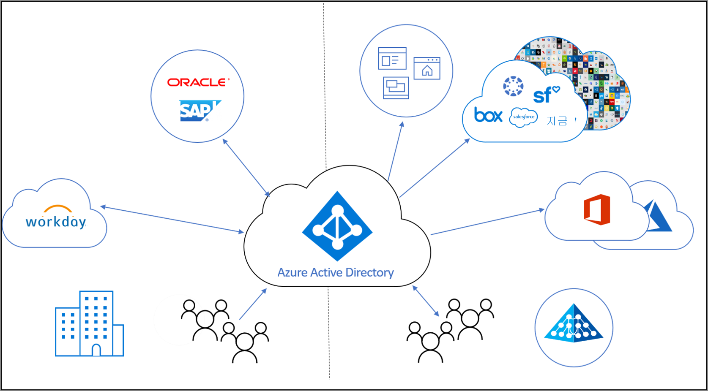

# ID 수명 주기 관리란?

조직에서는 ID 거버넌스를 통해 생산성(사용자가 조직에 가입할 때처럼 필요한 리소스에 액세스하는 속도)과 보안(고용 상태의 변화처럼 시간에 따른 사용자의 액세스 권한 변화) 간에 적절한 균형을 유지할 수 있습니다.

**ID 수명 주기 관리** 는 ID 거버넌스의 기반이며, 규모에 맞는 효과적인 거버넌스를 위해 애플리케이션에 대한 ID 수명 주기 관리 인프라를 현대화해야 합니다. ID 수명 주기 관리는 디지털 ID 수명 주기 프로세스 전체를 자동화하고 관리하는 것을 목표로 합니다. 

## 디지털 ID란?

디지털 ID는 하나 이상의 컴퓨팅 리소스(예: 운영 체제 또는 애플리케이션)에서 사용하는 엔터티에 대한 정보입니다. 이러한 엔터티는 사람, 조직, 애플리케이션 또는 디바이스를 나타낼 수 있습니다.  ID는 일반적으로 관련된 특성(예: 이름, 식별자 및 액세스 관리에 사용되는 역할)으로 설명됩니다.  이러한 특성은 시스템에서 이 시스템 또는 해당 시스템을 사용할 수 있는 대상 및 사용자에 액세스할 수 있는 사용자를 결정하는 데 도움이 됩니다.  

## 디지털 ID의 수명 주기 관리

디지털 ID 관리는 특히 사람과 같은 실제 개체 및 조직의 직원으로서 해당 조직과의 관계를 디지털 표현과 상호 관련시키는 복잡한 작업입니다.    소규모 조직에서는 ID가 필요한 개인의 디지털 표현을 유지하는 것이 수동 프로세스가 될 수 있습니다. 누군가를 고용하거나 계약자가 도착하면 IT 전문가가 해당 계정을 디렉터리에 만들고 필요한 액세스 권한을 할당할 수 있습니다.  그러나 중간 규모 및 대규모 조직에서는 자동화를 통해 조직에서 더 효과적으로 크기를 조정하고 ID를 정확하게 유지할 수 있습니다.

조직에서 ID 수명 주기 관리를 설정하는 일반적인 프로세스는 다음 단계를 따릅니다.

1. 조직에서 신뢰할 수 있는 것으로 처리하는 데이터 원본과 같은 레코드의 시스템이 이미 있는지 확인합니다.  예를 들어 조직에는 Workday HR 시스템이 있을 수 있으며, 해당 시스템에는 직원의 현재 목록과 해당 직원의 이름 또는 부서와 같은 일부 속성을 제공할 수 있는 권한이 있습니다.  또는 Exchange Online과 같은 이메일 시스템에는 직원의 이메일 주소에 대한 권한이 있을 수 있습니다.

2. 이러한 레코드 시스템을 애플리케이션에서 사용하는 하나 이상의 디렉터리 및 데이터베이스에 연결하고 레코드 시스템과 디렉터리 간의 불일치를 해결합니다. 예를 들어 디렉터리에는 이전 직원의 계정과 같이 더 이상 필요하지 않은 오래된 데이터가 있을 수 있습니다. 

3. 레코드 시스템이 없는 경우 신뢰할 수 있는 정보를 제공하는 데 사용할 수 있는 프로세스를 결정합니다.  예를 들어 방문자를 제외하고는 디지털 ID가 있지만 방문자에 대한 데이터베이스가 조직에 없는 경우 방문자의 디지털 ID가 더 이상 필요하지 않은 시기를 결정하는 다른 방법을 찾아야 할 수도 있습니다.

4. 레코드 시스템 또는 기타 프로세스의 변경 내용이 업데이트가 필요한 각 디렉터리 또는 데이터베이스에 복제되도록 구성합니다.

## 조직 관계가 있는 직원 및 기타 개인을 나타내는 ID 수명 주기 관리

직원 또는 조직 관계가 있는 다른 개인(예: 계약자 또는 학생)에 대한 ID 수명 주기 관리를 계획하는 경우 많은 조직에서 "참가, 이동 및 탈퇴" 프로세스를 모델링합니다.  이러한 항목은 다음과 같습니다.
    
   - 참가 - 개인이 액세스해야 하는 범위에 있는 경우 해당 애플리케이션에 대한 ID가 필요하므로 아직 사용할 수 없는 경우 새 디지털 ID를 만들어야 할 수 있습니다.
   - 이동 - 개인이 경계 사이를 이동하는 경우 디지털 ID에서 추가 액세스 권한 부여를 추가하거나 제거해야 합니다.
   - 탈퇴 - 개인이 액세스해야 하는 범위를 벗어나면 액세스를 제거해야 할 수 있으며, 이후에 감사 또는 법정 분석 목적 이외의 애플리케이션에서 ID를 더 이상 요구하지 않을 수 있습니다.

예를 들어 이전에 조직에 소속된 적이 없는 새 직원이 조직에 참가하는 경우 해당 직원에게 Azure AD에서 사용자 계정으로 표시되는 새 디지털 ID가 필요합니다.  이 계정을 만드는 작업은 "참가자" 프로세스에 속하게 되며, 새 직원이 업무를 시작하는 시기를 나타낼 수 있는 Workday와 같은 레코드 시스템이 있으면 자동화할 수 있습니다.  나중에 조직에서 직원이 영업에서 마케팅으로 이동하는 경우 "이동자" 프로세스에 속하게 됩니다.  이를 위해 영업 조직에 있는 더 이상 필요하지 않은 액세스 권한을 제거하고 마케팅 조직에서 새 요구 사항에 필요한 권한을 부여해야 합니다.

## 게스트에 대한 ID 수명 주기 관리

게스트와 다른 사용자에게도 비슷한 프로세스가 필요합니다.  Azure AD 권한 관리는 Azure AD B2B(기업 간)를 활용하여 조직의 리소스에 액세스해야 하는 조직 외부의 사용자와 협업하는 데 필요한 수명 주기 제어를 제공합니다. Azure AD B2B를 사용하면 외부 사용자가 홈 디렉터리를 인증하지만 디렉터리에 표시됩니다. 디렉터리의 표현을 사용하면 사용자에게 리소스에 대한 액세스 권한을 할당할 수 있습니다.  권한 관리를 통해 조직 외부의 개인이 액세스를 요청할 수 있고 필요에 따라 디지털 ID를 만들 수 있습니다. 이러한 디지털 ID는 사용자가 액세스 권한을 잃으면 자동으로 제거됩니다.  

## Azure AD에서 ID 수명 주기 관리를 자동화하는 방법

현재 Azure AD에서 제공하는 기능은 다음과 같습니다.

* 직원을 나타내는 사용자는 [HR 기반 프로비저닝](what-is-hr-driven-provisioning.md)을 사용하여 Azure AD 및 Active Directory에서 자동으로 만들고 업데이트할 수 있습니다.
* Active Directory에 이미 있는 사용자는 [디렉터리 간 프로비저닝](what-is-inter-directory-provisioning.md)을 사용하여 Azure AD에서 자동으로 만들고 유지 관리할 수 있습니다.
* 사용자는 [동적 그룹](../external-identities/use-dynamic-groups.md#what-are-dynamic-groups)을 사용하여 해당 속성에 따라 그룹에 자동으로 할당할 수 있으며, 요청 시 [권한 관리](entitlement-management-scenarios.md) 및 [Privileged Identity Management](../privileged-identity-management/pim-configure.md)를 사용하여 그룹, Teams, Azure AD 역할, Azure 리소스 역할 및 SharePoint Online 사이트에 할당할 수 있습니다.
* 사용자에 대한 업데이트는 [앱 프로비저닝](what-is-app-provisioning.md)을 사용하여 더 많은 애플리케이션에 자동으로 보낼 수 있습니다.

## 다음 단계 

- [프로비저닝이란?](what-is-provisioning.md)
- [Azure AD 권한 관리에서 외부 사용자에 대한 액세스 제어](/azure/active-directory/governance/entitlement-management-external-users.md)
- [HR 기반 프로비저닝이란?](what-is-hr-driven-provisioning.md)
- [앱 프로비저닝이란?](what-is-app-provisioning.md)
- [디렉터리 간 프로비저닝이란?](what-is-inter-directory-provisioning.md)
