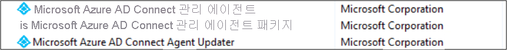

# Azure AD Connect 관리자 Agent 란? 
Azure AD Connect 관리 에이전트는 Azure Active Directory Connect는 Azure Active Directory Connect 서버에 설치 된 새 구성 요소입니다. Microsoft 지원 엔지니어가 지원 사례를 열 때 문제를 해결 하는 데 도움이 되는 Active Directory 환경의 특정 데이터를 수집 하는 것이 됩니다.

설치 하는 경우 특정 요청에 대 한 Azure AD Connect 관리 에이전트 대기 데이터를 Azure Active Directory 동기화 환경에서 요청된 된 데이터를 가져오고 Azure Active Directory에 보냅니다에 대 한 microsoft 제공 됩니다 지원 엔지니어입니다.

사용자 환경에서 Azure AD Connect 관리 에이전트를 검색 하는 정보는 어떤 방식으로든에서 저장 되지 않습니다-조사 하 고 Azure Active Directory Connect 문제 해결을 지원 하기 위해 Microsoft 지원 엔지니어에 게만 표시 됩니다. 열었던 관련된 지원 사례

## Azure AD Connect 서버에서 Azure AD Connect 관리자 에이전트를 설치 하는 방법을 
관리 에이전트를 설치한 후 서버의 제어판에서 "추가/제거 프로그램" 목록에서 다음 두 개의 새 프로그램을 볼 수 있습니다. 

취소에 Azure AD Connect 설치의 중요 한 부분으로 프로그램을 설치 하거나 제거 하지 마십시오.

## 내 동기화 서비스의 데이터는 Microsoft 서비스 엔지니어에 게 표시 되어 있습니까?
Microsoft 지원 엔지니어가 지원 사례를 열 때 내용은 지정된 된 사용자, Active Directory에서 관련 데이터를 Azure Active Directory Connect 서버에서 Active Directory 커넥터 공간에 대 한 Azure에서 Azure Active Directory 커넥터 공간 Active Directory Connect 서버 및 Azure Active Directory Connect 서버에서 메타 버스 합니다.

Microsoft 지원 엔지니어에 게 시스템의 모든 데이터를 변경할 수 없습니다 및 암호를 볼 수 없습니다.

## 그렇다면 내 데이터에 액세스 하려면 Microsoft 지원 엔지니어에 게 싶지? 
 
원하지 않는 경우 Microsoft 서비스 엔지니어가 지원을 열면이 지정할 수 있습니다 지원 호출 데이터에 액세스 하려면 포털에서 호출 합니다. 

  1.    오픈 **C:\Program Files\Microsoft Azure AD Connect 관리 Agent\AzureADConnectAdministrationAgentService.exe.config** 메모장에서.
  2.    사용 안 함 **UserDataEnabled** 아래와 같이 설정 합니다. 하는 경우 **UserDataEnabled** 설정 존재 하며 true 다음 false로 설정으로 설정 됩니다. 설정이 존재 하지 않는 경우 다음 설정을 추가 합니다 아래와 같이 합니다.    
  `
 <appSettings>
   <add key="TraceFilename" value="ADAdministrationAgent.log" />
   <add key="UserDataEnabled" value="false" />
  </appSettings>
  `
  3.    구성 파일을 저장합니다.
  4.    아래와 같이 Azure AD Connect 관리 에이전트 서비스를 다시 시작

## 다음 단계
[Azure Active Directory와 온-프레미스 ID 통합](whatis-hybrid-identity.md)에 대해 자세히 알아봅니다.