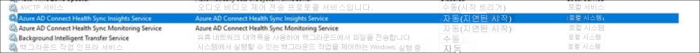

# <a name="what-is-the-azure-ad-connect-admin-agent"></a>Azure AD Connect 관리 에이전트란? 
Azure AD Connect 관리 에이전트는 Azure Active Directory Connect 서버에 설치할 수 있는 Azure Active Directory Connect의 새로운 구성 요소입니다. 지원 사례를 열 때 Microsoft 지원 엔지니어가 Active Directory 환경에서 문제 해결에 도움이 되는 데이터를 수집하는 데 사용됩니다. 

>[!NOTE]
>관리 에이전트는 기본적으로 설치 및 사용하도록 설정되지 않습니다.  지원 사례에 도움이 외는 데이터를 수집하려면 에이전트를 설치해야 합니다.

설치된 Azure AD Connect 관리 에이전트는 Azure Active Directory의 데이터에 대한 특정 요청을 대기하다가 동기화 환경에서 요청된 데이터를 가져와서 Azure Active Directory로 보냅니다. 전송된 데이터는 Microsoft 지원 엔지니어에게 제공됩니다. 

Azure AD Connect 관리 에이전트가 환경에서 검색하는 정보는 어떤 방식으로든 저장되지 않습니다. 사용자가 연 Azure Active Directory Connect 관련 지원 사례를 조사하고 해결하는 데 도움을 주기 위해 Microsoft 지원 엔지니어에게만 표시됩니다. Azure AD Connect 관리 에이전트는 기본적으로 Azure AD Connect 서버에 설치되지 않습니다. 

## <a name="install-the-azure-ad-connect-administration-agent-on-the-azure-ad-connect-server"></a>Azure AD Connect 서버에 Azure AD Connect 관리 에이전트 설치 

필수 조건:
1.    서버에 Azure AD Connect 설치
2.    서버에 Azure AD Connect Health 설치



Azure AD Connect 관리 에이전트 이진 파일은 AAD Connect 서버에 배치됩니다. 에이전트를 설치하려면 다음을 수행합니다.

1.    관리자 모드에서 powershell 열기
2.    애플리케이션이 있는 디렉터리로 이동(cd "C:\Program Files\Microsoft Azure Active Directory Connect\Tools")
3.    ConfigureAdminAgent.ps1 실행

Azure AD 글로벌 관리자 자격 증명을 입력하라는 메시지가 표시되면 입력합니다. Azure AD Connect를 설치할 때 입력한 것과 동일한 자격 증명이어야 합니다.

에이전트가 설치되면 서버 제어판의 "프로그램 추가/제거" 목록에 다음과 같은 두 개의 새 프로그램이 표시됩니다. 


## <a name="what-data-in-my-sync-service-is-shown-to-the-microsoft-service-engineer"></a>내 동기화 서비스의 데이터 중 Microsoft 서비스 엔지니어에게 표시되는 데이터는 무엇인가요? 
지원 사례를 열면 Microsoft 지원 엔지니어는 특정 사용자의 Active Directory에 있는 관련 데이터, Azure Active Directory Connect 서버의 Active Directory 커넥터 공간, Azure Active Directory Connect 서버의 Azure Active Directory 커넥터 공간, Azure Active Directory Connect 서버의 메타버스를 볼 수 있습니다. 

Microsoft 지원 엔지니어는 시스템의 데이터를 변경할 수 없으며 암호를 볼 수 없습니다. 

## <a name="what-if-i-dont-want-the-microsoft-support-engineer-to-access-my-data"></a>Microsoft 지원 엔지니어가 내 데이터에 액세스하는 것을 원하지 않는 경우 어떻게 하나요? 
에이전트가 설치되었고 Microsoft 서비스 엔지니어가 지원 전화를 위해 내 데이터에 액세스하는 것을 원하지 않는 경우 아래에 설명된 대로 서비스 구성 파일을 수정하여 해당 기능을 사용하지 않도록 설정할 수 있습니다. 

1. 메모장에서 **C:\Program Files\Microsoft Azure AD Connect Administration Agent\AzureADConnectAdministrationAgentService.exe.config** 파일을 엽니다.
2. 아래와 같이 **UserDataEnabled** 설정을 사용하지 않도록 설정합니다. **UserDataEnabled** 설정이 있고 true로 설정되어 있다면 false로 설정합니다. 이 설정이 없으면 아래와 같이 설정을 추가합니다.    

    ```xml
    <appSettings>
      <add key="TraceFilename" value="ADAdministrationAgent.log" />
      <add key="UserDataEnabled" value="false" />
    </appSettings>
    ```

3. 구성 파일을 저장합니다.
4. 아래에 표시된 것처럼 Azure AD Connect 관리 에이전트 서비스를 다시 시작합니다.


## <a name="next-steps"></a>다음 단계
[Azure Active Directory와 온-프레미스 ID 통합](whatis-hybrid-identity.md)에 대해 자세히 알아봅니다.
